# [研究]在 HorizontCMS 中发现的认证 RCE—第 1 部分(恶意插件)

> 原文：<https://infosecwriteups.com/bughunt-authenticated-rce-found-in-horizontcms-part-1-malicious-plugins-72846f4ab6fe?source=collection_archive---------2----------------------->

# 介绍

几周前，我和我的好友 [Chi Tran](https://ctrsec.io/) 合作，在一个开源的 CMS 应用程序 [HorizontCMS](https://github.com/ttimot24/HorizontCMS) 上寻找一些 bug。此应用程序由 [@ttimot24](https://github.com/ttimot24) 创建。感谢您对我们的错误报告做出快速回应，并允许我们写一篇关于它们的博文！

首先，我们在测试环境中安装了 HorizontCMS，并让它监听本地主机(127.0.0.1)。然后，我们将 Firefox 配置为允许本地主机代理。(如果您还不知道，请在 Firefox 上进行以下配置，以便它可以代理本地主机 web 应用程序。)

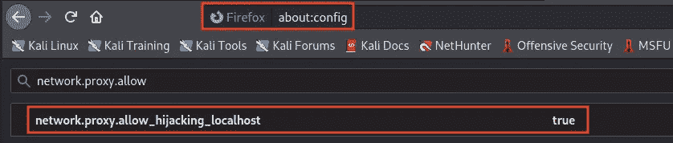

# 初始挖掘

接下来，我们知道最近为 HorizontCMS 发现的一个 CVE 是关于一个任意 PHP 文件上传漏洞:[CVE-2020–27387](https://packetstormsecurity.com/files/160046/HorizontCMS-1.0.0-beta-Shell-Upload.html)。因此，我们最初的方法是看看我们是否可以绕过作者已经解决的任何文件类型限制。这一次，通过限制文件扩展名，如`.php`、`.php5`、`.php7`、`.phtml`、`.inc`等，问题得到了适当的缓解。

## 绕过补丁…？

但是，我们通过使用“`/`”(例如`test.php/`)上传 PHP 文件发现了一个文件类型旁路。

1.  将`test.php`文件上传到“文件管理器”

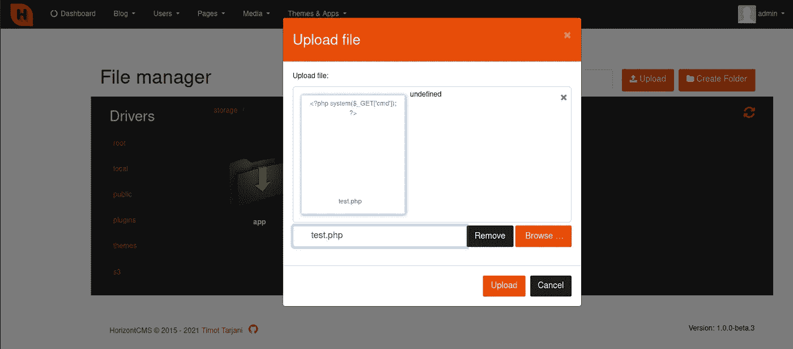

2.文件被上传；然而，它被重新命名为一些胡言乱语

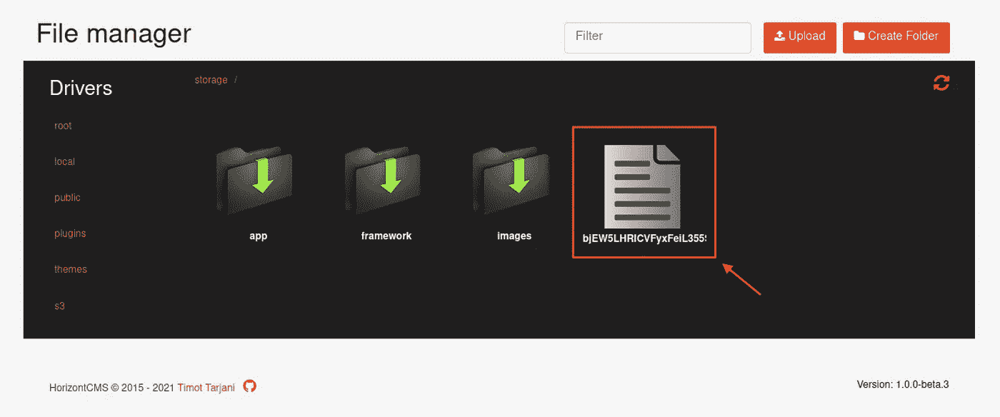

3.将文件名从胡言乱语重命名为`test.php/` →点击“重命名”我们可以看到文件名现在改为`test.php`

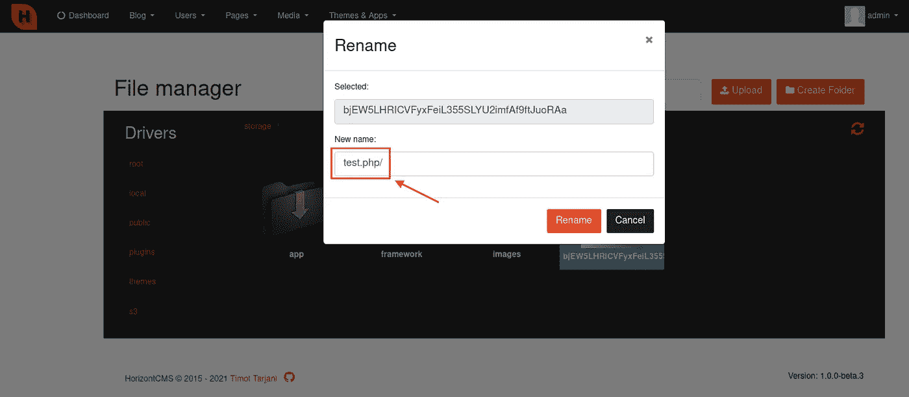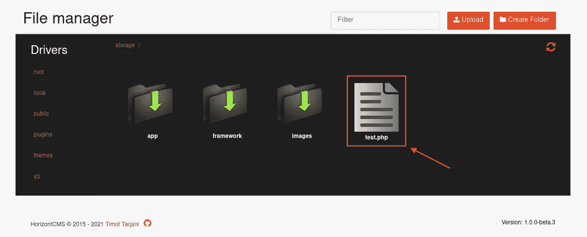

> 注意:如果你只是试图将文件名重新命名为 test.php 或 test.php5，它不会起作用，因为作者应用了 **validationRegex()** 函数来修复原来的 CVE([CVE-2020–27387](https://packetstormsecurity.com/files/160046/HorizontCMS-1.0.0-beta-Shell-Upload.html))

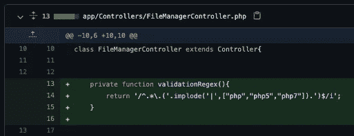

## 简单的 CVE？？？

不幸的是，这并不容易…当我们试图通过浏览器访问上传的`test.php`文件时，我们遇到了以下 404 错误页面。

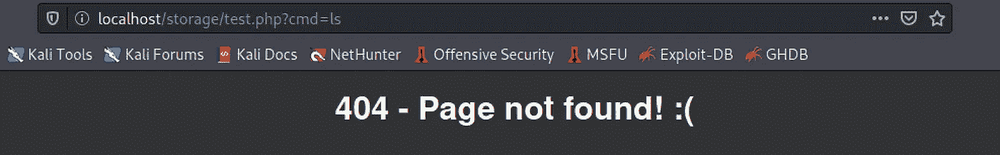

所以，我们想进入下一个有趣的功能:**插件**。

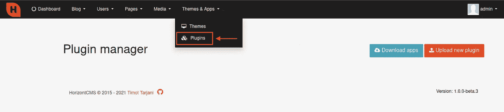

> 注意:后来，我们终于找到了另一种方法来绕过 PHP 文件类型的限制，上传恶意文件，以获得 RCE。请查看在 horizont CMS-Part 2(PHP 文件类型旁路) *中找到的[Part 2—**【BugHunt】认证的 RCE😀**](https://bigb0ss.medium.com/bughunt-authenticated-rce-found-in-horizontcms-part-2-php-filetype-bypass-4580176223eb)*

# 恶意插件 RCE

许多应用程序使用插件来引入新的特性和附加功能；因此，可能值得检查你是否可以上传任何恶意插件，以潜在地获得 RCE。根据我的经验，上传一个新插件，一个应用程序可能需要特定的文件格式，HorizontCMS 也是如此。但幸运的是，作者有一个 wiki 页面，详细解释了如何开发一个插件，并且有一个示例插件！😎

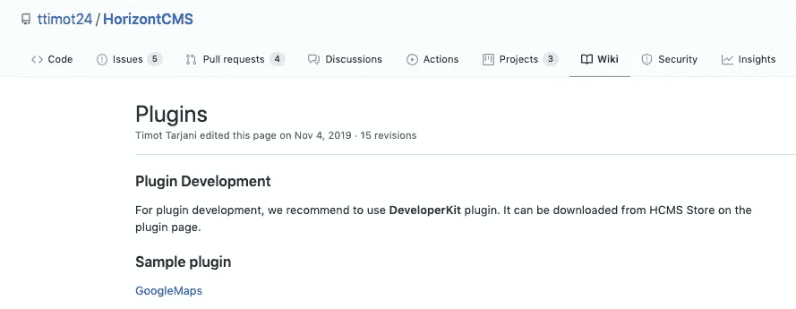

维基—[https://github.com/ttimot24/HorizontCMS/wiki/Plugins](https://github.com/ttimot24/HorizontCMS/wiki/Plugins)

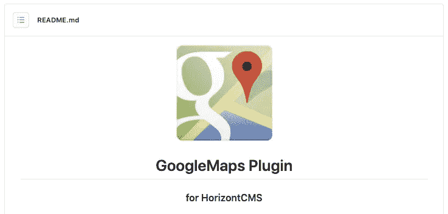

示例插件—[https://github.com/ttimot24/GoogleMaps](https://github.com/ttimot24/GoogleMaps)

我们对这个插件文件是如何开发、上传和部署到应用程序上的做了一些全面的评估。我们在插件文件中发现了一些易受攻击的代码，我们可以在其中引入恶意的 PHP 代码来导致 RCE。

## 寻找漏洞

首先，我们压缩了作者提供的示例 GoogleMaps 插件，并上传了它(上传时，它会在应用程序中自动解压缩。)

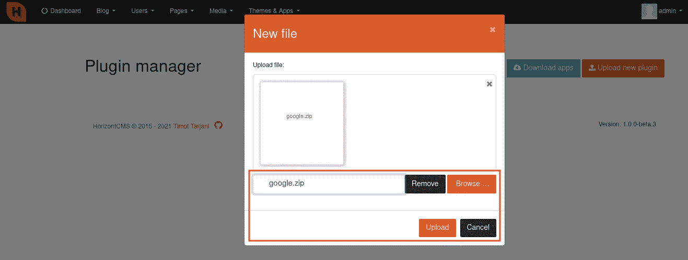

然后，有一个选项来“安装”和“激活”应用程序的插件。一旦完成，插件被激活，并在菜单栏下创建“谷歌地图”。

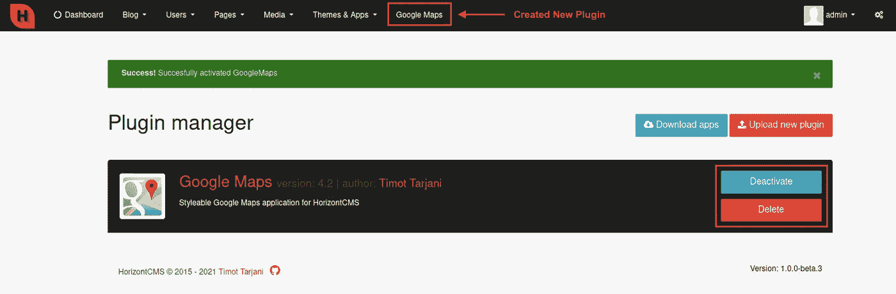

我们观察到谷歌地图插件中有一个“`Add location`”功能。当我们添加一个任意的位置并保存它时，它以一个成功的消息“`Location added succesfully!`”响应

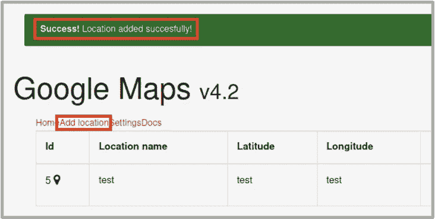

因此，我们很好奇应用程序是如何处理这个过程的，尤其是在什么情况下，它会用成功消息进行响应。

我们在插件源文件中搜索响应，发现下面的 PHP 脚本(`GoogleMaps/resources/lang/en/messages.php`)对我们来说非常明显。The 电码基本上是在做:

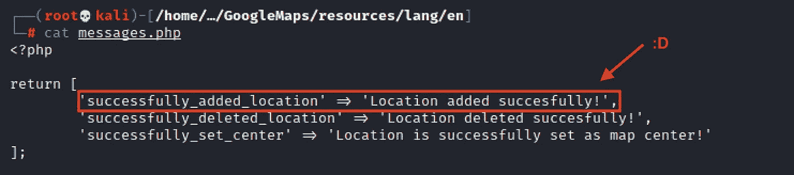

message.php

*   当成功添加位置时
*   打印出"`Location added succesfully!`"

我们在这里嗅到了一些潜在的任意代码执行:]

## 有效负载准备

那么，如果我们修改这段代码(在我们控制的插件文件中)来添加一个名为`$shell`的 PHP 反向 shell 变量，并且这个变量将在成功添加位置时被调用，会怎么样呢？听起来很有希望:]

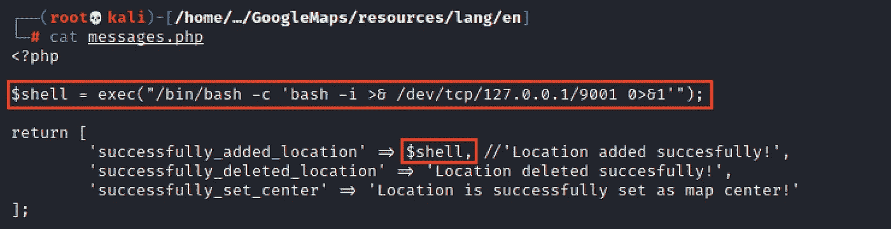

改良 message.php

## RCE

我们重新压缩了修改后的 GoogleMaps 插件，并再次上传。当我们这次添加位置时，我们成功地执行了反向 shell，并在系统上获得了 RCE！

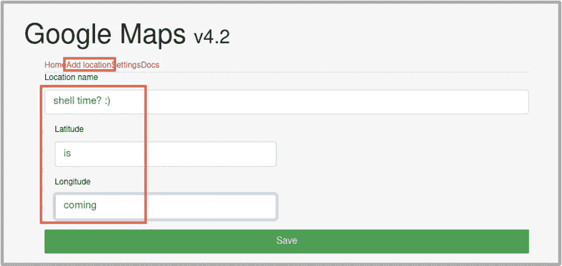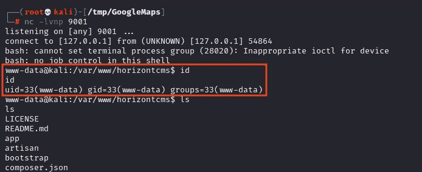

# 结论

在识别和验证问题后，我们向应用程序所有者披露了此问题。此外，请查看第 2 部分中我们如何绕过 PHP 文件类型限制上传任意文件以获得 RCE :]

*   [**【BugHunt】在 HorizontCMS —第 2 部分(PHP 文件类型绕过)**](https://bigb0ss.medium.com/bughunt-authenticated-rce-found-in-horizontcms-part-2-php-filetype-bypass-4580176223eb) 中发现经过身份验证的 RCE

## 披露时间表

*   2011 年 3 月 15 日—向 HorizontCMS 报告错误
*   2011 年 3 月 16 日— HorizontCMS 承认该问题
*   2011 年 3 月 16 日——CVE 提出请求(MITRE)