# 构建、攻击和保护 Azure 身份

> 原文：<https://infosecwriteups.com/build-hack-and-defend-azure-identity-9297f31231e9?source=collection_archive---------4----------------------->


Kaylee Stepkoski 摄

## purple cloud Hybrid+Identity Cyber 系列简介

# 概观

攻击身份系统是一种越来越常见的攻击手段。看看网络安全管理软件产品战役中使用的黄金法则[1]就知道了。我们正看到网络安全工具[2，3]，技术[4，5]和可靠的演示[6]的爆炸式增长，它们传达了对身份安全问题的更好理解。为了建立检测和响应弹性，网络防御人员需要一个安全的实验室环境，能够模拟攻击和防御身份系统的真实场景。 [PurpleCloud](https://purple.iknowjason.io/) 是一个混合+身份网络安全系列，为 Azure 云构建，具有自动化部署脚本。它实现了一种快速和自动化的方法来为各种用例建立 Azure Active Directory 安全实验室。将其用于 Azure 广告渗透测试实验室。云安全研究人员可以用它来研究对手的交易技巧。在这篇博客中，我们将通过描述 Azure Active Directory 和使用 Bloodhound 进行侦察的一个具体用例，对该系列进行简单介绍。

# 用例

PurpleCloud 的功能远不止 Azure AD。PurpleCloud 通过模拟内部、混合或云原生实验室，为企业安全测试用例提供了无数激动人心的功能。一些功能包括:

*   Azure AD 和 Azure 域服务的研究和渗透测试实验室
*   混合加入和 Azure AD 加入设备的安全性测试
*   EDR 测试实验室
*   PoC /产品安全实验室
*   使用加入域的设备的企业活动目录实验室
*   恶意软件/逆向工程针对加入域的设备研究工件
*   SIEM /威胁追踪/DFIR/HELK+迅猛龙实时响应实验室
*   日志聚合器架构，用于将日志转发到云原生 SIEM (Azure Sentinel)
*   使用 HELK 服务器、Jupyter 笔记本电脑进行数据科学研究
*   基于 Mordor 的检测工程研究

在这篇博客中，我们将特别关注 Azure Active Directory 用例。该实验室能够模拟 Azure 租户内的权限提升，并研究托管身份，如针对 OAuth 2.0 未授权同意授权的攻击的应用程序/服务主体。该系列是一个使用 terraform 的免费开源基础设施代码(IaC)项目。这些术语是什么？快速入门:

*   ***基础设施即代码(IaC)*** 是一种使用模板或定义文件实现云基础设施自动化部署和管理的技术。IaC 有很多不断增长的网络安全用例。
*   ***Terraform.io*** 是一家为 IaC 提供商业和开源工具的公司。使用 Terraform，我们以 terraform 声明性文件格式指定定义，并使用 terraform free 工具，通过 terraform 提供程序在 Azure 中自动快速部署 Azure AD。Terraform 对所有三个 CSP(AWS、Azure、Google)以及其他提供商都有灵活丰富的支持。Terraform 管理范围的状态，以自动建立和破坏资源。于是奇迹发生了。很好。

# **PurpleCloud 安装 Azure 广告支持**

让我们深入研究这一点，并使用 PurpleCloud 的 Azure AD 模块建立一个 Azure AD 安全实验室。这些 Terraform 模块将自动创建许多漂亮的 Azure AD 对象，这些对象通常需要花费相当多的时间来使用 Azure 门户手工构建。然后，可以通过导航到目录并修改 terraform 文件来进一步调整它们以获得额外的功能和安全性研究: ***modules/azure_ad*** 。Terraform 的 Azure AD 模块构建映射到以下文件的以下 Azure AD 资源:

*   62 个用户(users.tf)
*   8 组(groups.tf)
*   2 个应用程序和 2 个服务主体(apps.tf)

## 我们开始吧！

**注:**本程序已经在 Ubuntu Linux 20.04 上验证。

# 要求

*   Azure 租户和订阅
*   全局管理员角色
*   地形:在 v0.14.7 上测试
*   Azure CLI 工具

# 安装步骤

**步骤 1:** 在您的 Linux 系统上安装 Terraform 以及 Azure CLI 工具。

为您的平台下载并安装 Terraform:[https://www.terraform.io/downloads.html](https://www.terraform.io/downloads.html)

运行这个一行程序在 Ubuntu 20.04 上安装 Azure CLI 工具:

```
curl -sL [https://aka.ms/InstallAzureCLIDeb](https://aka.ms/InstallAzureCLIDeb) | sudo bash
```

**步骤 2:** 在你的 Azure 订阅上设置一个 Azure 服务主体，允许 Terraform 自动执行你的 Azure 订阅下的任务。

请严格遵循微软文档中的说明:[https://docs . Microsoft . com/en-us/azure/developer/terra form/getting-started-cloud-shell](https://docs.microsoft.com/en-us/azure/developer/terraform/getting-started-cloud-shell)

这是基于上面的链接运行的两个基本命令。首先，为 terraform 将使用的自动化资源创建创建一个服务主体。在下面的命令中，我们为它分配了所有者角色。

```
az ad sp create-for-rbac --role="Owner" --scopes="/subscriptions/<subscription_id>"
```

其次，在下面的步骤中，我们将使用该服务主体登录，并收集 Terraform 应用程序将使用的凭据。

```
az login --service-principal -u <service_principal_name> -p "<service_principal_password>" --tenant "<service_principal_tenant>"
```

请注意以下内容，我们接下来将使用这些内容来配置我们的 Terraform Azure 提供程序:

```
subscription_id = ""
client_id = ""
client_secret = ""
tenant_id = ""
```

**第三步:**在你的 Azure 门户帐户中设置 Azure 服务主体的权限。

# Azure AD 模块说明:Azure Active Directory 权限要求

要将 Azure Active Directory 模块与 terraform automation 一起使用，服务主体需要特殊权限来读写 Azure AD 用户、组和应用程序。在我最近的测试中，将需要下面描述的这两种权限。

**步骤#3.1:** 将“全局管理员”角色分配给服务主体。要在 Azure AD 门户中做到这一点，请导航到 ***Azure AD*** → ***角色和管理员*** 。搜索 ***全局管理员*** 角色。选中它，点击 ***【添加作业+】***。在右侧，搜索 Azure 服务主体的名称。默认情况下，它会以“ ***azure-cli-*** 开头。选择 ***添加*** 为服务主体添加全局管理员角色。完成此操作后，验证您的工作。它应该类似于以下内容:

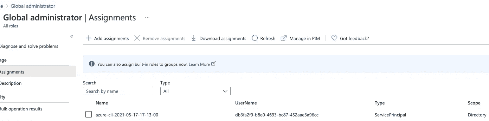

**步骤#3.2:** 将以下 API 权限分配给下面列出的服务主体。可以通过导航到 ***Azure Active Directory →应用注册→ < Select_App > → API 权限*** 来访问 API 权限的正确屏幕。

*   Azure 活动目录图→应用程序。读写。全部
*   Azure 活动目录图→目录。读写。全部
*   Microsoft Graph →用户。阅读

这是成功设置后的样子:

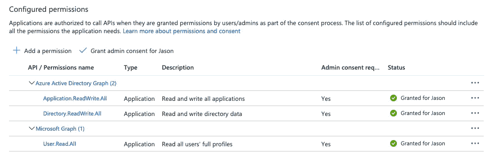

**步骤 4:** 克隆 PurpleCloud repo

```
$ git clone [https://github.com/iknowjason/PurpleCloud.git](https://github.com/iknowjason/PurpleCloud.git)
```

**第四步:**首先将***terra form . TF example***复制到***terra form . TF vars***。接下来，使用您喜欢的文本编辑器，为匹配您的 Azure 服务主体凭证的 Azure 资源提供者编辑***terra form . TF vars***文件。Azure AD provider 需要这些凭据来使用服务主体，并使用正确的 API 权限创建用户、组和应用程序。

```
$ cd PurpleCloud\deploy
$ cp terraform.tfexample terraform.tfvars
$ vi terraform.tfvars
```

在***terra form . TF vars***文件中编辑这些参数，替换“REPLACE_WITH_YOUR_VALUES”以正确匹配您的 Azure 环境。

```
# Azure RM
arm_client_id = "REPLACE_WITH_YOUR_VALUES"
arm_client_secret = "REPLACE_WITH_YOUR_VALUES"# Azure AD
aad_client_id = "REPLACE_WITH_YOUR_VALUES"
aad_client_secret = "REPLACE_WITH_YOUR_VALUES" # General Subscription and Tenant ID
subscription_id = "REPLACE_WITH_YOUR_VALUES"
tenant_id = "REPLACE_WITH_YOUR_VALUES"
```

您的 terraform.tfvars 文件应该类似于下图，但带有您自己的 Azure 服务主体凭据。请注意，这些是用于演示目的的虚假值，而不是真实的帐户信息。

```
# Azure RM
arm_client_id = "7e3c2cce-8bd4-887d-b2b0-90cd1e7e4781"
arm_client_secret = ":+2$+cdfafdaF-?%:.?d/EYZLK6po9`|E<["# Azure AD 
aad_client_id = "7e3c2cce-8bd4-887d-b2b0-90cd1e7e4781"
aad_client_secret = ":+2$+cdfafdaF-?%:.?d/EYZLK6po9`|E<["# General Subscription and Tenant ID
subscription_id = "aa7d8c9f-39c2-6262-89ff-3c78527c1b22"
tenant_id = "8b6917d9-f209-3061-8f4f-dd03332847cb"
```

**第五步:**取消 main.tf 中 Azure AD 模块的注释，默认是禁用的。查找此节块并删除多行注释。它应该是这样的:

```
##########################################################
## Azure AD Module - Create Azure AD Users, Groups, and Application
##########################################################
module "azure_ad" {
  source              = "../modules/azure_ad"
  upn_suffix          = local.upn_suffix
  tenant_id           = local.tenant_id
}
```

**步骤 6:** 在 main.tf 中，使用/*和*/注释掉所有其他模块，以进行多行注释。PurpleCloud 默认安装 Windows 域控制器、Windows 10 端点、ELK SIEM 服务器以及 Azure 虚拟网络。对于本实验，我们希望禁用所有这些基础架构组件，以便仅启用 Azure AD 模块。注释掉以下模块。在 terraform 中，多行注释的开头是/*，多行注释的结尾是*/。

*   模块“网络”
*   模块“dc-vm”
*   模块“velocihelk”
*   模块“win10-vm1”

这里有一个注释掉对手 VM 模块的例子。应该对其他模块执行相同的步骤来禁用它们。

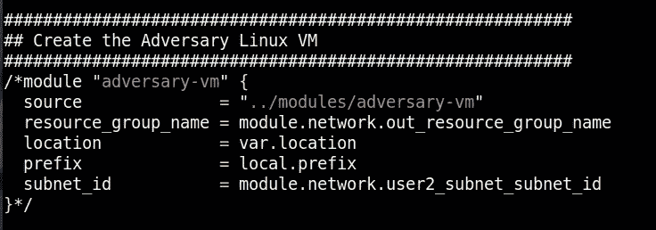

**第七步:**在 main.tf 中，为 Azure AD 正确设置以下两个变量:

*   租户 id
*   upn_suffix ( **可选:**仅当使用自定义域时)

tenant_id 变量应该是设置时与您的租户帐户关联的用户名，它构成了 AD 用户的通用主体名称(UPN)后缀。假设您的用户名是 acmecorp。那么 upn 后缀将是 acmecorp.onmicrosoft.com。如果您已经向 Azure 添加了自定义域，那么您可以使用该自定义域作为您的 upn 后缀，而不是“***tenant _ id . on Microsoft . com***”。以下屏幕截图显示了 tenant_id 的沙盒配置:

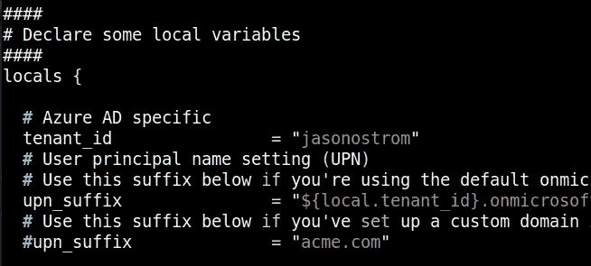

**步骤 8:** 运行命令初始化 terraform 并应用资源计划

```
$ cd PurpleCloud/deploy
$ terraform init
$ terraform apply -auto-approve
```

这应该会启动 Terraform 自动部署计划，并且您应该会看到资源计划的创建。如果由于任何原因收到错误，请再次运行 terraform apply。完成后，您将看到以下内容:

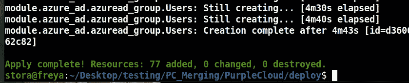

**第九步:**获取 Azure AD 用户密码。以下文件包含 terraform 为每次实验运行创建的动态生成的密码。该文件位于以下位置:

***模块/azure _ ad/AAD _ password . txt***

这是为所有 62 个 Azure AD 用户设置的密码。

**第十步:**核实你在 https://portal.azure.com 的工作

验证在 ***Azure Active Directory 中创建的 Azure 用户→用户***

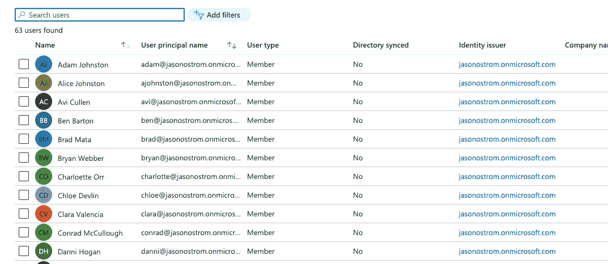

验证在 ***Azure Active Directory 中创建的 Azure 组→组***

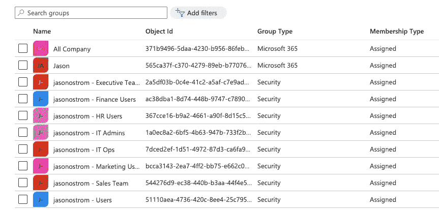

验证在 ***Azure Active Directory 中创建的应用程序→应用程序注册*** 。你应该在 ***HR-App*** 看到一个结尾，在 ***Fin-App*** 看到一个结尾。

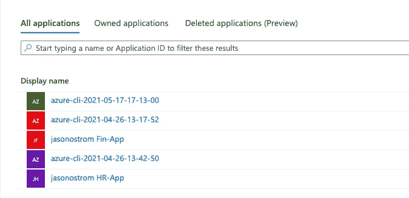

# 使用 Bloodhound 的 Azure 广告侦察

对于渗透测试来说，BloodHound 是一个有效且有价值的侦察工具。它在一个由 Neo4j 图形数据库支持的非常好的可视化用户界面中提供了对映射攻击路径、横向移动和权限提升的高度可见性。Andy Robbins 和其他 BloodHound 作者最近用 AzureHound 收集器添加了 Azure 对象支持和数据摄取[7]。这对我们意味着什么？现在，我们可以有效地查看 Azure 租户内权限提升的攻击途径，从内部 AD 到 Azure 的途径，以及从 Azure 迁移到内部 AD 环境的自上而下的攻击[8]。

让我们使用新的 AzureHound 收集器快速完成数据接收并导入 Bloodhound。

**第一步:**在 Windows 10 Pro 系统上，从 https://github.com/BloodHoundAD/AzureHound[下载 AzureHound 数据收集器 powershell 脚本](https://github.com/BloodHoundAD/AzureHound)

**步骤 2:** 使用管理员权限启动 powershell 会话:

```
powershell -exec bypass
```

**第三步:**安装 Az 模块，出现提示时选择 ***A*** :

```
Install-Module -name Az -AllowClobber
```

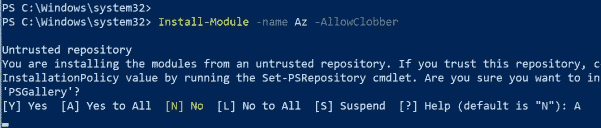

**第四步:**安装 AzureAdPreview 模块，出现提示时选择 ***A*** :

```
Install-Module -name AzureAdPreview -AllowClobber
```

**第 5 步:**运行以下两个 cmdlets 向 Azure 和 Azure AD powershell 进行身份验证以收集数据。对于这个安全的实验室概念验证，我建议对这些 cmdlets 使用您的全局管理员帐户。它允许在租户级别查看更多对象，如订阅。

```
Connect-AzureAD
Connect-AzAccount
```

**第六步:**解压 AzureHound zip 文件，从下载解压目录导入模块。

```
Import-Module C:\Users\Username\Downloads\AzureHound-master\AzureHound-master\AzureHound.ps1
```

**第七步:**从前一个目录运行 Invoke-AzureHound，查看收集到的数据！

```
Invoke-AzureHound
```

您应该看到它收集了租户中的所有 Azure 对象，并将其打包成一个 zip 文件。然后，这个 zip 文件可以被复制到运行 BloodHound 二进制文件的系统中！

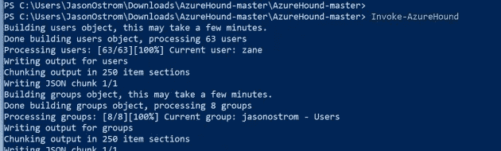

运行 Invoke-AzureHound

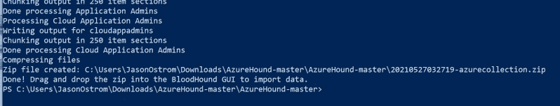

AzureHound 跑了！将压缩文件复制到 BloodHound 系统。

**步骤 8:** 将 zip 文件复制到您的 BloodHound 系统，并上传 zip 文件中的数据。本文假设您已经安装了 Bloodhound 并且熟悉它。如需了解更多信息，请查阅 BloodHound 文档:

[](https://bloodhound.readthedocs.io/en/latest/index.html) [## BloodHound:六度域管理- BloodHound 3.0.3 文档

### BloodHound 使用图论来揭示活动目录中隐藏的、通常是无意的关系…

bloodhound.readthedocs.io](https://bloodhound.readthedocs.io/en/latest/index.html) 

**第九步:**将数据可视化。导航到顶部搜索并键入 ***日期:***

选择租户。从这个视图中，您可以看到 Azure 用户和组对象以及其他后代对象。

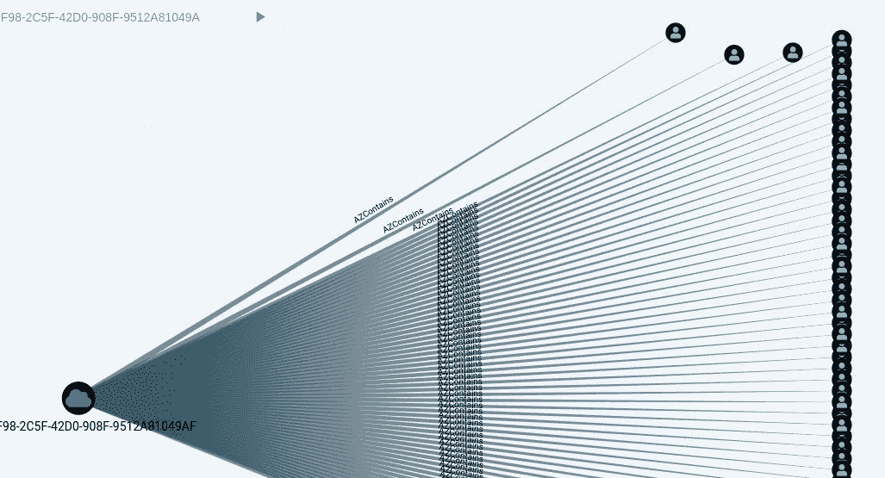

BloodHound 中 Azure 广告用户的视图

# 破坏紫云 AzureAD 资源

当需要销毁实验室资源时，Terraform 可以自动提供便利。只需导航到启动 terraform apply 的同一目录:

```
$ cd PurpleCloud/deploy
$ terraform destroy -auto-approve
```

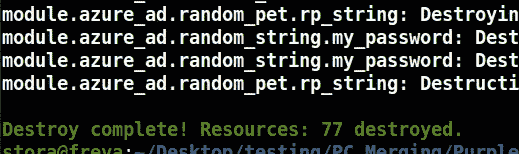

# 结论

这是一个 R&D 框架工具，用于安全研究和构建新的工具。我计划用针对 Azure AD security 的研讨会、练习和其他工具来扩展它。欢迎反馈和建议。

# 参考

[1][https://www . dark reading . com/attacks-breaks/solarwinds-campaign-focuss-attention-golden-SAML-attack-vector/d/d-id/1339794](https://www.darkreading.com/attacks-breaches/solarwinds-campaign-focuses-attention-on-golden-saml-attack-vector/d/d-id/1339794)

[2]https://github.com/AlteredSecurity/365-Stealer

[3][https://www . Microsoft . com/security/blog/2021/05/20/simuland-understand-attendant-trade craft-and-improve-detection-strategies/](https://www.microsoft.com/security/blog/2021/05/20/simuland-understand-adversary-tradecraft-and-improve-detection-strategies/)

[4][https://www . slide share . net/DouglasBienstock/troopers-19-I-am-ad-fs-and-so-can-you](https://www.slideshare.net/DouglasBienstock/troopers-19-i-am-ad-fs-and-so-can-you)

[5][https://www . fire eye . com/blog/threat-research/2021/04/滥用-复制-窃取-adfs-secrets-over-the-network . html](https://www.fireeye.com/blog/threat-research/2021/04/abusing-replication-stealing-adfs-secrets-over-the-network.html)

[https://www.youtube.com/watch?v=mxOHcqHxpi8](https://www.youtube.com/watch?v=mxOHcqHxpi8)

[https://www.youtube.com/watch?v=gAConW5P5uU](https://www.youtube.com/watch?v=gAConW5P5uU)

[8][https://posts . specter ops . io/death-from-above-lateral-movement-from-azure-to-on-prem-ad-d18cb 3959 d4d](https://posts.specterops.io/death-from-above-lateral-movement-from-azure-to-on-prem-ad-d18cb3959d4d)