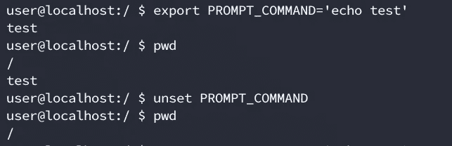
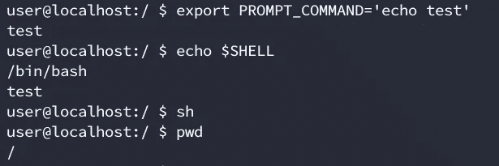
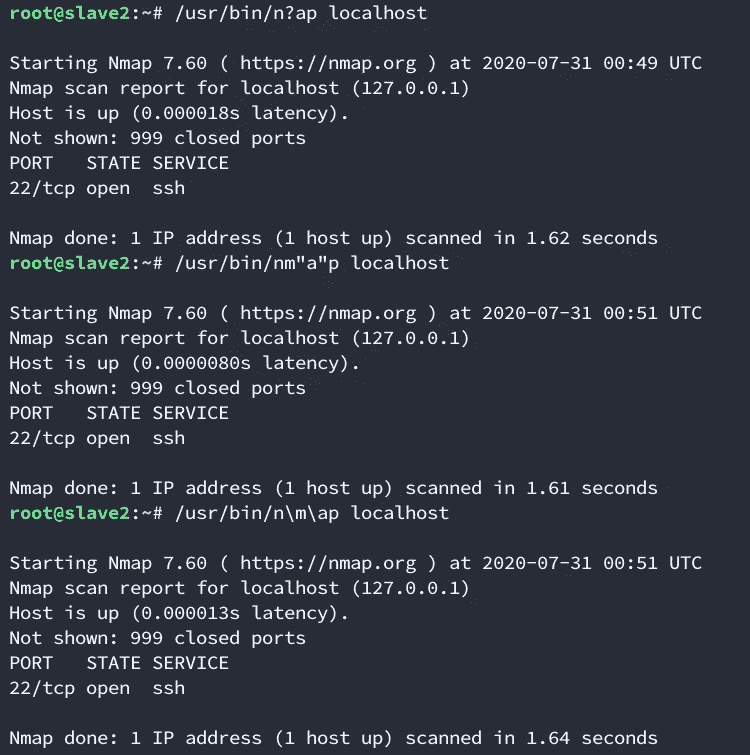
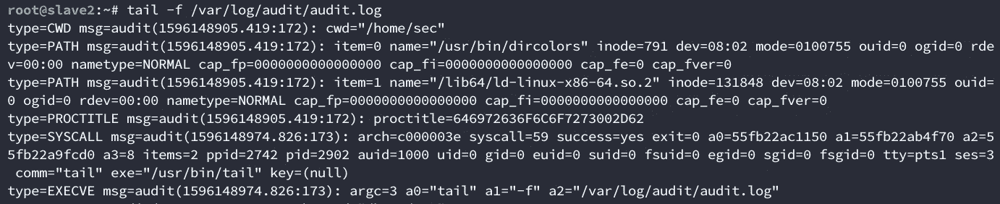
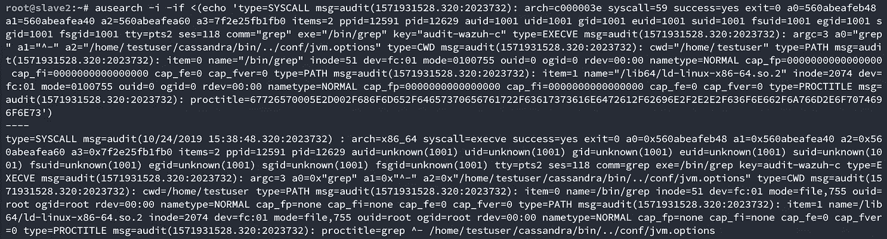
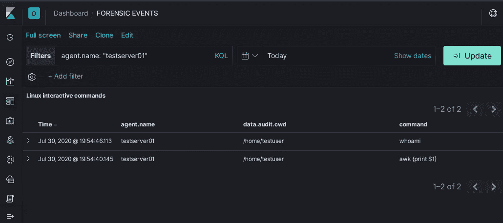
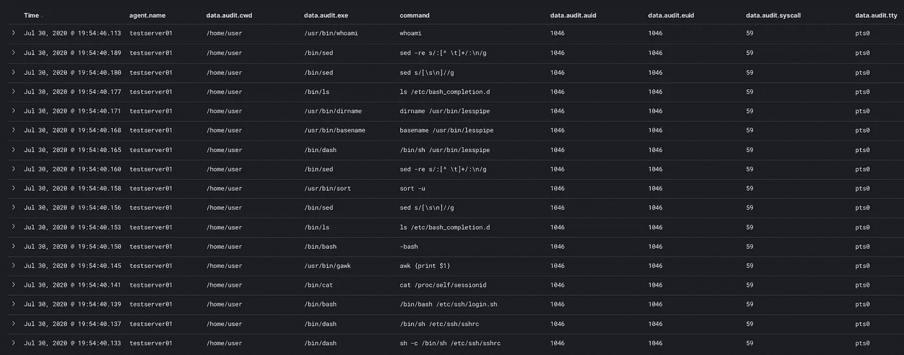
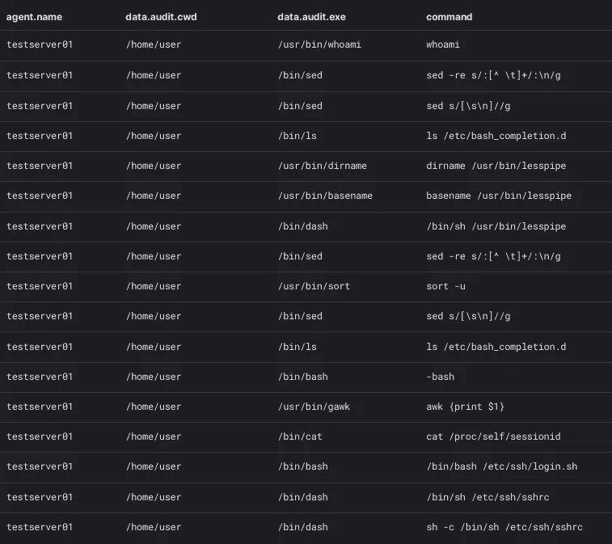

# 构建 SIEM:使用 ELK + auditd 集中记录所有 Linux 命令

> 原文：<https://infosecwriteups.com/building-a-siem-centralized-logging-of-all-linux-commands-with-elk-auditd-3f2e70503933?source=collection_archive---------2----------------------->

最近，在与 SOC 部门合作时，我们不得不为超过 10k 个实例启用命令日志记录。我们还需要实现一种解析这些命令并将它们导入 ELK 的方法。现在，如果您研究过终端日志记录，您会知道有多种解决方案。在这篇文章中，我将解释我们选择的那个，我们为什么选择它，最后我将告诉你一个它允许我们写的自定义规则。

对于这个问题，最推荐的解决方案是在 bash 中使用 PROMPT_COMMAND 变量，它在运行任何命令之前执行。如果你想走这条路，有很多关于如何实现的文章:

[https://medium . com/maveris labs/logging-bash-history-cefdce 602595](https://medium.com/maverislabs/logging-bash-history-cefdce602595)
[https://spin.atomicobject.com/2016/05/28/log-bash-history/](https://spin.atomicobject.com/2016/05/28/log-bash-history/)
[https://askubuntu . com/questions/93566/how-to-log-all-bash-commands-by-all-users-on-a-server](https://askubuntu.com/questions/93566/how-to-log-all-bash-commands-by-all-users-on-a-server)

然而，我们选择不使用这个解决方案，因为它有一些警告。首先，用户可以重置环境变量。在下面的示例中，我们将变量设置为在任何命令之前打印一个字符串，然后我们取消设置变量以删除日志记录。这将使任何攻击者能够读取本地~/。bashrc 或/etc/profile 来实现命令被记录，并禁用记录。



绕过未设置的 PROMPT_COMMAND 日志记录

其次，根据您用来定义变量的文件，您可以通过切换 shell 来绕过这个日志记录特性。在下面的例子中，我们将 bash 改为 sh，并观察变量自动取消设置。这将允许攻击者更改例如. bashrc 中的定义。



绕过 PROMPT_COMMAND 日志记录，生成新的 shell

每个 shell 提供不同的文件，您需要为每个人提供一致的解决方案。攻击者可能会使用 bash，但他也可能会使用 sh、ash、zsh 甚至 dash(不要忘记，与 bash 不同，dash 的某些版本允许您在不提供-p 的情况下使用 suid 启动二进制文件，这对于系统后门非常有用)。在您通过被利用的服务受到危害的情况下，文件的不同来源也非常相关。当您利用一个服务时，比如说 apache，您会被丢到一个没有 tty 分配的 shell 中，并且您需要在定义变量时考虑所有的可能性。我们写了一个自定义规则，考虑到这一点，将在最后解释。

第三，您可以用某些 bash 特性绕过定制的正则表达式过滤器。假设每当有人在您的网络上运行 nmap 时，您都希望得到通知。您应该编写一个 regex 来标识任何包含 nmap 的命令。大约

```
.*nmap.*
```

这很容易被绕过，比如变量扩展/单引号或双引号/反斜杠/别名:



多次绕过。*nmap。*

有多种方法可以实现这一点，如果你在一个 SOC 中工作，你应该知道所有的方法。这些都是红队组队时必须知道的。你可以在这里阅读更多关于它们的内容:[https://github . com/swisskyrepo/payloads all the things/tree/master/Command % 20 injection](https://github.com/swisskyrepo/PayloadsAllTheThings/tree/master/Command%20Injection)

第四，你只能通过交互式控制台运行命令。意识到这一点的任何攻击者都可以创建一个简单的脚本来运行它想要的命令(例如 nmap ),而这些不会显示在日志文件中。或者更糟，编译一个简单的 C 脚本来调用 bash 命令。

我们研究了很多替代工具(rootsh / pam_tty_audit.so / sudo)。我不会进入这些的细节，因为这篇文章会有几英里长，而且已经有关于这个的非常详细的报道(【https://www.scip.ch/en/?labs.20150604】T2)。

我们最终使用了 auditd 服务。这是一个与内核紧密集成的服务，根据我们收集的所有信息，它唯一的缺点是过于冗长，因为它在系统调用级别记录日志。这实际上是我们的一个优势，因为我们想要命令日志记录，而不仅仅是 bash 交互日志记录。稍后我们将看到我们是如何处理 logstash 过于冗长的问题的。

我们选择 auditd 的另一个原因是，因为它是根级别的服务，所以比日志文件更容易监控，也更难被破坏。当然，auditd 也使用日志文件，但是您有更高权限的服务来使用它，类似于 bash 进程。您可以设置自定义警报，以便在服务停止时发出通知，并考虑比您对文件所能做的更多的用户情况(可以删除、用不变标志更改、删除、清空等)。

Auditd 还允许您不仅记录用户键入的命令，还记录调用的结果二进制文件(这可以防止正则表达式绕过攻击，因为您可以构建正则表达式来匹配二进制文件而不是命令本身)。

为了实现 auditd，首先需要安装它:

```
apt-get install auditd audispd-plugins
```

之后，您需要编辑以下文件:/etc/auditd/rules . d/audit . rules(在任何 Debian 衍生工具上)。
要记录所有的架构系统调用，您应该执行以下操作:

```
-a always,exit -F arch=b32 -S execve
-a always,exit -F arch=b64 -S execve
```

之后，您应该启用并启动该服务:

```
systemctl enable auditd.service
systemctl start auditd.service 
```

您可以通过以下方式查看应用的规则:

```
auditctl -l
```

我不会深入讨论如何编写 auditd 规则，因为手册页会比我更好地解释它，但是您应该知道，您可以使用过滤器定制规则。例如，您可以使用以下命令为指定有效 uid 的单个用户启用日志记录:

```
-a always,exit -F arch=b32 -S execve -F euid=0
-a always,exit -F arch=b64 -S execve -F euid=0
```

启用 auditd 后，tailing/var/log/audit/audit . log 无疑会用输出填满您的屏幕:



auditd.log 中单个命令的标准输出

不要担心，我们可以很容易地分析每个命令的输出。让我们运行一个“whoami”并分析输出。

```
type=SYSCALL msg=audit(1596148543.861:63): arch=c000003e syscall=59 success=yes exit=0 a0=565156eecbc0 a1=565156ef1fa0 a2=565156e97ce0 a3=8 items=2 ppid=1667 pid=2806 auid=1000 uid=0 gid=0 euid=0 suid=0 fsuid=0 egid=0 sgid=0 fsgid=0 tty=pts0 ses=1 comm=”whoami” exe=”/usr/bin/whoami” key=(null)
type=EXECVE msg=audit(1596148543.861:63): argc=1 a0=”whoami”
type=CWD msg=audit(1596148543.861:63): cwd=”/home/sec”
type=PATH msg=audit(1596148543.861:63): item=0 name=”/usr/bin/whoami” inode=1185 dev=08:02 mode=0100755 ouid=0 ogid=0 rdev=00:00 nametype=NORMAL cap_fp=0000000000000000 cap_fi=0000000000000000 cap_fe=0 cap_fver=0
type=PATH msg=audit(1596148543.861:63): item=1 name=”/lib64/ld-linux-x86–64.so.2" inode=131848 dev=08:02 mode=0100755 ouid=0 ogid=0 rdev=00:00 nametype=NORMAL cap_fp=0000000000000000 cap_fi=0000000000000000 cap_fe=0 cap_fver=0
type=PROCTITLE msg=audit(1596148543.861:63): proctitle=”whoami”
```

它告诉我们命令的成功状态、父进程 id、进程 id、uid、gid、命令和我们的自定义密钥(来自 auditctl -k)。

首先，我们有 syscall 条目。这记录了一个 syscall 调用(并不意味着是冗余的),其中包含十六进制编码的相关参数(…a0=565156eecbc0…)。它为您提供了命令的状态、进程 id、父进程 id、用户 id、组 id、命令和一个自定义键(如果您之前定义了它的话)(键可用于标识您想要的自定义条目，您可以使用 auditctl -k 对它们进行过滤)。如果您想要解释这些参数，以及将 uid/gid 转换为正确的名称，您必须使用 ausearch 和-i。您可以使用以下语法调用它来解码文件:

```
ausearch -i -if /tmp/file
```

我们想要解码一行，所以我们将使用 bash 的便利的进程替换(它使用



Decoded syscall

After that you have the EXECVE type log, which has the parsed arguments for the syscall.

After the EXECVE you have entries for CWD and also the PATH of the invoked command (these are self explanatory).

Lastly, you have the PROCTITLE which as the name suggest, gives you the title of the process being executed (this may or may not match with the command ran, see consideration 2 at the end of the article).

You can find more details on auditd logging in here: [https://medium . com/@ guruisadog/exploring-audit-daemon-for-threat-hunting-6ef2a 30570 ad](https://medium.com/@guruisadog/exploring-audit-daemon-for-threat-hunting-6ef2a30570ad)

为了用 ELK 解析这个日志，您可能希望使用您选择的解决方案(filebeat、wazuh agent 等)将这个日志转发到一个集中的日志服务器..).

对于那些不知道，麋鹿是一个集成的解决方案，其中包括 3 个组成部分。Elastic search(非关系数据库)、Logstash(一个允许您规范化或丰富数据的数据解析器)和 Kibana(允许您以简单的方式可视化信息以及定义自定义仪表板)。警告，我只是在摸麋鹿的皮毛。如果你不熟悉它，你应该在 https://logz.io/learn/complete-guide-elk-stack/的[多读一些。](https://logz.io/learn/complete-guide-elk-stack/)

这样做之后，您需要在 logstash 中编写一个定制脚本来解析命令。这是必要的，因为在有多个参数的命令上，您会看到一条被命令参数分开的线。运行“cat test1 test2 test3 test4”将输出以下内容。

```
type=SYSCALL msg=audit(1596149019.479:174): arch=c000003e syscall=59 success=yes exit=0 a0=562e0acc36c0 a1=562e0ad523c0 a2=562e0ae1df70 a3=8 items=2 ppid=2879 pid=2903 auid=1000 uid=1000 gid=1000 euid=1000 suid=1000 fsuid=1000 egid=1000 sgid=1000 fsgid=1000 tty=pts2 ses=4 comm=”cat” exe=”/bin/cat” key=(null)
type=EXECVE msg=audit(1596149019.479:174): argc=5 a0=”cat” a1=”test1" a2=”test2" a3=”test3" a4=”test4"
```

以这种方式显示命令不仅难以阅读，更重要的是，这使得编写定制的正则表达式规则更加困难。为了防止这种情况，我们将在 logstash 中编写一个简单的 ruby 脚本，该脚本将处理 EXECVE 行并连接命令，以使其更具可读性(也更容易使用类似 elastalert 规则的东西进行监控)。

```
def filter(event)
   # Getting full log event
   full_log = event.get("full_log")
   # Making sure its of type EXECVE
   command = ""
   if /type=EXECVE/.match(full_log) then
       log_execve = full_log.split("type=EXECVE")
       # Spliting values
       log_execve_kv = Hash[log_execve[1].split(" ").map{|x| x.split("=",2)}]
       log_execve_kv.each do |key, value|
           # If the key equals a followed by 1 or 2 numbers
           if /a\d+|a\d+\d+/.match(key) then
               # Si value starts with "
               if /"/.match(value[0]) then
                   command += value[1..-2] + " "
               else
                   # Spliting the value in a two by two array
                   convert = [value].first.scan(/../)
                   convert.each_with_index { |item, index|
                   #Substituting 00 by 20
                   if item == "00"
                       convert[index] = 20
                   end
                   }
                   outputJoin = convert.join()
                   output = [outputJoin].pack('H*')
                   command += output + " "
               end
           end
       end
   end
   # Save the output in the [command] field
   event.set("command", command.chop)
   return [event]
end
```

我们将脚本保存在/etc/log stash/audit _ commands . Rb 中，并将它作为源代码保存在/etc/log stash/conf . d/202-filter-custom . conf 中

```
if “auditd” in [decoder][name] {
 ruby {path => “/etc/logstash/audit_command.rb”}
}
```

稍微润色一下您的 Kibana 查询之后，您可以尝试登录到一个测试服务器并运行一个测试命令。在我的例子中，运行 ssh testuser@testserver01 并运行“whoami ”,得到了类似如下的输出:



经过一些调整后的基巴纳可视化

这种方法需要记住几点:

1)您可能需要过滤一些命令。例如，通过 ssh 登录一个 bash 会话将输出大约 16 个系统调用，如果保存所有这些输出，在监视大量实例(在本例中超过 10k)时，可以很容易地填满一个驱动器。

当 bash 启动一个交互式会话时，它必须在给出提示之前执行一些命令。为了给你一个实际的例子，这里是与上一张图片(testserver01)相同的实例在没有过滤的情况下的输出。你需要用一个规则来过滤这些。



ssh 登录时的启动命令



启动时调用的命令特写

2)有一些非常常见的命令不会被记录。这些是 bash 内置函数。如果您执行“echo test > testfile”，您只会看到对 bash 的调用，而不会看到 echo。这是因为 bash 没有使用默认的二进制文件(/usr/bin/echo)，而是使用了内置函数。cd 命令也会发生这种情况，这没什么大不了的，因为您会在 CWD 变量中看到目录的变化。您可以在这里看到所有 bash 内置命令的列表:[http://man pages . Ubuntu . com/man pages/bionic/man 7/bash-builtins . 7 . html](http://manpages.ubuntu.com/manpages/bionic/man7/bash-builtins.7.html)

ruby 脚本只考虑了 100 个参数。你问谁会运行一个超过 100 个参数的命令？嗯，当你进入一个有很多文件的文件夹，你做一些像“ls *”这样的事情。log "来过滤它们，通配符被扩展到每个以*结尾的文件中。在调用 ls 之前记录。如果出于任何原因，你需要获得完整的命令，你应该考虑这一点。

4)您应该限制 audit.log 文件的大小，以防止可能的 DOS 攻击，在这种攻击中，攻击者通过发送垃圾命令来填满您的日志服务器的空间。不要忘记设置此事件的警报，这样您不仅可以防止这些攻击，还可以在有人进行攻击时得到通知。

auditd 非常冗长的特性允许您从一个简单的 syscall 中获得大量输出。这包括但不限于:auid、uid、gid、euid、suid、当前目录、进程 id、父进程 id 等。这些信息很容易用 logstash 默认插件解析，并为您提供许多工具来编写定制的非常详细的警报。它让你变得有创造力。

我可以给你举的一个例子是我们编写的一个定制规则，它允许你识别从一个没有相关 tty 的 shell 中运行的命令。你会问这为什么有用？好吧，如果你曾经通过服务漏洞入侵过一台机器，你会知道 90%的情况下，你会被丢进一个没有相关 tty 的非常基本的外壳中。这是因为这个服务不是以这个用户的身份运行 shells 的。我们快乐的假设黑客通常会用 python / socat / netcat 或它选择的任何其他方法提升到更舒适的 shell([https://blog . ROP nop . com/upgrading-simple-shell-to-full-interactive-ttys/](https://blog.ropnop.com/upgrading-simple-shells-to-fully-interactive-ttys/))。菲尼亚斯·菲舍尔的 stty 魔术是我最喜欢的一个。

我们的定制 auditd 规则将让您识别这种类型的事件，监视以下内容:首先，一个带有服务 id(通常是 id < 1000). Second, a command without an associated tty (audit.tty=none). This should trigger one of the most severe alerts that your SOC should have.

As I mentioned before, this method of logging is far from perfect, and it requires some tuning, but after that, you’ll be able to get to the granularity level you choose, without being restricted to the information a third-party tool might give you.

Lastly, this solution involves several technologies which I briefly explained. This is by no means a comprehensive guide. Please see the references listed in order to go deeper on a particular subject.

## From Infosec Writeups: A lot is coming up in the Infosec every day that it’s hard to keep up with. [的命令加入我们的每周简讯](https://weekly.infosecwriteups.com/)，以免费获得所有最新的 Infosec 趋势，形式为 5 篇文章、4 个线程、3 个视频、2 个 GitHub Repos 和工具以及 1 个工作警报！