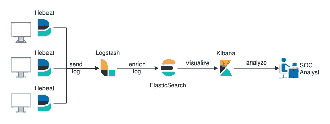
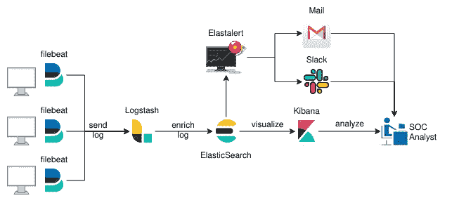
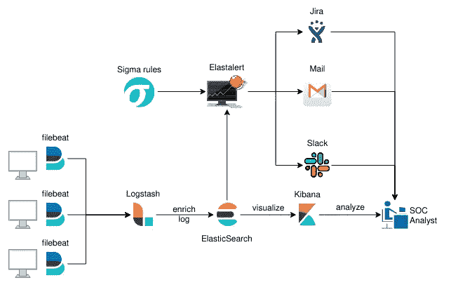
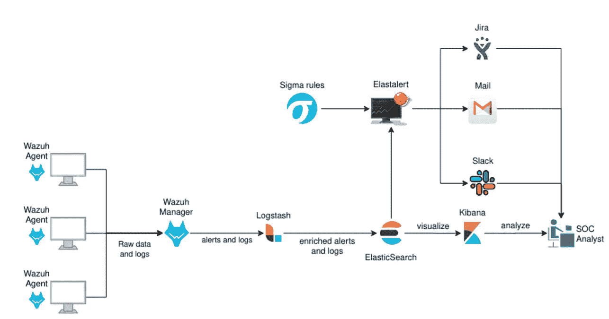
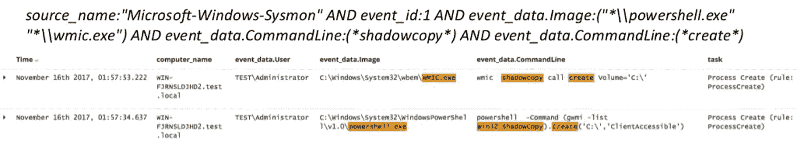

# 构建开源 SIEM:结合 ELK、Wazuh HIDS 和 Elastalert 实现最佳性能

> 原文：<https://infosecwriteups.com/building-a-siem-combining-elk-wazuh-hids-and-elastalert-for-optimal-performance-f1706c2b73c6?source=collection_archive---------0----------------------->

在构建 SIEM 时，您需要决定的第一件事是您要选择的分布式体系结构。这意味着分析可用的资源，以及您的 SOC 的需求。

*   您是在监控 100、1000 还是 10000 台主机？
*   你有购买商业工具的预算吗？
*   您的基础架构的异构程度如何？
*   您只是在寻找安全警报，还是也需要用于审计目的的持久事件日志记录？
*   您希望实现什么类型的粒度？
*   您希望实现什么样的响应时间？您需要实时通知吗？
*   您是否有时间改进/调整您的解决方案，或者您是否需要一些能够尽快 100%工作的东西？

这些是你需要问自己的一些问题。在我们的特殊例子中，我们需要为一个大约 20K 台主机的网络设置一个 SIEM。我们没有购买商业工具或许可证的预算。出于审计目的，我们需要持久的日志记录。这包括记录在我们的基础设施中执行的每个命令，同时监控恶意命令。为了编写自定义规则，我们还需要低层次的粒度。基本上，我们想要一款顶级的 SOC，而不需要花钱。但这是不可能的。

> 作为经理，你应该明白的第一件事是没有免费的东西。如果你选择开源，你可能不需要支付许可费，但是你会花钱组建一个团队，这个团队可以有效地:
> 
> 1)根据您需求调整开源解决方案，无需支付支持费用。
> 
> 2)如果你想有所回报，就为开源项目做贡献。

**你要么付钱给有才华的员工，要么付钱给封闭源码+支持。**这是不可避免的。就我而言，我很幸运能够与一个由安全工程师和 soc 分析师组成的优秀团队合作，他们能够共同努力实现我在开始时详述的所有目标。

你可能会问这有什么关系？嗯，我们采取的架构决策可能不符合您的需求。你可能需要一些快速且能完成工作的东西。你可能没有一个喜欢弄脏自己的团队。在这种情况下，像 Splunk(【https://www.splunk.com/】)这样的东西可能最适合你。这将是昂贵的，尤其是如果你有一个相当大的基础设施来监控，但这将是更容易实现比我们所做的。

描述了我们最初的情况后，让我们继续前进。查看常见的 SIEM 架构，最常见的开源架构涉及 ELK +类似 Elastalert 的东西。在我之前的文章中，我已经谈到了如何将麋鹿用于伐木目的。

这种架构通常在每台受监控的主机上运行某种类型的日志/事件转发(类似于 filebeat ),它将数据发送到 Logstash ingestor，后者解析数据、丰富数据并将其发送到非关系数据库(在本例中为 Elastic ),然后可以通过仪表板(Kibana)对其进行查询和可视化。它看起来会像这样。



SIEMS 架构的第一次迭代

然而，这个设计有一个明显的缺陷。它 100%是手工制作的。SOC 分析师必须手动查询和分析数据来检测线程。你应该尽可能地让每个过程自动化。

这还有另一个问题。你不会留下任何发现/相关事件的记录。至少不是自动的。

要解决这两个问题，您需要添加某种警报/通知系统来保存信息。这可以通过 Elastalert([https://github.com/Yelp/elastalert](https://github.com/Yelp/elastalert))来实现。这是一个 python 开发的框架，它查询 Elasticsearch 并在警报触发时通知您。

我们选择两种通知方法。第一种是通过一个松弛的频道来发布更紧急的警报。第二种是通过收件箱留下记录。



我们 SIEM 架构的第二次迭代

Elastalert 通知您特定的事件查询，但是它查询哪些事件呢？你必须定义这些。为此，我们将使用西格玛规则项目([https://github.com/Neo23x0/sigma](https://github.com/Neo23x0/sigma))。适马是一种标准的规则格式，允许您定义可以转换为多种格式的查询，如 Kibana 的 KQL、Splunk、Arcsight、Qualys，当然还有 Elastalert(等等)。引用它的创造者的话[弗洛里安·罗斯](https://medium.com/u/2fdc032a69b3?source=post_page-----f1706c2b73c6--------------------------------)

> 适马用于日志文件，就像 Snort 用于网络流量，YARA 用于文件。

在克隆存储库之后，您可以使用 David Routin 提供的 python 脚本`sigma2elastalert.py`将规则转换成 elastalert 格式。

现在，您有了一个可以独立于操作系统的架构，并且具有用于检测恶意事件的社区开源规则。但是问题跟踪呢？好吧，Slack 和 Gmail 都不擅长这个。幸运的是，您可以将吉拉与 Elastalert 集成在一起，自动创建对您可能发现的问题的跟进。你在这里有一个逐步实现:[https://qbox . io/blog/jira-alerting-elastic search-elastalert-tutorial](https://qbox.io/blog/jira-alerting-elasticsearch-elastalert-tutorial)

让我们用新增加的内容来更新图表。



我们 SIEM 架构的第三次迭代

现在我们已经满足了所有的基本需求，我们可以开始优化我们的实现了。到目前为止，我们提出的解决方案是 HELK 平台的精简版，由 [Roberto Rodriguez](https://medium.com/u/996cb7f12ac1?source=post_page-----f1706c2b73c6--------------------------------) 创建(https://github . com/cyb 3 rward 0g/HELK)。对于那些不知道的人，去看看吧，太棒了。它不仅涵盖了我们迄今为止所做的工作，还包含了通过 Apache Spark、Hadoop、GraphFrames 和 Jupiter 笔记本电脑实现的分布式处理和机器学习功能。我们实际上并不需要这些功能，但是您的用例可能会有所不同。

尽管我们架构的第三次迭代确实有一些问题。虽然它确实允许我们在搜索某些事件时获得更高的粒度，但这是以牺牲性能为代价的。像 ElasticSearch 这样的非关系数据库确实很快，但是请记住我们的首要要求之一:出于听觉目的的日志记录和命令监控。现在，让我们做一些数学计算。您有大约 20K 台服务器和一个低级别的审计策略，它基本上记录了每个 execve syscall 的运行。你已经在[上看到了我的第一篇文章](https://medium.com/@securityshenaningans/building-a-siem-centralized-logging-of-all-linux-commands-with-elk-auditd-3f2e70503933)中的详细审计输出，即使假设你去掉了大部分输出，只保留时间和调用的命令，也需要查询很多信息。西格玛规则库有大约 350 条规则。假设您监控大约 200 个恶意命令/字符串(在 Unix 和 Windows 规则之间),并且您定义了大约 100 个其他定制规则，特别是针对您的平台。总共有 650 条规则。

假设您的每个服务器每 10 秒记录一次系统调用(这已经很慷慨了)，那么您每秒将有 650 x20000/10 =**130 万次检查。**
当然，这并不是 100%准确，因为你有几个东西可能会优化你的查找时间，如[缓存查询](https://www.elastic.co/guide/en/elasticsearch/reference/current/query-cache.html)，但仍然，这个粗略的数字超出了我们的基础设施预算。它也有通知延迟的缺点。您可以增加查询间隔，并减少负载，但稍后会通知您。这就是权衡。我们正在寻找实时警报。我们需要找到另一种选择。

进入瓦祖赫。Wazuh 是一个开源的主机入侵检测系统(HIDS)，可以减轻你的处理负荷([https://wazuh.com/](https://wazuh.com/))。Wazuh 可以通过多种方式实现，但最常用的方式是在每个节点中有一个 Wazuh 代理，然后有几个 Wazuh 管理器接收事件。每个 Wazuh 代理监控安装它的主机上的几个事件，但它也可以充当日志转发器，取代 filebeat。它将有关主机的信息转发给每个代理，代理将处理该信息，并仅将您需要的警报转发给 SIEM。
Wazuh 管理器可以支持多个连接，并帮助减少大约 80%的信息处理。这是因为它的规则处理器利用了用 c 编写的特定解码器。该解码器以非常快的方式解析警报字段，然后以树状结构匹配每个规则([https://documentation . wazuh . com/3.7/user-manual/ruleset/ruleset-XML-syntax/rules . html](https://documentation.wazuh.com/3.13/user-manual/ruleset/ruleset-xml-syntax/rules.html))。

Wazuh 通过定义与特定事件相匹配的规则来工作，所以您可能会看到类似这样的内容(不要使用这些规则，这些规则已被修改以用于简化目的):

规则 1:检测分组的 ssh 消息

```
<rule id="1" level="0" noalert="1">
 <decoded_as>sshd</decoded_as>
 <description>SSHD messages grouped.</description>
 </rule>
```

规则 2:检测失败的登录

```
<rule id="2" level="5">
 <if_sid>1</if_sid>
 <match>illegal user|invalid user</match>
 <description>sshd: Attempt to login using a non-existent user</description>
 </rule>
```

规则 3:在定义的时间段内检测多个规则 2(暴力)

```
<rule id="3" level="10" frequency="8" timeframe="120" ignore="60">
 <if_matched_sid>2</if_matched_sid>
 <description>sshd: brute force trying to get access to the system.</description>
 <same_source_ip />
 </rule>
```

这种树状规则结构有两个主要问题:

1.  很快就会变得难以维持。一些规则可能首先与您不期望的其他规则匹配，或者如果您没有提前计划，您可能最终会得到杂乱无章的代码。
2.  粒度级别由规则预处理器决定。当然，您可以进行正则表达式匹配，但这并不容易让您关联不同的匹配规则。

幸运的是，对于 Wazuh，我们不需要粒度或详细的事件。我们追求速度。这意味着您可以使用:

1.  Wazuh 以真正快速的方式匹配最简单的规则(想想恶意命令、未授权登录或勒索软件加密警报的字符串匹配等基本内容)
2.  针对不需要实时通知的特定用例的 Elastalert 和 sigma 规则(例如每 5 分钟查询一次的特定恶意软件组检测规则)。

将 Elastalert 和 Wazuh 结合使用，您可以平衡处理负载，两全其美。

现在我们的架构看起来会像这样:



经济高效的 SIEM 的最终体系结构

我们最终的架构实现了我们最初打算的所有目标。然而，**它的缺点是维护起来困难两倍**，因为您现在必须调优和监控两个不同的规则集，一个是针对 Wazuh 的快速规则集，另一个是针对 Elastalert 的缓慢但更详细的规则集。
你需要考虑的最后一些事情(这可以被认为是一般的架构规则):

*   设计时总是考虑到事情会失败。在我们的例子中，我们最终在 4 个不同的环境中使用了 14 个 Wazuh 管理器(原生 Windows AD、原生 Unix、原生云和 AWS Cloud)。10 个用于主机，4 个用于故障切换(每个区域一个)
*   从代理接收连接时平衡流量。您可以使用类似 Nginx 的东西，甚至可以使用 DNS 平衡器，但总是通过您的管理器平均分配连接。如果您推送一个需要重启的配置更改，当没有正确分发时，所有代理都可以很容易地 DDOS 管理器。
*   分析网络开销。不要使用美国基础设施中的管理器接收来自欧盟代理的连接。这不仅会增加延迟时间(特别是如果你使用 VPN)，而且在处理跨 AZ AWS 流量时可能会产生额外的成本。
*   确保监控 Wazuh 代理服务的启动和停止，并限制单个实例可以创建的日志数量，以防止通过垃圾日志发起 DOS 攻击。
*   进行频繁的红队演习，以验证您的警报工作正常。你可以用 Mitre 的 Att&ck 框架来映射单元测试([https://attack.mitre.org/](https://attack.mitre.org/))以及类似 Red Canary 的原子测试([https://github.com/redcanaryco/atomic-red-team](https://github.com/redcanaryco/atomic-red-team))来自动化这个过程。
*   适马和瓦祖赫规则经常更新。一定要保持更新。
*   扩展您的规则集。不要只依赖社区的书面规则。有时你会发现错误，不得不手动修改它们。其他时候，您可能希望合并以顺序格式编写的规则/用于其他索引结构。

如果你想练习规则翻译，我可以推荐 Teymur Kheirhabarov 的两篇精彩演讲。

*   "[在 windows 环境中搜寻凭据转储](https://www.slideshare.net/heirhabarov/hunting-for-credentials-dumping-in-windows-environment)"
*   "[寻找 windows 基础架构中的横向移动](https://www.slideshare.net/votadlos/hunting-lateral-movement-in-windows-infrastructure)"



这个例子说明了这些规则可以变得多么精细(这个例子通过卷影副本识别凭证转储)

事实上，我们最终翻译了这些会谈中的许多规则，以监控我们公司特定的用例。

与所有事情一样，该体系结构需要大量调整才能完成，但是您将拥有一个可靠的 SIEM，它将允许您:

1.  监控来自不同环境/操作系统的数千台主机。
2.  接收实时警报。
3.  实现开源规则以及编写您自己的自定义规则
4.  出于安全和审计目的，自动检测、跟踪和记录威胁。
5.  不为一个许可证付费。

记住，

> **没有完美的午睡，只有完全符合你需求的午睡**。