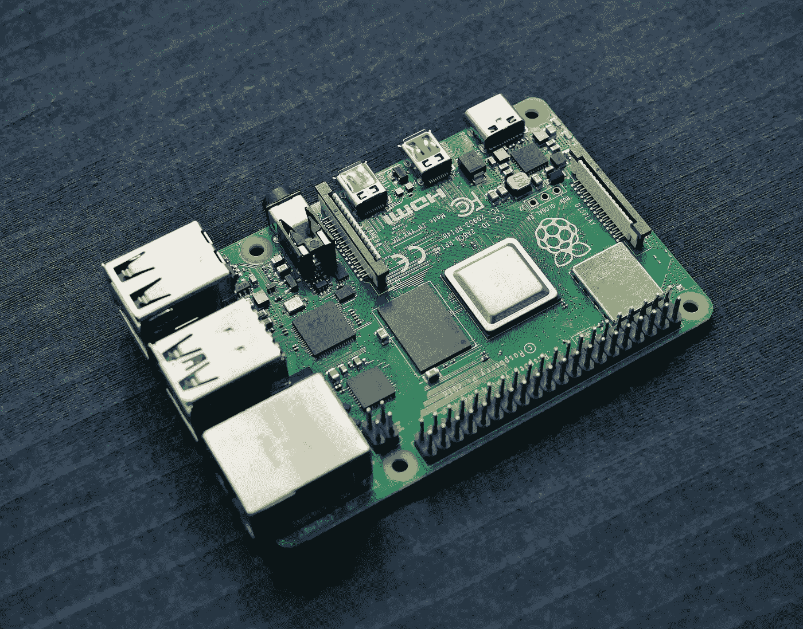
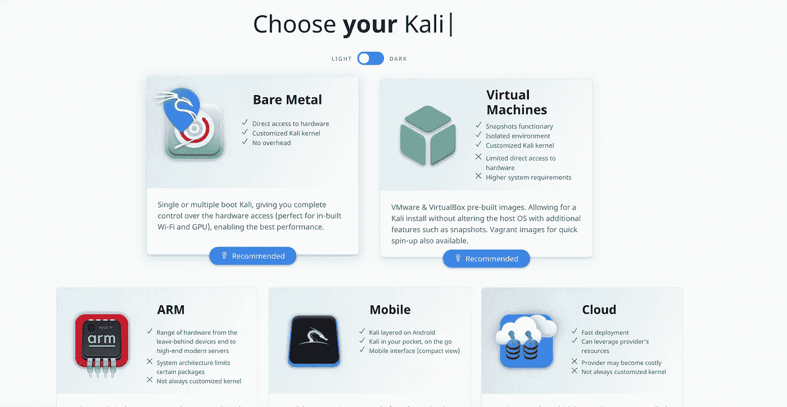
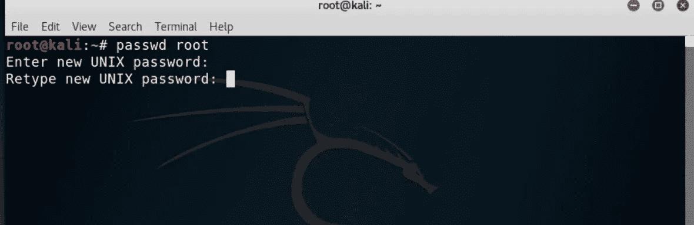
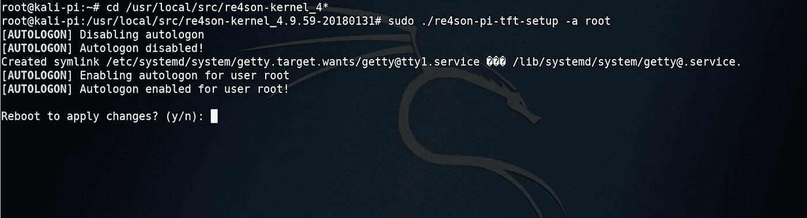

# 用 Raspberry Pi 构建我们自己的渗透测试盒

> 原文：<https://infosecwriteups.com/building-our-own-penetration-testing-box-with-raspberry-pi-5d7b17d11348?source=collection_archive---------0----------------------->

## 你只需要黑邻居的无线网络

[Unsplash.com](https://unsplash.com/photos/rZKdS0wI8Ks)

真的，你需要的只是一个树莓派。尽管它很小，但它是一个非常强大的工具。通过使用它，你可以攻击你周围的不同设备，所以要小心，我们开始。

首先，这份清单将帮助你找到并购买你需要的一切:

# 购物单

[配备 4GB 内存的树莓 Pi 4 型号 B(基本套件)](https://www.canakit.com/raspberry-pi-4-starter-kit.html)——70 美元

[闪迪 64GB 至尊 microSDXC UHS-I 存储卡](https://www.amazon.com/dp/B07FCMBLV6)——15 美元

[带风扇的树莓皮 4 盒](https://vilros.com/collections/raspberry-pi-accessories/products/vilros-raspberry-pi-4-compatible-clear-transparent-case-with-built-in-fan)——12 美元(可选)

[无线 WiFi USB 加密狗棒适配器 rt 5370 150 Mbps](https://www.amazon.com/gp/product/B01KWQAQ00/ref=ppx_yo_dt_b_asin_title_o00_s00?ie=UTF8&psc=1)——9 美元(可选)

疯狂收音机 PA——35 美元(可选)

# 操作系统

我强烈推荐 Kali linux，因为它已经有了很多很棒的工具，并且适合 pentesting。如果你担心特定的流量会被与 Kali Linux 相对应的蓝色团队成员注意到，你绝对可以在设备上安装 Debian/Ubuntu 之类的东西，并添加自己的工具。

你需要一个 ARM 版本，可以在这里 *下载 [*。*](https://www.kali.org/get-kali/)*

要将 Kali ARM 映像写入 microSD 卡，您可以使用类似 [balenaEtcher](https://www.balena.io/etcher/) 的工具

kali.org

# 无线网卡

Raspberry Pi 4 已经内置了无线网卡(2.4 GHz 和 5.0 GHz IEEE 802.11ac wireless)，并支持数据包注入和监控模式(Pi 3 没有)。因此，如果你想进行无线攻击，你可以使用内置的无线(wlan0)或另一个范围更大的无线适配器。

有许多适配器支持包注入，它们是:

1.  EASTECH FX-5370TH 802.11bgn 150M 天线
2.  阿尔法 AWUS036NHA
3.  **阿尔法 AWUS036NH**
4.  **TP-LINK TL-WN722N (v1)**

Amazon.com

# 加载 Kali Linux &更新

一旦 Kali Linux 加载，您应该会看到一个登录屏幕。默认凭证是用于登录的**卡利**和用于密码的**卡利**。当 Kali 加载时，打开一个终端窗口。重置您的凭据

接下来，你需要更新系统。现在，您需要通过以太网电缆或点击右上角的 Wi-Fi 图标并选择一个可访问互联网的网络，将您的 Pi 连接到互联网。

使用以下命令更新您的 raspberry pi:

apt-get 更新
apt-get 升级
apt-get 远程升级

页（page 的缩写）这可能需要一些时间

所有这些完成更新后，我们将准备开始配置我们的树莓 Pi。

# 更改 SSH 密钥

在你的终端窗口中， [**cd**](https://null-byte.wonderhowto.com/how-to/hack-like-pro-linux-basics-for-aspiring-hacker-part-2-creating-directories-files-0147234/) 到 SSH 键并重新配置服务器。

> *CD/etc/ssh/
> dpkg-重新配置 openssh-server*

这应该会创建新的 SSH 密钥。启用 SSH 的运行级别，以便在引导时启动服务，这样我们就可以远程登录。

> *更新-rc.d -f ssh 删除
> 更新-rc.d -f ssh 默认值
> nano/etc/ssh/sshd _ config*

在打开的 nano 窗口中，确保“PermitRootLogin”未被标记

按 CTRL+x 保存

接下来，键入 **sudo service ssh restart** 来应用这些更改。最后，键入**update-RC . d-f ssh enable 2 3 4 5**在引导时使用我们应用的设置启用 SSH

# 启用自动登录

如果您想要访问 raspberry pi 而不需要将其连接到显示器，请执行以下操作:

*CD/usr/local/src/re4son-kernel _ 4 *
。/re4son-pi-tft-setup -a root*

您应该会看到如下所示的输出。要应用更改并引导到新配置的 Pi，请键入 **Y** 进行确认并重新引导。

现在，您已经准备好用它来入侵无线网络了。随意通过 ssh 连接到它并开始攻击