# 打嗝自动化|使用 Python3 通过 Rest API 和 Robot 框架自动化打嗝扫描

> 原文：<https://infosecwriteups.com/burp-automation-automating-burp-scanning-via-rest-api-robot-framework-using-python3-78aebdd35c53?source=collection_archive---------0----------------------->

> 手动安全扫描非常耗时，我们可以利用 headless Burp Suite 来执行扫描，并通过 Python 中的 Pydrive 模块直接将结果上传到 **Google Drive** 中。

[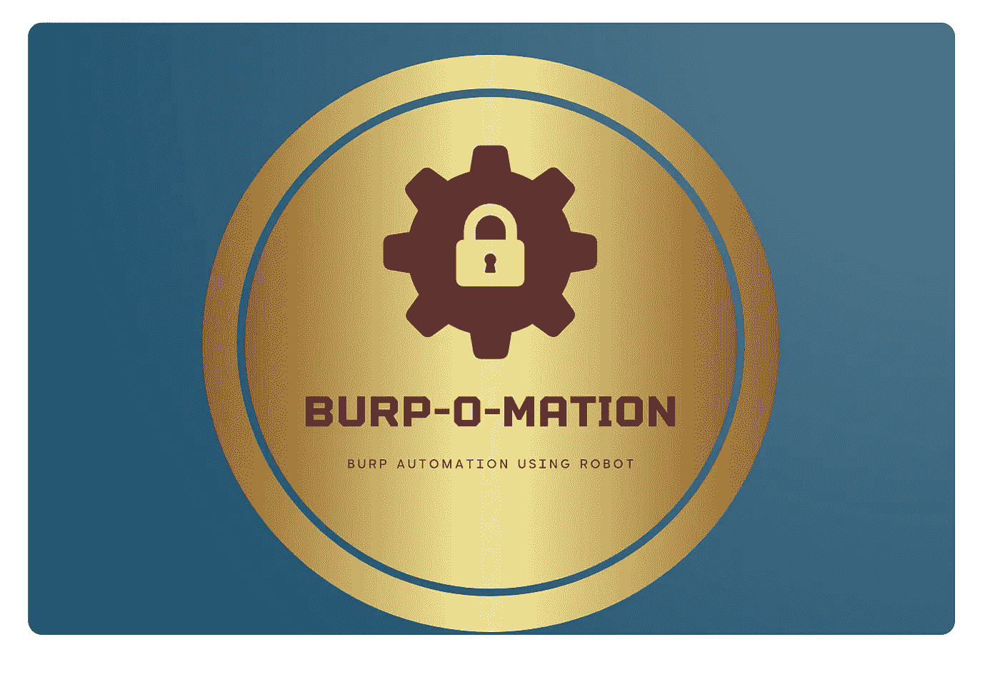](https://github.com/justmorpheus/burp-automation)

**打嗝自动化**

这种自动化使用 Burp Suite Pro 以及机器人框架和使用 Python3 的 [REST API](https://github.com/vmware/burp-rest-api) 。因此称为 [**打嗝**](https://github.com/justmorpheus/burp-automation) 。

## github:[https://github.com/justmorpheus/burp-automation](https://github.com/justmorpheus/burp-automation)

它也可以在 Jenkins 中用来执行自动化的 UI 测试。这将通过利用打嗝扫描仪和**打嗝扩展器**的能力来启动自动蜘蛛和爬虫。
一旦扫描完成，报告将以 HTML & CSV 格式生成，并自动上传至 **GDrive 文件夹**。

> 这是一个将 Burp Suite 与 CI/CD 管道集成以实现自动化 API 模糊化的分步指南。该工具使用 bash 脚本，一键安装所有使用 Burp Rest API 的命令，使用 python 和 Robot 框架进行自动化测试。

## 它允许您非常有效地执行以下操作

*   使用 Bash 的一键运行安装所有的依赖项和详细的先决条件。
*   使用 python3 和易于自动化的机器人框架。
*   用户使用 Burp Suite Rest API，并在无头模式下运行 Burp Suite Professional 以及多个 Burp Suite 扩展，如 [**【附加扫描检查】**](https://github.com/PortSwigger/additional-scanner-checks) 、[**BurpJSLinkFinder**](https://github.com/InitRoot/BurpJSLinkFinder)、和[**active-scan-plus**](https://github.com/PortSwigger/active-scan-plus-plus)。
*   使用 robot 脚本自动执行 API/Web 端点的 pentest，包括范围添加和删除。
*   实时警报的松散集成，以及以 YYYY-MM-DD 格式将报告上传到 GDrive。

## 关于框架

机器人框架是一个通用的测试自动化框架，用于验收测试和测试驱动开发(ATDD)。它有易于使用的表格测试数据语法，并利用关键字驱动的测试方法。它的测试能力可以通过用 Python 或 Java 实现的测试库来扩展。用户还可以从现有的关键字中创建新的更高级别的关键字，使用与创建测试用例相同的语法。

## *自动化的先决条件* [*通过机器人框架使用 Rest API 打嗝*](https://github.com/justmorpheus/burp-automation)

*   Windows/Linux 操作系统
*   安装了许可证的 Burp Suite Pro
*   Burp 套件 Rest API (Vmware)
*   Python 2.x(大多数 Linux 发行版中都有)
*   点
*   机器人框架
*   机器人 2 打嗝包

*(本分步指南将包括通过一键操作安装运行该自动化所需的先决条件和预设置步骤)*

# 先决条件

1.  Debian OS(Ubuntu)。
2.  用 [prefs.xml](https://burpsuite.guide/blog/activate-burpsuite-inside-docker-container/) 激活了 Burp Suite Pro(Burp Suite _ Pro _ v 2021 . 6 . 2 . jar)。
3.  [Vmware Burp Suite Rest API](https://github.com/vmware/burp-rest-api) (将通过自动化脚本安装)。
4.  Python3 & Pip(它将通过自动化脚本安装)。
5.  机器人框架(将通过自动化脚本安装)。
6.  更新 [custom_lib_2.py](https://github.com/justmorpheus/burp-automation/blob/master/custom_lib_2.py) 扫描的范围和时间(当前时间为 3 分钟)。
7.  为 PyD [驱动器](https://pythonhosted.org/PyDrive/oauth.html)设置 G 驱动器认证
8.  将凭证(client _ secrets . JSON & mycreds . txt)上传到 GitHub 存储库。
9.  使用 Dockerfile 的 docker，以 CentOS 为单位。

> 样本 [client_secrets.json](https://github.com/justmorpheus/burp-automation/blob/master/client_secrets.json) 、 [mycreds.txt](https://github.com/justmorpheus/burp-automation/blob/master/mycreds.txt) 和 [prefs.xml](https://github.com/justmorpheus/burp-automation/blob/master/prefs.xml) 已经在存储库中提供。用工作配置更新文件。

> ***注*** *:更新*[*custom _ lib _ 2 . py*](https://github.com/justmorpheus/burp-automation/blob/master/custom_lib_2.py)*中的 time.sleep 如果要运行扫描更长时间。*

## 预设置

1.  *生成 g 盘凭证。*

*   转到 API 控制台并创建自己的项目。
*   搜索“Google Drive API”，选择条目，然后单击“启用”。
*   从左侧菜单中选择“凭据”，单击“创建凭据”，选择“OAuth 客户端 ID”。

[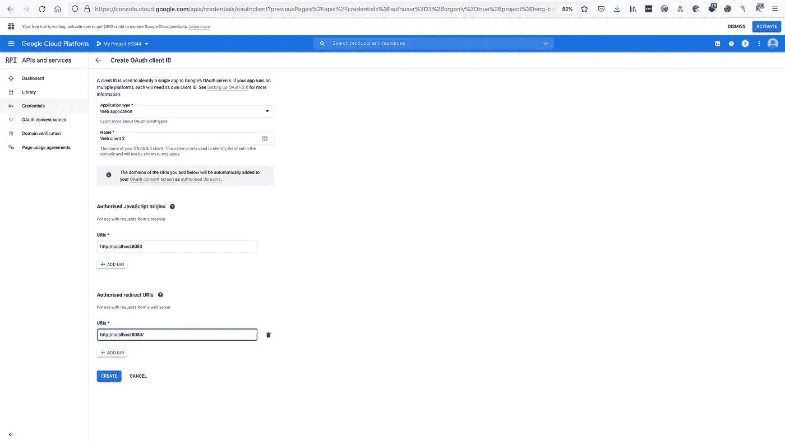](https://github.com/justmorpheus/burp-automation)

**Oauth 客户端**

*   点击客户端 ID 右侧的“下载 JSON”保存凭证，以下载 **client_secret_ <真正的长 ID >。json** 。并重命名为 **client_secrets.json**

> 这将生成 **client_secrets.json.**

[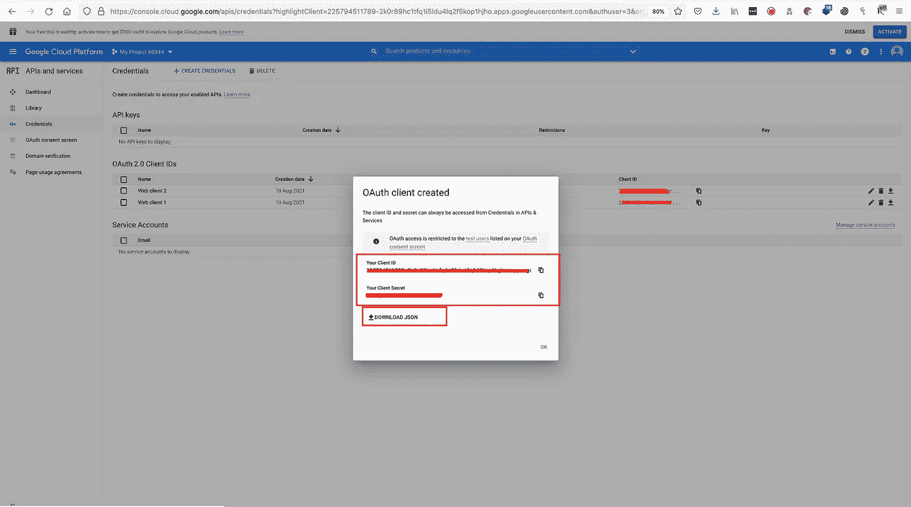](https://github.com/justmorpheus/burp-automation)

**client_secrets.json**

*   现在，需要设置产品名称和同意屏幕->单击“配置同意屏幕”并按照说明进行操作。

    完成后:
    -选择“应用类型”为 Web 应用。
    -输入一个合适的名称。
    -输入 [http://localhost:8080](http://localhost:8080) 中的“授权 JavaScript 源”。
    -输入 [http://localhost:8080/](http://localhost:8080/) “授权重定向 URIs”。

[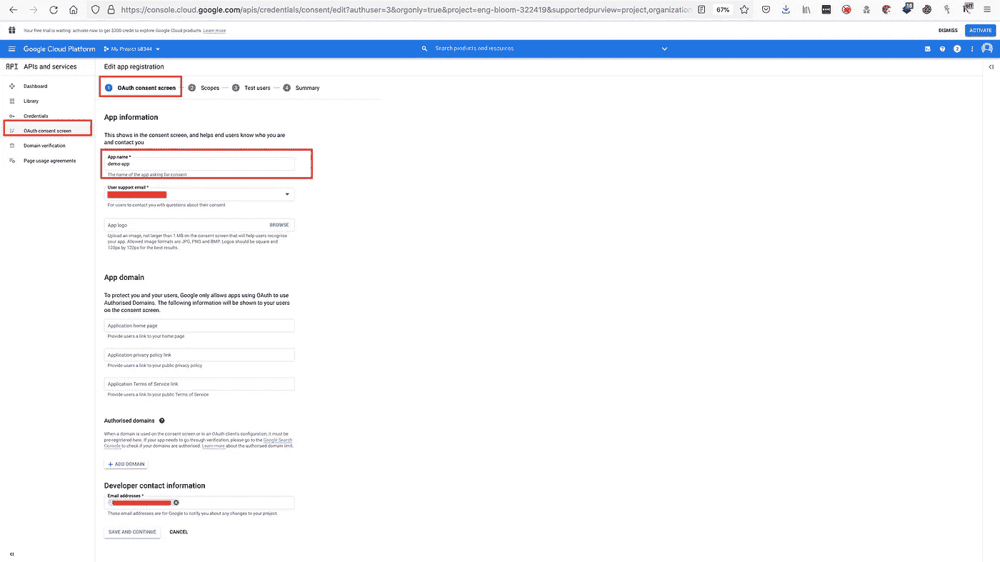](https://github.com/justmorpheus/burp-automation)

**添加 Web 应用**

*   单击保存并继续。
*   现在，在测试用户中，添加将用于 G 驱动器验证的用户。

[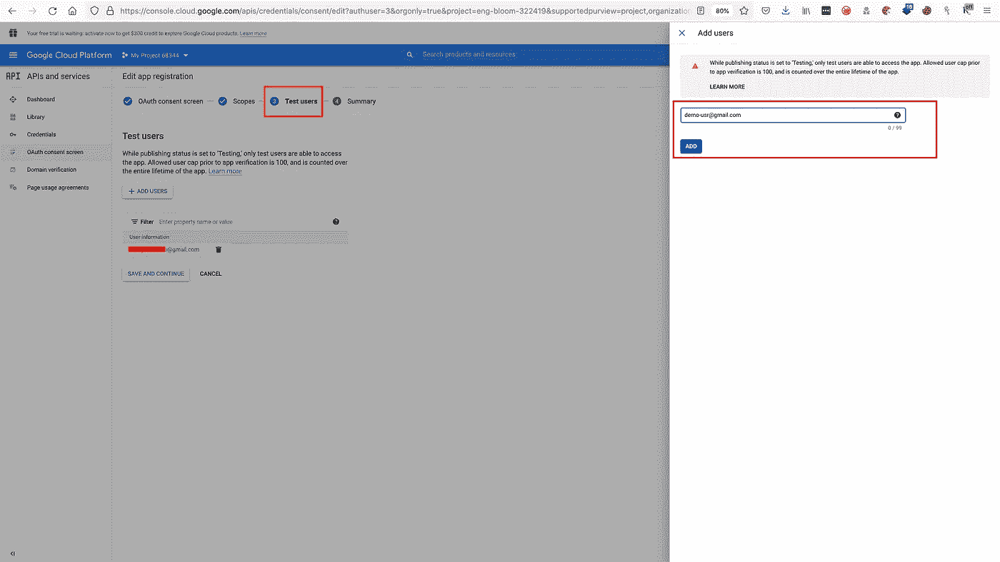](https://github.com/justmorpheus/burp-automation)

**添加 GDrive 文件夹的用户**

*   最后，检查摘要并返回仪表板。这是完整的。

[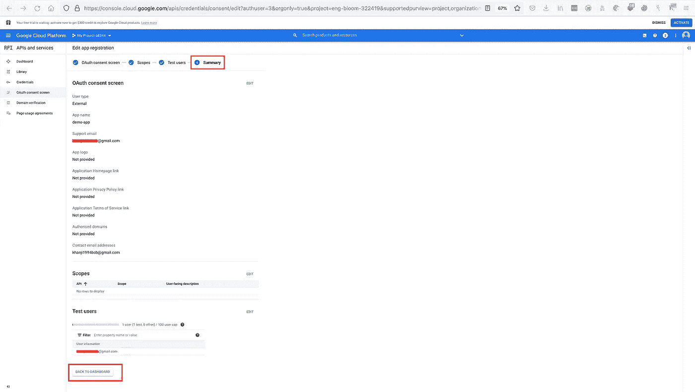](https://github.com/justmorpheus/burp-automation)

**检查总结**

*   使用 [client_secrets.json](https://github.com/justmorpheus/burp-automation/blob/master/client_secrets.json) 生成 [mycreds.txt](https://github.com/justmorpheus/burp-automation/blob/master/mycreds.txt) 。

> Pydrive 要求通过浏览器进行身份验证。因此，我们可以在本地生成凭证，并将所需的文件上传到存储库中。资源库中提供了示例文件。用您自己的文件替换它们。
> **这个需要做一次。**

*   在本地系统上运行以下命令(首次身份验证需要浏览器)。

```
# wget [https://gist.githubusercontent.com/justmorpheus/3c0f1f1034bc9532afa45fd27fe0dcb4/raw/12ced55441772692960bb9e19de2ccdc73c1910f/oauth-quickstart.py](https://gist.githubusercontent.com/justmorpheus/3c0f1f1034bc9532afa45fd27fe0dcb4/raw/12ced55441772692960bb9e19de2ccdc73c1910f/oauth-quickstart.py)#python3 -m pip install pydrive
```

**生成 mycreds.txt 的快速启动脚本**

*   运行命令。

```
#python oauth-quickstart.py
```

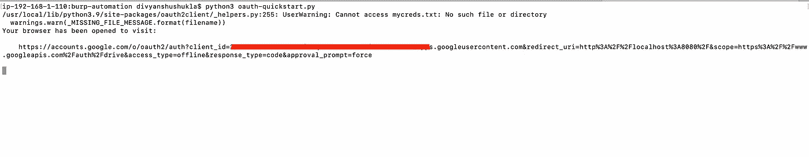

**Python 快速入门**

*   遵循默认步骤并继续。认证完成后，关闭浏览器。

> 这将生成 **mycreds.txt**

[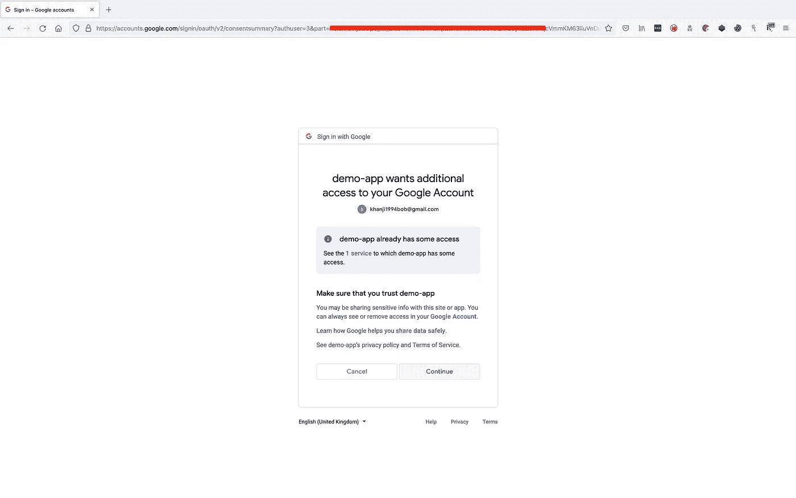](https://github.com/justmorpheus/burp-automation)

**演示 Google Drive 认证**

*   最终文件(client _ secrets . JSON & mycreds . txt)将上传到存储库。

> 不要公开共享此文件夹，因为它包含机密。这将被上传到回购。

```
$ find . | sed -e "s/[^-][^\/]*\// |/g" -e "s/|\([^ ]\)/|-\1/"
.
 |-mycreds.txt
 |-oauth-quickstart.py
 |-client_secrets.json
```

2.为报告上传生成**父文件夹 id** 。

*   在 Google Drive 中创建一个共享驱动器，复制文件夹 id(父 id)用于上传报告。

[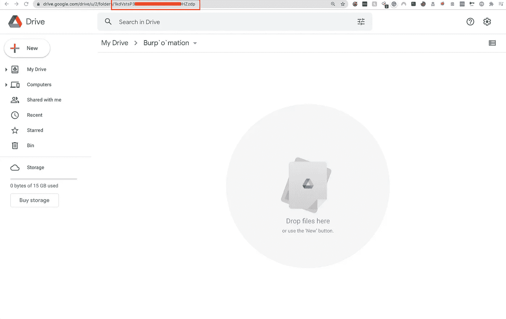](https://github.com/justmorpheus/burp-automation)

**用于上传报告的父 id。**

3.为 Slack 生成传入的 [Webhook URL。](https://api.slack.com/messaging/webhooks)

*   通过创建应用程序并启用应用程序的 webhook，可以生成传入的 URL。

[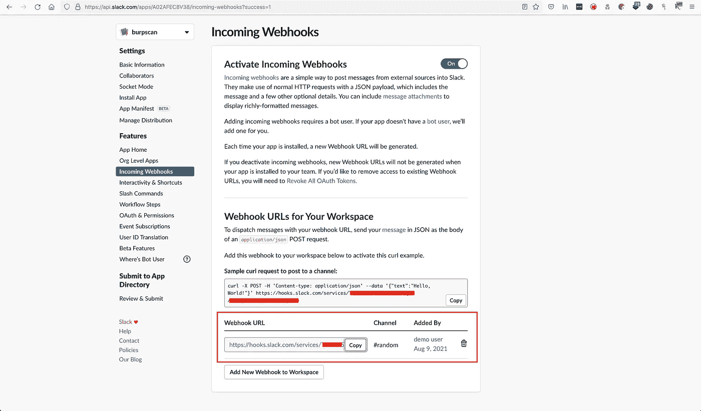](https://github.com/justmorpheus/burp-automation)

**松紧网钩**

4.修改 [custom_lib_2.py](https://github.com/justmorpheus/burp-automation/blob/master/custom_lib_2.py) 并更新**范围**、alert 的 **Slack Webhook** 和 Google Drive 的**父文件夹 id** (从步骤 2。)

> 这个也可以自动化，请自己动手。

[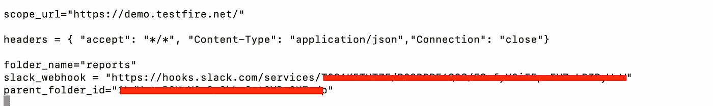](https://github.com/justmorpheus/burp-automation)

**范围更新**

2.*通过 CLI 模式激活打嗝。*

在您的系统上激活打嗝套件。Burp Suite Pro 将所有激活详情、设置和用户首选项保存在~/中。java/。userPrefs/burp/prefs.xml 文件。将 prefs.xml 上传到存储库。

3.将 *mycreds.txt* 、*client _ secrets . JSON*&*prefs . XML*放在 GitHub 的同一个目录下。

4.现在我们可以开始执行自动化的安装步骤了。

## 自动化 Burp 套件扫描

1.  在主目录中创建一个文件夹。

`#mkdir automation`

2.将目录更改为自动化。

`#cd automation`

3.下载 automate.sh bash 脚本。

```
#wget [https://raw.githubusercontent.com/justmorpheus/burp-automation/master/automation.sh](https://raw.githubusercontent.com/justmorpheus/burp-automation/master/automation.sh)
```

4.向 automate.sh 提供执行权限

```
chmod +x automation.sh
```

5.运行脚本。另外，提供一个参数作为保存自动化脚本的 GitHub 存储库。

```
#bash automation.sh [https://github.com/justmorpheus/burp-automation.git](https://github.com/justmorpheus/burp-automation.git)
```

6.剩下的一切将由自动化脚本来完成。

[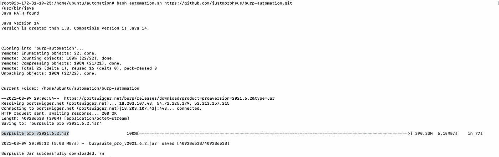](https://github.com/justmorpheus/burp-automation)

通过 Bash 实现自动化

7.Bash 脚本将运行 python robot 命令(脚本将运行该命令)。

```
# python3 -m robot -d output fuzzing.robot
```

> 输出应该类似于下面提到的图像:**状态:无头打嗝 API 运行**。
> 在**状态下:无头打嗝 API 无法启动**。手动运行上述命令并排除错误。

[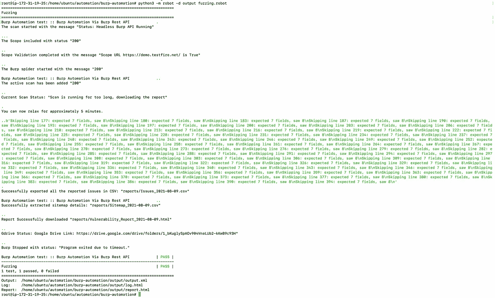](https://github.com/justmorpheus/burp-automation)

8.一旦所有的测试案例完成，报告将被上传到谷歌驱动器和链接可以通过控制台复制。

> 报告格式:CSV，HTML 和网站地图开发。

[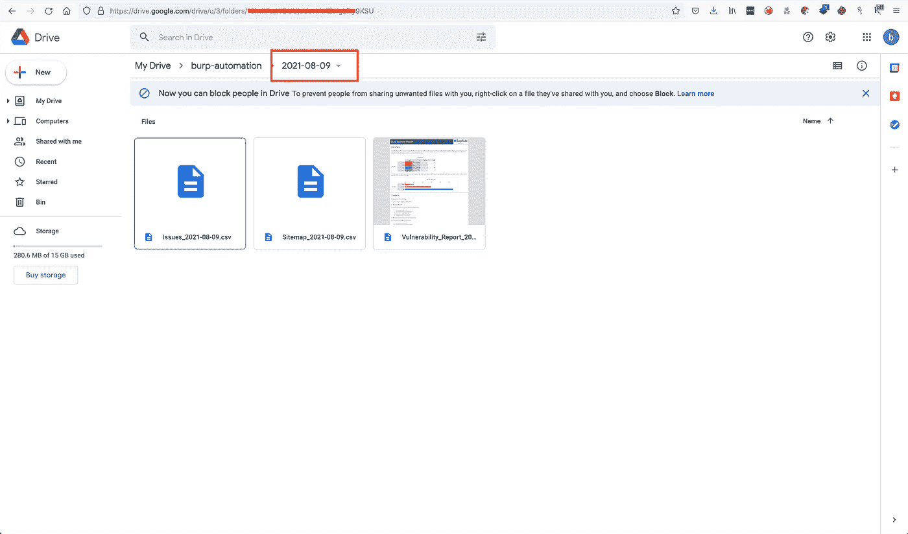](https://github.com/justmorpheus/burp-automation)

**最终报告**

9.检查 Gdrive 链接的松弛通道。

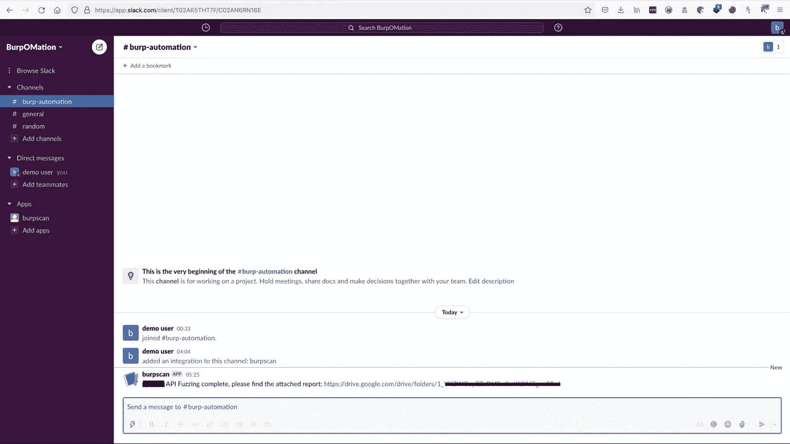

10.对 Cent-OS 的额外支持。

*   下载并运行这个 docker 文件。
*   相应地修改 dockerfile 文件。

**用于 CentOS(DIY)的 Dockerfile】**

*   运行 docker 文件的命令。

```
#docker build --no-cache -t burp-automate .#docker run --name burpomation -d burp-automate
```

*   这将构建并运行映像。

> 由于最初的想法是作为自动扫描的一部分在 Jenkins 管道上运行，因此没有保留任何数据，因为在运行 Jenkins 之前应该清理工作区。

*   运行[排气](https://github.com/justmorpheus/burp-automation)日志的日志命令。

```
#docker logs burpomation -f
```

[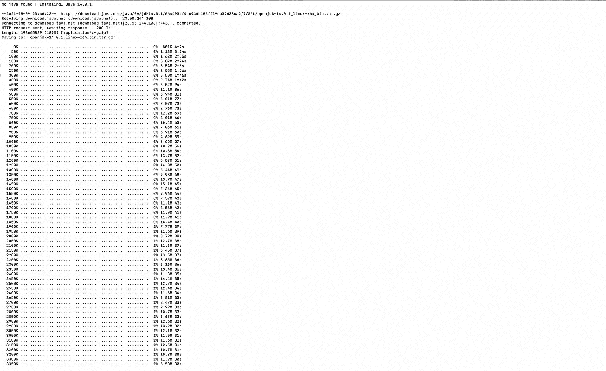](https://github.com/justmorpheus/burp-automation)

**Docker 记录脚本的状态。**

*   Docker 最后的结果应该是**通过**。

[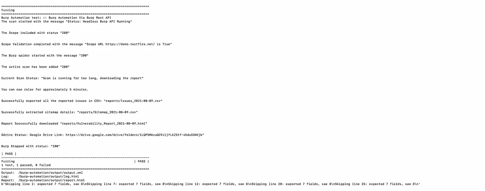](https://github.com/justmorpheus/burp-automation)

**最终对接结果:通过**

## 参考

-[https://we45.com/blog/automating-burp-with-jenkins/](https://we45.com/blog/automating-burp-with-jenkins/)
-[https://burp suite . guide/blog/activate-burp suite-inside-docker-container/](https://burpsuite.guide/blog/activate-burpsuite-inside-docker-container/)
-[https://portswigger.net/burp](https://portswigger.net/burp)
-[https://github.com/vmware/burp-rest-api](https://github.com/vmware/burp-rest-api)
-[https://doyensec.com/](https://doyensec.com/)

**免责声明:*请勿在 CI/CD 管道的生产中使用 Burp Suite Pro，而是使用***[***Burp Suite enterprise***](https://portswigger.net/burp/enterprise)***。所有提供的信息仅用于教育目的。作者不对任何人从事的任何非法活动负责。***

*感谢* [*just m0 rph 3 u 5*](https://twitter.com/justm0rph3u5)