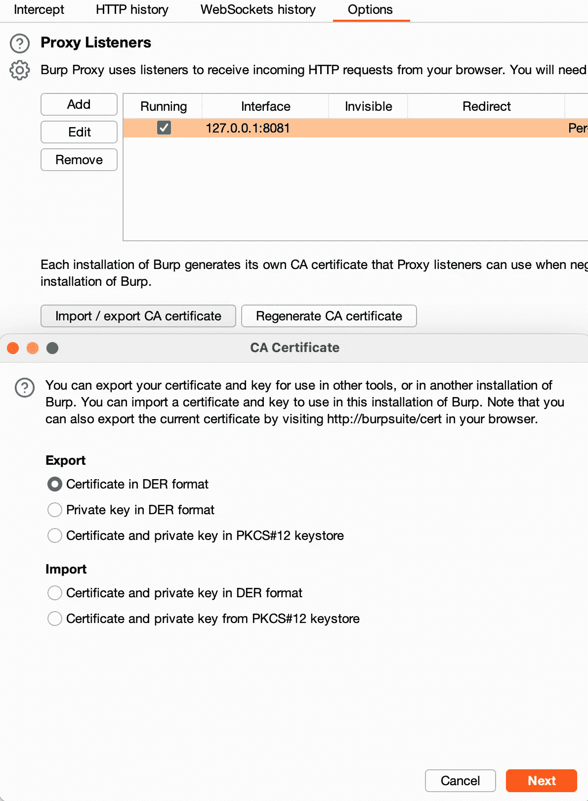
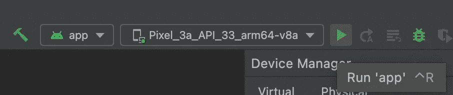
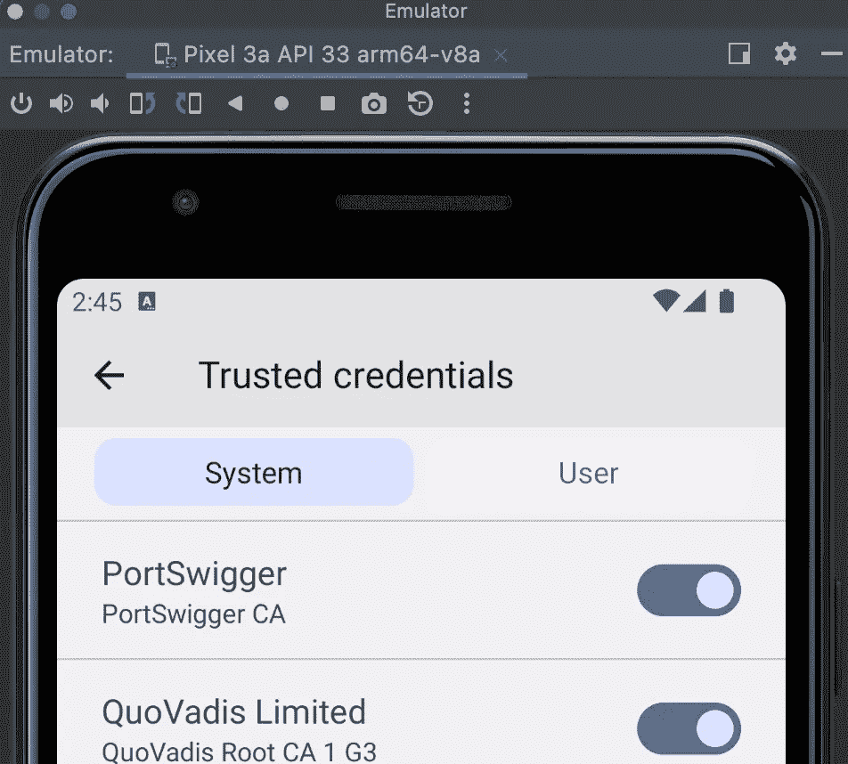
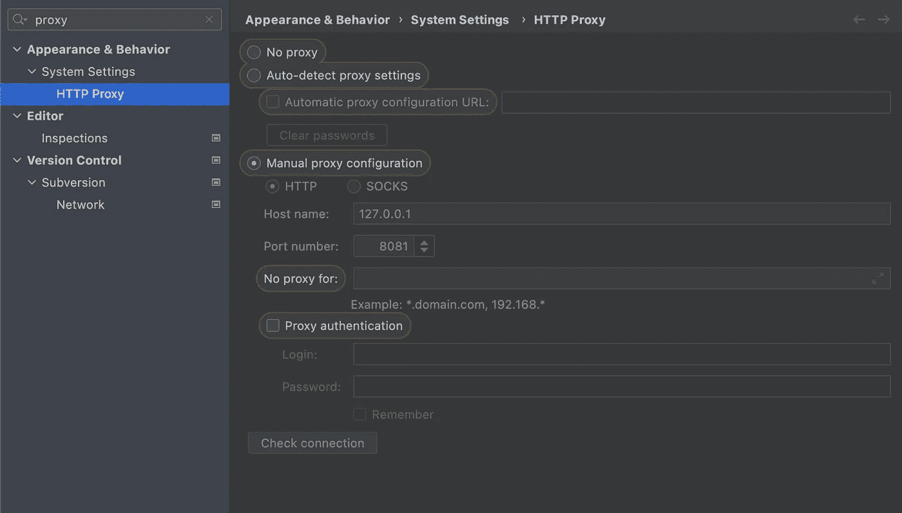
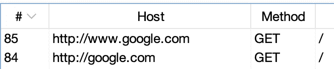

# Burp Suite Android 模拟器设置

> 原文：<https://infosecwriteups.com/burp-suite-android-emulator-5c030d420394?source=collection_archive---------1----------------------->

在 Android 模拟器上设置 Burp 套件的指南

Burp Suite 有一个[很棒的指南](https://blog.ropnop.com/configuring-burp-suite-with-android-nougat)来设置这一点，我会引用它，但它不是针对模拟器的，我在网上没有找到完整的指南，所以我在这里做一个。如果你喜欢，请关注我的推特和媒体以获得更多的指南和提示

安装 [Android Studio](https://developer.android.com/studio)

在您的终端中运行此命令，允许您对仿真器的系统进行更改

```
launchctl setenv studio.emu.params -writable-system
```

安装 [adb](https://developer.android.com/studio/command-line/adb) : `adb devices`会让你知道它是否已经安装

转到 Burp 中的“代理选项卡”并选择“选项”在“代理监听器”中，以 der 格式导出您的证书。我称之为`cacert.der`



运行这 3 个命令，将证书更改为 pem，并将其名称更改为添加了`.0`的`hash value`(用第二个命令打印的散列替换<散列>)

```
openssl x509 -inform DER -in cacert.der -out cacert.pem
openssl x509 -inform PEM -subject_hash_old -in cacert.pem |head -1
mv cacert.pem <hash>.0
```

我们需要在 android studio 上启动模拟器，所以打开一个空项目，点击我照片中高亮显示的开始按钮



模拟器启动后，我们将把证书推送到设备上

```
adb root
adb remount
adb push <cert>.0 /sdcard/
```

现在，我们将移动该文件，并为其授予权限

```
adb shell
mv /sdcard/<cert>.0 /system/etc/security/cacerts/
chmod 644 /system/etc/security/cacerts/<cert>.0
reboot
```

重新启动后，您的证书应该出现在“设置”= >“安全”= >“更多安全设置”= >“加密和凭证”= >“可信凭证”中



最后一步是进入 Android Studio 设置并启用代理(无论你使用哪个端口都可以，只要它在 burp 上是相同的)



手动代理配置

对我来说，直到我使用 127.0.0.1 和谷歌一起使用`Check connection`,并在我的 burp HTTP 历史上看到它，它才起作用



我在模拟器上有 Play Store，所以我用[https://apkpure.com/](https://apkpure.com/)来获取 apk，然后用`abd push`在设备上获取并运行它们

在推特[https://twitter.com/AdamJSturge](https://twitter.com/AdamJSturge)和媒体上关注我

如果你喜欢阅读这样的故事，并想支持我成为一名作家，可以考虑报名成为一名媒体成员。一个月 5 美元，你可以无限制地阅读数千篇文章，包括我的文章。如果你使用[我的链接](https://adamjsturge.medium.com/membership)注册，我会赚一小笔佣金，不需要你额外付费。