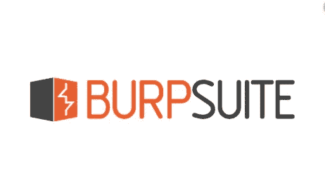
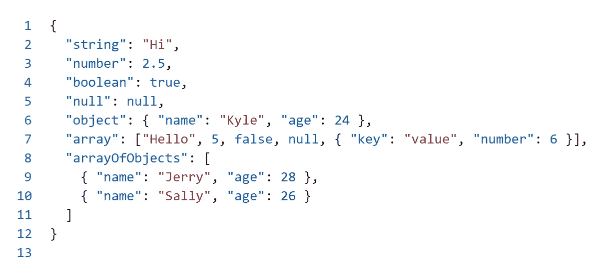
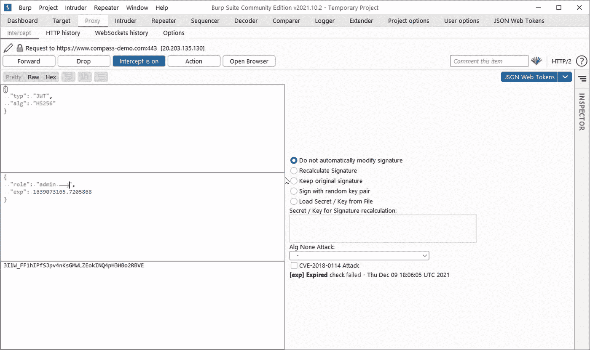

# 网络搜索的打嗝套件扩展

> 原文：<https://infosecwriteups.com/burp-suite-extensions-for-web-hunting-44ffc3b655aa?source=collection_archive---------0----------------------->

[来源](https://medium.com/@ramsha.kamran/burp-suite-tutorial-f3ca5bc3368)

# **简介**

Burp Suite 是一个强大的 web 应用程序安全测试工具，可用于执行各种任务。Burp Suite 与市场上其他代理服务器的区别，以及它成为大多数用户和组织首选的原因是它的简单性、漂亮的用户界面，以及集成扩展以提供默认情况下不包含的附加功能的能力。还包括各种工具，如宏，可用于自动化过程，入侵者，可用于暴力登录表单，以及其他有用的项目。它甚至提供了大量代理服务器没有提供的工具。

我们将在这篇博文中讨论各种 Burp 套件扩展，我们相信这些扩展会让您在运行 web 应用程序渗透测试时更加轻松。

注意:Burp 扩展可以用 Java、Python 或 Ruby 编写。用 Java 构建的扩展不需要在您的终端进行任何配置。然而，用 Python 或 Ruby 构建的应用程序需要分别安装 JPython 和 JRuby。

# **JSON 美化者**

JSON 代表 JavaScript 对象符号。它是一种用于存储或传输数据的轻量级格式。JSON 格式最好的一个方面是它很容易理解。

API 的使用越来越多，构建 API 的默认首选是 JSON。但是对于大型复杂的应用程序，您很容易被作为响应收到的大量数据淹没。你有什么选择？要么照原样处理，复制然后粘贴到 Sublime text 这样的文本编辑器中，然后使其可读，要么使用在线资源。

[来源](https://levelup.gitconnected.com/all-you-need-to-know-about-json-and-its-usage-in-javascript-b5181208966d)

如果能有一个美化它的选项岂不是很棒？JSON Beautifier 已经覆盖了它。

这是一个 Burp 套件扩展，让您可以灵活地美化响应。

只需转到 Extender 选项卡下的 BApp 部分，并查找 JSON Beautifiers。安装后，您将在 response 部分的 Repeater 选项卡下看到它的运行。一旦收到您的回复，您可以点击回复部分下的 JSON 美化器。

# **JSON Web 令牌**

[来源](https://blog.miniorange.com/what-is-jwt-json-web-token-how-does-jwt-authentication-work/)

JSON Web tokens (JWT)逐渐获得了很多关注。这是使用同一个令牌执行身份验证和授权的一种非常奇特的方式。然而，认证是使用它的主要原因。虽然它可能解决了许多用会话 id 难以解决的问题，但是 jwt 的实现方式可能存在配置错误的问题。

你可以在这里阅读我们关于 JWT 以及如何检查安全问题的博客。

对于 JWT，您可以使用在线工具，如 jwt.io、CyberChef，或者使用命令行工具来篡改它。这确实需要你采取一些额外的步骤，而且由于这里或那里的一些问题，可能并不总是有成效的。

JSON Web 令牌解决了这个问题。它是一个扩展，专门用于解码和操作 JSON Web 令牌(JWT ),并自动处理常见攻击。

只需切换到 Extender 选项卡下的 BApp 部分，然后查找 JSON Web 令牌。安装后，您可以在 Burp Suite 窗口中看到它作为一个新标签。

[来源](https://camo.githubusercontent.com/80337d7d5d35df1ad2f8acb94cdd0a757bda1e1167531b63444f803a79df3b9a/68747470733a2f2f692e696d6775722e636f6d2f567362716f4e4c2e706e67)

# **自动曝光**

授权问题可能很难解决。许多功能可能未经检查，因此仍然容易受到攻击。检查授权问题的一般方法是先作为特权用户，然后作为非特权用户检查应用程序，然后检查非特权用户是否可以访问特权功能。

如果你有，这在打嗝套件中可能有点困难

1.  为了捕获请求
2.  发送到中继器
3.  篡改 cookies 和标题，看看是否可以访问受限功能。在此步骤中，您可能希望引用特权用户发出的请求，以了解它与非特权用户的请求有何不同。

但是如果一个扩展为你做了这些呢？你所要做的就是访问浏览器上的功能。这正是 Autorize 所做的。以非特权用户身份登录 web 应用程序。获取它们的会话 cookie，或者任何可以作为会话标识符的特殊头。复制它以自动调整大小。现在以特权用户的身份登录应用程序，尝试访问不同的功能。

Autorize 将尝试访问这些功能并执行与您在浏览器中执行的操作相同的操作。然后它会显示哪些可以被非特权帐户访问。简单吧？

# **HTTP 请求走私者**

HTTP 请求走私攻击很难实现，测试起来也更加困难，尤其是在有一些限制的情况下。此外，可能存在许多请求走私攻击，但是手动测试所有这些攻击是不可行的，因为它们需要内容长度或传输编码头方面的精确性。

为了让您脱离苦海，HTTP Request Smuggler 是另一个 Burp Suite 扩展，它帮助您自动化 HTTP 请求走私攻击。

只需切换到 BApp 部分，下载 HTTP 请求走私者插件。

# **云存储测试器**

越来越多的公司选择基于云的服务。该领域的主要领导者是 AWS、谷歌和微软 Azure。如果我们是新手，刚开始做 web 应用黑客怎么办？当您几乎不知道服务是什么以及如何测试它们时，测试云中的服务可能有点困难。

云存储测试器来拯救你。它将测试基于云的存储服务的错误配置问题，因此被称为云存储测试器。

您只需提供一个访问权限或密钥。它会自动扫描和测试常见的配置错误问题。如果您没有访问密钥，它仍然可以执行一些被动的检查和测试。

# **自动补全**

搜索有效载荷有困难吗？如果一个插件可以帮你做这件事呢？如果一个扩展可以自动完成你的有效负载，不是更好吗？BurpSuiteAutoCompletion 就是这样一个插件，可以帮助你自动完成有效载荷。它只在中继器和入侵者选项卡中有效。想要了解作者的更多信息以及如何使用它，你可以点击[这个链接](https://github.com/Static-Flow/BurpSuiteAutoCompletion)。

# **403 旁路**

经过大量努力后，您遇到了一个潜在的易受攻击的端点，但是收到了一个 403 状态代码。相信我，没有什么比收到 403 响应代码更令人沮丧的了。

403Bypasser 将自动扫描 403 响应代码，并尝试找到一个解决方法/绕过它们。你可以在这里阅读更多关于这个扩展[的内容。](https://github.com/sting8k/BurpSuite_403Bypasser)

# **结论**

在这篇博客文章中，我们讨论了不同类型的扩展，这些扩展可以即兴发挥 burp 套件的功能，并帮助您以更好的方法执行测试。大多数情况下，授权、jwt 和 json 需要大量的努力，当我们可以轻松完成它们时，我们的能力和曝光率就会上升。