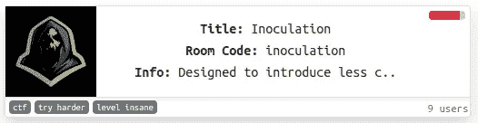
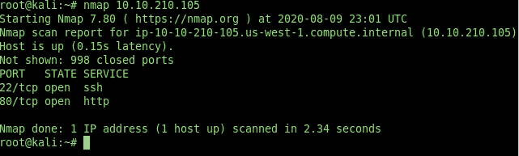
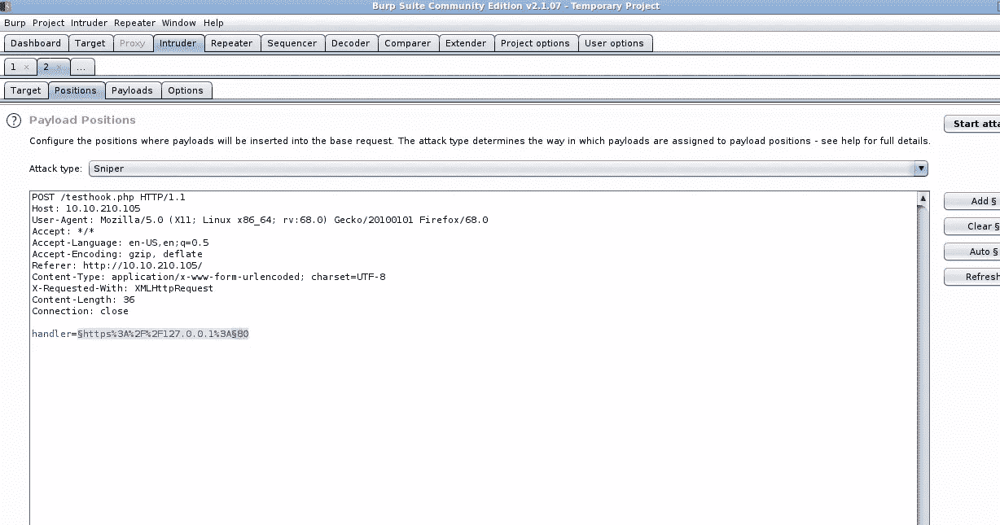
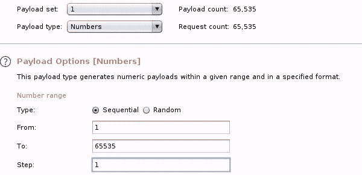
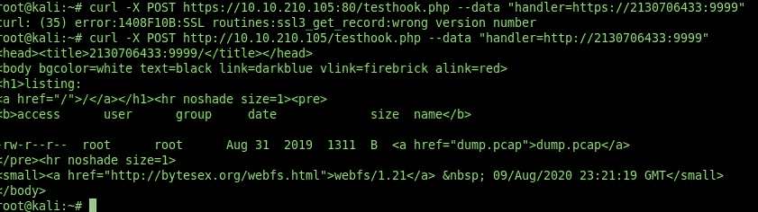
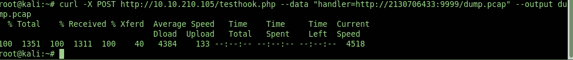
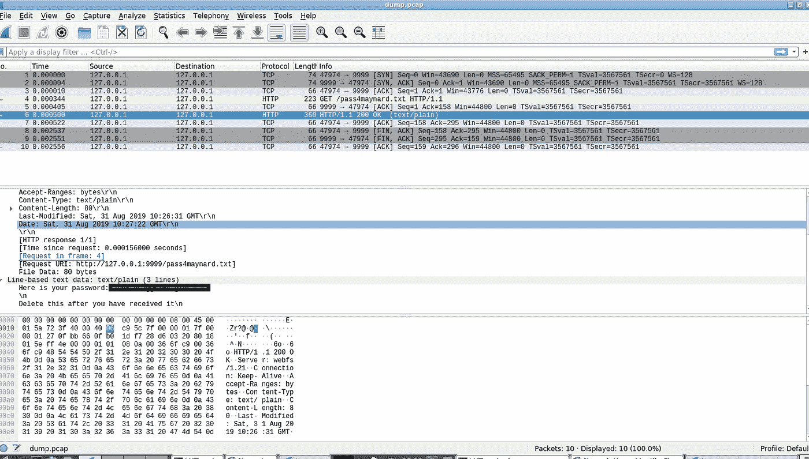
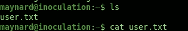
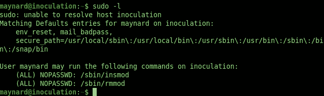

# 打嗝套件，Nmap，Priv Esc 等等！

> 原文：<https://infosecwriteups.com/burp-suite-nmap-priv-esc-and-more-376251add9e9?source=collection_archive---------0----------------------->

## 全部在一篇文章中！


[阿吉特](https://unsplash.com/@arget?utm_source=medium&utm_medium=referral)在 [Unsplash](https://unsplash.com?utm_source=medium&utm_medium=referral) 拍摄的照片



信用:[https://tryhackme.com/](https://tryhackme.com/)

接种疫苗无疑是一个考验玩家技能的挑战，并提供了广泛和多样的工具，肯定是在现实环境中使用的东西。想挑战吗？试试接种！

以下是一些你需要知道/知道如何使用的东西:

*   **Nmap**
*   **打嗝组曲**
*   **基本 Linux 命令**
*   **Wireshark**
*   **权限提升**

现在让我们从部署机器开始吧！

## 1) Nmap

马上，首先应该想到的是 Nmap



太好了！所以我们看到两个开放的端口！现在，让我们访问实际的网站。


# 2)打嗝组曲

嗯……所以首先，我启动了 Burp Suite 并拦截了在输入框中输入随机 URL 的请求。没什么我们感兴趣的。经过几分钟的思考，我意识到我们也许可以找到一些有趣的东西，通过把这个网站的 URL 和一个随机的端口号放入入侵者中！



现在，经过快速的谷歌搜索，最大端口号是 65535。酷！现在我们要做的就是转到有效负载，将有效负载类型设置为数字，数字范围从 1 到 65535。该进攻了！



太好了！考虑到 Community Edition 的时间有限，肯定有其他方法可以做到这一点，但是对于本文和整体概念来说，这看起来很好。然后我们发现有两个开放端口，端口 80 和端口 9999。虽然端口 80 似乎不起作用，但我们通过执行以下命令在端口 9999 上收到了响应！

# 3)基本的 Linux 命令



你可能会问，“2130706433”是怎么回事？这基本上是 127.0.0.1 的字符串版本。运行以下代码时，可以找到从 int 到 string 的精确转换器:

`int pack(byte[] bytes) { int val = 0; for (int i = 0; i < bytes.length; i++) { val <<= 8; val |= bytes[i] & 0xff; } return val; } pack(InetAddress.getByName(dottedString).getAddress());`

[https://stack overflow . com/questions/2241229/going-from-127-0-0-1-to-2130706433-and-back-again](https://stackoverflow.com/questions/2241229/going-from-127-0-0-1-to-2130706433-and-back-again)

但是你看！回头看看 curl 的结果！我们得到一个. pcap 文件。所以，作为任何一个正常人，首先想到的就是 Wireshark！在我们跳进水里之前。pcap 文件，我们首先需要访问它！这可以通过执行与上次完全相同的命令来完成，除了告诉计算机输出并给我们。pcap 文件通过以下命令:

```
--output dump.pcap
```

因此，最终应该是这样的:



# 4) Wireshark

这太棒了！现在我们要做的就是用 Wireshark 打开文件并分析数据包。



哇，我们这么快就能得到密码！如您所知，该目录名为“pass4maynard.txt ”,因此意味着“maynard”必须是用户名！这很简单，我们需要做的就是 SSH 并获得用户标志！！！



# 5)权限提升

现在，在运行 sudo -l 以检查权限之后，很明显我们需要执行特权提升。



ExploitDB 返回以下内容:

[https://www.exploit-db.com/exploits/41240](https://www.exploit-db.com/exploits/41240)

代码确实需要在编辑等方面做一些小的改动。，但这是最后的结果:

```
obj-m += cve_2017_0358.o all: make -C /lib/modules/4.15.0-58-generic/build M=$(PWD) modules clean: make -C /lib/modules/4.15.0-58-generic/build M=$(PWD) clean
```

简单。现在我们必须运行 sudo insmod。基本上，insmod 用于将模块插入内核。只做 cd /tmp，运行 ls 后我们应该会注意到一个有趣的 r00t 文件。运行。/r00t -p 创建嵌套目录和 wohoo！输入 whoami，你就是 root！

没那么难吧。

虽然关卡被贴上了“神经病”的标签，但是一点也不难。**这只是基于基本知识，知道如何操作什么工具和使用什么命令。**就这样。几分钟内轻松解决。

我们经历的挑战的链接在这里:

【https://tryhackme.com/room/inoculation 