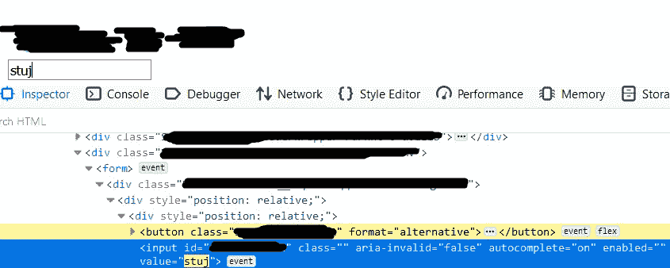
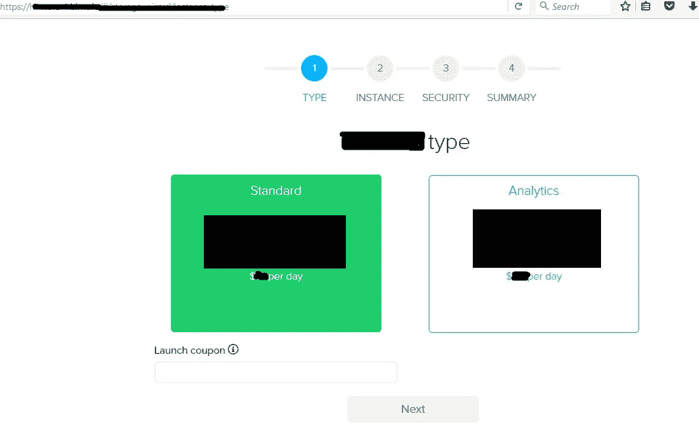
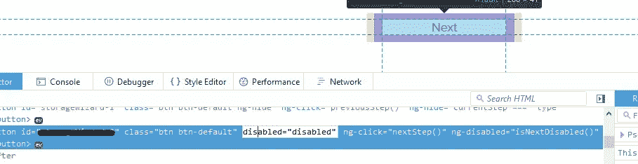
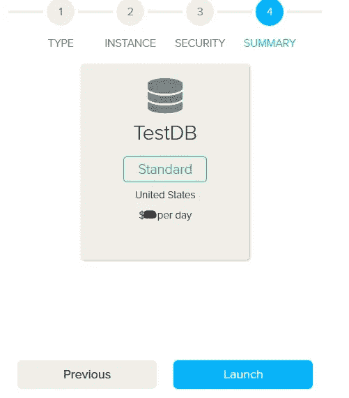
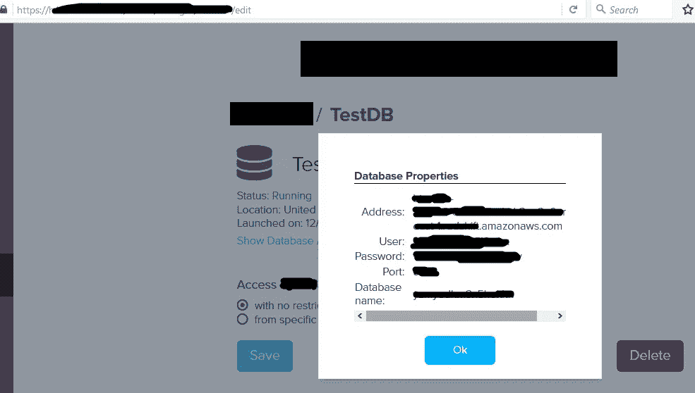
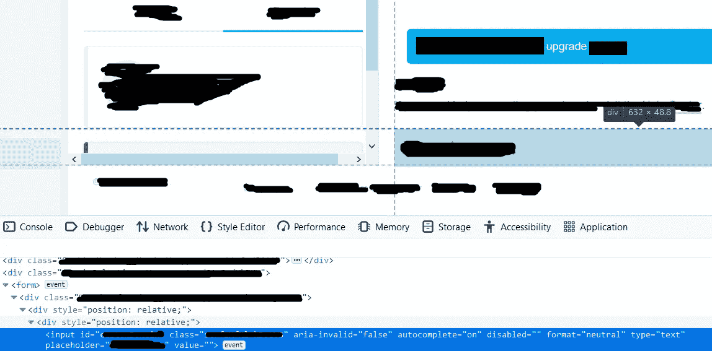
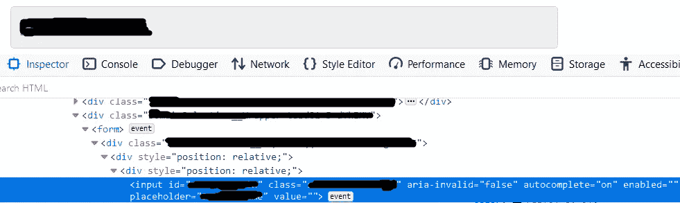

# 业务逻辑错误方法论(简单方法)+ PoC-s

> 原文：<https://infosecwriteups.com/business-logic-error-methodology-easy-way-poc-s-8195d8dee95b?source=collection_archive---------1----------------------->

## ，或者通过动态编辑 HTML 代码来入侵网站的功能

我在 3 年前发现过一次这种类型的 bug，我对它的存在感到惊讶。然后前几天又找到了。太神奇了。但是，为了知道首先要寻找什么，这都是关于映射 web 应用程序的。

**绘制什么—最简单的方法:**

弄清楚任何事物如何工作背后的逻辑可能会变得复杂。但是，有时有一些面包屑可以很容易地跟踪，至少对于快速简单的测试来说是这样。

当我听到业务逻辑时，我首先想到的是——某种业务。现在，每个企业都必须有一个赚钱的方法。因此，容易看的网站是那些提供免费和付费计划的网站。付费计划越多，需要测试的就越多，受影响的计划越昂贵，bug 就越严重。

**你不能点击禁用按钮，是吗？**

一些网站通过隐藏来限制付费功能，另一些网站通过显示来限制付费功能，但禁用了访问这些功能的链接/按钮。路的尽头？不一定。现在，获得这些特性的一个很长的方法是找出它们与哪些请求相关联。这可能是一个非常困难/缓慢的过程。如果有一些自定义头文件，弄清楚 API-s 就更复杂了，如果这些自定义头文件有很难/不可能猜到的值，就更复杂了。最后，即使您设法获得了正确的请求，也存在类似的问题，即计算出所述请求的参数及其值。内容类型是手动解决的一个快速方法，但是即使使用自动化，剩下的部分也会很乏味。因此，如果被禁用的按钮背后实际上有一个代码，您可以通过简单的 HTML 代码编辑来避免所有耗时的工作。

**进入火狐/Chrome 检查器:**

就在那里，右击就能看到。点击它，然后开始探测禁用按钮的“软”点。

很容易发现它们，通常，只需查找 disabled，或 disabled=true 和相似，并相应地更改它(例如，将 Disabled 改为 Enabled，或从 HTML 代码中删除 Disabled)。而且，如果它看起来不起作用，您可能需要删除其他参数的内容，这些内容可能也禁用了其中的功能。有时额外的“保护”是通过样式实现的。但是，简单地删除它的值有时可以启用按钮。当然，按钮的设计会在这个过程中改变，但只要你能点击它，这真的没关系。

**不是一个，而是两个 PoC，还有一句警告:**

**第一个**很简单，因为它只需要将禁用更改为启用。

注意，下一个被禁用，因为我没有有效的优惠券

这里我们有两个区域要启用

是这个吗？让我们检查一下

但这是真的还是假阳性？

我猜这是真的，顺便说一句，我试图连接到它，是的，它的工作

**第二个**有点“复杂”,因为为了能够访问它，它需要的不仅仅是将 disabled 更改为 enabled。

除非升级，否则输入字段将被禁用

好了，禁用已经换成启用了，但是还是什么都没有，结束？

我猜不是，删除类值(在蓝色选定区域)启用了字段的编辑，同时影响了它的设计

**警告:**

有些按钮一旦启用，就会给你一种成功绕过的印象。例如，单击曾经禁用的“添加付费功能”按钮，当它被启用并被单击时，将显示可点击的付费功能的列表。在兴奋之前，尝试最大限度地使用这些付费功能。也就是说，如果付费功能是“从下拉列表中添加自定义徽标”,并且您设法将自定义徽标添加到您的页面或其他地方，请在单独的浏览器/会话中登录到该网站，然后转到应该显示自定义徽标的页面，如果自定义徽标没有显示在那里，那么这意味着它是一个误报。很遗憾，我知道。但是，最好是沮丧地继续前进，而不是花时间写一份错误报告，然后急切地期待一个回应，结果却被 n/a 或 informational(如果你幸运的话，有时你可能会被要求自我关闭，但如果你幸运的话，再次)。

不要指望“老”虫会真正退休。即使有问题的网站不是某个所有人都忘记了的奇怪的子域，而是一个古老的 www.website.com，但这并不意味着它不容易受到这样一个愚蠢的错误的攻击。