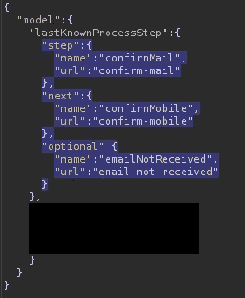
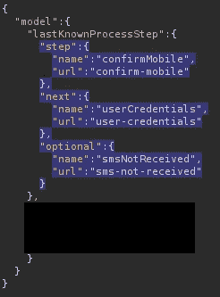

# 注册时的业务逻辑错误导致绕过 SMS 验证

> 原文：<https://infosecwriteups.com/business-logic-error-on-registration-leads-to-sms-validation-bypass-80380b3ff629?source=collection_archive---------1----------------------->

你好，猎人们。是时候再写一篇了。这基本上是一个商业逻辑错误，让我绕过注册时的短信验证。让我们开始吧。

## 目标

这一次，我的目标是一家金融服务公司，这与故事无关。他们范围内的资产非常少。注册/登录面板和一些没有任何功能的静态网站。因为只有注册面板有功能，所以我决定简单地测试一下，然后转向其他程序。我不会透露任何来自应用程序的截图，因为它不允许我透露关于错误的细节。然而，故事中会有我的打嗝套件日志的片段。目标网站将被称为**" rededited . com "**。

## 注册流程

测试功能或应用的第一件事是像普通用户一样使用它，并彻底理解流程。我启动了我的 Burp 套件，按照下面的说明完成了注册过程，同时记录了所有的请求和响应:

1-导航到 redacted.com/registration 的2-要求用户输入他/她的名字、姓氏、电子邮件地址和电话号码。应用程序将用户转发到**redacted.com/registration/api/email-confirmation**
3-在提供所需信息后，首先，一个 6 位数字的字母数字确认码被发送到您的电子邮件地址。用户输入代码并在另一个端点上进行下一步，该端点是**redacted.com/registration/api/confirm-mobile**4-在这一步，一个 6 位数字确认码通过 SMS 发送到用户的手机。用户输入代码并被重定向到**redacted.com/registration/api/user-credentials** 5-作为最后一步，用户被要求输入他/她的用户名和密码。当用户提供凭证时，注册过程完成。

## 剥削

在**步骤 3** 中，当用户输入发送到其电子邮件的确认码时，会发送一个 POST 请求，请求正文如下:

步骤 3)电子邮件确认

很简单，对吧？当前步骤、下一步和可选参数真的无关紧要。唯一重要的部分是当前步骤和下一步。

在**步骤 4** 中，当确认通过短信发送的代码时，会发起另一个 POST 请求，其正文如下:

步骤 4)短信确认

有相似之处，对吗？有趣的部分来了，就是剥削。以下是我遵循的步骤:

1- On **步骤 3** ，**打开拦截**，输入发送到你邮箱的确认码。在正文中，如上面第一张图所示，当前步骤被指定为电子邮件确认。现在，在转发请求之前，将图 1 中突出显示的区域替换为第二张图中突出显示的区域。转发请求。
2-要求用户输入通过短信发送的验证码，这意味着用户当前处于**步骤 4** 。目前网址是**redacted.com/registration/api/confirm-mobile**。
3-不输入 SMS 代码，导航至**redacted.com/registration**。

第 3 步之后，系统提示我输入我的帐户的用户名和密码，这表明我成功绕过了短信验证。

## 为什么会这样呢？

当我将电子邮件确认请求的正文更改为 SMS 确认请求的正文时，应用程序认为电子邮件代码是有效的。然而，它也假设短信确认也做了，因为我已经改变了身体参数，并得到了成功的回应。当我手动输入网址**redacted.com/registration**时，应用程序认为我已经完成了短信代码验证，因此将我重定向到要求我输入用户名和密码的页面。

# 外卖食品

*   当一个程序在其作用域中有一个特定的功能或一个端点时，尽可能地尝试使用它。由于这个功能是在范围中直接指定的，所以我的报告非常重要，因此我得到了$ $ $ $的报酬。

我希望这篇文章对您的 bug 搜索之旅有所帮助，并让您感受到业务逻辑漏洞有多种用途。在未来的文章中再见！

你可以在推特上关注我。 [@pleorqy](https://twitter.com/pleorqy)