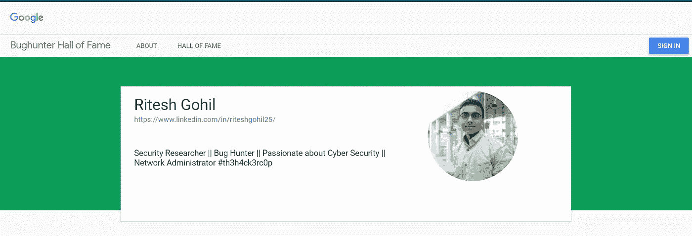

# 🎯谷歌收购的商业逻辑缺陷！(名人堂)🎯

> 原文：<https://infosecwriteups.com/business-logic-flaw-in-google-acquisition-hall-of-fame-1a9af5d3ac04?source=collection_archive---------2----------------------->

永远更加努力！因为是**谷歌！**

嗨，

我要感谢所有的 Bug 猎人，感谢他们为提高互联网安全所做的不懈努力，感谢他们阅读我的 **GOOGLE-Bug 狩猎**的小故事和我实现[***GOOGLE-名人堂*的经历！**](https://bughunter.withgoogle.com/profile/14e37fcd-0032-4230-aa4e-9d8118601ec0)

大约 3 个月前，我开始了我的捕虫之旅，前三个月，我在许多私人平台上练习捕虫，这增强了我的信心和我对基于互联网的捕虫研究的兴趣。由于谷歌是极其安全的平台，花了几天时间了解**各种谷歌域名和谷歌收购？我已经报告了谷歌总共 3 个漏洞(P2 > S2 ),它们都被接受了。**

名人堂！

**你首先要明白，谷歌管理的是什么类型的域名，什么是对** [**谷歌的收购！**](https://en.wikipedia.org/wiki/List_of_mergers_and_acquisitions_by_Alphabet)？🙄如果您发现任何其他域名未在维基百科中列出，请在( [***whois 查找***](https://www.whois.com/whois/workbencheducation.com) **)** 上检查该域名，并记住注册人和管理联系人应为 **Google LLC**

***报告的 Bug 详情:***

我在没有使用任何工具的情况下，选择并报告了这个领域的两个漏洞:[***https://edu.workbencheducation.com/***](https://edu.workbencheducation.com/)***。***

1.  文件/文档在删除后不会被永久删除，仍可全局访问文档。**(被删除的数据会永久保存在 Workbencheducation 上吗？)** 在了解了应用程序的基本原理后，我意识到上传的文件存储在 AWS S3 桶中。我很想知道删除上传的文件后会发生什么。当然，我发现被删除的文件仍然可以公开访问。
2.  无论您选择将上传文件的可访问性设为**私人**或**公共**，它仍然是公共可访问的，因此任何人都可以从互联网上访问该文件。
    后来我报告了这个 Bug，经过对同一个域名🧐的深入研究，我发现了另一个 Bug。观察到上传的文件存储在 AWS 中。申请中有一个特点是让学生公开或保密作业。逻辑很清楚，如果任务被设置为私有，那么它就不应该公开。**如果它仍然是可公开访问的，那么在应用程序中提供使文件公开和私有的功能是不明智的。**

**遵循的步骤:**
1。创建并登录账户[***【https://edu.workbencheducation.com/】***](https://www.google.com/url?q=https://edu.workbencheducation.com/&sa=D&usg=AFQjCNHv4jvYokEdksLuReoDPTBHUrG44Q)***。***
2。现在，点击创建按钮，选择上传文件并填写必要的信息。
3。上传任何文件/文档并点击保存按钮。
4。复制 ***上传的文件链接*** 并通过任何网络浏览器打开，并通过以任何匿名模式打开相同的链接来验证。
4。现在，删除上传的文件，并使用 ***上传文件链接*** 再次浏览，您应该能够访问或下载相同的文件。
5。您仍然可以通过相同的 ***上传文档链接随时下载或访问相同的文件。***

**攻击场景和影响:**
即使用户上传了选择私人可访问性的个人文档，但这些文件是公开可访问的。
1。这直接关系到用户的隐私，因为它存储了该人的所有被删除的数据，这些数据应该被永久删除。
2。用户可能滥用使上传的文件成为公共或私人访问的特征的功能，无论哪种方式，它仍然保持为公共访问，这破坏了用户的信任和完整性。
3。中学后的研究人员可能会受到这种功能滥用的不利影响，因为他们繁琐的数据受到困扰，研究可能会失去其独特性。

**建议:** 尽量熟悉目标领域，了解其所有功能。不断探索和了解新技术，永远不要限制自己的知识面。总有一些我们不知道的东西，跳出框框去想。#努力尝试🎯#永不放弃💪。