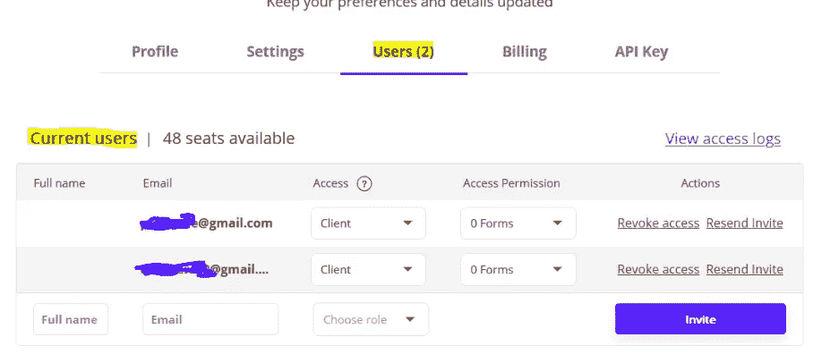
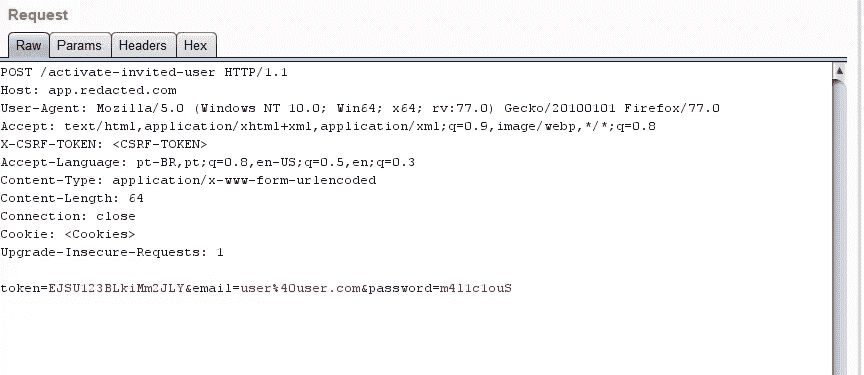
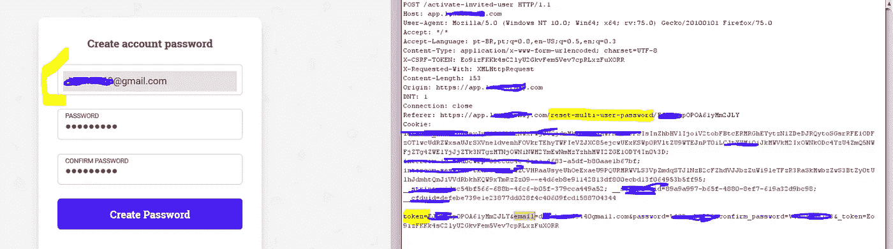

# 邀请系统中的业务逻辑缺陷允许接管私人公司的任何账户

> 原文：<https://infosecwriteups.com/business-logic-flaw-in-invitation-system-allows-to-takeover-any-account-at-private-company-daaf898966b0?source=collection_archive---------0----------------------->

朋友们好，

在这篇文章中，我将解释我如何利用一家私人公司的邀请系统下的业务逻辑缺陷，在未经用户同意的情况下接管他们服务中的任何帐户。

# **首先要做的事情:**

我有一个名为“仇杀”的团队，有一个新的目标启动了一个公开的 bug 赏金计划，我们通过 google dork 找到了这个计划，所以我们决定进行第一次“批判性”调查

通常，我开始以普通用户的身份使用应用程序，同时使用流量拦截工具(例如 Burp Suite)捕获和读取所有请求。

该应用程序允许我们在“用户”部分邀请新用户加入组织帐户

被邀请的用户将在他们的邮箱中收到一封带有如下令牌的电子邮件

[https://app . redated . com/reset-multi-user-password/INVITE-TOKEN-HERE](https://app.redacted.com/reset-multi-user-password/INVITE-TOKEN-HERE)

如果你是一个 Bug 猎人，那么上面的端点应该引起你的注意，因为它引起了我的注意，特别是在`reset-multi-user-password`中

正如我解释的那样，创建这个函数是为了给公司的帐户添加一个用户，为什么他们称这个为“重置密码”端点呢？

带着这个问题，我决定更深入地研究，当接受`invitation`时，应用程序向端点`/activate-invited-user`发送一个`POST`请求以及请求正文中的邀请电子邮件。

问题就在这里，**邀请的用户**控制着请求体中的**邮件和密码**，我想:

“被邀请的用户通过`reset-multi-user-password`端点接收邀请令牌，用户**控制**被邀请的****电子邮件和新密码，**如果我将被邀请的电子邮件更改为`owner@victim.com`并连同新密码一起转发请求会怎样？”**

**最后，我捕获了“accept invite”请求，并将`email`更改为“owner@victim.com”以及一个新密码，如下所示**

****

**服务器接受了我的请求，然后我用新密码登录“owner@victim.com”来确认接管。**

**最后，我向安全团队发送了一封电子邮件，用下面的**概念验证**描述了漏洞及其影响:**

1.  **登录您在[https://app.redacted.com](https://app.redacted.com)的账户**
2.  **现在邀请任何你也控制在“用户”部分的电子邮件**
3.  **点击邀请链接，你会看到一个页面，要求你为账户创建一个新的密码，拦截请求**
4.  **只需将`email`更改为应用程序中的任何其他用户帐户，然后转发请求**
5.  **现在，您已经使用邀请令牌为“受害者”电子邮件设置了新密码**

**安全团队很快对该漏洞进行了分类并解决了问题。**

# ****外卖:****

**始终观察所有的端点名称，如果您看到与平常不同的东西，尝试更深入，您可能会发现一些有趣的行为。**

**感谢您的时间:)**

**丹尼尔 _v**

**仇杀白帽队**

**[推特](https://twitter.com/d4niel_v) | [BugCrowd 简介](https://bugcrowd.com/daniel_v) | [H1 简介](https://hackerone.com/daniel_v) | [Linkedin](https://www.linkedin.com/in/daniel-morais-968463120/)**