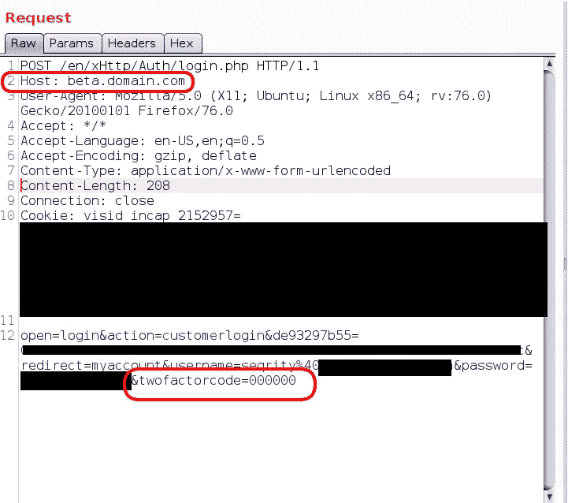
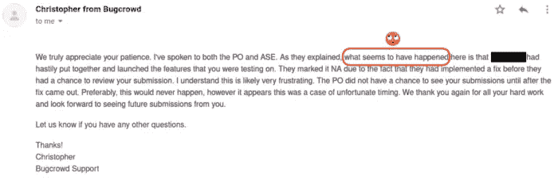
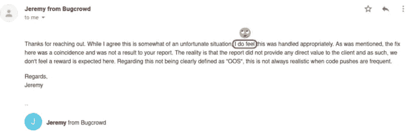
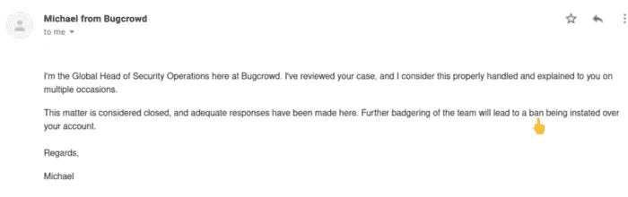

# 像老板一样绕过 2FA

> 原文：<https://infosecwriteups.com/bypass-2fa-like-a-boss-378787707ba?source=collection_archive---------0----------------------->

嗨，
这篇文章是关于一个公开的项目，但是在这个项目上启用了披露政策，所以我们假设域名是:domain.com

在调查过程中，我发现有两个网站是相同的:

[www.domain.com](http://www.domain.com)beta.domain.com

www.domain.com[的](http://www.domain.com)启用了 2FA，当你在这个域名上创建账户时，你可以登录 beta.domain.com 而无需输入 2FA 代码。

默认情况下，2FA 被禁用。所以，我决定尝试旁路 2FA，并在[www.domain.com](http://www.domain.com.)启用它。输入用户名和密码后，您应该输入 6 个字符(数字和字符)，5 分钟后代码将过期。因此暴力在这里不起作用。

输入密码后打开 Burp 并拦截请求，并将主机标题更改为-beta.domain.com

在 twofactorcode 字段中输入 000000

和转发请求，BOOOM。

我在没有输入正确代码的情况下成功登录了[www.domain.com](http://www.domain.com.)。

报告日期:2020 年 5 月 14 日

固定日期:2020 年 5 月 15 日

第一次答复:2020 年 5 月 19 日

Bounty:不，他们没有支付 bounty，并说我们的开发人员在审查您的报告之前就解决了这个问题！！！

我问你如何确定你三年级后的项目评估报告？
你们有没有针对这些情况的监控系统？
想了解程序原因和证据。
这是他们的反应

**支持团队回应:**

我的推特:[https://twitter.com/seqrity9](https://twitter.com/seqrity9)