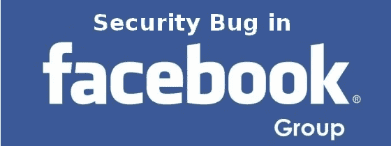
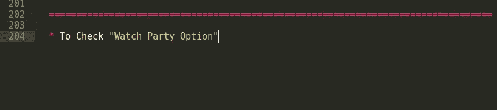
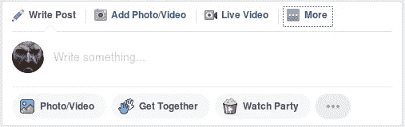
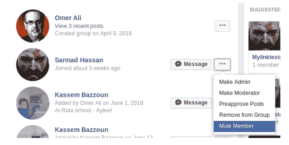
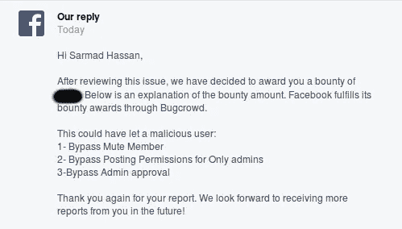

# 绕过管理员批准，仅脸书组中的管理员拥有静音成员和发帖权限

> 原文：<https://infosecwriteups.com/bypass-admin-approval-mute-member-and-posting-permissions-for-only-admins-in-facebook-groups-ef476cb3d524?source=collection_archive---------0----------------------->

大家好，今天我想和你们分享我是如何绕过管理员批准，静音成员和发布权限，只有管理员在脸书组，所以让我们开始:)

故事开始于 [**脸书安全团队**](https://www.facebook.com/whitehat/dashboard/) 宣布他们 [**脸书六月怀特哈特晋级**](https://www.facebook.com/whitehat/promotion/)**2018 年 6 月 1 日，他们表示将只带两名研究员参加 [**维加斯 Defcon**](https://www.defcon.org/)免费争夺**最佳质量报告**和**最高奖励值。****

**我说，嗯，听起来不错，所以让我们来找一些 bug 吧。也许我很幸运赢得了晋升，我直接打开了我的脸书笔记文档，看看我应该从哪些方面着手，然后我看到了这个:**

****

**我的脸书文档记录了我把所有与 Facebook 相关的东西放在哪里，以备将来寻找**

**那么什么是**观察党选项:****

**这是脸书群组中的一项新功能，允许群组管理员甚至普通成员选择脸书上的任何公共视频，并通过专用评论卷轴同时展示给其他成员，以创建“共享观看体验”，更多详细信息请访问**。****

********

****这就是观看派对选项的样子****

****像往常一样，我从 Sarmad Hassan 帐户打开我的测试组**，点击**观察组选项**来发布一个帖子，并拦截了 Burpsuite 的请求，以查看该功能内部发生了什么，请求如下:******

**POST/API/graph QL/HTTP/1.1
variables = { " input ":{ " client _ mutation _ ID ":" 2 "，" actor_id":"userID "，" composer _ session _ ID ":" session ID "，" creator_actor_id":"actorID "，" custom_name":null，"**group _ ID ":" MyTestGroupID "**，" VIDEO _ ids ":[" VIDEO-ID "]}&doc _ ID = doc-ID**

**引起我注意的是" **group_id"** 参数，我说让我们把这个组 id 的值从另一个帐户**(名为 Noobs 的组)**更改为我的第二个测试组 ID**，看看我是否能在我加入的 **Noobs** 组中使**观看聚会帖子**。这很有效，回应如下:****

**{
" data ":{
" group _ living _ room _ create ":{
" client _ mutation _ id ":" 2 "，
" living _ room ":{
" _ _ typename ":" living room session "，
**"id ":"视频党的 id "**
}
}
}
}**

# ****绕过静音成员****

**嗯，有趣的是，我在虚拟机中从我的第二个测试帐户切换到我的第二个测试组(受害者组)**(名为 Noobs 的组)**，然后点击成员选项卡，点击**萨马德·哈桑(攻击者用户)**并将他从组中静音，因此**萨马德·哈桑**将无法在 **Noobs** 组中发表任何帖子**

****

**受害者组织(Noobs)的管理员使攻击者 Sarmad Hassan 静音**

**我从 Sarmad Hassan 帐户切换回第一个测试组**，并发布了观看聚会帖子，并将 **group_id** 更改为受害者组 ID ( **Noobs)** 和 boom，这样即使受害者组的管理员使攻击者静音，他仍然能够观看聚会视频并绕过**静音选项。**

# ****绕过管理员批准，只允许管理员发布内容****

**我说好吧，让我们挖掘更多，看看我们可以用**观察队**做些什么，所以我再次切换回我的第二组 **Noobs** ，点击组设置并检查以下内容:**

*   ****帖子批准:**所有群组帖子必须由管理员或版主批准**
*   ****发布权限:**仅限管理员**

**如果管理员选中了上述选项，没有人可以发表任何帖子，如果张贴权限设置为任何人，所有帖子都应该由管理员批准**

**于是我从萨尔马德·哈桑账户再次从第一测试组**获得**图形 API** 调用，并将 **group_id** 参数更改为受害者组 id **(Noobs 组)**和 booooom，响应如下:****

**{
" data ":{
" group _ living _ room _ create ":{
" client _ mutation _ id ":" 2 "，
" living _ room ":{
" _ _ typename ":" living room session "，
" id ":" 199255894077754 "
}
}
}
}**

**我当时想:**

**其中**“id”:“199255894077754”**是守望党房间的 id**

**攻击者可以去:**

**https://www . Facebook . com/groups/[group-id]/WP/[观看派对房间 id]**

**并且将能够观看该视频，并邀请所有群组成员观看该视频，所以想象一下受害者群组管理员( **Noobs** )所做的所有这些保护，**攻击者萨尔马德哈桑**绕过了这一切:)，想象一下如果你是群组管理员，并且你检查了所有上述设置以确保除了你之外没有人可以在你的群组中发帖，并且你感到非常高兴，但是有人实际上可以绕过这些并在没有你的批准的情况下发帖，你会怎么想！！！**

****时间线:**
六月。2018 年 03 月—初步报告
6 月。2018 年 14 日—六月报告审判
。2018 年 7 月 27 日—修复了前两次影响
。2018 年 7 月 17 日—完成修复
。2018 年 18 日—修复确认
7 月。2018 年 18 月 18 日——获得奖金**

****

**我要感谢**脸书安全团队**的悬赏。**

**也祝贺获奖选手 **SASAE** 和**[**Pranav Meghsham**](http://www.pranavhivarekar.in/)**获奖选手[**脸书 6 月怀特哈特晋级**](https://www.facebook.com/whitehat/promotion/) **。********

******概念验证视频:******

******武道:******

****1-试着为你的目标做一个文档笔记，并不时检查它****

****2-如果你发现了一个 bug，不要停止深入挖掘，也许你会得到不止一个影响****

****3-总是问自己**如果！！当你搜索 bug 时******

****4-如果我能做到，你也能做到，相信我:)****

****谢谢你****

****萨尔马德·哈桑 ( [朱巴巴格达](https://twitter.com/JubaBaghdad)****