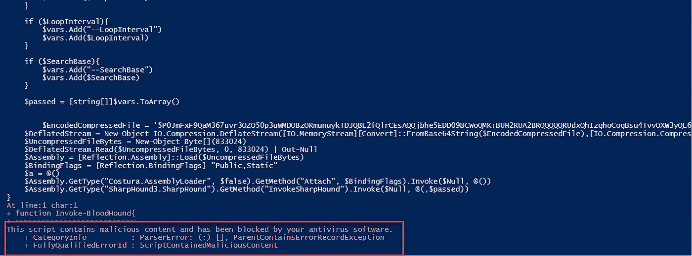
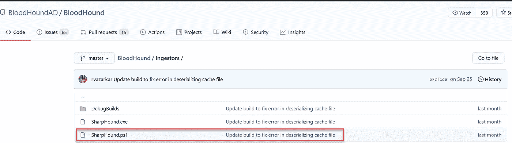
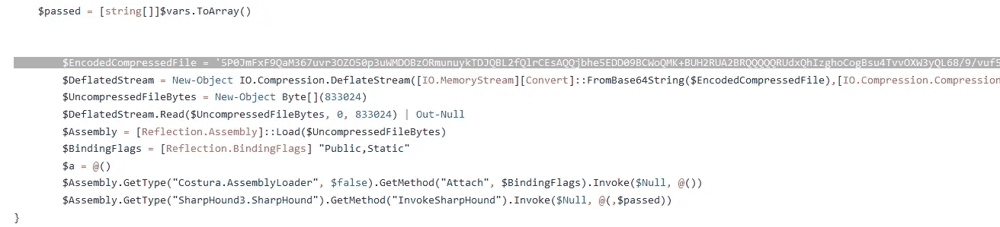

# 绕过 PowerShell 中的 AMSI—一个很好的案例研究

> 原文：<https://infosecwriteups.com/bypass-amsi-in-powershell-a-nice-case-study-f3c0c7bed24d?source=collection_archive---------2----------------------->

在 RedTeam 的一个项目中，我希望使用 BloodHoundAD 脚本。BloodHound 是一个单页 JavaScript web 应用程序，构建在 Linkurious 之上，用 electronic 编译，带有一个 Neo4j 数据库，由 C#数据收集器提供数据。BloodHound 使用图论来揭示活动目录环境中隐藏的、通常是意想不到的关系。攻击者可以使用 BloodHound 轻松识别高度复杂的攻击路径，否则无法快速识别。防御者可以使用 BloodHound 识别并消除这些相同的攻击路径。蓝队和红队都可以使用 BloodHound 轻松地深入了解 Active Directory 环境中的特权关系。【https://github . com/blood houndad/blood hound】。

让我解释一下这个场景…

我想用 SharpHound。SharpHound 是 BloodHound Ingestor 的 C#重写版本。

当您直接在 PowerShell 中运行 SharpHound.ps1 时，最新版本的 AMSI 会阻止它运行:

因为这个脚本被认为是恶意负载，微软 AMSI 有它的签名并阻止它运行。

嗯，我将这个脚本分成几部分，并在 PowerShell 中分别直接运行每个部分。这样做的原因是我想找出恶意有效载荷的哪些部分可以被 AMSI 准确地检测到。

OMG！AMSI 无法检测此参数的值: **$EncodedCompressedFile** 。这是恶意代码的主要部分。现在，您需要使用脚本的其他部分来在 PowerShell 中正确执行它。

您可以通过 base64 编码和 deflate 压缩恶意负载，然后执行它来绕过 AMSI。这是概念验证视频。