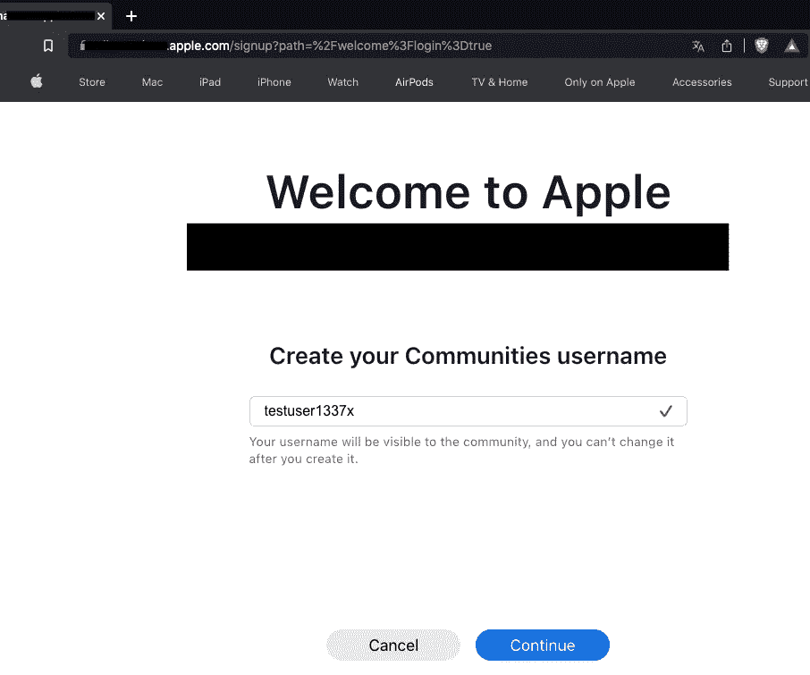
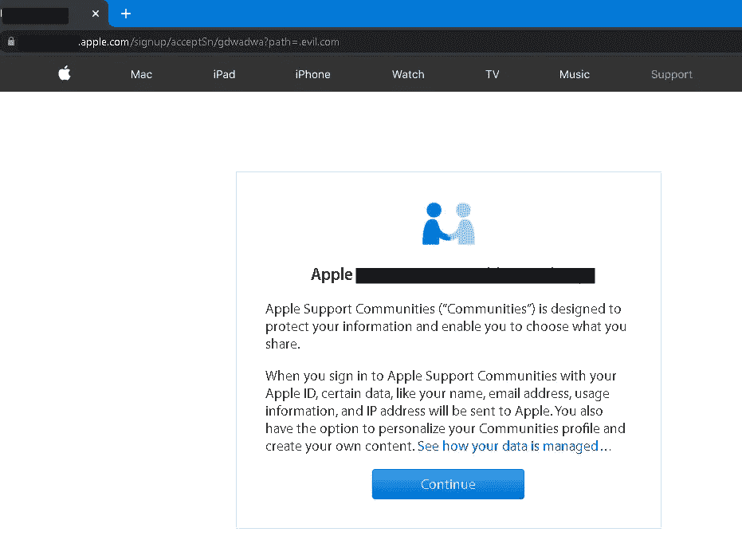
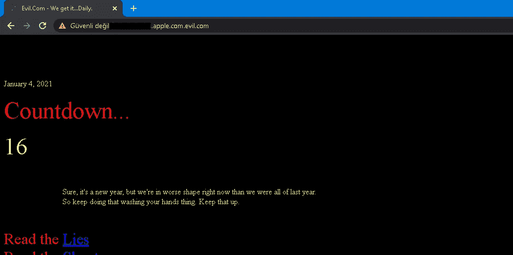
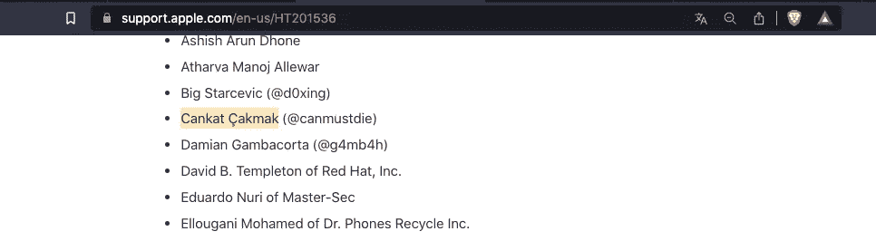

# 用点号(“.”绕过苹果的重定向过程)字符

> 原文：<https://infosecwriteups.com/bypass-apples-redirection-process-with-the-dot-character-c47d40537202?source=collection_archive---------0----------------------->

嗨，伙计们，我离开了一段时间，但现在我回来了，这里有一个新的写文章。今天，我将向你展示我在苹果的子域中发现的使用点字符的开放重定向漏洞。

我没有权限发布这个子域，所以我不会发布它，但你可以把它看作是一个用户活跃的论坛区。所以我称之为“编辑”，让我们开始吧！

首先，当我们访问 redacted.apple.com 子域时，这里有一个登录屏幕，登录非常简单。

如图所示，*？path=* 参数设置为重定向到第一次登录的用户选择昵称部分的同一子域中的另一个页面。

这个过程大概会重定向到“/欢迎？login=true ",适用于所有先决条件都已正确完成的首次用户。

正如我所猜测的，在选择用户名并上传头像后，重定向被重定向到指定的页面。当然，我在这里尝试了一些有效载荷，主要是像 https://evil.com &//evil . com 等。

实际上，这里让我感兴趣的是，在使用//evil.com 有效负载之后，响应是带有单个“/”字符的/evil.com。
如果你用的是像？path=//evil.com 然后预计如下:redacted.apple.com//evil.com
然而我得到的回应如下:redacted.apple.com/evil.com

在这种情况下，我认为唯一附加到末尾的'/'是由于我的有效载荷，我想只输入 evil.com

我实际期望的行为是被重定向到一个不存在的 redacted.apple.comevil.com 域，但我却返回到“/welcome？login=true”。对于大多数参数来说，只需在子域中导航到 evil.com 就可以了。(?path = evil . com > x.apple.com/evil.com)

最后，我想到了一个主意，我以前从未在任何地方见过它。我纯粹是从理论上思考，惊讶地发现这在苹果公司是可能的。

如果我们把有效载荷设为. evil.com(即？path=.evil.com)，“”字符将被附加到 redacted.apple.com 的末尾，这使它成为 evil.com 的子域。

这是我们期望的结果。在有效负载前添加一个点字符意味着在某些情况下会缺少“/”字符。这使得 redacted.apple.com 成为 evil.com 的一个子域

【https://support.apple.com/en-us/HT201536 

这个漏洞被团队修复了，我被加入了苹果名人堂。

目前就这些。感谢你读到这里，希望你喜欢！

你可以在推特上关注我:[https://twitter.com/canmustdie](https://twitter.com/canmustdie)

## 来自 Infosec 的报道:Infosec 每天都有很多内容，很难跟上。[加入我们的每周简讯](https://weekly.infosecwriteups.com/)以 5 篇文章、4 条线索、3 个视频、2 个 GitHub Repos 和工具以及 1 个工作提醒的形式免费获取所有最新的 Infosec 趋势！