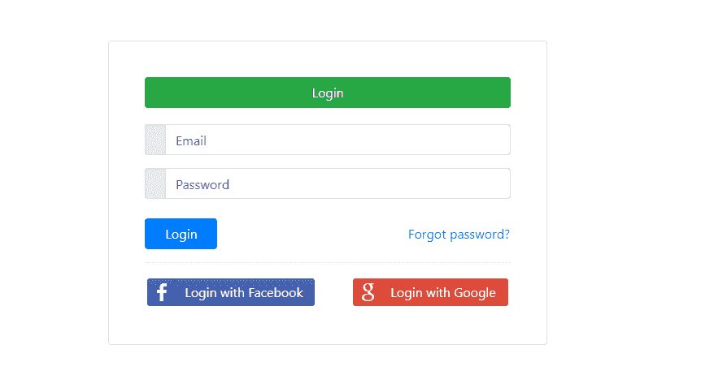
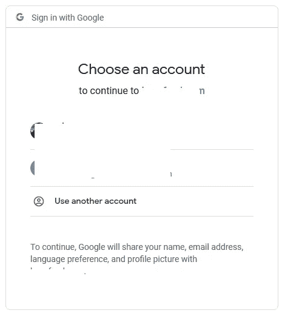
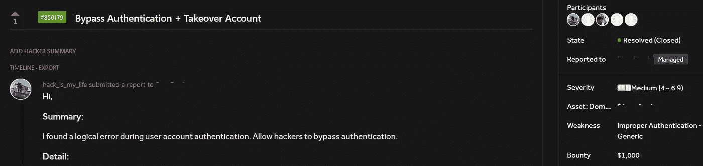

# 我如何发现认证绕过错误，并赚取$$$$

> 原文：<https://infosecwriteups.com/bypass-authentication-1bfab09332fe?source=collection_archive---------0----------------------->

大家好，

我是@影子 _ 克莱。今天我要写一个我发现的非常有趣的 bug😎

# 总结:

这是一个专注于在线新闻、媒体和娱乐的应用程序。

登录时有两种选择:
+通过 Oauth 登录
+用邮箱登录

照片是为了说明的目的

当我登录 Google 时，我需要验证我的 Google 帐户。然后我会被重定向到 redacted.com 的帐户。

***假设*** *:我在 redacted.com 注销(* ***未注销*******Google****)并使用 Google 重新登录 redacted.com，我被自动重定向到 redacted.com 账户。**

*这通常是一个错误的配置，因为当用户登录谷歌时，通常会选择他们想要使用的谷歌账户，而不是直接重定向到 redacted.com*

**

*照片是为了说明的目的*

*即使我注销了所有账户，包括谷歌账户。我仍然可以用谷歌登录 redacted.com*

# *利用:*

> *现在我将通过 Oauth 登录-> Google ->完成认证步骤->注销所有包括 **Google** 账户- >再次登录通过 Oauth - >直接访问无需认证的账户*

# *攻击时间:*

> **受害者在公共电脑上通过谷歌登录 redacted.com 账户= >片刻之后，受害者离开了他们的电脑(尽管被注销了 redacted.com 和* ***谷歌*** *账户)= >此时，任何人都可以使用谷歌访问受害者的账户。**

# *为什么会这样？*

*两个案例:*

*   *访问令牌/代码未取消*
*   *自动登录*

> *当攻击者登录谷歌= >访问令牌/代码将被 redacted.com 调用，并自动登录到帐户*

# *甜水果😎*

**

*此错误的严重性已经降低，因为:*“攻击者需要访问受害者的设备”**

# *建议:*

*我很想尝试验证功能和 Oauth，但是我从没想过这样的错误会发生在现实生活中。*

*我给你的建议是永远跳出你的舒适区，往更大胆的方向想。有时候我们以为现实中不会发生，但实际上它一直在某个地方发生着。问题是谁会先找到它？*

*谢谢大家的阅读！！！❤*

*黑客快乐:))*

*推特:[https://twitter.com/shadow_CLAY](https://twitter.com/shadow_CLAY)*