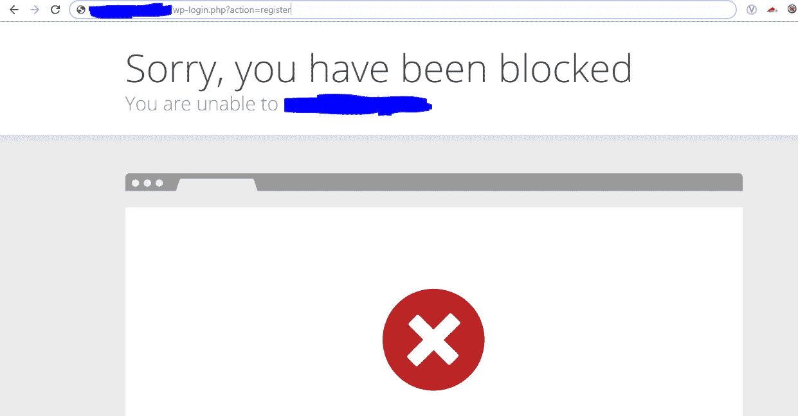
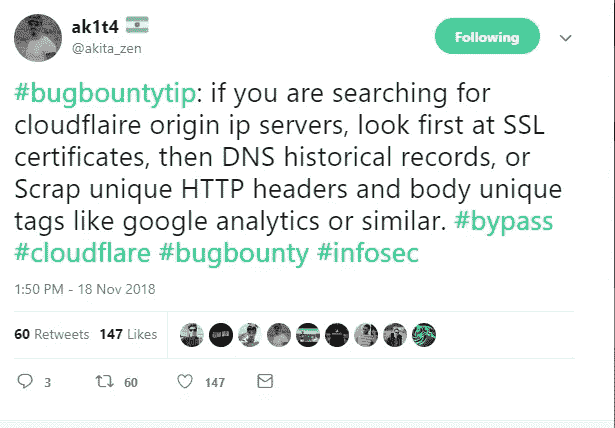

# 我如何绕过 Cloudflare WAF 来改进应用程序

> 原文：<https://infosecwriteups.com/bypass-cloudflare-waf-to-pwned-application-2c9e4f862319?source=collection_archive---------0----------------------->

大家好。！

我正与一个私人项目(例如:xyz.com)合作。所以按照我的方法，我从 dnsdumpster、virustotal、aquatone、sublister、findsubdomains.com 等网站获取所有子域。我得到了一个在 wordpress 上运行的子域。因此，我检查了基本的东西，以获得 xss，如果他们使用旧版本。

运行脚本后，检查 wp 目录，我看到 x.xyz.com/wp-login.php？action=register 我看到了这个

看起来像是被云闪挡住了，是的，我就像是在哼:(:(

如果我们能绕过他们晶片并获得源 IP 呢是的，

**关于 cloudflare 的基础知识:**

[Cloudflare](https://cloudflare.com/) 允许网站抵御各种攻击。它还可以充当 web 应用程序防火墙(WAF ),阻止利用基于 Web 的漏洞。

我用了 [**CFBYPASS**](https://github.com/christophetd/CloudFlair) 工具，运行这个后，我得到了他们的起源 IP。在[https://blog . Christophe TD . fr/bypassing-cloud flare-using-internet-wide-scan-data/](https://blog.christophetd.fr/bypassing-cloudflare-using-internet-wide-scan-data/)上的精彩报道

有多种方法可以获得原始 IP #Bugbountytip

接下来我试了那个 origin IP，x.x.x.x/wp-login.php？action=register，我可以看到注册页面，并可以使用我的电子邮件和 pwn 他们的系统注册

感谢阅读的家伙，我一直相信，分享是关怀。希望你喜欢这个发现。更多的人来了。敬请关注。有问题可以随意评论，或者在[**Twitter**](https://twitter.com/vis_hacker)(twitter.com/vis_hacker)给我拍 DM