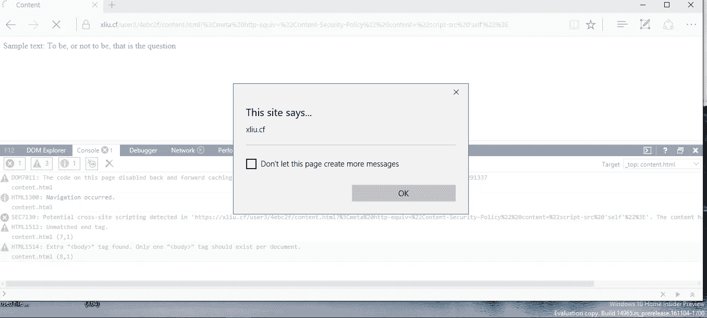

# 通过在 Edge 中滥用 XSS 滤波器绕过 CSP

> 原文：<https://infosecwriteups.com/bypass-csp-by-abusing-xss-filter-in-edge-43e9106a9754?source=collection_archive---------0----------------------->

在本文中，我将分享我在 2016 年 12 月发现的微软 Edge 中的一个内容安全策略(CSP)绕过漏洞。这种绕过是通过滥用浏览器的 XSS 过滤器实现的。这非常具有讽刺意味，因为 XSS 滤波器和 CSP 都是为了保护用户免受 XSS 攻击而设计的，但该漏洞允许攻击者滥用一种 XSS 保护机制来绕过另一种。

XSS 过滤器是在 IE 8 中首次推出的。XSS 滤波器的目的是减轻反射 XSS 攻击。IE/Edge 的 XSS 过滤器大致是这样工作的:当浏览器加载一个 URL 时，XSS 过滤器首先使用一组预定义的正则表达式检查 URL 的一些参数是否可能包含 XSS 有效载荷。例如，`http://example.com/index.php?id=100`显然是无害的，但是对于像`http://example.com/index.php?id=<script>alert(1)</script>`这样的 URL，参数`id` 的值可能是 XSS 有效载荷。然后，为了准确判断是否是反射 XSS 攻击，IE/Edge 检查返回的 HTML 是否包含子串`<script>alert(1)</script>` *。*如果是的话，IE/Edge 假设它是从`id`参数中反映出来的。注意，这个假设可能不成立:如果`<script>alert(1)</script>`被硬编码在页面中，而`id`参数实际上没有任何作用，那该怎么办？

XSS 滤波器有两种模式:默认模式和阻塞模式。站点可以通过设置 HTTP header:X-XSS-保护:1 来启用阻止模式；模式=块”。在 block 模式下，IE/Edge 会阻止整个 HTML 的渲染。在默认模式下，IE/Edge 试图通过修改相应的 HTML 标签来破坏 XSS 的有效载荷。例如，如果 Edge 假设`<script>alert(1)</script>`是一个 XSS，它会将该元素更改为`<sc#ipt>alert(1)</script>`。因此，DOM 解析器不会将这个片段解析为一个<脚本>元素，所以它不会执行。

现在我们来看看漏洞，[CVE-2017–0135](https://portal.msrc.microsoft.com/en-US/security-guidance/advisory/CVE-2017-0135)。网站设置内容安全策略有两种方式:通过 Content-Security-Policy HTTP response 头字段，或者通过< meta >标签。这种元元素的一个例子是:
`<meta http-equiv=”Content-Security-Policy” content=”script-src ‘self’”>`。现在假设这是 URL http://example.com/xss.html:的 HTML

```
<!DOCTYPE html>
<html>
 <head>
 <title>CSP Test</title>
  <meta http-equiv="Content-Security-Policy" content="script-src 'self'">
 </head>
 <body>
 <script>alert(document.domain);</script>
 </body>
</html>
```

CSP 应该阻止`alert(document.domain)`执行。为了绕过 CSP，让我们要求用户访问`http://example.com/xss.html?<meta http-equiv=”Content-Security-Policy” content=”script-src ‘self’”>`(只需将 meta 元素作为参数添加到 URL 中。)

然后，默认情况下，Edge 的 XSS 过滤器简单地将 meta 标签修改为`<me#a http-equiv=”Content-Security-Policy” content=”script-src ‘self’”>`，这会杀死 CSP，alert 就会执行。



图 1 成功绕过 CSP 的屏幕截图

2017 年 3 月发布的 [MS17-007](https://technet.microsoft.com/library/security/MS17-007) 中修复了该漏洞。已分配 [CVE-2017-0135](https://cve.mitre.org/cgi-bin/cvename.cgi?name=CVE-2017-0135) 。

当 XSS 过滤器检测到查询字符串与任何元元素匹配时，无论模式如何，都会阻止整个 HTML 页面，从而解决这个问题。

虽然这个漏洞已经被修复，但是设置“X-XSS-保护:1；模式=块”。此外，通过 HTTP 报头传递的 CSP 策略不易受到这种绕过攻击。

**时间线**

*   2016 年 12 月 2 日:向 MSRC 报告的漏洞
*   2017 年 3 月 14 日:MS17–007 中修复的漏洞(漏洞奖金:1500 美元)

**参考文献**

*   Nava，E. V .和 Lindsay，d .“[滥用 Internet Explorer 8 的 XSS 过滤器](http://p42.us/ie8xss/Abusing_IE8s_XSS_Filters.pdf)
*   W3C，"[内容安全策略级别 2](https://www.w3.org/TR/CSP2/) "
*   [IE 8 XSS 滤波器架构/实现](https://blogs.technet.microsoft.com/srd/2008/08/19/ie-8-xss-filter-architecture-implementation/)

**致谢**

*   非常感谢 MSRC 修复了这个错误并给了我奖金。
*   本文最初发表于中文网站 FreeBuf，链接:【http://www.freebuf.com/articles/web/164871.html】T21。我要感谢他们允许我在 Medium 上发布英文版。