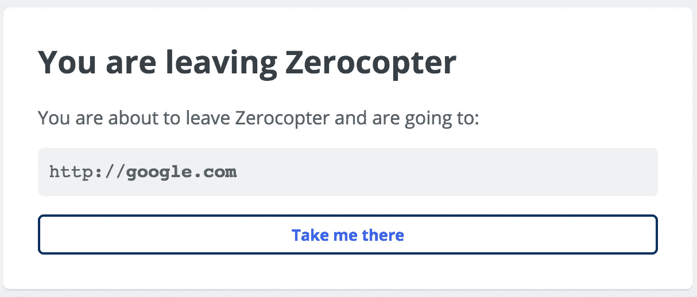
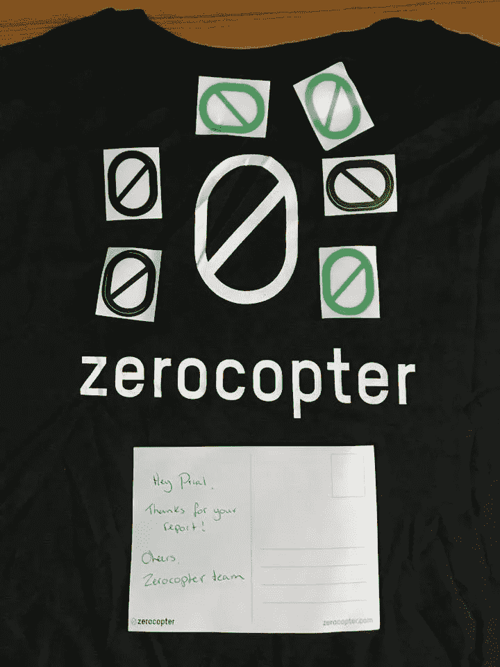
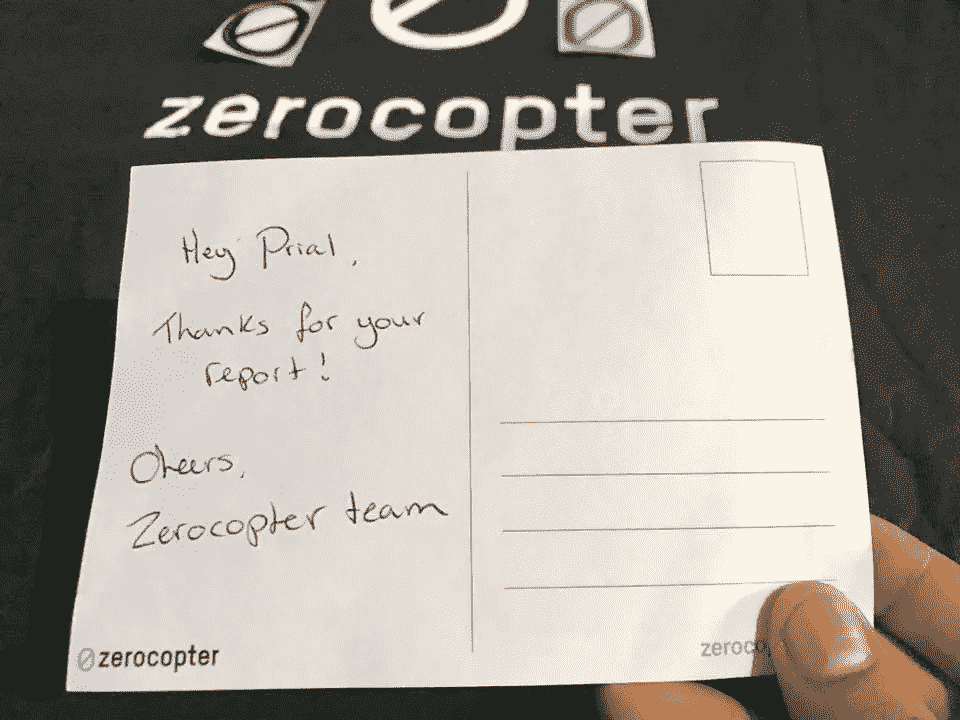

# 在 Zerocopter 中绕过外部链接警告页面

> 原文：<https://infosecwriteups.com/bypass-of-external-link-page-in-zerocopter-88ef998f861a?source=collection_archive---------4----------------------->

# 描述

**zerocopter.com**是 ***bug 赏金*** ***平台*** 对于有道德的黑客来说就像 **Hackerone** 一样。在 **zerocopter** 报告中，用户可以使用**降价**。用户也可以在报告中给出外部链接。如果用户点击报告中的外部链接，则会将用户带到一个外部警告页面，如下图所示



但是我能够绕过外部警告页面，将用户重定向到没有任何警告页面的外部链接。

**降价:-**

```
<http:1249723505> 
[Click Me](http:1249723505)
```

**注:-** 在上面的降价`1249723505`中，这是**google.com**[**74.125.68.113**的 ip 使用 [**这个工具**](http://www.smartconversion.com/unit_conversion/IP_Address_Converter.aspx) 转换成**长/十进制**。

# 繁殖

*   在一份报告中，我使用了`[Click Me](http://google.com)`这个降价，得到的回应是:-

```
<a href="/external_redirect?href=http%3A%2F%2Fgoogle.com" rel="noreferrer" target="_blank" title="">Click Me</a>
```

*   然后我用`[Click Me](http://74.125.68.113)`这个降价，得到的回应是:-

```
<a href="/external_redirect?href=http%3A%2F%2F74.125.68.113" rel="noreferrer" target="_blank" title="">Click Me</a>
```

*   然后我想让我们把协议搞乱，把降价改成`[Click Me](http:/google.com)`，仍然没有旁路。
*   然后我正要用`[Click Me](http:google.com)`但是我不小心用了`[Click Me](http:google)`在我忘记给**的地方。终于在域名降价中，我注意到了一个回应的希望:-**

```
<a href="http%3Agoogle" rel="noreferrer" target="_blank" title="">Click Me</a>
```

*   通过分析行为，我发现如果我使用一个像 **http:google** 这样的域名，我就可以绕过外部警告页面。然后我想起了 IP **长/十进制**编码。
*   所以我用 [**这个工具**](http://www.smartconversion.com/unit_conversion/IP_Address_Converter.aspx) 工具把 google.com IP 编码成**长/十进制**最后降价变成`[Click Me](http:1249723505)`然后宾果😎😎😎

```
<a href="http%3A1249723505" rel="noreferrer" target="_blank" title="">Click Me</a>
```

现在，当用户点击链接时，它会直接带用户进入**google.com**，而不是外部警告页面。然后我在**零直升机**的 [**责任披露**](https://www.zerocopter.com/en/responsible-disclosure) 页面上向他们报告了此事，他们修复了此事，并发给我很酷的 **T 恤**和**贴纸**作为奖励。



感谢阅读。希望这对你们有所帮助。