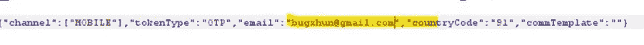
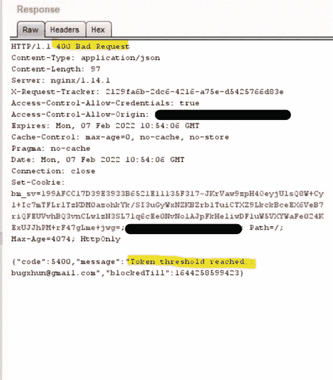
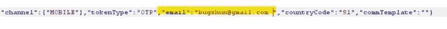
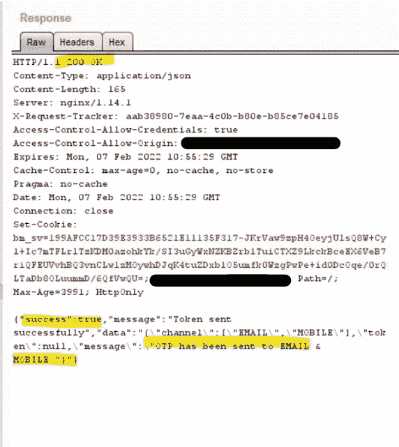

# 绕过速率限制——一个空格导致这种随机遭遇！

> 原文：<https://infosecwriteups.com/bypass-rate-limit-a-blank-space-leads-to-this-random-encounter-e18e72fbf228?source=collection_archive---------1----------------------->

大家好，希望你们玩得开心！

让我直接进入我发现的弱点。有一个名为“example.com”的网站，我还不能透露网站的名称。当我测试登录功能时，我尝试重置密码。该功能就像，当我请求密码重置服务器发送动态口令到我的电子邮件和手机号码。

> 幸运的是，我在那里添加了我的手机号码，否则我不会发现这个问题(随着我们的深入，你会明白的)。所以有时候运气在 Bug 赏金中起主要作用~

起初，我只是向入侵者发送密码重置请求，并尝试使用空有效载荷，添加任意值等..，—但失败了，因为它在 20 次请求后启用了速率限制。所以我试着添加了 X-Forwarded-Host:127.0.0.1，X-Forwarded-Client，X-Client-IP 和所有其他的标题内容，但是都没有用。所以我尝试了 IP Rotate(一个 Burp 扩展——它允许你很容易地跨多个区域旋转 API 网关),也失败了，因为它不是基于 IP 的。但是某种东西(*强烈的直觉*)让我一次又一次地努力。所以我尝试添加%00 ( *空字节在电子邮件*的末尾)和其他编码字符，但也不起作用。

# **幸运的部分~**

这时，我想起读过一篇博客，说在电子邮件末尾加一个空格可能有助于绕过最初失败的速率限制。幸运的是，我创建了一个账户*(没有手机号码)*，当我偶尔使用这个网站进行预订活动时，我已经有了我的个人账户*(一个验证了电话号码的账户)*。

***请求和响应不带空格-***

我一直在使用测试帐户进行测试，我随机(**幸运的我**)选择了我的个人帐户，并在我的电子邮件末尾添加了一个空格，我看到动态口令没有发送到我的电子邮件*(因为末尾有空格)，*但是由于手机号码与电子邮件相关联，**动态口令被发送到我的手机。~** *绕过* **~**

***添加空格后的请求和响应-***

在这个 bug 的帮助下，我能够绕过速率限制，向受害者的手机号码发送大量请求，我知道这可能不是一个很大的漏洞，但我希望这种**类型的小事情**可能会在**不同场景**中帮助你，因为你正在进行 Bug 搜索之旅。

我非常欢迎大家的建议和指正，因为我可能还不太好，我还在学习中。

## 谢谢大家~