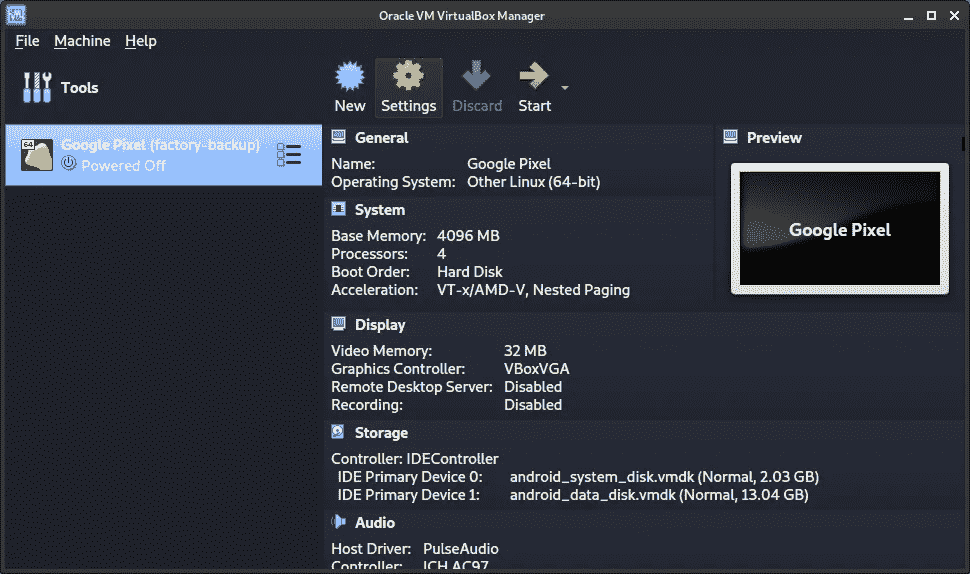
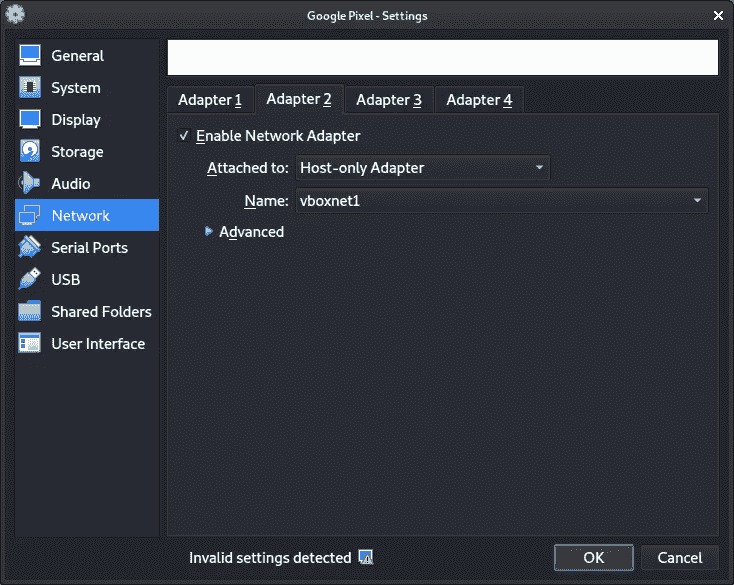
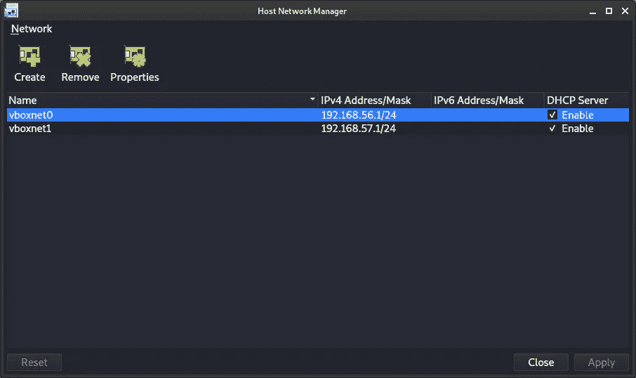
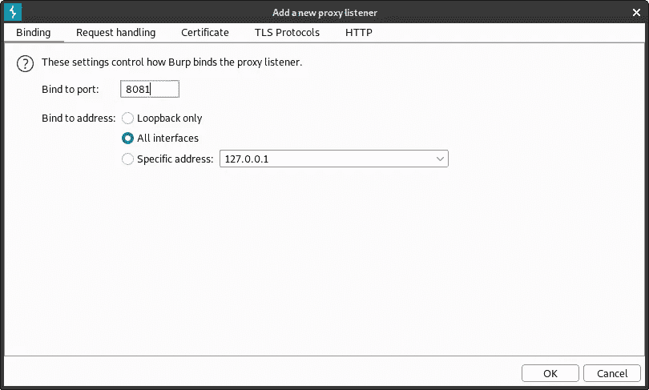
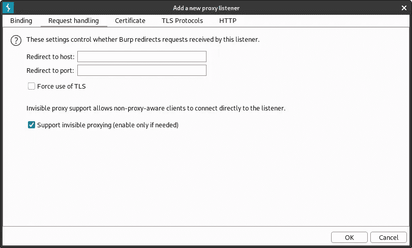
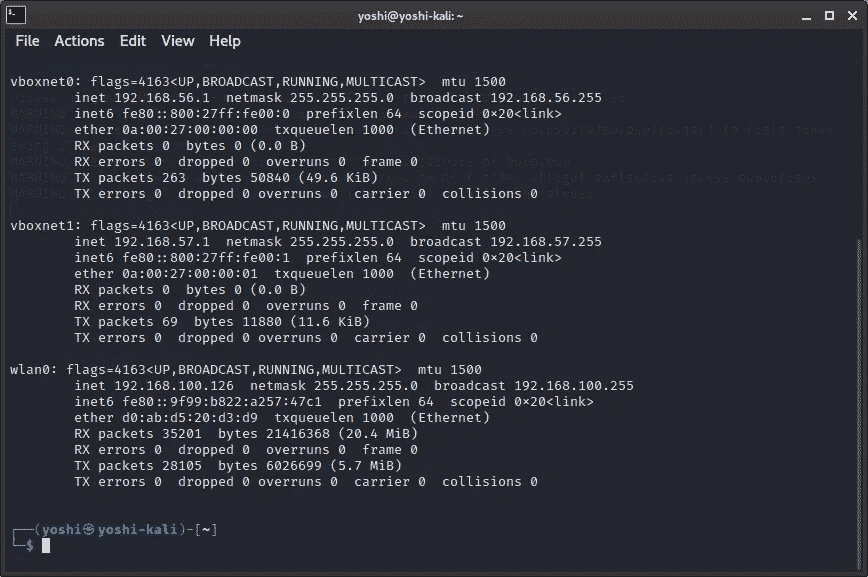
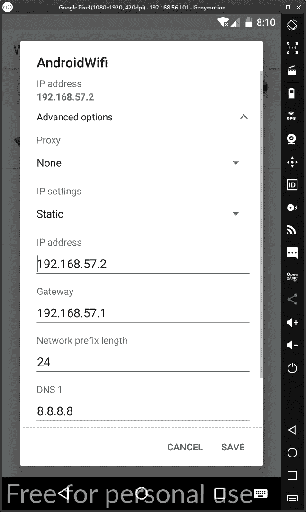
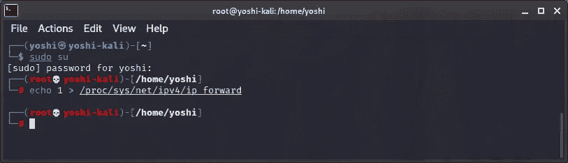
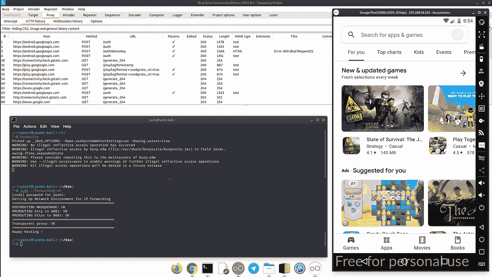

# 通过 IP 转发绕过 SSL 锁定| iptables

> 原文：<https://infosecwriteups.com/bypass-ssl-pinning-with-ip-forwarding-iptables-568171b52b62?source=collection_archive---------0----------------------->

在努力使用常用工具绕过 SSL 锁定后，因为我测试的应用程序不会显示我试图捕获的一些 HTTPS 流量。

我像往常一样使用 Frida，它在另一个应用程序上运行良好，只是我测试过了。

因此，我的团队“紫色团队”决定通过使用 kali 中的 IP 转发功能来配置透明代理。我很惊讶的结果，它工作顺利，因为它没有注入任何脚本到应用程序中。

如果你想试试，这就是我们在移动应用中绕过 SSL 锁定的方法。

1.  在 genymotion 中创建 Android 模拟器时，我使用 Google Pixel (8.0 API 26)作为我的 Android 虚拟设备
2.  打开虚拟盒子，机器列表里有安卓谷歌 Pixel。并选择“设置”选项卡，将 adapter1 和 adapter2 配置为仅主机适配器。请确保名称不同(适配器 1 的 vboxnet0 和适配器 2 的 vboxnet1)

Oracle VirtualBox 管理器中的 Google Pixel

适配器 1 配置(默认)

适配器 2 配置(仅从 NAT 更改为主机)

如果你不能在你的 android 虚拟机器中找到适配器 2，只要进入虚拟机器文件->主机网络管理器。而在网络窗口上，选择**创建**做一个新的适配器，别忘了启用 DHCP。

android 虚拟盒中的网络适配器配置

3.在 Genymotion 中启动您的 android 模拟器

4.导出 burp 证书，作为可信证书安装在 android 系统中。(网上有这么多这方面的教程)。

5.下一步是配置我们将使用什么端口来拦截从 android 设备到我们的 burp 代理的连接。我通常使用 8081 端口进行移动连接。所以，在 burp 代理打开代理选项卡->选项->代理监听器->添加

绑定到 8081 和所有接口的端口

选中支持不可见代理复选框

6.现在，移动到您的 kali，用 ifconfig -a 命令查看所有接口的 IP 地址，确保有 2 个适配器名称与 vboxnet。

wlan0 是用于连接到互联网的适配器，vboxnet0 和 vboxnet1 是来自 android 模拟器设备的适配器。

7.让我们配置我们的 android 网络

将 Wifi 配置更改为我使用的静态 IP 地址 192.168.57.2 将自动设置默认网关和 DNS。(参见 vboxnet1 中的 IP 地址)

选择 SAVE 按钮，像往常一样，在进入下一步之前重启 android 虚拟机。

8.现在有趣的部分来了。我们将在 Kali Linux 机器中配置 IP 转发规则。

在 kali Linux 中打开您的终端，使用以下命令将 IP 转发设置为 1 (true)(需要 root 权限):

echo 1 >/proc/sys/net/IP v4/IP _ forward

将 IP 转发设置为真

9.通过执行以下命令，退出 root 用户，并为 80 和 443 端口连接设置 IP 表

## sudo iptables-t NAT-A post routing-o WLAN 0-j 假面舞会

## sudo iptables -t nat -A 预路由-p TCP-I vbox net 1-dport 80-j 重定向-到端口 8081

## sudo iptables -t nat -A 预路由-p TCP-I vbox net 1-dport 443-j 重定向-到端口 8081

> *您可以将 wlan0 更改为 eth0(用于互联网连接的设备)*

现在你可以检查你的 HTTPS 流量从你的 android 被拦截到你的打嗝代理。

所有 http/https 都被拦截

好吧，希望这个技巧可以成为绕过 SSL 锁定问题的替代方法。