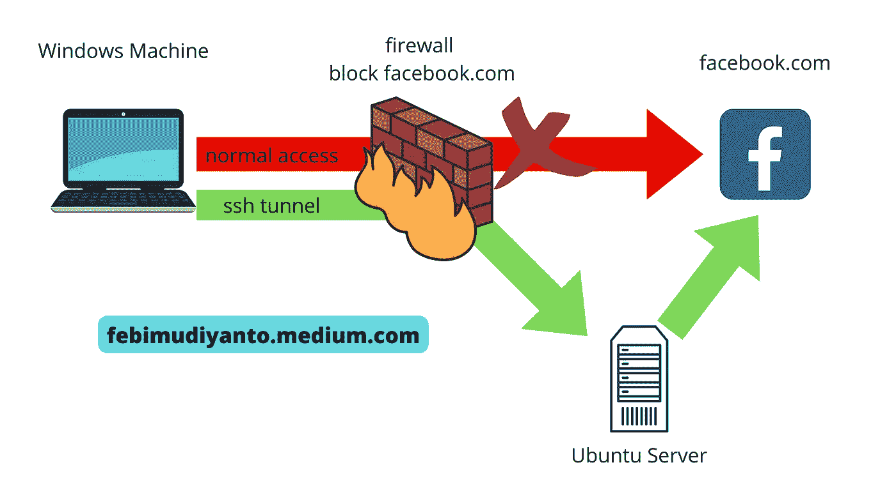
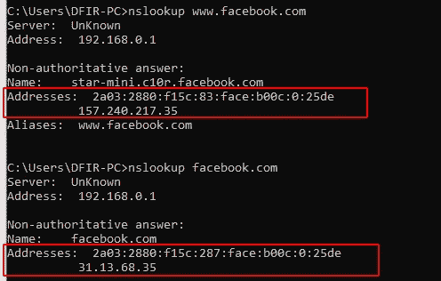
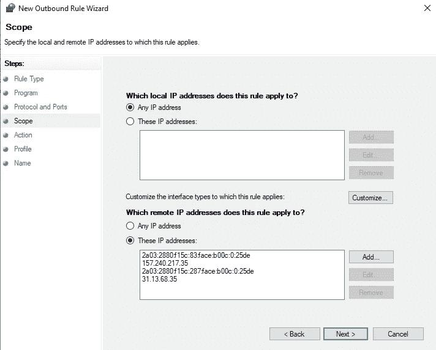
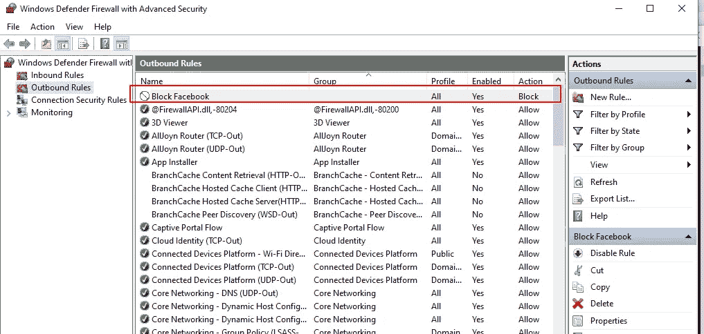
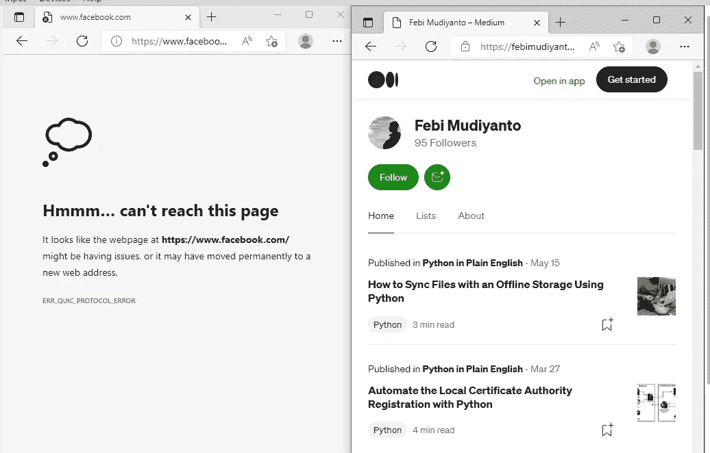
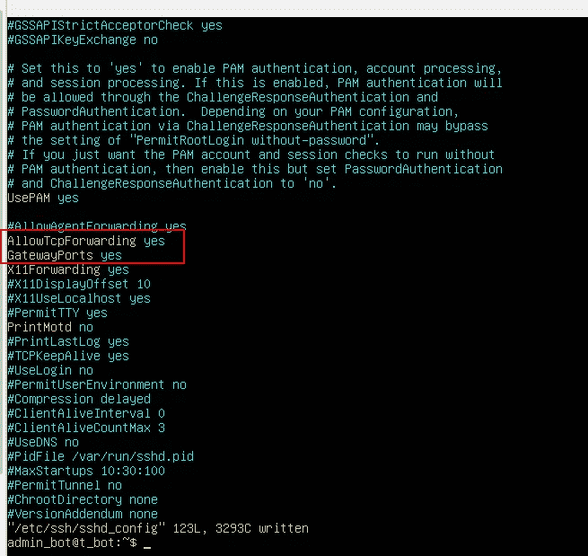
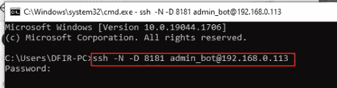
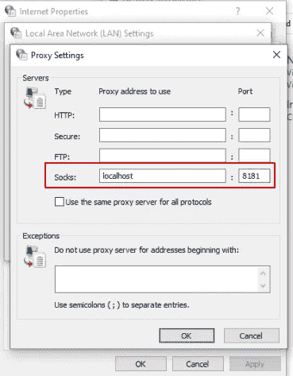
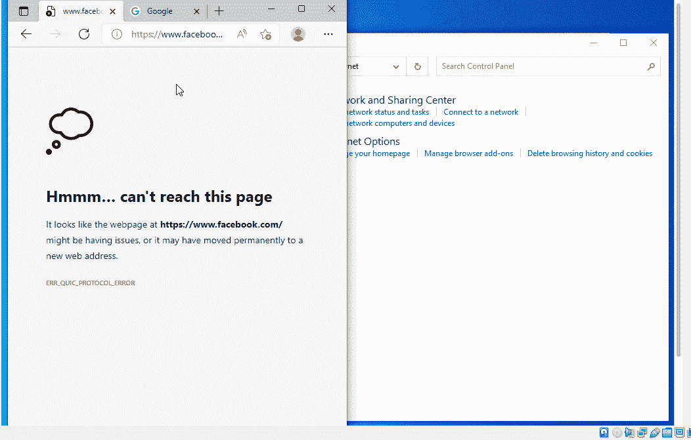

# 使用 SSH 隧道绕过防火墙

> 原文：<https://infosecwriteups.com/bypass-the-firewall-with-ssh-tunnelling-711fa78ea97f?source=collection_archive---------0----------------------->

## 创建 SSH 隧道以通过端口 22 访问阻塞端口的指南



你在公司工作吗？他们的防火墙有问题吗？或者你是一个在你的本地计算机上制作 netcat 监听器的黑客？

这篇文章适合你。因为今天我将向您解释如何创建一个 ssh 隧道来通过端口 22 访问被阻塞的端口。

默认情况下，端口 22 用于 ssh 连接，几乎每个公司都允许在防火墙中使用该端口。

## 虚拟场景

在这种情况下，我想制定一个防火墙规则来阻止我的 Windows 计算机中的 facebook.com。这是一个概念证明，我们将通过 ssh 隧道绕过防火墙。

## 我的防火墙设置

首先，用 nslookup 命令收集脸书的 IP。



然后，我在防火墙中创建新的出站规则，专门用于阻止 facebook.com



## 我的工作笔记本电脑(Windows) —在 SSH 隧道之前

因为防火墙阻止了对 facebook.com 的访问，所以当我试图用浏览器连接时，这是我的浏览器的回应:



## 绕过防火墙

一开始，我在 Ubuntu 服务器上设置 sshd_config。

## 我的服务器(Ubuntu 服务器)

确保/etc/ssh/sshd_config 文件中的配置如下:

```
**AllowTcpForwarding** yes
**GatewayPorts** yes
```



之后，重新启动 sshd 服务，以确保应用了配置。

```
sudo service sshd restart
```

## 我的工作笔记本电脑(Windows)—SSH 隧道之后

步骤 1 在 windows 机器上，创建一个 ssh 隧道:

```
ssh -N -D user@ip-server
```



注意:

-N →不登录服务器

-D→动态隧道

8181 →本地主机中的端口是否绑定到 192.168.0.113 中的任何端口

下一步是这样设置您的代理，



恭喜你，你的 ssh 隧道代理服务器**工作正常**，你绕过了防火墙。

## 演示



## 结论

防火墙不是确保公司安全的安全工具之一。与一些安全工具进行组合，让攻击者陷入困境。

感谢阅读。