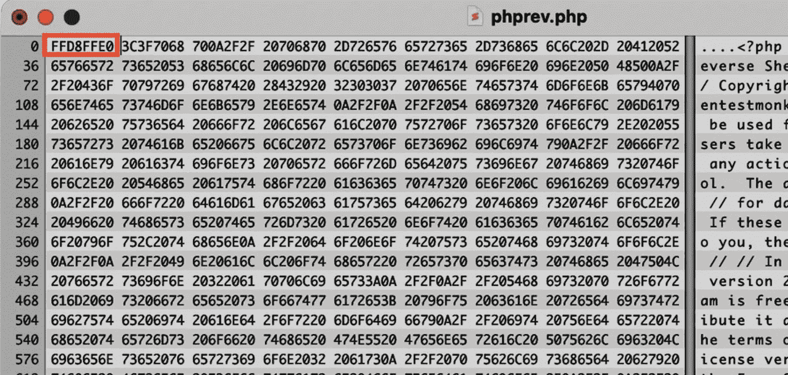

# 绕过了！还上传了一个甜甜的反转壳

> 原文：<https://infosecwriteups.com/bypassed-and-uploaded-a-sweet-reverse-shell-d15e1bbf5836?source=collection_archive---------0----------------------->

## 嘿，今天我将展示我是如何发现一个文件上传漏洞的，我绕过了这个漏洞并弹出了一个反向外壳。

最初是一个私人项目，姑且称之为 target.com。他们有一个功能，上传一个只接受 jpg，png，jpeg 图像的个人资料图片。

首先，我试着上传一个 php 反向 shell 文件，你可以从 [pentestmonkey](https://github.com/pentestmonkey/php-reverse-shell/blob/master/php-reverse-shell.php) 获得

**我试着上传了一个反壳，但不幸失败:**

*   只是上传。php 文件而不是 jpg 文件。
*   尝试双扩展名绕过和上传 php 文件 pic.jpg.php 或 pic.php.jpg
*   更改内容类型过滤，即将内容类型:txt/php 更改为 image/jpg
*   试过区分大小写 pic.php5 也试过 pic.php5，php5。
*   尝试使用特殊字符绕过 pic.php%00、pic.php%0a 和 pic.php%00

所有上述情况根本不起作用，显然它们是公司保留的基本安全补救措施。

现在让我们尝试一些新的东西，**你听说过幻数吗？**

基本上每个文件扩展名都有自己的幻数，我拿了一个 php-reverse-shell.php 文件，用十六进制编辑器在 php 文件的开头用十六进制工具添加了 jpeg 的幻数，即 **FF D8 FF E0** 。

我刚刚上传了文件，它工作了！

然后，只要点击查看个人资料，我就可以访问反向外壳。

**这背后的原因是因为**，

“图像过滤器正在查看文件开头的‘幻数’,以确定它是否是有效的图像，而这正是我们刚刚忽略的地方。”

举报、奖励— $*****

希望你喜欢我发现的这个关于文件上传漏洞的小故事。

如果你有任何关于这篇文章的问题想问我，请通过[Twitter(security _ donut)](https://twitter.com/security_donut)联系我，我的 DMs 永远是开放的。

下一篇文章再见！