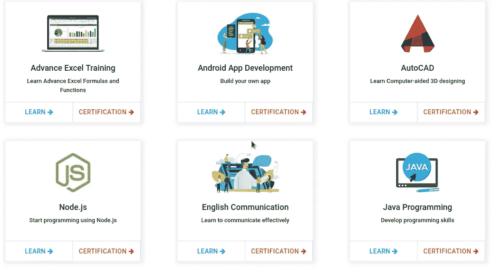
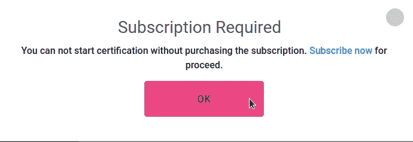

# 绕过订阅，获得认证

> 原文：<https://infosecwriteups.com/bypassed-the-subscription-and-got-the-certification-27c571c2f383?source=collection_archive---------0----------------------->

嘿，各位黑客和臭虫猎人们，

# **通过响应操作绕过订阅的故事。**

昨天，我在寻找目标。一段时间后，我完成了学习平台。例如(test.com)。进入网站后，有一个标签叫做认证。在认证页面上，有很多课程可供选择。

我看到了 java 编程课程，我点击了 Java 认证，它要求参加测试，我点击了参加按钮，网站显示需要订阅，我就像 WTF！！！

你们都知道我现在要做什么，我截取了参加的请求，这个请求看起来像，

> POST/Service/users . aspx/UserSubscriptionStatus HTTP/1.1
> 主机:[www.test.com](http://www.edubull.com)用户代理:Mozilla/5.0(X11；Linux x86 _ 64RV:78.0)Gecko/2010 01 01 Firefox/78.0
> 接受:应用/json，text/javascript，*/*；q=0.01
> 接受-语言:en-US，en；q=0.5
> 接受-编码:gzip，deflate
> 内容-类型:application/JSON；charset = utf-8
> X-Requested-With:XMLHttpRequest
> Content-Length:17
> Origin:[https://www.test.com](https://www.edubull.com)
> Connection:close
> Referer:[https://www.test.com/certifications/java-programming](https://www.edubull.com/certifications/java-programming)
> Cookie:cookies；
> 
> {
> 
> 用户 id:“210125”
> 
> }

回应看起来像是，

> HTTP/1.1 200 OK
> Cache-Control:private，max-age = 0
> Content-Type:application/JSON；charset=utf-8
> 服务器:Microsoft-IIS/10.0
> X-Powered-By:ASP.NET
> X-Powered-By Plesk:PleskWin
> 日期:2021 年 10 月 23 日星期六 07:21:46 GMT
> 连接:关闭
> Content-Length: 9
> 
> {"d":"0"}

在这里，我所做的是，只是我把 d 值改为“1 ”,订阅被绕过，我就像这样

这个网站还有更多 XSS 和伊多尔漏洞，所以我不能透露网站名称。

请关注我，获取更多关于寻找 bug 的文章

在 Instagram 上关注我:[https://www.instagram.com/ram_0x_infosec/](https://www.instagram.com/ram_0x_infosec/)

在 Linkedin 上联系我:[https://www.linkedin.com/in/ram0xinfosec/](https://www.linkedin.com/in/ram0xinfosec/)