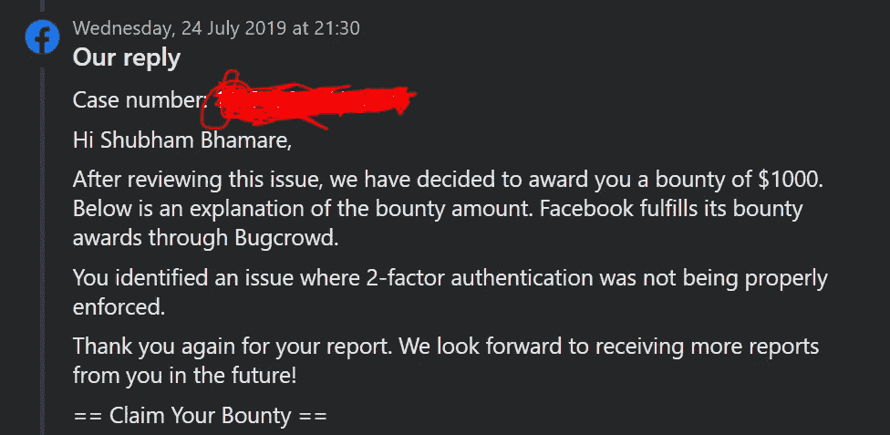

# [推荐]绕过脸书业务经理的双因素认证(奖金:1000 美元)

> 原文：<https://infosecwriteups.com/bypassing-2-factor-authentication-for-facebook-business-manager-bounty-1000-usd-c78c858459d6?source=collection_archive---------1----------------------->

嗨，伙计们，又是舒巴姆·巴玛雷。在这篇文章中，我将告诉你我是如何使用一个非常简单的技巧绕过脸书商业管理器(现在的 Meta Business Suite)的双因素认证的。

由于这个问题，攻击者能够更改受害者的脸书业务经理帐户。然而，需要进入受害者的个人脸书账户。

不浪费时间，让我们开始吧！👉

===

**设置和场景:**

1.  攻击者(ABC)可以访问受害者(XYZ)的个人脸书帐户。XYZ 为 Business Manager 启用了双因素身份验证(因为在使用 Business Manager 帐户之前需要启用它。)

平台:[脸书网](https://www.facebook.com)

===

**复制步骤:**

1.  因为 ABC 有权访问 XYZ 的个人脸书帐户，但他/她希望更改 XYZ 的业务经理帐户，由于启用了 2FA，因此无法访问该帐户。因此，首先，去美国广播公司的业务经理帐户，拦截和复制 XYZ 的业务经理的任何行动的请求。
2.  现在，您已经获得了 XYZ 的脸书帐户访问权限，复制他/她的 cookies 和 fb_dtsg 令牌，并将其替换到我们之前捕获的业务经理请求中。此外，在此请求中，您必须将 ABC 的 business_id 替换为 XYZ 的 business_id。完成后，转发这个修改后的请求。您将看到该操作已从 XYZ 的业务经理帐户成功完成。这样，你可以对 XYZ 的业务经理帐户进行任何操作。

===

**赏金:**

1000 美元

===

**时间线:**

> 2019 年 5 月 5 日:报告已发送
> 
> 2019 年 5 月 8 日:预审
> 
> 2019 年 6 月 14 日:分流
> 
> 2019 年 7 月 24 日:奖励 1000 美元奖金
> 
> 2019 年 7 月 25 日:问题已修复

===

感谢您的阅读！敬请关注我的下一篇文章，别忘了关注我的**[**Twitter**](http://twitter.com/theshubh77)[**LinkedIn、**](https://linkedin.com/in/theshubh77) 和**[**insta gram**](http://instagram.com/theshubh77)**。😊******

****===****

## ****来自 Infosec 的报道:Infosec 每天都有很多内容，很难跟上。[加入我们的每周简讯](https://weekly.infosecwriteups.com/)以 5 篇文章、4 条线索、3 个视频、2 个 GitHub Repos 和工具以及 1 个工作提醒的形式免费获取所有最新的 Infosec 趋势！****