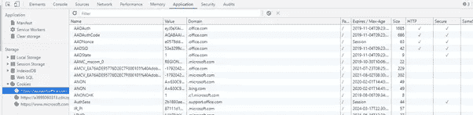
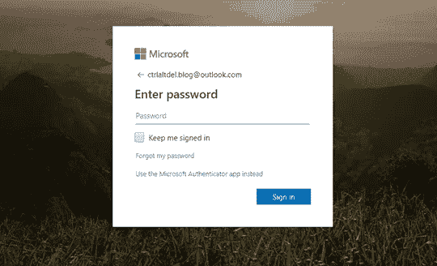
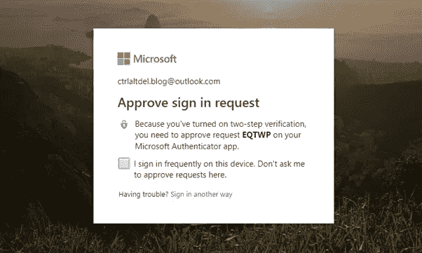
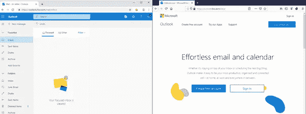
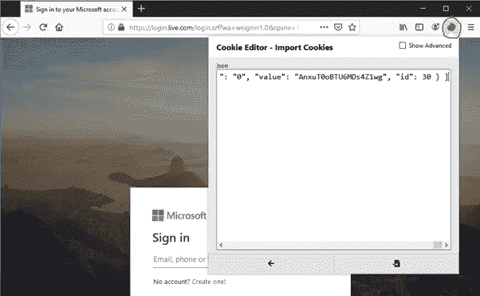
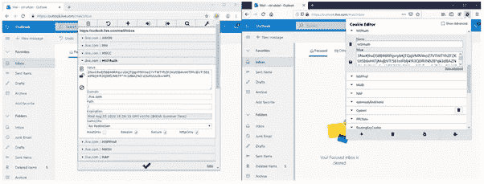
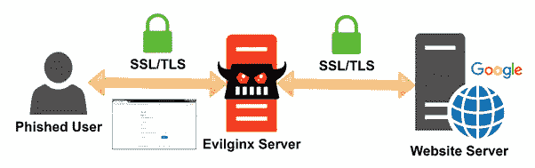
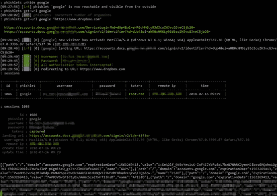
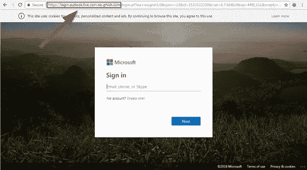

# 用饼干绕过 2FA！

> 原文：<https://infosecwriteups.com/bypassing-2fa-with-cookies-ff2c79022f63?source=collection_archive---------1----------------------->

如果您的帐户启用了双因素身份验证(2FA)，您就不会受到威胁，对吗？

不完全是。随着技术的进步，攻击者也在进步。网络钓鱼攻击变得更加复杂，攻击者正在寻找绕过 2FA 的方法。之所以如此，是因为你的浏览器里储存了美味的饼干。会话 cookies 是向服务器显示用户已经通过身份验证的一种方式。这包括通过 2FA 挑战。您的浏览器可以使用这些 cookie，直到其过期(抱歉)。一旦 cookie 过期，您将被要求重新认证。

这取决于应用程序，但有些应用程序可能比其他应用程序有更强的限制。其中包括:

*   一次性 cookie。
*   受 IP、设备或某种指纹的限制。
*   链接到验证 cookie 的另一个元素(反欺骗)。

但并非所有情况都是如此，这正是攻击者所利用的。Outlook、Gmail 和社交网络平台等服务都允许 cookie 被重复使用。攻击者只需要一种提取它们的方法。

为了向您展示它是如何工作的，我将使用一个名为 EditThisCookie 的浏览器扩展:[http://www.editthiscookie.com/](http://www.editthiscookie.com/)

你不需要一个花哨的扩展就能看到和查看你的 cookies。如果您在浏览器(开发者)中点击 F12，您可以在应用程序>存储下看到正在使用的 cookies。

问题是，你没有提取它们的简单方法。当然，你可以复制和粘贴，但这是冗长的，容易出错。这就是 Cookie 编辑器让生活变得更容易的地方。使用 EditThisCooke，我们可以简单地将 cookies 导出和导入到不同的浏览器中。

以 Outlook.com 为例。我们首先登录我们的帐户。

输入密码后，我们会批准 MFA 提示。

现在我们进来了。下面你可以看到我正在使用两种浏览器。在左边，我用 Chrome 登录了 Outlook。在右边，你可以看到我没有登录 Outlook，正在使用 Firefox。请记住，cookies 是特定于浏览器的。

有了 EditThisCookie，我可以从 Chrome 导出我的 Outlook cookie

…并将它们导入 Firefox。如你所见，我仍然没有登录。

导入后，我再次点击 Outlook 网站，登录成功。这是因为 Firefox 用我导入的 cookie 来证明我已经认证了。

导入后，我再次点击 Outlook 网站，登录成功。这是因为 Firefox 使用了我导入的 cookie 来表明我已经通过了身份验证。

这是在同一台设备上完成的，但是，如果我使用另一台设备，这也可以工作。如果我将设备 1 上的 cookie 导出并导入设备 2，我会得到相同的结果(取决于应用程序)。

这基本上就是攻击者现在正在利用的。你可能会想，他们怎么能接触到我的设备呢？

答案是他们并没有试图这么做。虽然我确信这是可以实现的，但风险相当低。攻击者可以使用某种脚本或橡皮鸭提取 cookie，但这不太可能。相反，他们希望你去找他们。

这就是 EvilGinx2 发挥作用的地方:[https://github.com/kgretzky/evilginx2](https://github.com/kgretzky/evilginx2)

EvilGinx2 是一个代理/钓鱼工具，可以提取您的会话 cookie。它通过创建一个钓鱼网站来欺骗您输入您的凭据，包括 2FA 挑战。

EvilGinx2 是一个代理/钓鱼工具，可以提取您的会话 cookie。它通过创建一个钓鱼网站来欺骗您输入您的凭据，包括 2FA 挑战。

一旦用户被愚弄，Evilginx 保存令牌，允许攻击者提取并将其导入他们选择的浏览器。这整个过程使 2FA 提示失效，因为服务器读取 cookie 并假设用户已经过身份验证。正如我上面提到的，一些应用程序对 cookies 有限制。Evilginx 的好处是身份验证的来源将是 Evilginx 服务器。这意味着，攻击可以使用服务器本身的浏览器，绕过任何 IP 和设备限制。请记住，会话 cookie 会将源记录为 Evilginx 服务器，而不是您的客户端。

开发人员制作了下面的视频来解释它是如何工作的。

有了云计算，这些“邪恶”的服务器可以以非常低的成本制造出来。我们聊了不到一杯咖啡: [IONOS](https://acn.ionos.co.uk/SHBE) :

那么，您能做些什么来防范这种类型的攻击呢？

这种攻击的一个缺陷是 DNS 记录必须有说服力才能欺骗今天的用户。攻击者会将 Evilginx 托管在所有人都可以访问的 web 服务器上。这将要求攻击者设置一个外部 IP 和 DNS 记录。因此，他们将不能使用微软的任何官方域名。这适用于谷歌和其他任何有钓鱼网站的网站。攻击者将不得不使用我过去的帖子中描述的技术:【https://xstag0.com/2019/07/11/how-the-phishers-phish/ 

最简单的解决方法就是教育。现在，攻击者使用 HTTPS 似乎是真实的，我们真的需要在输入我们的凭据之前检查 URL。

[xstag 0(buymeacoffee.com)](https://www.buymeacoffee.com/Xstag0)

## 来自 Infosec 的报道:Infosec 每天都有很多内容，很难跟上。[加入我们的每周简讯](https://weekly.infosecwriteups.com/)以 5 篇文章、4 条线索、3 个视频、2 个 Github Repos 和工具以及 1 个工作提醒的形式免费获取所有最新的 Infosec 趋势！