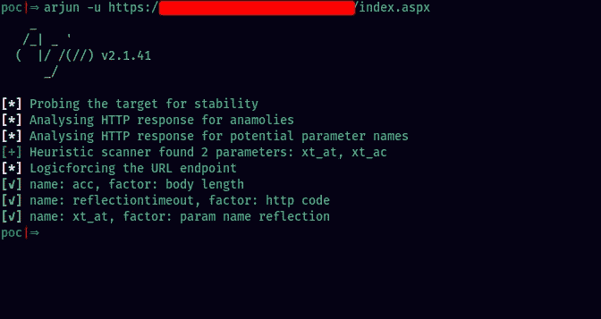
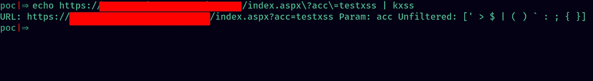
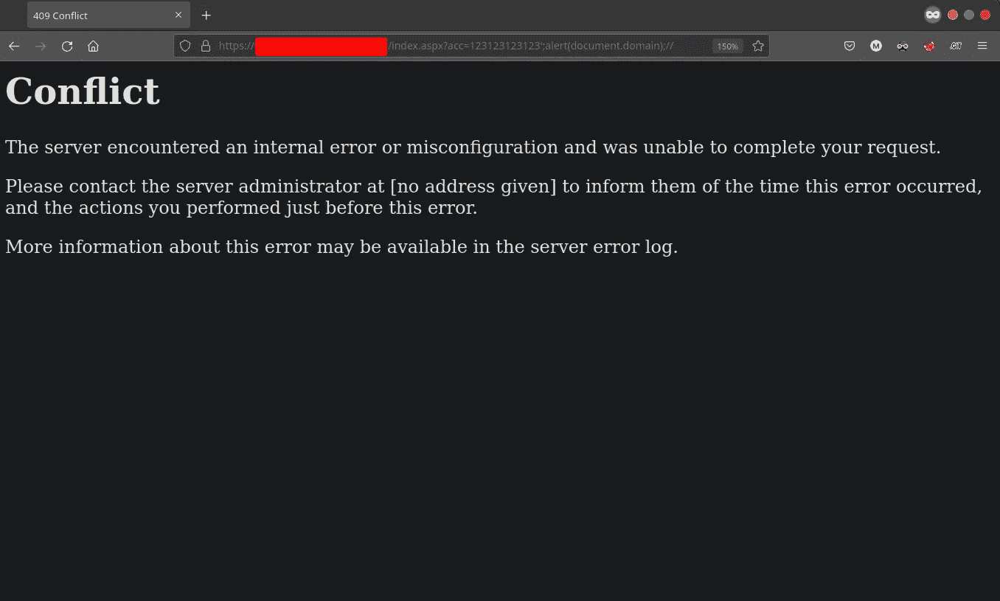

# 绕过 Amazon WAF 弹出警报()

> 原文：<https://infosecwriteups.com/bypassing-amazon-waf-to-pop-an-alert-4646ce35554e?source=collection_archive---------0----------------------->


嘿，各位，我已经有一段时间没有发表任何东西了。这一次，我将分享我是如何绕过亚马逊 WAF 让 XSS 上目标的。如果你对 bugbounty 感兴趣，这将有助于你建立一种思维模式来创建可以绕过 WAFs 的有效载荷。否则，这将是一本好书。我保证！

未知的是，WAF (Web 应用程序防火墙)是一种防火墙，用于保护 Web 应用程序免受常见攻击，如 SQL 注入、跨站脚本(XSS)等。，通过过滤掉恶意流量。

# 发现

在内容发现阶段，我试图收集尽可能多的端点。在启用被动扫描扩展的情况下，始终在后台使用 Burpsuite 代理执行此操作。在花了大量时间之后，我分析了 Burpsuite 为手动检查端点而生成的站点地图。目标网站本身的功能非常有限，因此，我找不到任何有用的东西。转到 robots.txt 文件，我看到了一个不允许的端点，即`/index.aspx .`这有点奇怪，因为网站是在 wordpress 上运行的，而带有`.aspx`端点的页面是你在 Wordpress 网站上看不到的。

页面本身是空白的，但在检查源代码时，我看到了一些 HTML 和 javascript。这让我想知道这个页面的目的是什么。我觉得这个难题缺少了点什么。然后我想起来我可以做一些参数发现。阿琼([https://github.com/s0md3v/Arjun](https://github.com/s0md3v/Arjun))是实现这一目的的绝佳工具。它可以用最少的服务器请求查询大量的参数名称。



使用 arjun 发现参数

在这三个参数中，参数`acc`反映在网页上的一个`<script>`标签中。javascript 看起来像这样:

```
xt_multc ='&x1=0&x2=REFLECTION_POINT';
```

`REFLECTION_POINT`是指反映我们参数值的区域。我需要对单引号进行转义，以便能够将 javascript 注入页面。

我用这个参数在页面上快速运行了`kxss`,以识别未被清理/编码的特殊字符，并按原样反映出来。



kxss 是识别参数中未过滤字符的好工具

可以看到，有大量的特殊字符没有被过滤掉，其中，单引号字符也是其中之一。这是个好消息，因为我们现在离目标更近了一步。

在这一点上，我尝试了一个简单的有效载荷，如`';alert(document.domain);//`。晶片启动了，尝试失败了。



封锁☠️

# 绕过晶圆

在玩了不同的有效载荷后，我得出了一个结论，包含有效 javascript 函数名如`alert(`(是的，如果 alert 后有一个开括号，就会被屏蔽。没有开括号，不会被阻塞)都被阻塞。我试图通过在警告和左括号之间插入一个注释来绕过它，但同样被阻塞了。

我试着用 Burpsuite Intruder 模糊基于这个上下文(Javascript 字符串中的反射)的有效负载，但结果是没有结果。

用除了`alert()`以外的函数 Fuzzing，我看到有些函数比如`fetch()`和`print()`是允许的。虽然，我本可以在我的报告中使用这些来演示概念验证，但我把击败 WAF 和执行`alert()`功能作为一个挑战。

不用写`alert(document.domain)`，我们可以用`window`对象调用`alert` 函数:`window["alert"](document.domain)`。

可惜这个有效载荷也被屏蔽了。然后我想起我可以在有效负载之间使用 Javascript 中的多行注释语法来欺骗 WAF，WAF 通常基于一组规则和正则表达式运行。

最后的有效载荷是`';window/*aabb*/['al'%2b'ert'](document./*aabb*/location);//`。我将“alert”字符串拆分为“al”和“ert”两部分，然后添加它们。加号需要进行 URL 编码；否则，它将被解释为空格符号。


终于发出警报了！

如果你喜欢读这篇文章，请考虑跟随并鼓掌。在接下来的几天里，我会带来更多这样的内容。感谢您的阅读，我们后会有期:)

*来自 Infosec 的报道:Infosec 上每天都会出现很多难以跟上的内容。* [***加入我们的每周简讯***](https://weekly.infosecwriteups.com/) *以 5 篇文章、4 个线程、3 个视频、2 个 Github Repos 和工具以及 1 个工作提醒的形式免费获取所有最新的 Infosec 趋势！*