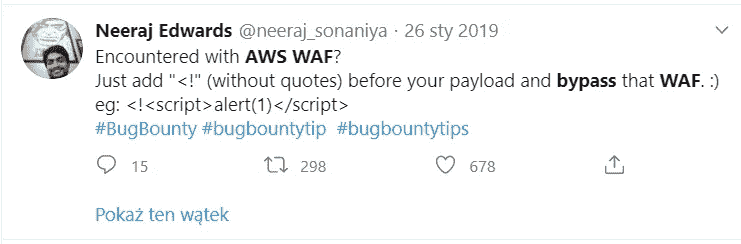
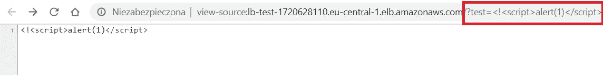
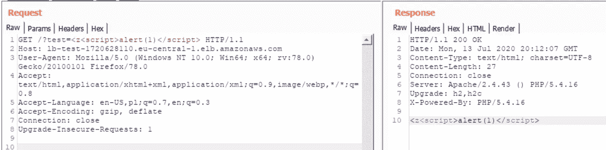
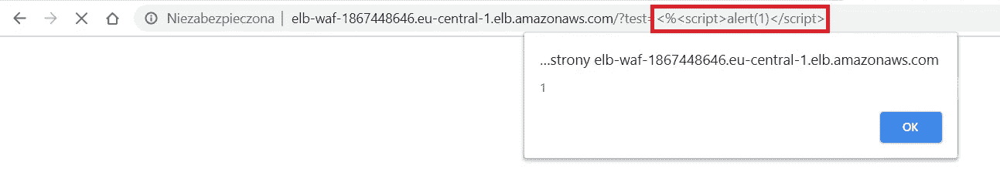
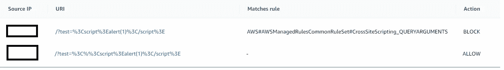
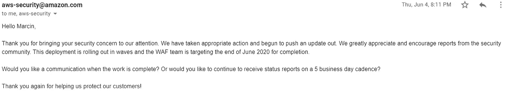

# 使用跨站点脚本(XSS)有效负载绕过 AWS WAF CRS

> 原文：<https://infosecwriteups.com/bypassing-aws-waf-crs-with-cross-site-scripting-xss-payload-fc90a09b370a?source=collection_archive---------1----------------------->

今年早些时候，我的同事发现了一个明显易受跨站点脚本攻击的应用程序，因为没有对特殊字符进行编码。

然而，他很快了解到，该应用程序是在一个 WAF 后面，因为试图利用 XSS 导致 HTTP 403 错误信息。

标准 AWS 晶圆错误信息

在与应用程序所有者交谈后，我们了解到实际上应用程序在启用了核心规则集的 AWS WAF 后面。

考虑到有多少 web 应用程序使用 AWS WAF 和 CRS，绕过它似乎很有挑战性。然而，我们决定花一些额外的时间尝试这样做。

我们开始检查 Twitter 上有什么，只是为了找到 2019 年初的这篇帖子:

不幸的是，这个有效载荷对我们不起作用

因此，我们更新了我们的有效载荷，并了解到 WAF 实际上被绕过了，但是脚本没有被执行，因为主要的 web 浏览器将这个有效载荷视为注释。

脚本不在 web 浏览器中执行

然而，现在很清楚，在实际有效载荷前加上一些其他字符可能会导致晶片旁路。

考虑到这一点，我启动了打嗝的入侵者试图取代“！”(%21)字符和一些其他十六进制值，这将允许绕过 WAF。

过了一会儿，我有了一个完整的值列表，它没有返回一个错误。但是，

WAF Bypass — script not executed

Best was yet to come though, as my list had also some special characters which went through the WAF unnoticed: **后面的大部分字符(【A-Z】【A-Z】)！** *(%21)* ， **/** *(%2F)* ，**？***(% 3F)*****%***(% 25)。***

**几秒钟后，很明显，在这四个有效载荷中有一个幸运的赢家，它允许 AWS WAF 旁路和在 web 浏览器中执行脚本。**

****

**AWS 晶圆旁路和脚本执行**

**晶片旁路在 AWS 晶片日志中也清晰可见**

****

**晶片日志证实 XSS 有效载荷没有被阻挡**

**在花了一段时间思考通过在各种 bug bounty 程序中使用这个有效载荷我可以赚多少钱之后，我决定向 AWS 公开它(AWS 目前根本没有运行任何 bug bounty 程序)。**

****

**好孩子…**

****披露时间表:** 2020 年 5 月 23 日—向 AWS 安全团队发送报告
2020 年 5 月 24 日—AWS 安全团队的首次回应
2020 年 4 月 6 日—发现确认为漏洞**

****

**漏洞已确认**

**2020 年 10 月 7 日—发布修复程序
2020 年 13 月 7 日—发表评论**