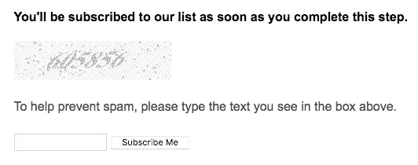
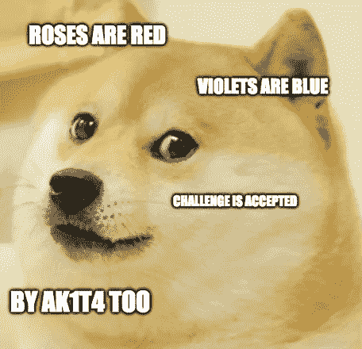
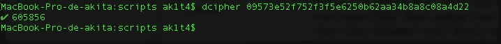
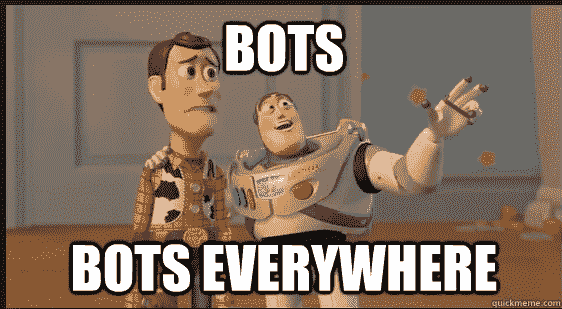

# 像老板一样绕过验证码

> 原文：<https://infosecwriteups.com/bypassing-captcha-like-a-boss-d0edcc3a1c1?source=collection_archive---------0----------------------->

猎人们，你们好！距离我上次写文章已经有一段时间了，所以我决定分享一下我在一个私人项目上的有趣经历。

**验证码是什么鬼东西？**

从我的角度来看:验证码解决方案主要用于避免机器人，并确保应用程序背后的用户是一个真正的人。

> 分享是关怀，所以我们去向上写吧！

在映射应用程序时，我发现了一个带有验证码过滤器的订阅端点，如下所示:

【http://example.com/captcha/captchaCheck? 号

这很快吸引了我的注意力，所以我转到了 src 页面:

如果你看这个表格，你会发现有两个有趣的参数:

> “**哈希**”(加密哈希)和“**输入值**”(验证码的数值)

所以，我填写了验证码并发送了表单:

此时，我需要实现这个验证码的行为/功能，所以:

我发现了这个:

> 如果“哈希”==“输入的值”，则接受请求
> 
> 如果“哈希”！= "输入值",则请求被阻止

很好，所以..很简单:如果参数匹配:请求被接受..现在复杂的事情是:散列可以被解密？接受挑战！

所以我在我的终端中粘贴散列，并尝试用[“dcipher”](https://github.com/k4m4/dcipher)解密:

(使用在线彩虹表[hash toolkit，GromWeb，MD5Hashing] &查找表攻击服务解密哈希。)

不错！解密:OK！如果您注意到 6 位数等于下面的验证码图片:

好了，好了，现在我们已经有了所有的部分:所以..让我们创造一个机器人！

我用 python 创建了一个用于 PoC 目的的 bot，以展示攻击者如何轻松绕过这种 captcha 行为并滥用其功能:

> 1)首先，机器人向订阅页面发送带有验证码->[https://company.com/captcha/form/?](https://company.com/captcha/form/?)
> 的请求 2)机器人抓取页面并检索“散列”值参数。
> 3) Bot 解密哈希(dcipher)
> 4)利用解密值，Bot 向[http://company.com//captcha/captchaCheck](http://company.com//captcha/captchaCheck)创建 POST 请求，并自动用随机值(电子邮件、姓名、IP 地址等)填充所有用户表单所需的参数
> 5) Bot 发送 POST 请求并绕过验证码

这个机器人非常简单，但工作起来很有魅力..因此，我将此概念证明发送给了该计划，并附上了以下解释:

> **安全影响**
> 
> 攻击者可以创建一个机器人来绕过验证码，并自动执行任务，向多个 URL 或带有随机/虚假用户、电子邮件、IP 地址的列表发送无限制的请求..出于垃圾邮件或邪恶目的(收集数据、分析流量行为等)

(这个程序的反应真的很快！ **< 1h )**

> **时间线**
> 
> **已提交世界协调时 2018–04–16 03:51:17**
> 
> **团队反应与伤检分类和奖金 2018–04–16 04:48:17 UTC**
> 
> **(赏金$ xxx)**

所以 ak1t4 是幸福的！

> 我希望你喜欢这篇文章，就像我喜欢写它一样！
> 
> 记住:如果你失败了？再努力点！
> 
> 狩猎愉快！

 [## ak1t4 z3n 🇦🇷 (@knowledge_2014) |推特

### ak1t4 z3n 🇦🇷的最新推文(@knowledge_2014)。Bug 赏金猎人——HoF:谷歌——Mozilla——PayPal……

twitter.com](https://twitter.com/knowledge_2014)