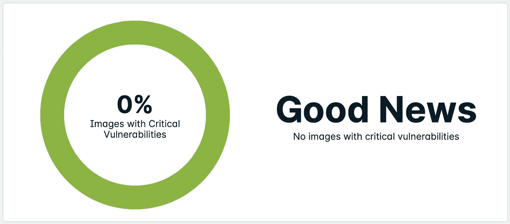
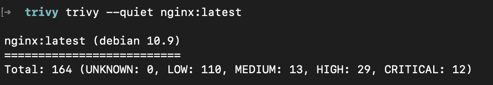
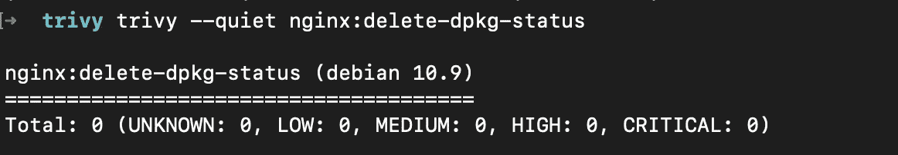

# 绕过集装箱图像扫描

> 原文：<https://infosecwriteups.com/bypassing-container-image-scanning-2c50dbfa7e4c?source=collection_archive---------2----------------------->



容器技术已经成为现代计算的支柱。大多数现代公司现在在生产环境中运行容器，许多公司已经成功地将容器图像扫描构建到他们的 CI/CD 管道中。许多公司甚至对这些映像扫描实施策略，仅允许部署低于漏洞阈值的映像。CNCF 云本地安全白皮书定义了这一事实上的标准。

> 扫描容器映像是在整个生命周期中保护容器应用程序的一个关键组成部分…将容器映像的漏洞扫描与管道合规性规则相结合，可确保仅将修补充分的应用程序部署到生产中，从而减少潜在的攻击面。

但是这些容器图像扫描的准确性如何，在评估容器漏洞时还应该考虑什么？
让我们深入了解什么是集装箱图像扫描，以及我们如何从处理结果中获得乐趣。

# 什么是集装箱图像扫描？

嗯……那会变得复杂。现在有许多不同的容器图像扫描工具，每种工具都有自己的扫描方法和漏洞数据源。有些人可能会扫描文件系统(毕竟，这就是容器映像的全部内容)，寻找已知的静态易受攻击组件的签名，而其他人可能会实际运行容器并查询包管理器。这些会产生非常不同的结果。

一些流行的集装箱图像扫描工具包括但不限于:

*   Snyk(由 docker 扫描使用)
*   clair(AWS ECR 用？)
*   Trivy (aquasec)
*   安克雷

让我们用高级扫描方法来分解它。我对这些高级扫描方法的理解来自于阅读文档、开源代码以及现场观察和实验。

## 静态包管理器扫描

通过包管理器静态查询包列表似乎是最常见的方法。对于基于 debian 的映像，这可能只是提取`/var/lib/dpkg/status`的内容这么简单。扫描器读取这个静态文件来获取已安装软件包的列表。

## 运行时包扫描

一些工具实际上会运行容器并向包管理器查询信息。对于使用高级打包工具(APT)的映像，这可能看起来很简单:

`docker run --rm --it <image> apt list`

实际上，情况可能会更复杂一些。一个更复杂的扫描器可能会做一些事情，比如将二进制文件注入到映像中，以识别本地包管理器并相应地进行扫描。

例如，Aquasec 最近弃用的 microscanner 涉及在构建时运行和扫描图像，向 docker 文件添加:

```
ADD [https://get.aquasec.com/microscanner](https://get.aquasec.com/microscanner) /RUN chmod +x microscannerRUN microscanner <TOKEN>
```

## 基于静态文件的扫描

这是经典的漏洞扫描方法。这些类型的扫描可以遍历文件系统，检查已知的易受攻击的签名。基本的扫描工具可能只是检查文件散列，而更高级的工具具有分解应用程序依赖库文件甚至源代码本身的能力。

例如，一个包含节点应用程序的映像，扫描器可能会检查 package-lock.json 文件，以提取正在使用的依赖项列表。

## 漏洞数据源

每个容器图像扫描工具都会以不同的方式获取其漏洞数据。这可能包括 NVD、特定于操作系统的漏洞跟踪器、专有研究等。了解您的工具的数据来源对于理解它是否真正解释了您的图像是至关重要的。

# 获得黑客技术

对集装箱图像扫描仪的工作原理有了基本的了解后，我们现在可以试着打破一些东西。我发现了一些绕过集装箱图像扫描仪的方法。

## 绕过静态软件包管理器扫描

*   删除软件包管理器状态文件

对于一个基于 debian 的映像，这很简单，只需将`RUN rm /var/lib/dpkg/status`添加到映像的 Dockerfile 中。让我们比较 nginx:latest 的一个新副本和一个用附加的 RUN 命令构建的副本的结果。

之前:



之后:



这种旁路方法的其他变体包括:

*   移动包裹
*   更改包名

## 绕过运行时扫描

除了绕过静态包管理器检查的方法之外，还有一些巧妙的方法来绕过运行时依赖检查。

*   删除软件包管理器

例如，尝试在安装完映像的所有基本包之后，将`RUN apt-get remove apt`构建到映像中。这些包将保留在映像上，但是运行时扫描程序将无法使用`apt list`进行查询，因此导致 0 个漏洞被发现。

*   防止运行时扫描程序被注入

如果您确切地知道运行时扫描程序二进制文件被注入的位置和方式，请找到一种方法来防止它。例如，在上面的微扫描器案例中，我们知道它将在`/microscanner`添加扫描器二进制文件。在这种情况下，我们可以在写入微扫描器之前添加一个层，创建一个指向/dev/null 的符号链接。这意味着在映像构建时，microscanner 二进制文件会被丢弃，而不是写入文件系统。

```
RUN ln -s /dev/null /microscannerADD [https://get.aquasec.com/microscanner](https://get.aquasec.com/microscanner) /RUN chmod +x microscannerRUN microscanner <TOKEN>
```

## 绕过基于静态文件的扫描

这种更经典的依赖性扫描方法比传统的绕过方法要弱。

*   更改文件签名
*   更改文件名
*   更改文件扩展名

# 为什么在乎？

了解这些缺陷可以让我们看到更多的潜在威胁，这样安全工程师和开发人员就可以做好最好的准备。

一些威胁可能包括:

*   报告 0 个漏洞的公共映像(例如 Docker Hub ),但实际上包含已知的恶意软件和易受攻击的软件包。
*   受损的 CI/CD 管道现在可以部署带有漏洞和恶意软件的映像。
*   意外。开发人员有时会做一些有趣的事情。

# 接下来是什么？

有了对集装箱图像扫描的这种理解，考虑集装箱安全的下一个级别就很重要了。更多博客文章即将发布。

*   容器应用程序清单扫描
*   容器运行时安全实施
*   构建安全的无发行版映像

# 关键要点

*   了解您的集装箱图像扫描工具
*   了解您的映像清单—确保您的基本映像发行版在扫描过程中得到考虑
*   永远不要相信公众形象