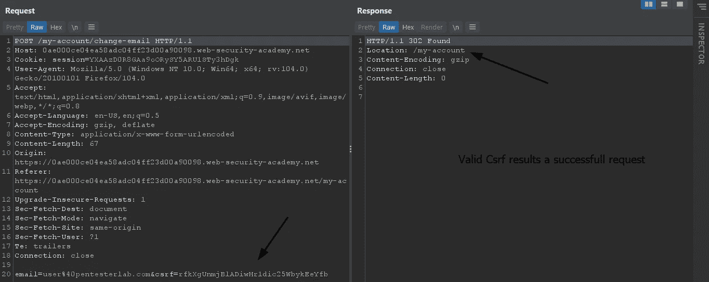
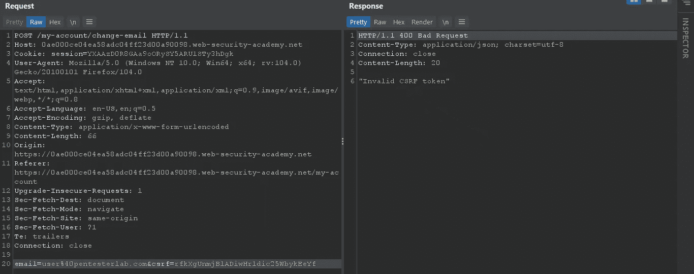
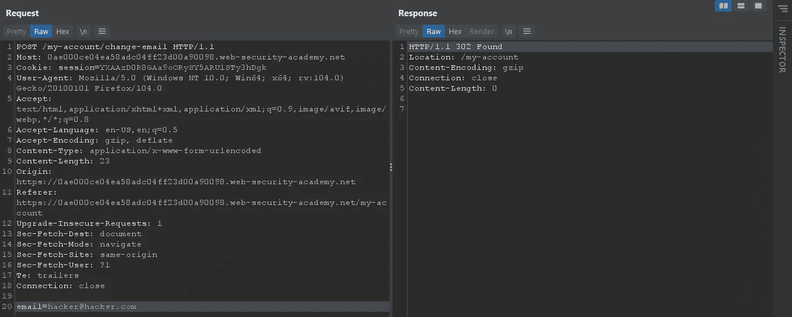
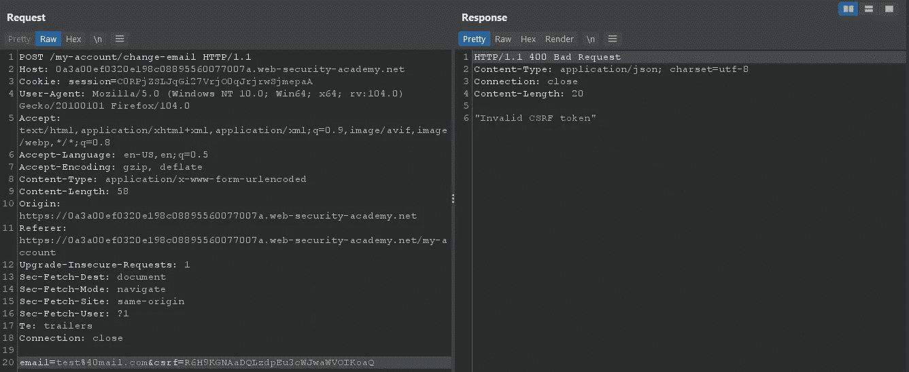
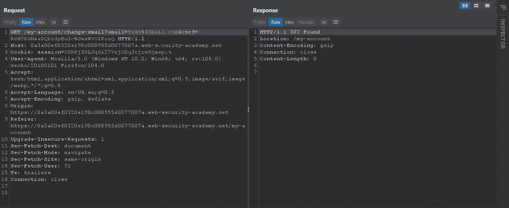
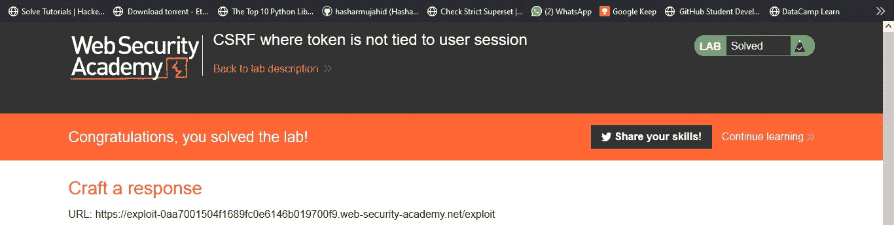

# 绕过 CSRF 保护(一)

> 原文：<https://infosecwriteups.com/bypassing-csrf-protection-i-bc014384d0aa?source=collection_archive---------2----------------------->

嗨，我的名字是**哈沙尔·穆贾希德**，在这篇博客中，我们将讨论一些绕过 csrf 保护的**技术。**

如果你想了解 csrf 是什么，你可以在这里阅读我以前的博客。

 [## 跨站点请求伪造(CSRF)解释和利用 I

### 嗨！这篇博客将教你 CSRF 袭击是如何发生的，以及我们如何预防它们。

medium.com](https://medium.com/@hasharmujahid/cross-site-request-forgery-csrf-explained-and-exploited-i-db464a61a582) 

如果应用程序只依赖于客户端的值，如 cookies，那么应用程序将容易受到 csrf 攻击。攻击者可以很容易地欺骗用户点击恶意负载，并启动用户不希望发生的操作。

为了防止 csrf 攻击，使用了 Csrf 令牌。现在你可能会有一个问题

**什么是 CSRF 代币？**

简而言之，csrf 令牌是 web 应用程序分配给每个用户会话的随机生成的值，该值将在用户执行的每个 post 操作后更新。

**CSRF 令牌是如何工作的？**

当用户在应用程序上执行任何操作时，请求包含用户会话(cookies)对吗？在这种情况下，请求还包含一个由应用程序在 csrf 参数中分配的**随机生成值**，该值将在服务器端进行验证。如果 csrf 值无效，那么服务器将停止处理该请求。

**如何绕过 CSRF 保护？**

众所周知，如果任何协议被正确实现，那么我们就很少有机会绕过它。CSRF 旁路的情况也是如此。如果有一些实现错误，那么我们可以绕过这种保护。

— — — — — — — — — — — — — — — — — — — — — — — — — — — — — — — — —

## 1:检查 CSRF 值是否在后端得到验证。

要测试 CSRF 是否正在后端进行验证，请尝试修改 CSRF 参数中的 CSRF 值，如果该值正在接受检查和验证，则发送请求。如果没有，则不应处理该请求。您将拥有一个有效的 CSRF 旁路。

有效 Csrf

现在，当我们更改或修改该值时，我们可以看到服务器用一个无效的 csrf 令牌进行响应。

无效的 csrf 令牌。

如果存在漏洞，应用程序应该会正确无误地将您重定向到您的配置文件。

— — — — — — — — — — — — — — — — — — — — — — — — — — — — — — — — —

**2: CSRF，令牌验证依赖于令牌的存在。**

如果我们从请求中删除 csrf 参数，一些应用程序会跳过 csrf 验证。简而言之，如果应用程序标记了缓和的或无效的令牌，我们可以尝试完全删除 csrf 参数，以查看我们的请求是否仍被处理。

检测到缓和令牌

让我们去掉 csrf 参数。

移除的参数

我们可以看到我们的请求是成功的。

我们可以利用此漏洞代表用户执行非预期的操作，如通过生成 csrf 有效负载来更改用户的电子邮件。如果你想知道如何在没有专业打嗝的情况下生成 csrf 有效载荷，请阅读我以前的博客。

**——————**

## 3:CSRF 令牌的验证取决于请求方法。

有时应用程序只验证 post 请求上的 csrf，但这可能是一个严重的错误，因为攻击者也可以使用 GET request 方法代表用户执行类似的操作。

我们可以将请求类型更改为 get from burp 并测试此漏洞。

我们可以看到，当我们调整请求中的令牌并发送它时，服务器响应了错误。

现在让我们改变请求方法，发送这个请求。

我们现在可以看到，我们的缓和令牌没有得到验证，我们的请求成功了。

**——————**

## 4: CSRF 令牌与用户会话无关

对于应用程序来说，验证 csrf 令牌是否属于发送请求的同一个会话也很重要。

有时，攻击者可以注册一个帐户，并在有效负载中发送他们的有效 csrf 令牌，以使攻击成功。

为了解决这个问题，服务器应该验证令牌是否属于同一个会话。

要测试此漏洞，请在 web 应用程序上创建两个帐户，并在执行操作时将一个帐户上的令牌更改为另一个帐户，如果请求完成，则发送请求，这意味着 csrf 值与用户会话无关。

 [## 实验室:CSRF，令牌与用户会话无关|网络安全学院

### 练习利用现实目标的弱点。记录你从学徒到专家的进步。看哪里…

portswigger.net](https://portswigger.net/web-security/csrf/lab-token-not-tied-to-user-session) 

解决这个实验来练习我们所学的内容。

今天到此为止，我将在未来发布一些更先进的绕过 CSRF 保护的技术。

在那之前快乐的黑客！❤

## 来自 Infosec 的报道:Infosec 每天都有很多内容，很难跟上。[加入我们的每周时事通讯](https://weekly.infosecwriteups.com/)以 5 篇文章、4 个线程、3 个视频、2 个 Github Repos 和工具以及 1 个工作提醒的形式免费获取所有最新的 Infosec 趋势！