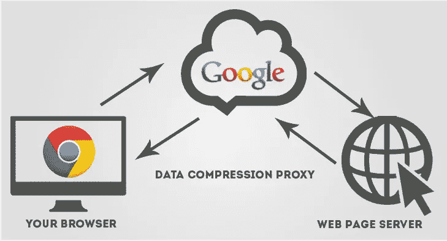
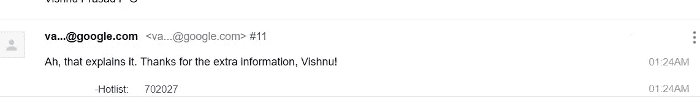
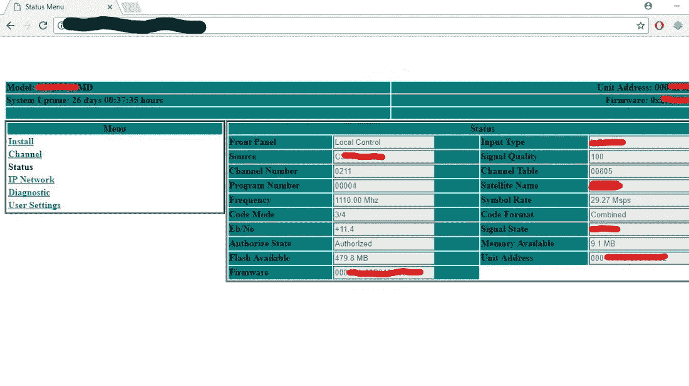
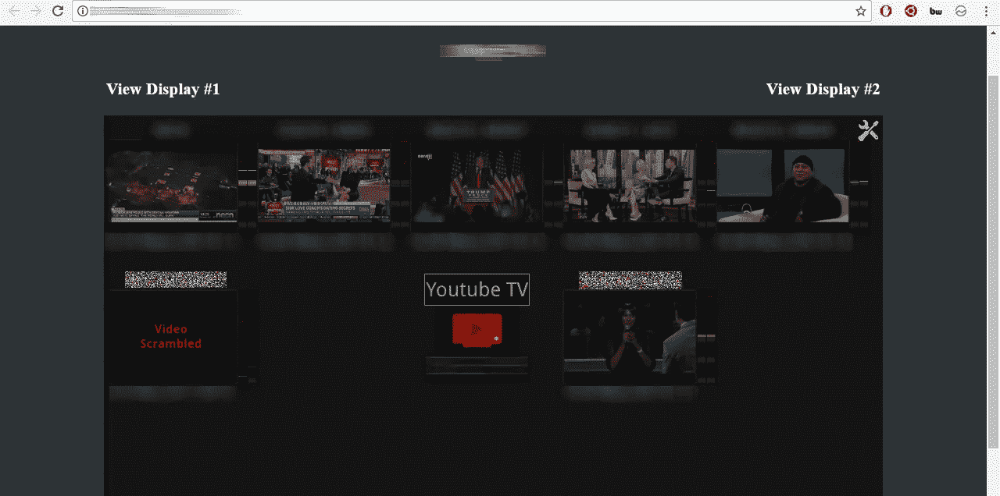
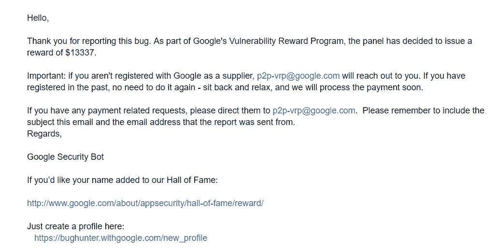

# 绕过谷歌的认证进入他们的内部管理面板

> 原文：<https://infosecwriteups.com/bypassing-googles-fix-to-access-their-internal-admin-panels-12acd3d821e3?source=collection_archive---------0----------------------->

大家好，

我是 [*Vishnu prasad*](https://www.vishnuprasadpg.com) *，一名三年级的工科学生，一名热情的开发人员，也是一名 bug 搜索新手(如果我在这篇文章中有任何错误，请原谅我)。*

我最近在谷歌发现了一个漏洞，任何人都可以访问 YouTube 广播卫星的内部管理面板。我把它作为谷歌 VRP 的一部分进行了报道，这让我赚了 13337 美元。

*这篇文章向谷歌名人堂解释了我的故事。*

话虽如此，我们还是开始吧😃

有一天，在谷歌搜索新的 bug 时，我从某个域得到了一些谷歌的 IP 地址。

我检查了 IP 地址，可以理解列表中也包含一些内部设备的 IP 地址。最近，我的朋友 [KL SREERAM](https://www.facebook.com/sreeram.kl) 报告了一个类似的关于他们内部设备 IP 的错误，我的好朋友 [Vishnu](https://www.facebook.com/vishnu0002) 也报告了一个类似的错误，他发现了一个可以访问管理面板的子域。但是，这些问题已经得到解决。谷歌也阻止了公众对这些完整的知识产权范围的访问。

但是现在，我有了一些相似的 IP 地址，我必须想办法绕过这个限制。😺

我开始在谷歌上广泛搜索，寻找访问被屏蔽的 IP 地址的方法。我读过的每篇文章/博客/论坛/评论都告诉我，我们需要他们的代理/VPN 来访问 IP 地址。

我一直在寻找新的方法

然后突然就发生了！

我的电源断了！

我没有备用电池😕(KSEB 烂！)

我就像…..

我已经决定，我会想办法绕过这一切，我不准备放弃👽

我就是停不下来，于是，我拿出手机，再次开始在谷歌上搜索。在我搜索的时候，出于好奇，我试图在我的谷歌 Chrome 手机浏览器中打开其中一个 IP 地址(我喜欢在 Chrome 中浏览)

WTF —一个 HTTP 登录的页面出现在我面前。

哇哦。我从没想到会看到这一幕！

所以在我面前有登录，可能是进入世界上最强大的公司之一的大门。然而，我需要用户名和密码才能进入。

那我该怎么办？

我试着不输入任何凭证就点击登录按钮。

令我惊讶的是，一个有很多按钮和选项的页面出现在我面前。我花了一分钟才意识到我在谷歌产品的管理面板里。

答对了。！我加入了！

(当我读到 SREERAM 的发现时，我从他的博客文章中获得了使用空凭证登录 Google 的想法。谢谢你，兄弟..！)

然而当时我真的不知道是怎么回事。我唯一知道的是，我已经进入了一个谷歌产品的管理面板。

几分钟后，电源恢复，我试图在我的电脑上打开同一个 IP。但是打不开。登录页面一直没有出现！多么不幸！

现在，我完全糊涂了。😕

为什么它能在我的手机浏览器上运行，而不能在我的笔记本浏览器上运行？这个问题一直困扰着我…

反正一个小时，我在手机上做了一个 POC，把报告提交给了 Google。

大约 5 个小时后，我得到了他们的回复，他们已经审阅了我的报告。我还得到了一句“接得好！”对我报告的回应。我高兴得跳了起来。硅谷强大的谷歌在特里凡得琅回复了我！

他们问我——“你能告诉我们你用了哪些 IP 地址进行访问吗？”。他们基本上想知道我连接到哪个代理。但我不知道。所以我决定深入挖掘一下。

大约两个小时后，我找到了帮助我进入他们管理面板的回路。

这个大谜团已经被解开了！

是谷歌的数据保护程序帮助我进入了他们的内部 IP。它是在我的 Chrome 手机浏览器中打开的。我已经包括了一个图像，以帮助您了解它的工作。

这个代理充当他们的访问代理，让我可以访问他们的内部页面。因此，在将这个代理添加到我的计算机后，我也能够从我的笔记本电脑浏览器访问管理面板。

给你。现在，任何人都可以从世界任何地方访问谷歌管理面板！

吓人！！

我用一篇非常详细的文章回复了他们。我在 30 分钟内得到了回复。

我已经包括了一些截图以及我可以访问的管理面板。

他们的卫星接收器管理面板

YouTube 电视管理面板(屏幕控制)

除此之外，我获得了他们的广播面板，内部 PCSC 配置，和许多这样的位置使用这种特殊的技术。

最后，他们奖励了我 13337 美元😲

谷歌名人堂—[https://bughunter.withgoogle.com/rank/hof/1](https://bughunter.withgoogle.com/rank/hof/1)

个人资料链接—[https://bug hunter . with Google . com/profile/76289848-1b 71-44c 7-b11f-6475 ffbc 4d 7 f](https://bughunter.withgoogle.com/profile/76289848-1b71-44c7-b11f-6475ffbc4d7f)

现在，他们也选择了我作为他们 2017 年的头号 Bughunter😃。

并在《印度时报》上刊登(TOI)。😃

> ***我取得成就背后的原因和激励我一直梦想和志存高远的人是我的导师***[***Sreenath Sasikumar***](https://www.facebook.com/sreenath.sasikumar.33)*[***mash upstack***](https://www.mashupstack.com/)***先生——一家 fullstack web 开发培训公司的创始人兼 CEO。他们说得对，良好的开端是成功的一半****

*更多详情请联系我—[https://www.vishnuprasadpg.com](https://www.vishnuprasadpg.com/)*

*谢谢你，*

*毗湿奴·普拉萨德·宝洁*