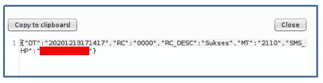
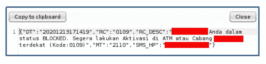

# 绕过 OTP 验证更改已注册手机银行账户的 PIN 码。

> 原文：<https://infosecwriteups.com/bypassing-otp-verification-for-changing-pin-in-registered-mobile-banking-account-ed92dbcaa5c7?source=collection_archive---------3----------------------->

祝你平安

好了，这是我的第二个帖子，看标题很有趣吧？

我从这个应用程序的机制开始。我的手机号码是在这个手机银行应用程序中注册的，我设置了个人识别码以便登录。

我的用户配置文件配置在移动设备的内部存储中加密。因为我对手机测试的了解不够。我正在用我知道的 web 应用程序方法做这个测试。:D

移动应用程序是这样工作的:

1.  每次首次加载应用程序时，它都会请求后端 API (api/v1/credential/status)检查设备中注册的移动银行号码(手机)的状态。如果号码状态正常，则服务器将做出如下响应:

状态正常时来自服务器的响应。

(“Sukses”表示成功)。请求和响应是用 base64 编码的，所以很容易被解码。

2.然后，应用程序将弹出 PIN 的输入表单来登录。

3.要更改 PIN，系统会提示用户将 OTP 验证发送到在该手机银行应用程序中注册的手机号码。

对于这个移动银行应用程序来说，这是一个正常的流程。下面是我如何(意外地)发现绕过 OTP 验证机制来更改 PIN 的。

***枚举状态响应***

我和我的团队向银行系统注册了 4 个手机号码。因为我试图检查反自动化机制，我的电话号码被屏蔽了。所以，当我打开我的手机银行应用程序时，它显示的响应是这样的:

阻止来自服务器的邮件

我的账户被封了，需要我去最近的 ATM 机重新激活。但是这里有一个有趣的现象，我的手机号码给了我一个不同的回复。那么，如果我更改了电话号码(请求中)会发生什么呢？这可能会枚举电话号码的状态。

幸运的是，使用 api/v1/credential/status 函数没有限制，所以我做了一些有效载荷，包括所有 4 个数字，用于测试这个应用程序以了解状态。我发动了打嗝入侵者，我从我的有效载荷中发现了 4 个状态。

1.  成功状态
2.  已经注册，需要设置 PIN

响应表明需要设置 PIN

3.被屏蔽(*我的手机号:D* )，而且

4.未注册的手机号码

你们有些人已经能猜到下一步会是什么了，对吗？第二点非常有趣。假设是 08123456789 号。如果我把电话号码改成 08123456789 会怎么样？因此，我打开拦截并加载我的移动应用程序银行，它带有对 api/v1/credential/status 的请求，我将电话号码参数更改为 08123456789 *。*和 uupsss，应用程序显示设置 PIN 表单。(*这个我不能截图，因为 UI 一模一样)*。

至此，我想我成功地为 08123456789 手机号码设置了一个新的 PIN。但事实并非如此。发生的情况是，我成功地更改了自己的 PIN，但状态仍然被阻止。

那么，收购的可能性在哪里呢？

虽然概率很小，但还是有可能发生。如果有人丢失了他们的手机和/或攻击者有能力访问设备，而所有者还没有时间封锁帐户。攻击者将试图完全控制设备(rooteded 或越狱)，如果设备成功 root，攻击者就可以执行上述测试。

同样，几率很小，但预防胜于治疗，对吗？

**我的笔记:**

*   *如果有机会做一些列举条件，不要错过那个测试。*
*   拥有一个具有多个条件的测试用户将使测试更加全面。

好了，这次到此为止。再次为我有限的英语道歉。希望能理解。

如果你有关于移动渗透测试的好资源，书籍或网站等，请评论。我将非常感激。我对 Brida 也很感兴趣，有人已经用它进行移动测试，尤其是 android 应用程序吗？请与我分享。