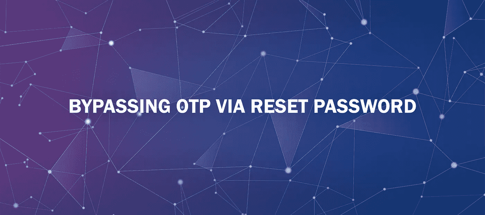
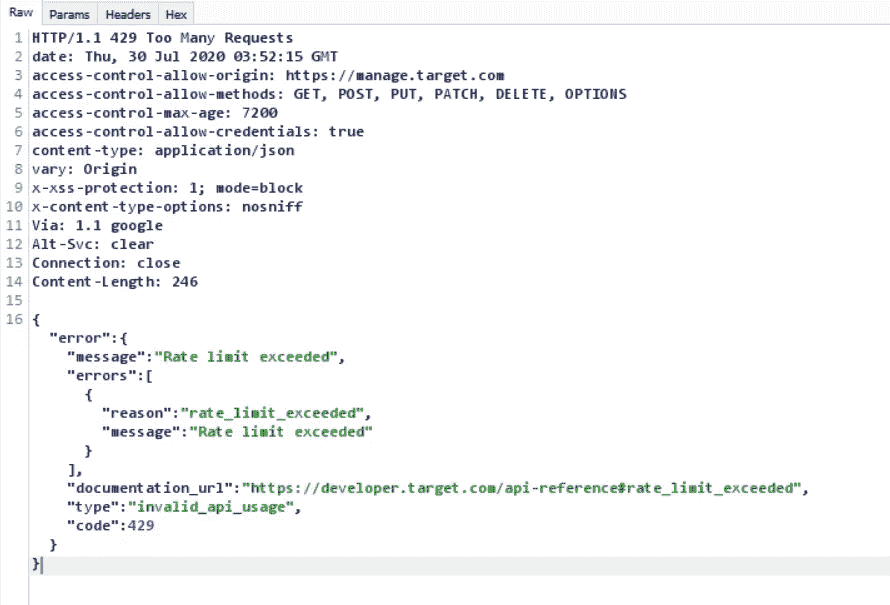
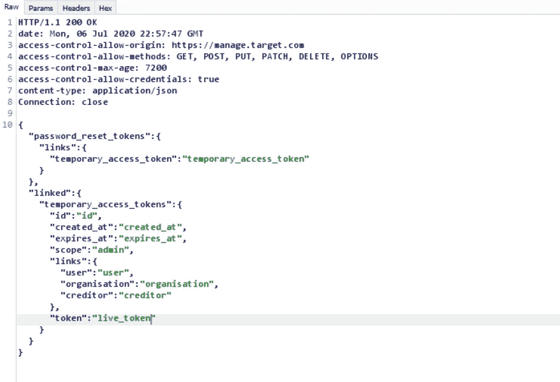
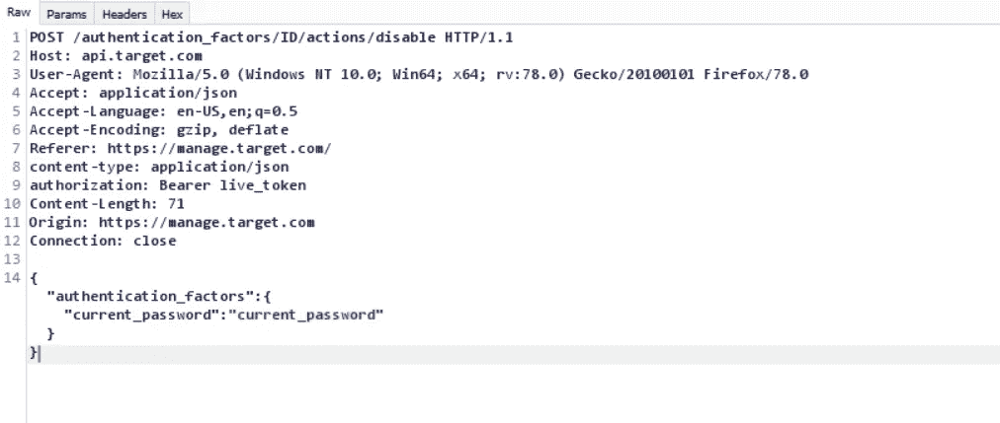

# 通过重置密码绕过 OTP

> 原文：<https://infosecwriteups.com/bypassing-otp-via-reset-password-f004a29020c?source=collection_archive---------1----------------------->

在这篇文章中，我将解释我是如何通过电子邮件地址重置密码来绕过一次性密码的。

> 我在一个私人程序中发现了这个漏洞，我将它命名为:***【target.com】***，在我们继续解释之前，我们应该考虑到这个漏洞是由于错误地应用了通过 API 重置密码的方法，导致了响应中用户 live token 的泄漏。

W 当我在这个目标中进行侦察时，我意识到所有的函数无一例外都与一个 API 直接相关，这个目标是它的 API 的一个接口，所以从函数扫描 bug 开始是有意义的，当我检查帐户设置时，我发现了通过电话号码选项进行 OTP，所以我打开它并注销。

我直接登录并决定检查速率限制绕过和其他与 OTP 相关的 bug，但不幸的是，API 本身有一个速率限制实现，我无法绕过它。

速率限制机制响应

我还检查了是否可以通过电子邮件地址重置密码来绕过 OTP，但该应用程序会要求我使用新密码再次登录，并插入通过短信发送的 6 位 OTP 代码，因此我无法通过这种方式绕过它。

所以是时候检查每个请求及其响应了，我打开了我的拦截并开始检查重置密码方法响应，没有什么有趣的，我登录到我的测试帐户电子邮件并检查重置密码链接，链接中的令牌很复杂，我不能暴力破解它。

我请求链接并插入我的新密码，我按下更改我的密码按钮并检查响应，我可以确认重置密码 API 方法为我的帐户设置了一个新的实时令牌，并在响应中泄露了令牌，通过这个实时令牌，我能够通过 API 使用帐户中的所有方法，而无需登录到应用程序界面。

响应中的令牌泄漏

但我选择了在不登录的情况下停止 OTP 的方法，在检查帐户设置后，我能够找到通过电话号码停止 OTP 的 API 请求，因此我在中继器中输入了该请求，我能够通过 API live token 停止 OTP 并登录到应用程序界面。

禁用 OTP API 请求

# ***汇总***

> 我能够通过电子邮件地址重置密码来绕过 OTP，我们应该考虑到我能够通过重置密码方法响应中泄漏的 API live 令牌来使用帐户中的每一种方法，但我更喜欢找到方法来停止 OTP，并且我通过禁用 OTP API 请求来停止它，因此我能够在不需要插入 OTP 代码的情况下打开我的帐户。

# ***时间轴***

报告(7 月 7 日)。
首次回应(7 月 7 日)。

别忘了在 Twitter 上关注我，这样你就不会错过我的新评论和文章。感谢你阅读我的第一篇文章，非常感谢。