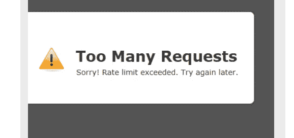
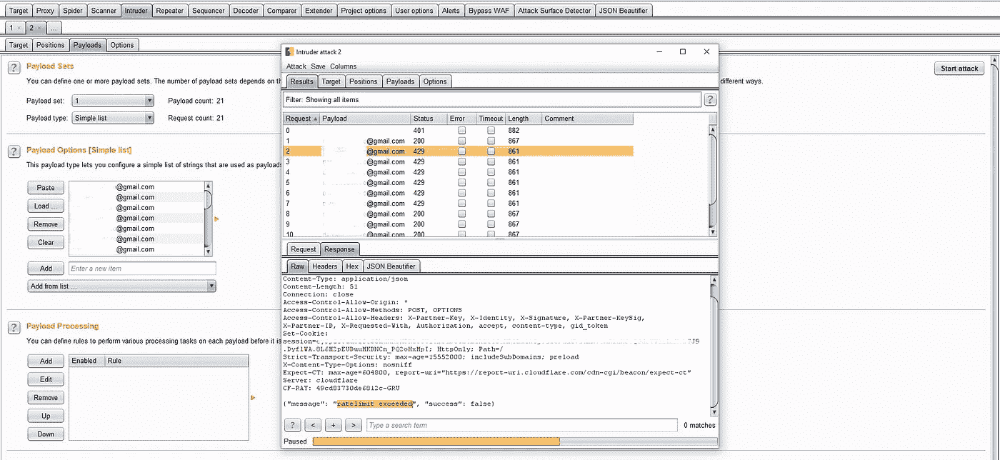
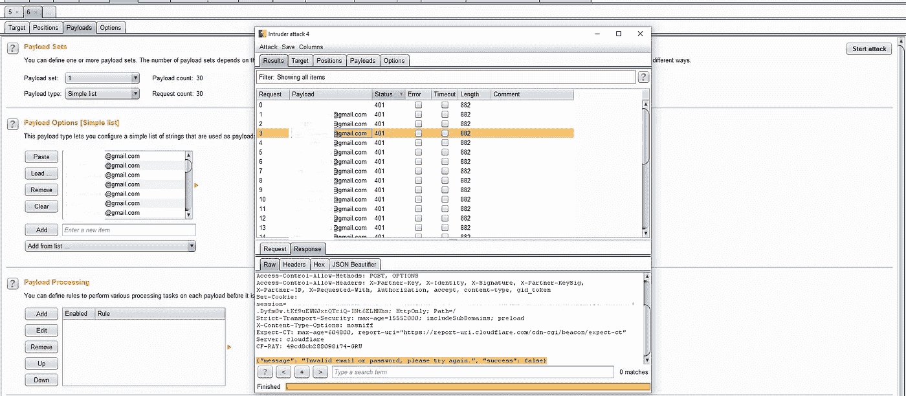
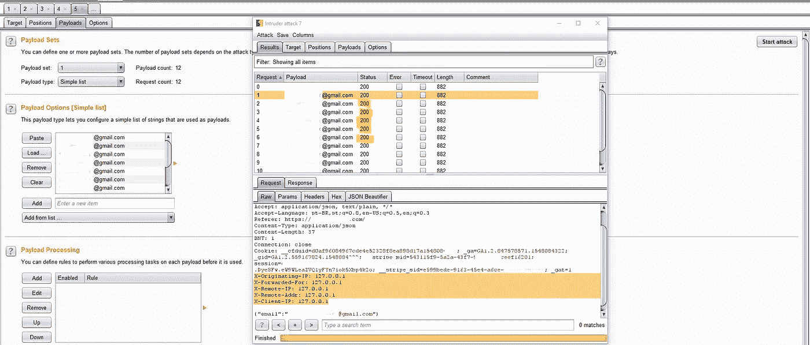
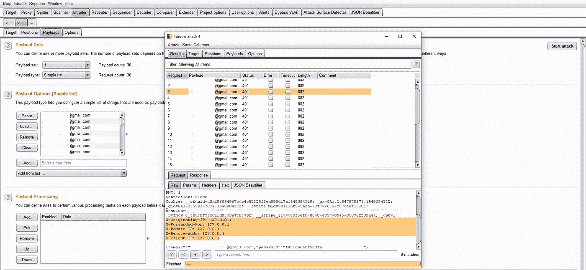

# 绕过速率限制，滥用错误配置规则

> 原文：<https://infosecwriteups.com/bypassing-rate-limit-abusing-misconfiguration-rules-dcd38e4e1028?source=collection_archive---------0----------------------->

朋友们好，

这一次，我将与你分享我是如何绕过一个私人程序中所有表单的速率限制的，所以让我们开始吧:)

**稍微讲一下速率限制:**

> 使用速率限制算法来检查用户会话(或 IP 地址)是否必须基于会话高速缓存中的信息来限制。
> 
> 如果客户机在给定的时间范围内发出太多请求，HTTP-服务器可以用状态代码 429:太多请求来响应。

**发现阶段:**

在发现过程中我注意到所有的应用功能都受到速率限制的保护，于是我开始思考如何忽略公司实现的这个算法，因为一旦忽略，我就可以对多个应用功能进行暴力攻击，比如:

*   通过强力创建多个用户
*   暴力攻击登录页面
*   2FA 旁路(不幸的是，应用程序没有实现 2FA 方法)

**第一次尝试:**

有目的地触发速率限制算法，然后更改我的 IP。当执行这样的测试时，我能够发送 4 个以上的请求，之后，我再次被阻止。

你注意到什么了吗？

通过这个测试，我感觉到 IP 正在执行速率限制规则。我发现每 4 个请求中就有一个被阻止。我们现在可以假设应用程序一直在检查我们通过远程 IP 发出了多少请求。

有意思…

我立即想到了第二种可能性:实现速率限制规则的一个常见错误是，有时创建该规则是为了阻止来自远程 IP 的暴力攻击，但 IP **127.0.0.1** (本地主机)除外

**第二次尝试:**

添加到 HTTP 请求头 **X-Remote-IP: 127.0.0.1**

和…速率限制旁路成功完成！

**攻击场景:**

这打开了几个可能性，如:在登录页面上执行暴力(这是由速率限制保护的)

执行密码更改垃圾邮件:

如果应用程序有双因素身份验证，我们也可以对用户密码进行这种攻击，但不幸的是没有启用这种机制:(

**温馨提示:**

有一个 Burp Suite 扩展可以自动将 bypass 头插入到所有 HTTP 请求中，你可以在这里找到它

这是一种让您执行 burp 入侵者攻击的方式，而不必在您发出的每个请求中手动插入报头。攻击看起来像这样:

最后，我要感谢整个 bug bounty 社区，和大家一起学习总是一件非常愉快的事情:)

希望你喜欢它！

在这里找到我。