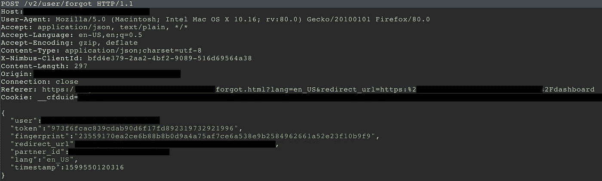

# 绕过速率限制(使用时间戳)

> 原文：<https://infosecwriteups.com/bypassing-rate-limit-using-timestamp-b41291859457?source=collection_archive---------1----------------------->

本文分为以下几个部分:

1.  介绍
2.  漏洞描述和攻击方法。
3.  复制和绕过速率限制的步骤。

# 介绍

> 什么是速率限制？

速率限制是一种限制网络流量的策略。它限制了一个人在一定时间内重复一个动作的频率——例如，尝试登录一个账户。速率限制有助于阻止某些类型的恶意 bot 活动。它还可以减轻网络服务器的压力。
如果一个客户端在给定的时间范围内发出太多请求，HTTP 服务器可以用**状态代码 429:太多请求**来响应

所以像往常一样，我试图在应用程序的忘记密码页面上寻找限速问题。不要对实施的速率限制感到惊讶。

照片由 [Tim Mossholder](https://unsplash.com/@timmossholder?utm_source=medium&utm_medium=referral) 在 [Unsplash](https://unsplash.com?utm_source=medium&utm_medium=referral) 上拍摄

为了绕过速率限制，我研究了它在处理忘记密码过程时发出的请求。

如您所见，有一个**“timestamp”**参数与一些其他用户数据一起被传递。

我想他们为什么特别传递时间戳参数。一定有什么原因。所以为什么不试试这个参数，试着相应地改变它。看看会不会发生什么

在做了一些研究并制定了攻击方法后，我能够绕过速率限制

# **攻击方法**

现在，由于每个请求都要传递时间戳参数，所以很有可能服务器正在检查时间戳变量，以查看时间戳是否与前一个请求相同，或者是否已经更改。

因此，服务器将检查时间戳，如果它发现时间戳与前一个请求中使用的时间戳相同，它将知道请求已被重复，并将给出 **429:太多请求状态。**

但是如果我们在每个请求上增加时间戳参数呢？然后，如果服务器检查时间戳并将其与之前的请求进行匹配。随着 timestamp 参数的增加，它将与前一个请求中使用的不同，服务器会将该请求视为有效。

**所以像第一个请求有时间戳:**1599550120**334**
因此下一个请求将有时间戳: 1599550120 **335**

如您所见，我们将时间戳从 334 增加到 335。

这样做之后，我成功地绕过了速率限制。

**有用知识:**

这里**“1599550120316”**是时间戳格式，格式名是**纪元**。这种格式通常用在 web 应用程序中，是一种常见的格式。

所以为了根据我们的需要改变时间戳。

访问这个在线转换器，根据你的需要改变它[**https://www.epochconverter.com/**](https://www.epochconverter.com/)

# 复制的步骤

**步骤 1 —** 转到忘记密码页面，输入受害者的电子邮件地址。

**步骤 2** —在 Burpsuite 中拦截此特定请求。

**步骤 3** —现在将这个请求发送给入侵者，并选择您想要增加的时间戳参数编号。

比如你想在 1599550120 **334 中增加 **334** 。**

选择这些特定的数字作为有效负载，以便有效负载在新请求时增加。

注意:为了检查的目的，你也可以手动执行这个任务(比如一个一个地增加数字)，但是我建议你使用 turbo intruder 或者 intrusor 来自动执行这个任务。

第四步——如果一切正常，你会在受害者的收件箱里收到 200 封状态码为&的 100 多封邮件

***在这里支持我⬇***

 [## Karan Arora 正在媒体上创建与 bug 奖金相关的高质量内容。

### 嘿👋我是一名好奇的安全研究员和内容创建者，喜欢为安全创建高质量的内容…

www.buymeacoffee.com](https://www.buymeacoffee.com/karanxa) 

[https://www.paypal.com/paypalme/karanxarora](https://www.paypal.com/paypalme/karanxarora)

***推特⬇***

[https://twitter.com/Itskaranxa](https://twitter.com/Itskaranxa)

**如果你觉得这值得你花时间，那么**

**订阅更多。保持好奇！！**