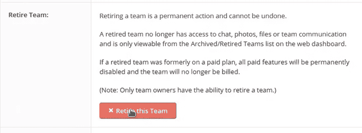
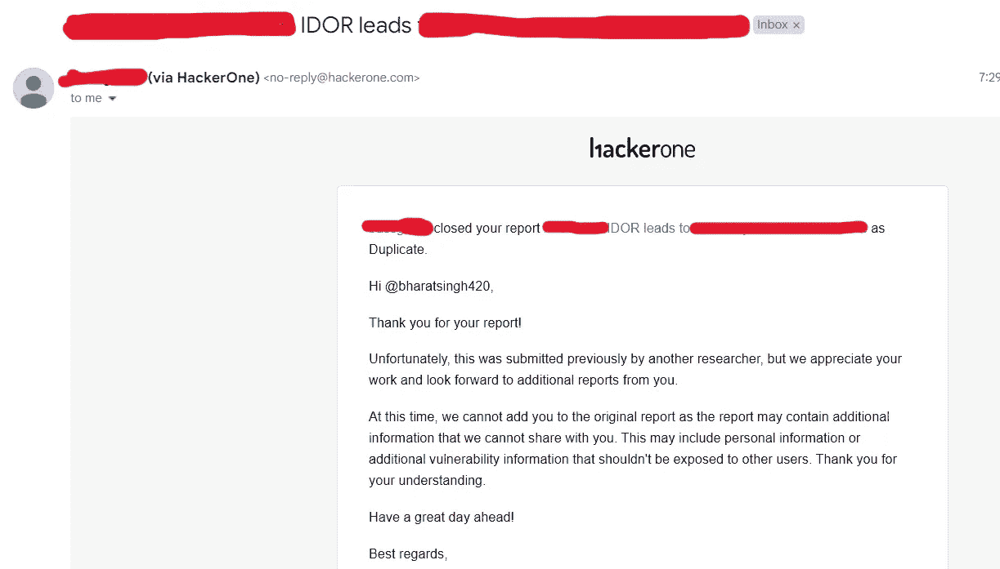

# 绕过意外的 IDOR

> 原文：<https://infosecwriteups.com/bypassing-unexpected-idor-e6a9da2e0498?source=collection_archive---------0----------------------->

大家好，我又回来了，带来了另一篇关于我最近在 HackerOne Private VDP 上发现的 bug 的文章。在这篇文章中，我将告诉你我是如何绕过一个 IDOR 漏洞的，并在最后分享一些其他方法来绕过它，敬请关注。

idOR 并不总是改变 ID 参数，因为我们有各种方法可以找到漏洞，但我们大多数人只是试图改变 ID 参数，在获得 401(未经授权的访问)和其他错误后，我们放弃并转移到其他功能。但是这是一个错误的方法，试着给同样的错误一些时间，在谷歌上做一些研究，并试图利用它。现在没有任何进一步的拖延，让我们从主要的故事开始。

## 回去吧

# 虫子的故事

8 月 4 日，我在 [HackerOne](https://hackerone.com/) 上收到了一个 VDP 的私人邀请，邀请范围有限。这是一个 kindda 运动平台，在这里我们可以创建一个特定运动的团队，允许我们添加成员并作为教练管理我们的团队。我开始了一些侦察和子域枚举，但没有发现任何感兴趣的子域或任何端点。然后，我在网站的主要领域进行了手动漫游，并开始测试一些错误，如 CSRF 和 XSS，但没有运气。之后，我在团队设置选项下看到了一个有趣的选项，叫做“退出团队”。



我决定玩这个功能，并点燃了我的打嗝。我看到的请求是这样的:

> 岗位/账户/团队设置/退休 _ 团队？team_id=12345

我的心在大声呼喊“我多我多我多我多”。我立即创建了一个受害者帐户，并创建了一个受害者团队，更改了受害者的团队 id，而不是攻击者的团队 id，但我的 burp 中继器中的响应对我不利，它向我显示了未经授权的访问错误，在那里我没有放弃并继续前进，而是研究了如何绕过它，找到了一些有趣的方法并开始尝试它们，其中一个让我得到了 200 OK 的响应，最终导致任何用户退出团队。我所做的是将%20 放在 id 参数的末尾，如:

> 岗位/账户/团队设置/退休 _ 团队？team _ id =受害者的 id%20

我很高兴，同时也很兴奋，因为没有速率限制，攻击者可以**暴力**team _ id 参数和大量退出团队的许多用户。

报告了错误，并等待分流小组的响应。6 天后，他们打电话给我说…



**标明重复😡😡**

# 以下是一些绕过 IDORs 的方法:

1.  **参数污染**

通过为单个参数提供多个值，可以创建一个可以利用 idor 的场景。更改请求自:

```
GET /api/card?custom_id=<attacker_id>
```

收件人:

```
GET /api/card?custom_id=<attacker_id>&custom_id=<victm's_is>
```

**2。附加特殊字符和随机字符串**

简单地替换 id 可能会导致 401、拒绝访问或无效请求。因此，在这种情况下追加特殊字符 **(/)** 或字符串，如 **%20、%09、%0b、%0c、%1c、%1d、%1e、%1f** 等。可能会给你一个 Idor。拒绝请求自

```
GET /profile/update/12345
```

到

```
GET /profile/update/12345%20
```

这可能会破坏应用程序的逻辑。

**3。改变请求方法**

如果一种 HTTP 请求方法不起作用，您可以尝试许多其他方法:GET、POST、PUT、DELETE、PATCH 等等。

**4。为没有 id 的请求放置 id**

即使请求 URL 没有使用输入参数，也要为每个请求设置参数，并观察它是否有所不同。例如，如果此请求显示您的所有卡详细信息:

```
GET /api/card
```

如果攻击者附加如下所述的用户 id 会发生什么？

```
GET /api/card?custom_id=<victim_id>
```

即使 web 应用程序有时隐藏了与参数相关的信息，通过观察相邻的请求，您也可以随机添加 id。

# 结尾:

我已经决定将我到目前为止所学到的一切回馈给黑客社区，我将积极参与这些文章的撰写，所以请确保 [**关注我**](https://medium.com/@bharatsingh070601) 。

**让我们成为朋友，**请随时与我联系，如果你们有任何疑问或建议，我的 DM 是开放的。

请关注我定期更新的 Bug Bounty 和网络安全。

> > > > > > > > > > > > > > > >[领英](https://www.linkedin.com/in/bharat-s1ngh/)<<<<<<<<<<<<<<<<<

> > > > > > > > > > > > > > > >[碎碎念](https://twitter.com/zingzangoo)<<<<<<<<<<<<<<<

*来自 Infosec 的报道:Infosec 上每天都会出现很多难以跟上的内容。* [***加入我们的每周简讯***](https://weekly.infosecwriteups.com/) *以 5 篇文章、4 个线程、3 个视频、2 个 Github Repos 和工具以及 1 个工作提醒的形式免费获取所有最新的 Infosec 趋势！*