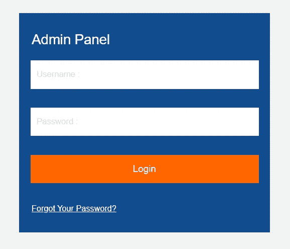
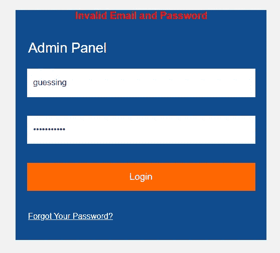
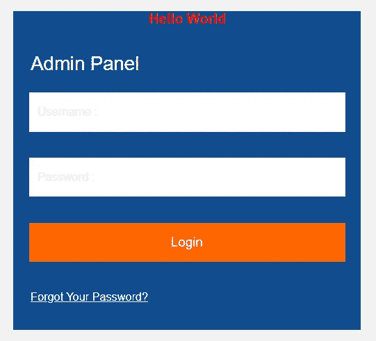
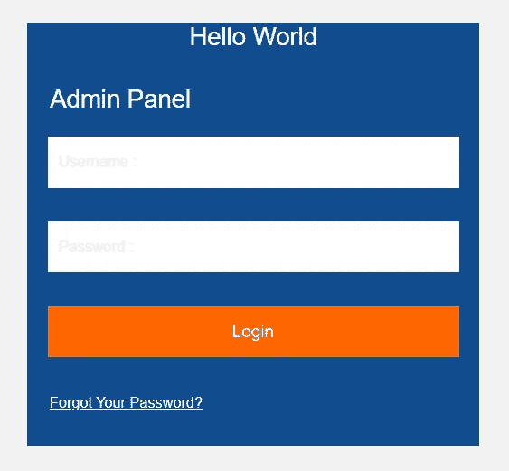
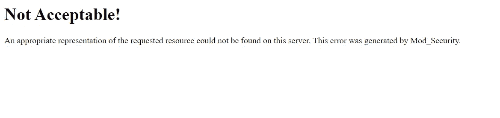
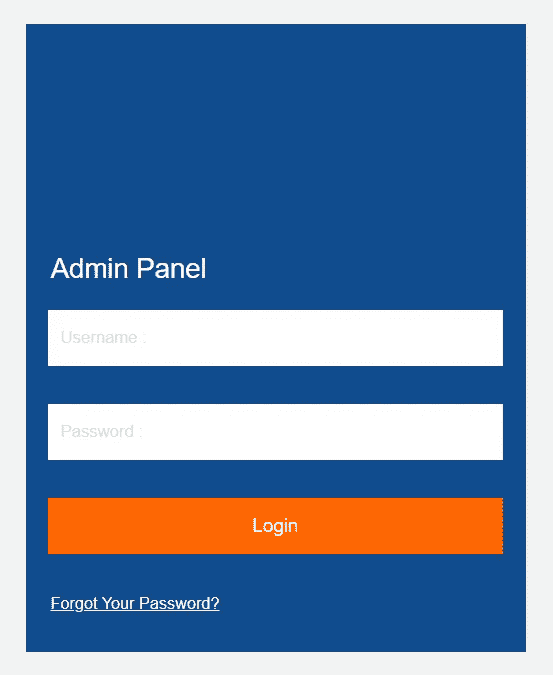
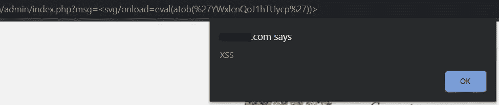
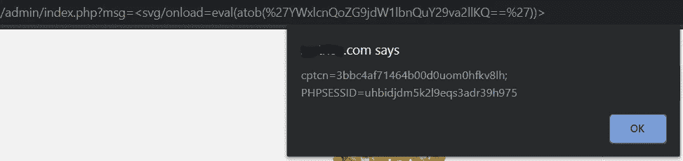

# 绕过晶圆执行 XSS

> 原文：<https://infosecwriteups.com/bypassing-waf-to-perform-xss-2d2f5a4367f3?source=collection_archive---------0----------------------->

最近我在寻找一些 XSS，我来到一个网站(出于隐私原因，我们称它为 website.com)，在那里有一个管理员登录表单在 **/admin** 目录下。

website.com/admin 管理面板

出于本能，我尝试输入随机凭证，看看会得到什么样的响应。

/admin/index.php？msg =无效的% 20 电子邮件% 20 和% 20 密码

> **/admin/index.php？msg =无效的电子邮件和密码**

这是我被重定向到的 URL，默认情况下，这是一个非常糟糕的显示错误消息的想法，但这是我在不同网站上看到的一个实现。

**的任意值*？msg=*** 可能会反映到网站中，所以让我们试着改变它以便更好地理解。

我尝试的是 website.com/admin/index.php?msg=Hello 世界

？msg=Hello World 被反射

现在我们看到，我们输入的每一个输入都反映在红色字体的文本中。

如果我尝试注入一些 HTML 标签呢？

> **？msg =<h1>Hello World</h1>**

HTML 注入

我们得到了一个成功的 HTML 注入，现在是时候放一些 Javascript 代码了。

我尝试了 50 多种基本的 XSS 有效载荷，希望 XSS 弹出:

？msg= 
？msg =
？msg =<input/onmouseover = " javaSCRIPT&冒号；确认&LPAR；1 & rpar
？msg =<iframe % 00 src = "&Tab；JavaScript:prompt(1)&Tab；"%00 >

你知道我对所有类型的 XSS 人施暴。所有这些都被服务器屏蔽了，似乎幕后有一个 WAF:

恶意 XSS 请求被 WAF 阻止

通过输入 50 多个 XSS 有效载荷，我得出了 WAF 真正过滤的是什么的结论:

> 每一个带有 **<脚本>、<帧、<输入、<表单、**的有效载荷都被 WAF 直接屏蔽。
> 每一个 **alert( )** 的有效载荷都被 WAF 直接封锁。

那么，当 alert()被过滤掉时，我们如何弹出一个 XSS 呢？

一边猜，一边意识到

> **？msg =***没有被过滤掉，所以我一直沿着这条路径走。由于 alert()被阻止，我正在尝试 confirm()，因为它起作用了。

> **< svg > <脚本%20？>确认(1)**

svg 已注入，但没有 XSS 弹出窗口

我有一种感觉，我很接近了，因为它反映了一个空白的空间，我只是必须继续前进。由于有 WAF，我尝试了不同的旁路，包括 Base64 decode with*eval . atob*。我一直使用 ***< svg >*** ，因为它在某种程度上有效。

> **<【SVG/onload = eval(atob(' ywxlcnqoj 1 htuycp ')】>**

这个有效载荷主要解码 base64 值，即**alert(‘XSS’)**。我立即启动了有效载荷，猜猜我看到了什么，一架 XSS！！！

终于有 XSS 了！！！

将 XSS 的有效载荷(被 WAF 过滤掉)编码成 base64，这真的给了我执行任何我想做的事情的自由。

> **<【SVG/onload = eval(atob(' ywxlcnqozg 9 jdw 1 lbnquy 29 va 2 llqq = = ')>**

下面的 base64 是 alert(document.cookie ),它按预期运行。

现在，我可以自由地执行我想做的任何事情，因为所有的东西都是以 Base64 编码的，不会被 WAF 检测到，这是每个人都想要的！此外，这个 XSS 花了我 20 分钟，但它对我来说更像是一个有趣的挑战。