# c4ptur3-th3-fl4g (TryHackMe)

> 原文：<https://infosecwriteups.com/c4ptur3-th3-fl4g-tryhackme-4381c5f3f59f?source=collection_archive---------0----------------------->

## 任务 1

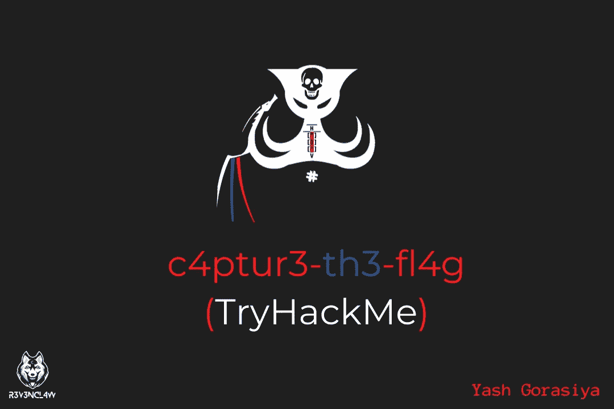

在我们开始挑战之前，我想告诉大家，这个房间不适合完全的初学者或对网络安全领域一无所知的人。

它包括各种要使用的加密技术，以及一些隐写和隐写术挑战。这听起来可能很新鲜，但学习它会很有趣。

这只是作为参考，我要求你在阅读这篇文章之前先完成这个挑战。你可以在这里通过挑战: [CTF](https://tryhackme.com/room/c4ptur3th3fl4g)

> 到底是 CTF 还是夺旗？

CTF 是一种用于网络安全领域的游戏化学习技术。在这个游戏中，隐藏了一个加密文本形式的标志，我们需要找到明文才能得到答案。我们可以使用多种工具和技术来获取标志。现在它也作为一项比赛来举办，有两个或更多的队伍相互竞争。现在我们知道了什么是 CTF，让我们回到挑战中来！

# 任务 1 翻译和转移

这项任务要求你翻译或转换某些密码，如 ROT13、ROT47、莫尔斯电码等。

> **#1**

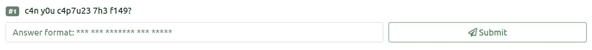

它是如此简单。仔细看正文就好。这是李特的形式。所以基本上 Leet 是一种在互联网上最常用的字体形式。是众多黑客使用的著名字体。例如:单词 *leet* 的 leet 拼写有 *1337* 和*l33t*； *eleet* 可以拼成 *31337* 或 *3l33t* 。现在你可以猜猜答案了！

**回答** : *能不能夺旗*。

这里的“a”被替换为“4”，“o”被替换为“0”，“t”被替换为“7”，“r”被替换为“2”，“e”被替换为“3”等等…

你也可以用这个工具来解决这个:[工具](http://www.robertecker.com/hp/research/leet-converter.php)

> **#2**

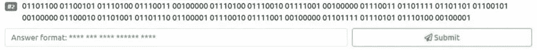

这种格式好像是二进制数。所以二进制数包括 1 和 0，这是计算机或机器唯一能理解的语言。为此，我们将使用一个在线工具“ [CyberChef](https://gchq.github.io/CyberChef/) ”。我们将把它从二进制转换成纯文本。你也可以使用这个名为 [RapidTables](https://www.rapidtables.com/convert/number/binary-to-ascii.html) 的工具。转换后你会得到问题的答案。

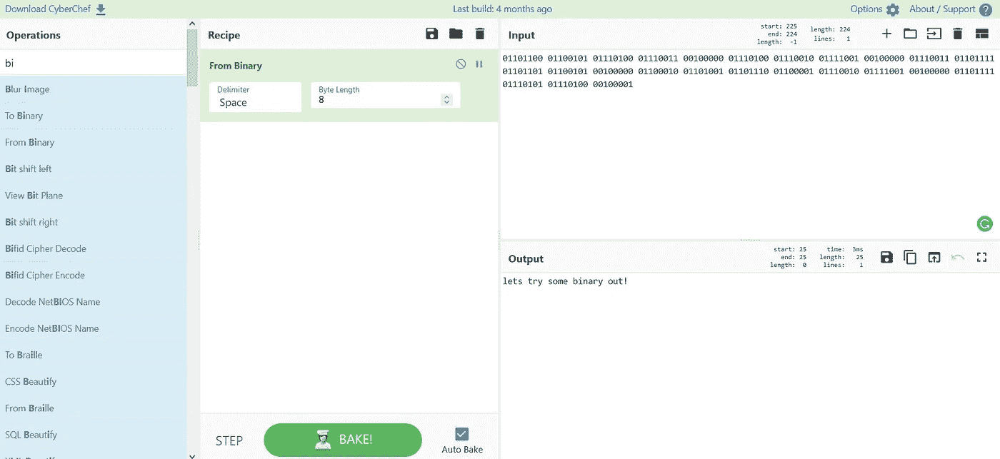

**回答:**让我们尝试一些二进制出来！

> **#3**

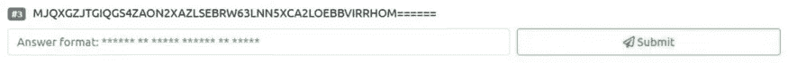

这种格式似乎是以 32 为基数。Base32 是一种常见的传输编码。它由 32 个字符组成。这些字符集通常是大写字母。因此，我们将再次使用“ [CyberChef](https://gchq.github.io/CyberChef/) ”。我们将把它从基数 32 转换成纯文本。所以你的网吧窗口将看起来像这样！

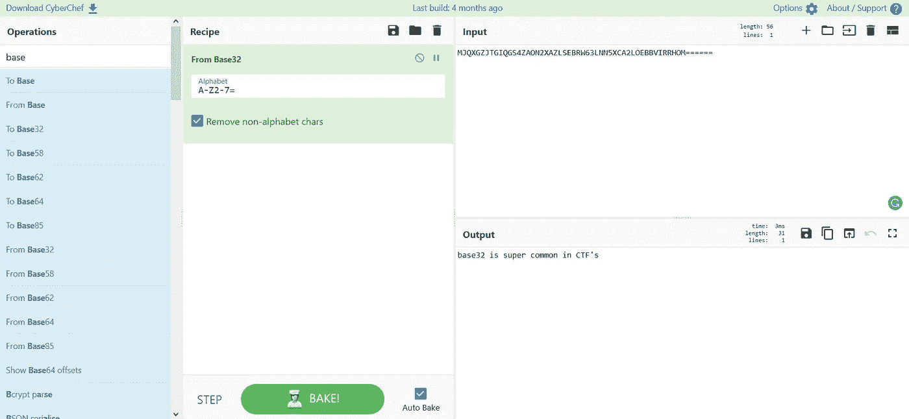

**回答:** base32 在 CTF 超级常见

> **#4**

这种格式似乎是 64 进制。Base64 是另一种常见的传输编码。它由 64 个字符组成。这些字符集通常是大写和小写字母。我们将再次使用“ [CyberChef](https://gchq.github.io/CyberChef/) ”。我们将把它从 Base 64 转换成纯文本。

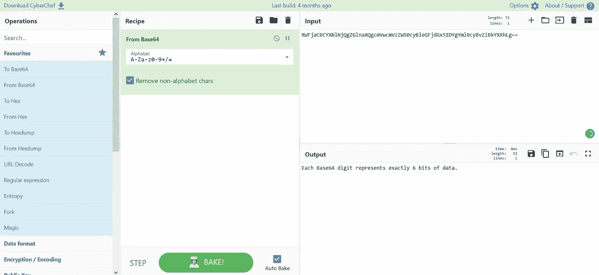

**答:**每个 Base64 位正好代表 6 位数据。

> **#5**

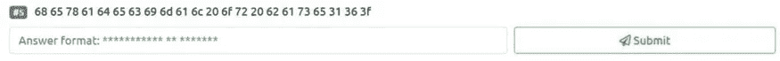

这个格式好像是十六进制的。十六进制或者我们一般说它是由 16 位二进制组成的十六进制。它也被称为 base16。我们将把它从十六进制转换成纯文本。

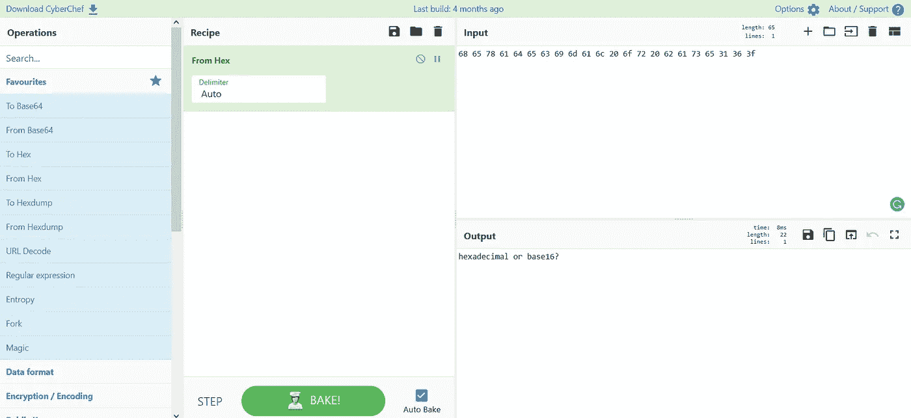

**回答:**十六进制还是十六进制？

> **#6**

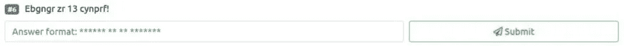

这个格式好像是 ROT 13。课文中给出了一些提示。Rot 13 或称为旋转 13 是凯撒密码一种形式，它旋转 13 次。我们将把它从 ROT 13 转换成纯文本。

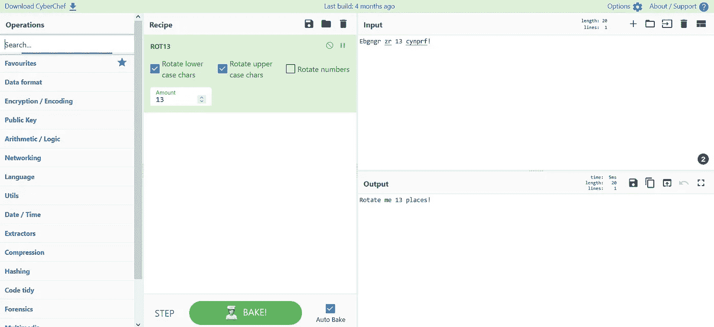

**回答:**把我旋转 13 个位置！

> **#7**

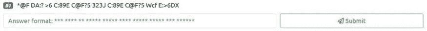

这个格式好像是 ROT 47。Rot 47 或称为旋转 47 是凯撒密码另一种形式，旋转 47 次。它编码了几乎所有可见 ASCII 字符。我们将把它从 ROT 47 转换成纯文本。

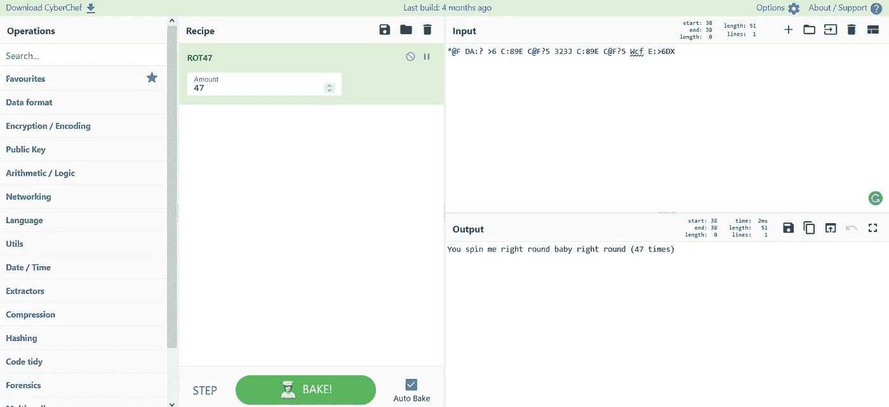

**回答:**你让我一直转，宝贝，一直转(47 次)

> **#8**

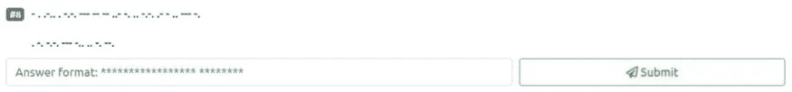

这似乎是某种电信加密信息。这是莫尔斯电码。莫尔斯电码是由短脉冲和长脉冲(点和划)组成信号的组合。它是为电信而设计的。我们将把它从莫尔斯电码转换成明文。

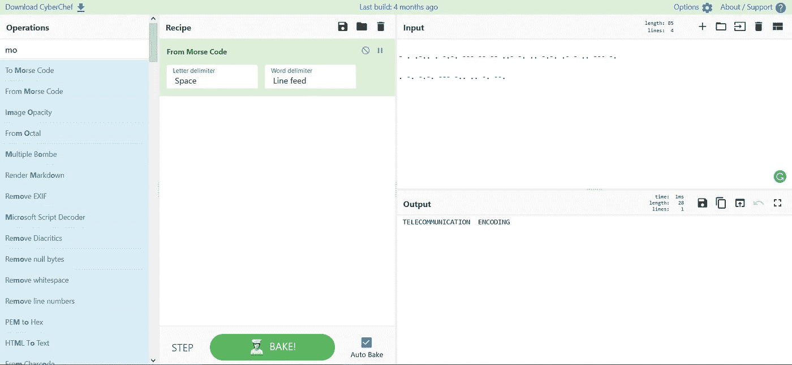

**答:**电信编码

> **#9**

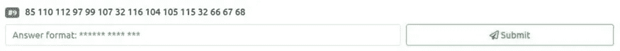

这似乎是一些二进制编码的十进制文本。二进制编码的十进制(BCD)是一种十进制编码技术。我们将把它从十进制转换成纯文本。

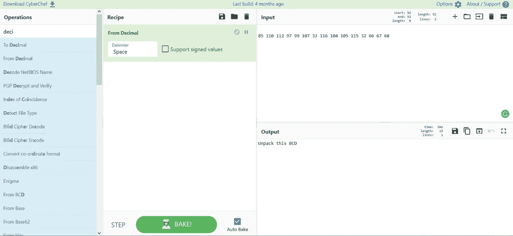

**回答:**拆开这个 BCD

> **#10**

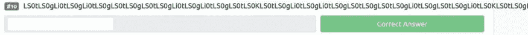

这似乎是很长的文字。如下所述:-

ls 0 TLS 0 gli 0 TLS 0 gli 0 TLS 0 gls 0 TLS 0 GL 0 TLS 0 GL 0 TLS 0 TLS 0 GL 0 TLS 0 GL 0 TLS 0 GL 0 TLS 0 TLS 0 gls 0 TLS 0 gls 0 TLS 0 gls 0 TLS 0 GL 0 TLS 0 TLS 0 TLS 0 GL 0 TLS 0 TLS 0 GL 0 TLS 0 TLS 0 TLS 0 GL 0 TLS 0 GL 0 TLS 0 TLS 0 GL 0 TLS 0 TLS 0 gls 0 TLS 0 gls 0 TLS 0 gls 0 TLS 0 gls 0 GL 0 GL 0 GL 0 TLS 0 gli 0 TLS 0 TLS 0 TLS

这不能仅仅依靠一种技术来解决，为此我们需要应用多种分层技术来找到纯文本。正如我们所看到的，在文本的末尾有一个“=”符号，为什么不从 Base64 开始尝试呢？

技术 1 >来自 Base 64

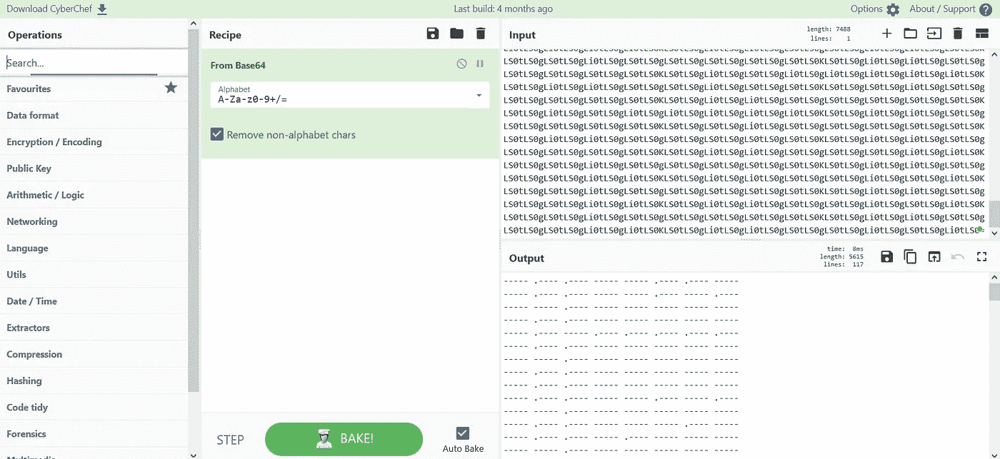

所以现在从结果我们可以假设这可能是莫尔斯电码。

技术 2 >莫尔斯电码

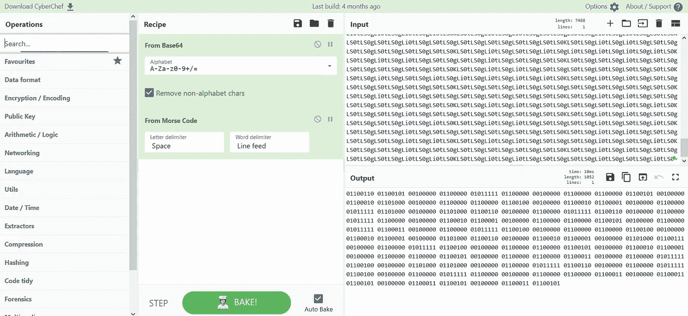

现在在结果中，我们可以看到这么多的 1 和 0，所以它肯定是一个二进制数。

技巧 3 >二进制数

现在看起来有点棘手，但是等等…我们以前见过类似的事情，所有的 ASCII 字符都被使用了。好吧，那就是 ROT47。

技术 4 > ROT47

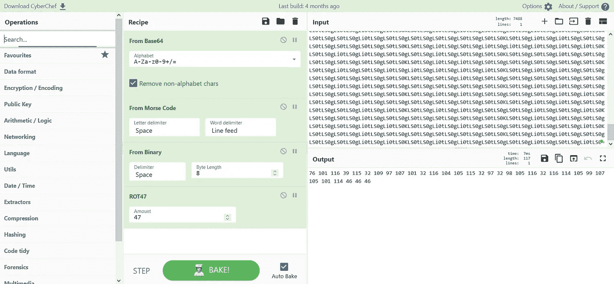

现在看来我们以前见过这种类型的数字…猜猜看！你是对的，它是二进制编码的十进制。所以我们要把它从十进制转换成。

技巧 5 >从十进制

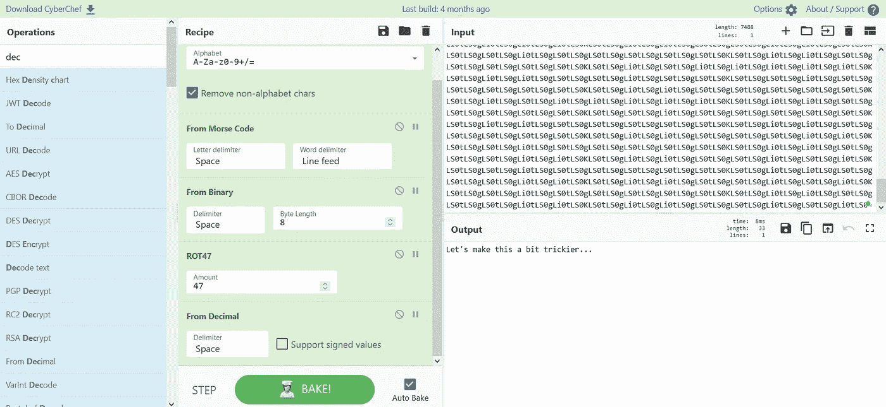

霍雷。我们已经解决了这个棘手的加密问题。

**回答:**让我们把这个弄得更复杂一点…

请记住，正如我们在问题 1-9 中看到的那样，您不会直接获得密码文本，您将在实时 CTS 中获得与问题 10 类似的内容。

恭喜你！您已经完成了任务 1。再见，到那时

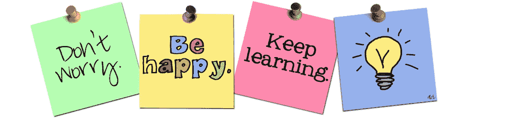